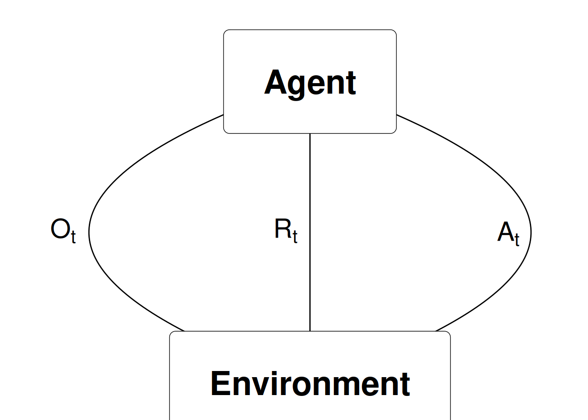

# (PART) Introduction to RL {-}

# An introduction to RL {#mod-rl-intro}

This module gives a short introduction to Reinforcement learning. 

## Learning outcomes {#mod-rl-intro-lo}

By the end of this module, you are expected to:

* Describe what RL is. 
* Be able to identify different sequential decision problems.
* Know what Business Analytics are and identify RL in that framework.
* Memorise different names for RL and how it fits in a Machine Learning framework.
* Formulate the blocks of a RL model (environment, agent, data, states, actions, rewards and policies).
* Run your first RL algorithm and evaluate on its solution.

The learning outcomes relate to the [overall learning goals](#mod-lg-course) number 3, 5, 6, 9 and 11 of the course.

<!-- SOLO increasing: identify · memorise · name · do simple procedure · collect data · -->
<!-- enumerate · describe · interpret · formulate · list · paraphrase · combine · do -->
<!-- algorithms · compare · contrast · explain causes · analyse · relate · derive · -->
<!-- evaluate · apply · argue · theorise · generalise · hypothesise · solve · reflect -->


## Textbook readings

For this week, you will need to read Chapter 1-1.5 in @Sutton18. Read it before continuing this module.


## What is reinforcement learning

RL can be seen as

* An approach of modelling sequential decision making problems.
* An approach for learning good decision making under uncertainty from experience.
* Mathematical models for learning-based decision making.
* Trying to optimize decisions in a sequential decision model. That is, making a good sequence of decisions.
* Estimating and finding near optimal decisions of a stochastic process with sequential decision making. 
* A model where given a state of a system, the agent wants to take actions to maximize future reward. Often the agent does not know the underlying setting and, thus, is bound to learn from experience.

Sequential decision problems are problems where you take decisions/actions over time. As an agent, you base your decision on the current state of the system (a state is a function of the information/data available). At the next time-step, the system have moved (stochastically) to the next stage. Here new information may be available and you receive a reward and take a new action. Examples of sequential decision problems are (with possible actions):

* Playing backgammon (how to move the checkers).
* [Driving a car](https://arxiv.org/pdf/1807.00412.pdf) (left, right, forward, back, break, stop, ...).
* How to [invest/maintain a portfolio of stocks](https://medium.com/ibm-data-ai/reinforcement-learning-the-business-use-case-part-2-c175740999) (buy, sell, amount).  
* [Control an inventory](https://www.youtube.com/watch?v=pxWkg2N0l9c) (wait, buy, amount).
* Vehicle routing (routes).
* Maintain a spare-part (wait, maintain).
* [Robot operations](https://arxiv.org/pdf/2103.14295.pdf) (sort, move, ...)
* [Dairy cow treatment/replacement](http://dx.doi.org/10.1016/j.ejor.2019.01.050) (treat, replace, ...)
* Recommender systems e.g. [Netflix recommendations](https://scale.com/blog/Netflix-Recommendation-Personalization-TransformX-Scale-AI-Insights) (videos)

Since RL involves a scalar reward signal, the goal is to choose actions such that the total reward is maximized. Note actions have an impact on the future and may have long term consequences. As such, you cannot simply choose the action that maximize the current reward. It may, in fact, be better to sacrifice immediate reward to gain more long term reward.

RL can be seen as a way of modelling intuition. An RL model has specific states, actions and reward structure and our goal as an agent is to find good decisions/actions that maximize the total reward. The agent learn using, for instance:

* totally random trials (in the start),
* sophisticated tactics and superhuman skills (in the end). 

That is, as the agent learn, the reward estimate of a given action becomes better. 

As humans, we often learn by trial and error too:

* Learning to walk (by falling/pain).
* Learning to play (strategy is based on the game rules and what we have experienced works based on previous plays). 

This can also be seen as learning the reward of our actions. 


## RL and Business Analytics

[Business Analytics](https://en.wikipedia.org/wiki/Business_analytics) (BA) (or just [Analytics](http://connect.informs.org/analytics/home)) refers to the scientific process of transforming data into insight for making better decisions in business. BA can both be seen as the complete decision making process for solving a business problem or as a set of methodologies that enable the creation of business value. As a process it can be characterized by descriptive, predictive, and prescriptive model building using "big" data sources.

**Descriptive Analytics**: A set of technologies and processes that use data to understand and analyze business performance. Descriptive analytics are the most commonly used and most well understood type of analytics. Descriptive analytics categorizes, characterizes, consolidates, and classifies data. Examples are standard reporting and dashboards (KPIs, what happened or is happening now?) and ad-hoc reporting (how many/often?). Descriptive analytics often serves as a first step in the successful application of predictive or prescriptive analytics.

**Predictive Analytics**: The use of data and statistical techniques to make predictions about future outputs/outcomes, identify patterns or opportunities for business performance. Examples of techniques are data mining (what data is correlated with other data?), pattern recognition and alerts (when should I take action to correct/adjust a spare part?), Monte-Carlo simulation (what could happen?), neural networks (which customer group are best?) and forecasting (what if these trends continue?).

**Prescriptive Analytics**: The use of optimization and other decision modelling techniques using the results of descriptive and predictive analytics to suggest decision options with the goal of improving business performance. Prescriptive analytics attempt to quantify the effect of future decisions in order to advise on possible outcomes before the decisions are actually made. Prescriptive analytics predicts not only what will happen, but also why it will happen and provides recommendations regarding actions that will take advantage of the predictions. Prescriptive analytics are relatively complex to administer, and most companies are not yet using it in their daily course of business. However, when implemented correctly, it can have a huge impact on business performance and how businesses make decisions. Examples on prescriptive analytics are optimization in production planning and scheduling, inventory management, the supply chain and transportation planning. Since RL focus optimizing decisions it is Prescriptive Analytics also known as sequential decision analytics.

<div class="figure" style="text-align: center">

<p class="caption">(\#fig:analytics)Business Analytics and competive advantage.</p>
</div>

Companies who use BA focus on fact-based management to drive decision making and treats data and information as a strategic asset that is shared within the company. This enterprise approach generates a companywide respect for applying descriptive, predictive and prescriptive analytics in areas such as supply chain, marketing and human resources. Focusing on BA gives a company a competive advantage (see Figure \@ref(fig:analytics)).

**BA and related areas**: In the past *Business Intelligence* traditionally focuses on querying, reporting, online analytical processing, i.e. descriptive analytics. However, a more modern definition of Business Intelligence is the union of descriptive and predictive analytics. *Operations Research* or *Management Science* deals with the application of advanced analytical methods to help make better decisions and can hence be seen as prescriptive analytics. However, traditionally it has been taking a more theoretical approach and focusing on problem-driven research while BA takes a more data-driven approach. *Logistics* is a cross-functional area focusing on the effective and efficient flows of goods and services, and the related flows of information and cash. *Supply Chain Management* adds a process-oriented and cross-company perspective. Both can be seen as prescriptive analytics with a more problem-driven research focus. Advanced Analytics is often used as a classification of both predictive and prescriptive analytics. *Data science* is an interdisciplinary field about scientific methods, processes, and systems to extract knowledge or insights from data in various forms, either structured or unstructured and can be seen as Business analytics applied to a wider range of data. 


## RL in different research deciplines

RL is used in many research fields using different names:

   - RL (most used) originated from computer science and AI.
   - *Approximate dynamic programming (ADP)* is mostly used within operations research.
   - *Neuro-dynamic programming* (when states are represented using a neural network).
   - RL is closely related to *Markov decision processes* (a mathematical model for a sequential decision problem).

<div class="figure" style="text-align: center">

<p class="caption">(\#fig:unnamed-chunk-3)Adopted from @Silver15.</p>
</div>


## RL and machine learning

Different ways of learning:

   * **Supervised learning:** Given data $(x_i, y_i)$ learn to predict $y$ from $x$, i.e. find $y \approx f(x)$ (e.g. regression).
   * **Unsupervised learning:** Given data $(x_i)$ learn patterns using $x$, i.e. find $f(x)$ (e.g. clustering).
<!-- * Often assume that data are independent and identically distributed (iid).  -->
   * **RL:** Given state $x$ you take an action and observe the reward $r$ and the new state $x'$.
      - There is no supervisor $y$, only a reward signal $r$.
      - Your goal is to find a policy that optimize the total reward function.

<div class="figure" style="text-align: center">

<p class="caption">(\#fig:unnamed-chunk-4)Adopted from @Silver15.</p>
</div>


## The RL data-stream


RL considers an agent in an environment:

- Agent: The one who takes the action (computer, robot, decision maker).
- Environment: The system/world where observations and rewards are found. 

Data are revealed sequentially as you take actions $$(O_0, A_0, R_1, O_1, A_1, R_2, O_2, \ldots).$$ At time $t$ the agent have been taken action $A_{t-1}$ and observed observation $O_t$ and reward $R_t$: 

<div class="figure" style="text-align: center">

<p class="caption">(\#fig:unnamed-chunk-6)Agent-environment representation.</p>
</div>
  
This gives us the *history* at time $t$ is the sequence of observations, actions and rewards $$H_t = (O_0, A_0, R_1, O_1, \ldots, A_{t-1}, R_t, O_t).$$

## States, actions, rewards and policies

The (agent) state $S_t$ is the information used to take the next action $A_t$:

<div class="figure" style="text-align: center">

<p class="caption">(\#fig:unnamed-chunk-7)State and action.</p>
</div>

A state depends on the history, i.e. a state is a function of the history $S_t = f(H_t)$. Different strategies for defining a state may be considered. Choosing $S_t = H_t$ is bad since the size of a state representation grows very fast. A better strategy is to just store the information needed for taking the next action. Moreover, it is good to have Markov states where given the present state the future is independent of the past. That is, the current state holds just as much information as the history, i.e. it holds all useful information of the history. Symbolically, we call a state $S_t$ Markov iff

$$\Pr[S_{t+1} | S_t] = \Pr[S_{t+1} | S_1,...,S_t].$$

That is, the probability of seeing some next state $S_{t+1}$ given the current state is exactly equal to the probability of that next state given the entire history of states. Note that we can always find some Markov state. Though the smaller the state, the more "valuable" it is. In the worst case, $H_t$ is Markov, since it represents all known information about itself.

The reward $R_t$ is a number representing the reward at time $t$ (negative if a cost). Examples of rewards are

   * Playing backgammon (0 (when play), 1 (when win), -1 (when loose)).
   * How to invest/maintain a portfolio of stocks (the profit).  
   * Control an inventory (inventory cost, lost sales cost).
   * Vehicle routing (transportation cost).

The goal is to find a policy that maximize the total future reward. A *policy* is the agent’s behaviour and is a map from state to action, i.e. a function $$a = \pi(s)$$ saying that given the agent is in state $s$ we choose action $a$.

The total future reward is a currently not defined clearly. Let the *value function* denote the future reward in state $s$ and define it as the expected discounted future reward: $$V_\pi(s) = \mathbb{E}_\pi(R_{t+1} + \gamma R_{t+2} + \gamma^2 R_{t+3} + \ldots | S = s).$$ Note the value function is defined using a specific policy and the goal is to find a policy that maximize the total future reward in all possible states $$\pi^* = \arg\max_{\pi\in\Pi}(V_\pi(s)).$$

The value of the discount factor is important:

   - Discount factor $\gamma=0$: Only care about present reward.
   - Discount factor $\gamma=1$: Future reward is as beneficial as immediate reward. Can be used if the time-horizon is finite.
   - Discount factor $\gamma<1$: Rewards near to the present more beneficial. Note $V(s)$ will converge to a number even if the time-horizon is infinite.
   


<!-- ## Model free vs Model based -->


## Exploitation vs Exploration

A key problem of reinforcement learning (in general) is the difference between exploration and exploitation. Should the agent sacrifice what is currently know as the best action to explore a (possibly) better opportunity, or should it just exploit its best possible policy? *Exploitation* takes the action assumed to be optimal with respect to the data observed so far. This, gives better predictions of the value function (given the current policy) but prevents the agent from discovering potential better decisions (a better policy). *Exploration* does not take the action that seems to be optimal. That is, the agent explore to find new states and update the value function for this state.  

Examples in the exploration and exploitation dilemma are for instance movie recommendations: recommending the user’s best rated movie type (exploitation) or trying another movie type (exploration) or oil drilling: drilling at the best known location (exploitation) or trying a new location (exploration).


## RL in action (Tic-Tac-Toe)


The current state of the board is represented by a row-wise concatenation of the players' marks in a 3x3 grid. For example, the 9 character long string `"......X.O"` denotes a board state in which player X has placed a mark in the first field of the third column whereas player O has placed a mark in the third field of the third column:

<style type="text/css">
.table-bordered th, .table-bordered td {
    border: 1px solid black !important; 
}
</style>


<table border: solid black class="table table-bordered" style="width: auto !important; margin-left: auto; margin-right: auto;">
<tbody>
  <tr>
   <td style="text-align:center;"> . </td>
   <td style="text-align:center;"> . </td>
   <td style="text-align:center;"> . </td>
  </tr>
  <tr>
   <td style="text-align:center;"> . </td>
   <td style="text-align:center;"> . </td>
   <td style="text-align:center;"> . </td>
  </tr>
  <tr>
   <td style="text-align:center;"> X </td>
   <td style="text-align:center;"> . </td>
   <td style="text-align:center;"> O </td>
  </tr>
</tbody>
</table>
That is, we index the fields row-wise:
<table border: solid black class="table table-bordered" style="width: auto !important; margin-left: auto; margin-right: auto;">
<tbody>
  <tr>
   <td style="text-align:center;"> 1 </td>
   <td style="text-align:center;"> 2 </td>
   <td style="text-align:center;"> 3 </td>
  </tr>
  <tr>
   <td style="text-align:center;"> 4 </td>
   <td style="text-align:center;"> 5 </td>
   <td style="text-align:center;"> 6 </td>
  </tr>
  <tr>
   <td style="text-align:center;"> 7 </td>
   <td style="text-align:center;"> 8 </td>
   <td style="text-align:center;"> 9 </td>
  </tr>
</tbody>
</table>

The game is continued until all fields are filled or the game is over (win or loose). 

<!-- All states are observed from the perspective of player X who is also assumed to have played first.  -->

The player who succeeds in placing three of their marks in a horizontal, vertical, or diagonal row wins the game. Reward for a player is 1 for 'win', 0.5 for 'draw', and 0 for 'loss'. These values can be seen as the probability of winning. 

Examples of winning, loosing and a draw from player Xs point of view:


<table style="width: 100%; border: 0px !important">
 <tbody>
  <tr style="border: 0px !important;">
    <td style="border: 0px !important;"><table border: solid black class="table table-bordered" style="width: auto !important; margin-left: auto; margin-right: auto;">
<tbody>
  <tr>
   <td style="text-align:center;"> . </td>
   <td style="text-align:center;"> . </td>
   <td style="text-align:center;"> X </td>
  </tr>
  <tr>
   <td style="text-align:center;"> . </td>
   <td style="text-align:center;"> X </td>
   <td style="text-align:center;"> . </td>
  </tr>
  <tr>
   <td style="text-align:center;"> X </td>
   <td style="text-align:center;"> O </td>
   <td style="text-align:center;"> O </td>
  </tr>
</tbody>
</table>

</td>
    <td style="border: 0px !important;"><table border: solid black class="table table-bordered" style="width: auto !important; margin-left: auto; margin-right: auto;">
<tbody>
  <tr>
   <td style="text-align:center;"> X </td>
   <td style="text-align:center;"> . </td>
   <td style="text-align:center;"> X </td>
  </tr>
  <tr>
   <td style="text-align:center;"> . </td>
   <td style="text-align:center;"> X </td>
   <td style="text-align:center;"> . </td>
  </tr>
  <tr>
   <td style="text-align:center;"> O </td>
   <td style="text-align:center;"> O </td>
   <td style="text-align:center;"> O </td>
  </tr>
</tbody>
</table>

</td>
    <td style="border: 0px !important;"><table border: solid black class="table table-bordered" style="width: auto !important; margin-left: auto; margin-right: auto;">
<tbody>
  <tr>
   <td style="text-align:center;"> X </td>
   <td style="text-align:center;"> X </td>
   <td style="text-align:center;"> O </td>
  </tr>
  <tr>
   <td style="text-align:center;"> O </td>
   <td style="text-align:center;"> O </td>
   <td style="text-align:center;"> X </td>
  </tr>
  <tr>
   <td style="text-align:center;"> X </td>
   <td style="text-align:center;"> X </td>
   <td style="text-align:center;"> O </td>
  </tr>
</tbody>
</table>

</td>
  </tr>
 </tbody>
</table>

Note a state can be also be represented using a *state vector* of length 9:


```r
stateStr <- function(sV) {
   str <- str_c(sV, collapse = "")
   return(str)
}
stateVec <- function(s) {
   sV <- str_split(s, "")[[1]]
   return(sV)
}
sV <- stateVec("X.X.X.OOO")
sV
#> [1] "X" "." "X" "." "X" "." "O" "O" "O"
```

Given a state vector, we can check if we win or loose:


```r
#' Check board state
#'
#' @param pfx Player prefix (the char used on the board).
#' @param sV Board state vector.
#' @return A number 1 (win), 0 (loose) or 0.5 (draw/unknown)
win <- function(pfx, sV) {
   idx <- which(sV == pfx)
   mineV <- rep(0, 9)
   mineV[idx] <- 1
   mineM <- matrix(mineV, 3, 3, byrow = TRUE)
   if (any(rowSums(mineM) == 3) ||  # win
      any(colSums(mineM) == 3) ||
      sum(diag(mineM)) == 3 ||
      sum(mineM[1,3] + mineM[2,2] + mineM[3,1]) == 3) return(1)
   idx <- which(sV == ".")
   mineV[idx] <- 1
   mineM <- matrix(mineV, 3, 3, byrow = TRUE)
   if (any(rowSums(mineM) == 0) ||  # loose
      any(colSums(mineM) == 0) ||
      sum(diag(mineM)) == 0 ||
      sum(mineM[1,3] + mineM[2,2] + mineM[3,1]) == 0) return(0)
   return(0.5)  # draw
}
win("O", sV)
#> [1] 1
win("X", sV)
#> [1] 0
```

We start with an empty board and have at most 9 moves (a player may win before). If the opponent start and a state denote the board before the opponent makes a move, then then a *draw* game may look as in Figure \@ref(fig:hgf). We start with an empty board state $S_0$, and the opponent makes a move, next we choose a move $A_0$ (among the empty fields) and we end up in state $S_1$. This continues until the game is over. 

<div class="figure" style="text-align: center">

<p class="caption">(\#fig:hgf)A draw.</p>
</div>

### Players and learning to play

Assume that we initially define a value $V(S)$ of each state $S$ to be 1 if we win, 0 if we loose and 0.5 otherwise. Most of the time we *exploit* our knowledge, i.e. choose the action which gives us the highest estimated reward (probability of winning). However, some times (with probability $\epsilon$) we *explore* and choose another action/move than what seems optimal. These moves make us experience states we may otherwise never see. If we exploit we update the value of a state using $$V(S_t) = V(S_t) + \alpha(V(S_{t+1})-V(S_t))$$ where $\alpha$ is the *step-size* parameter which influences the rate of learning. 

Let us implement a RL player using a [R6 class](https://adv-r.hadley.nz/r6.html) and store the values using a [hash list](https://github.com/decisionpatterns/r-hash). We keep the hash list minimal by dynamically adding only states which has been explored or needed for calculations. Note using R6 is an object oriented approach and objects are modified by reference. The internal method `move` takes the previous state (from our point of view) and the current state (before we make a move) and returns the next state and update the value function (if exploit). The player explore with probability `epsilon` if there is not a next state that makes us win. 


```r
PlayerRL <- R6Class("PlayerRL",
   public = list(
      pfx = "",
      hV = NA,
      control = list(epsilon = 0.2, alpha = 0.3),
      clearLearning = function() clear(self$hV),
      initialize = function(pfx = "", control = list(epsilon = 0.2, alpha = 0.3)) {
         self$pfx <- pfx
         self$control <- control
         self$hV <- hash()
      },
      finalize = function() {
         # cat("FIN\n")
         clear(self$hV)
      },
      move = function(sP, sV) { # previous state (before opponent move) and current state (before we move)
         idx <- which(sV == ".")
         state <- stateStr(sP)
         if (!has.key(state, self$hV)) self$hV[[state]] <- 0.5
         keys <- c()
         keysV <- NULL
         for (i in idx) {  # find possible moves
            sV[i] <- self$pfx
            str <- str_c(sV, collapse = "")
            keys <- c(keys, str)
            keysV <- rbind(keysV, sV)
            sV[i] <- "."
         }
         # add missing states
         idx <- which(!has.key(keys, self$hV))
         if (length(idx) > 0) {
            for (i in 1:nrow(keysV)) {
               self$hV[keys[i]] <- win(self$pfx, keysV[i,])
            }
         }
         # cat("Player", pfx, "\n")
         # print(self$hV)
         # update and find next state
         val <- values(self$hV[keys])
         # cat("Moves:"); print(val)
         m <- max(val)
         if (rbinom(1,1, self$control$epsilon) > 0 & any(val < m) & m < 1) { # explore
            idx <- which(val < m)
            idx <- idx[sample(length(idx), 1)]
            nextS <- names(val)[idx] 
            # cat("Explore - ")
         } else { # exploit
            idx <- which(val == m)
            idx <- idx[sample(length(idx), 1)]
            nextS <- names(val)[idx] # pick one
            self$hV[[state]] <- self$hV[[state]] + self$control$alpha * (m - self$hV[[state]])
            # cat("Exploit - ")
         }
         # cat("Next:", nextS, "\n")
         return(str_split(nextS, "")[[1]])
      }
   )
)
```

We then can define a player using:

```r
playerA <- PlayerRL$new(pfx = "A", control = list(epsilon = 0.5, alpha = 0.1))   
```

Other players may be defined similarly, e.g. a player which moves randomly (if can not win in the next move):


```r
PlayerRandom <- R6Class("PlayerRandom",
   public = list(
      pfx = NA,
      initialize = function(pfx) {
         self$pfx <- pfx
      },
      move = function(sP, sV) {  # previous state (before opponent move) and current state (before we move)
         idx <- which(sV == ".")
         state <- stateStr(sV)
         keys <- c()
         keysV <- NULL
         for (i in idx) {  # find possible moves
            sV[i] <- self$pfx
            str <- str_c(sV, collapse = "")
            keys <- c(keys, str)
            keysV <- rbind(keysV, sV)
            sV[i] <- "."
         }
         # check if can win in one move
         for (i in 1:nrow(keysV)) {
            if (win(self$pfx, keysV[i,]) == 1) {
               return(keysV[i,])  # next state is the win state
            }
         }
         # else pick one random
         return(keysV[sample(nrow(keysV), 1),])
      }
   )
)
```

A player which always place at the lowest field index:


```r
PlayerFirst <- R6Class("PlayerFirst",
   public = list(
      pfx = NA,
      initialize = function(pfx) {
         self$pfx <- pfx
      },
      move = function(sP, sV) { # previous state (before opponent move) and current state (before we move)
         idx <- which(sV == ".")
         sV[idx[1]] <- self$pfx
         return(sV)
      }
   )
)
```

### Gameplay

We define a game which returns the prefix of the winner (`NA` if a draw):


```r
#' @param player1 A player R6 object. This player starts the game
#' @param player2 A player R6 object.
#' @param verbose Print gameplay.
#' @return The winners prefix or NA if a tie.
playGame <- function(player1, player2, verbose = FALSE) {
   sP2 <- rep(".", 9)  # start state / game state
   sP1 <- sP2          # state from player 1s viewpoint
   for (i in 1:5) { # at most 4.5 rounds
      ## player 1
      if (verbose) cat("Player ", player1$pfx, ":\n", sep="")
      sP1 <- player1$move(sP1, sP2)  # new state from player 1s viewpoint
      # states <- c(states, stateChr(sV))
      # cat(stateStr(sV), " | ", sep = "")
      if (verbose) plot_board_state_cat(stateStr(sP1))
      if (win(player1$pfx, sP1) == 1) {
         return(player1$pfx)
         break
      }
      if (i == 5) break  # a draw
      ## player 2
      if (verbose) cat("Player ", player2$pfx, ":\n", sep="")
      sP2 <- player2$move(sP2, sP1)
      # states <- c(states, stateChr(sV))
      # cat(stateStr(sV), " | ", sep = "")
      if (verbose) plot_board_state_cat(stateStr(sP2))
      if (win(player2$pfx, sP2) == 1) {
         return(player2$pfx)
         break
      }
   }
   return(NA)
}
```

Let us play a game between `playerA` and `playerR`:


```r
playerR <- PlayerRandom$new(pfx = "R")
playGame(playerA, playerR, verbose = T)
#> Player A:
#> |------------------|
#> |  .  |  .   |  .  |
#> |------------------|
#> |  A  |  .   |  .  |
#> |------------------|
#> |  .  |  .   |  .  |
#> |------------------|
#> Player R:
#> |------------------|
#> |  R  |  .   |  .  |
#> |------------------|
#> |  A  |  .   |  .  |
#> |------------------|
#> |  .  |  .   |  .  |
#> |------------------|
#> Player A:
#> |------------------|
#> |  R  |  .   |  .  |
#> |------------------|
#> |  A  |  A   |  .  |
#> |------------------|
#> |  .  |  .   |  .  |
#> |------------------|
#> Player R:
#> |------------------|
#> |  R  |  .   |  .  |
#> |------------------|
#> |  A  |  A   |  .  |
#> |------------------|
#> |  .  |  R   |  .  |
#> |------------------|
#> Player A:
#> |------------------|
#> |  R  |  .   |  .  |
#> |------------------|
#> |  A  |  A   |  A  |
#> |------------------|
#> |  .  |  R   |  .  |
#> |------------------|
#> [1] "A"
```

Note `playerA` has been learning when playing the game. The current estimates that are stored in the hash list are:


```r
playerA$hV
#> <hash> containing 22 key-value pair(s).
#>   ......... : 0.5
#>   ........A : 0.5
#>   .......A. : 0.5
#>   ......A.. : 0.5
#>   .....A... : 0.5
#>   ....A.... : 0.5
#>   ...A..... : 0.5
#>   ..A...... : 0.5
#>   .A....... : 0.5
#>   A........ : 0.5
#>   R..A....A : 0.5
#>   R..A...A. : 0.5
#>   R..A..A.. : 0.5
#>   R..A.A... : 0.5
#>   R..AA.... : 0.55
#>   R..AA..RA : 0.5
#>   R..AA.AR. : 0.5
#>   R..AAA.R. : 1
#>   R.AA..... : 0.5
#>   R.AAA..R. : 0.5
#>   RA.A..... : 0.5
#>   RA.AA..R. : 0.5
```

### Learning by a sequence of games {#rl-intro-tic-learn}

With a single game only a few states are explored and estimates are not good. Let us instead play a sequence of games and learn along the way:


```r
#' @param playerA Player A (R6 object).
#' @param playerB Player B (R6 object).
#' @param games Number of games
#' @param prA Probability of `playerA` starts.
#' @return A list with results (a data frame and a plot).  
playGames <- function(playerA, playerB, games, prA = 0.5) {
   winSeq <- rep(NA, games)
   for (g in 1:games) {
      # find start player
      if (sample(0:1, 1, prob = c(prA, 1-prA)) == 0) {
         player1 <- playerA
         player2 <- playerB
      } else {
         player2 <- playerA
         player1 <- playerB
      }
      winSeq[g] <- playGame(player1, player2)
   }
   # process the data
   dat <- tibble(game = 1:length(winSeq), winner = winSeq) %>% 
      mutate(
         players = str_c(playerA$pfx, playerB$pfx),
         winA := case_when(
            winner == playerA$pfx ~ 1,
            winner == playerB$pfx ~ 0,
            TRUE ~ 0.5
         ),
         winsA_r = rollapply(winA, ceiling(games/10), mean, align = "right", fill = NA)  #, fill = 0, partial = T
      )
   # make a plot
   pt <- dat %>% 
      ggplot(aes(x = game, y = winA)) +
      geom_line(aes(y = winsA_r), size = 0.2) +
      geom_smooth(se = F) +
      labs(y = str_c("Avg. wins player ", playerA$pfx),
           title = str_c("Wins ", playerA$pfx, " = ", round(mean(dat$winA), 2), " ", playerB$pfx, " = ", round(1-mean(dat$winA), 2)))
   return(list(dat = dat, plot = pt))
}
```

Let us now play games against a player who moves randomly using $\epsilon = 0.1$ (explore probability) and $\alpha = 0.1$ (step size).

```r
playerA <- PlayerRL$new(pfx = "A", control = list(epsilon = 0.1, alpha = 0.1)) 
playerR <- PlayerRandom$new(pfx = "R")
res <- playGames(playerA, playerR, games = 2000)
res$plot
```


The black curve is the moving average of winning with a trend line. Note the values of the parameters have an effect on our learning:


In general we do not need to explore ($\epsilon = 0$) (the other player explore enough for us) and a high explore probability ($\epsilon = 0.9$) make us loose. Moreover, using a high step size seems to work best. 

Other players may give different results. If the RL player play against a player which always move to first free field index:


Here a high step size and a low exploration probability is good and the RL player will soon figure out how to win all the time.

This is different if the RL player A play against another clever (RL) player B. 


```r
playerA <- PlayerRL$new(pfx = "A", control = list(epsilon = 0, alpha = 0.1))
playerB <- PlayerRL$new(pfx = "B", control = list(epsilon = 0, alpha = 0.1))
```

If both players play using the same control parameters, one would expect that they after learning should win/loose with probability 0.5. However if there is no exploration ($\epsilon = 0$) this is not always true: 


Depending on how the game starts a player may learn a better strategy and win/loose more. That is, exploration is important. Finally let us play against a player B with fixed control parameters.


In general it is best to explore using the same probability otherwise you loose more and a higher step size than your opponent will make you win. 


## Summary

Read Chapter 1.6 in @Sutton18.


## Exercises {#sec-rl-intro-ex}

Below you will find a set of exercises. Always have a look at the exercises before you meet in your study group and try to solve them yourself. Are you stuck, see the [help page](#help). Sometimes solutions can be seen by pressing the button besides a question. Beware, you will not learn by giving up too early. Put some effort into finding a solution!

### Exercise - Self-Play {#ex-r-intro-self}


<div class="modal fade bs-example-modal-lg" id="5GRbCa4K4LVSuWhw2Urs" tabindex="-1" role="dialog" aria-labelledby="5GRbCa4K4LVSuWhw2Urs-title"><div class="modal-dialog modal-lg" role="document"><div class="modal-content"><div class="modal-header"><button type="button" class="close" data-dismiss="modal" aria-label="Close"><span aria-hidden="true">&times;</span></button><h4 class="modal-title" id="5GRbCa4K4LVSuWhw2Urs-title">Solution</h4></div><div class="modal-body">

<p>If the exploration parameter is non-zero, the algorithm will continue to adapt until it reaches an equilibrium (either fixed or cyclical).</p>

</div><div class="modal-footer"><button class="btn btn-default" data-dismiss="modal">Close</button></div></div></div></div><button class="btn btn-default btn-xs" style="float:right" data-toggle="modal" data-target="#5GRbCa4K4LVSuWhw2Urs">Solution</button>

Consider Tic-Tac-Toe and assume that instead of an RL player against a random opponent, the reinforcement learning algorithm described above
played against itself. What do you think would happen in this case? Would it learn a different way of playing?


### Exercise - Symmetries {#ex-r-intro-sym}

Many tic-tac-toe positions appear different but are really the same because of symmetries. 


<div class="modal fade bs-example-modal-lg" id="h3PK8zC5ZcxNA5XDZAyj" tabindex="-1" role="dialog" aria-labelledby="h3PK8zC5ZcxNA5XDZAyj-title"><div class="modal-dialog modal-lg" role="document"><div class="modal-content"><div class="modal-header"><button type="button" class="close" data-dismiss="modal" aria-label="Close"><span aria-hidden="true">&times;</span></button><h4 class="modal-title" id="h3PK8zC5ZcxNA5XDZAyj-title">Solution</h4></div><div class="modal-body">

<p>It is possible to use 4 axis of symmetry to essentially fold the board down to a quarter of the size.</p>

</div><div class="modal-footer"><button class="btn btn-default" data-dismiss="modal">Close</button></div></div></div></div><button class="btn btn-default btn-xs" style="float:right" data-toggle="modal" data-target="#h3PK8zC5ZcxNA5XDZAyj">Solution</button>
   1. How might we amend the reinforcement learning algorithm described above to take advantage of this?
   

<div class="modal fade bs-example-modal-lg" id="3X7Pr2VBGuv9kFu9l1Hc" tabindex="-1" role="dialog" aria-labelledby="3X7Pr2VBGuv9kFu9l1Hc-title"><div class="modal-dialog modal-lg" role="document"><div class="modal-content"><div class="modal-header"><button type="button" class="close" data-dismiss="modal" aria-label="Close"><span aria-hidden="true">&times;</span></button><h4 class="modal-title" id="3X7Pr2VBGuv9kFu9l1Hc-title">Solution</h4></div><div class="modal-body">

<p>A smaller state space would increase the speed of learning and reduce the memory required.</p>

</div><div class="modal-footer"><button class="btn btn-default" data-dismiss="modal">Close</button></div></div></div></div><button class="btn btn-default btn-xs" style="float:right" data-toggle="modal" data-target="#3X7Pr2VBGuv9kFu9l1Hc">Solution</button>
   2. In what ways would this improve the algorithm? 
   

<div class="modal fade bs-example-modal-lg" id="f5n1IWGphKaCpoeHkKdU" tabindex="-1" role="dialog" aria-labelledby="f5n1IWGphKaCpoeHkKdU-title"><div class="modal-dialog modal-lg" role="document"><div class="modal-content"><div class="modal-header"><button type="button" class="close" data-dismiss="modal" aria-label="Close"><span aria-hidden="true">&times;</span></button><h4 class="modal-title" id="f5n1IWGphKaCpoeHkKdU-title">Solution</h4></div><div class="modal-body">

<p>If the opponent did not use symmetries then it could result in a worse learning. For example, if the opponent always played correct except for 1 corner, then using symmetries would mean you never take advantage of that information. That is, we should now use symmetries too since symmetrically equivalent positions do not always hold the same value in such a game.</p>

</div><div class="modal-footer"><button class="btn btn-default" data-dismiss="modal">Close</button></div></div></div></div><button class="btn btn-default btn-xs" style="float:right" data-toggle="modal" data-target="#f5n1IWGphKaCpoeHkKdU">Solution</button>
   3. Suppose the opponent did not take advantage of symmetries. In that case, should we? Is it true, then, that symmetrically equivalent positions should necessarily have the same value?


### Exercise - Greedy Play {#ex-r-intro-greedy}


<div class="modal fade bs-example-modal-lg" id="IIRPKknZ89OkYuHcNaWd" tabindex="-1" role="dialog" aria-labelledby="IIRPKknZ89OkYuHcNaWd-title"><div class="modal-dialog modal-lg" role="document"><div class="modal-content"><div class="modal-header"><button type="button" class="close" data-dismiss="modal" aria-label="Close"><span aria-hidden="true">&times;</span></button><h4 class="modal-title" id="IIRPKknZ89OkYuHcNaWd-title">Solution</h4></div><div class="modal-body">

<p>As seen in Section \@ref(rl-intro-tic-learn) using \(\epsilon = 0\) may be okay for this game if the opponent use a simple strategy (e.g. random or first index). However, in general the RL player would play worse. The chance the optimal action is the one with the current best estimate of winning is low and depending on the gameplay the RL player might win or loose. The RL player would also be unable to adapt to an opponent that slowly alter behaviour over time.</p>

</div><div class="modal-footer"><button class="btn btn-default" data-dismiss="modal">Close</button></div></div></div></div><button class="btn btn-default btn-xs" style="float:right" data-toggle="modal" data-target="#IIRPKknZ89OkYuHcNaWd">Solution</button>
Consider Tic-Tac-Toe and suppose the RL player is only greedy ($\epsilon = 0$), that is, always playing the move that that gives the highest probability of winning. Would it learn to play better, or worse, than a non-greedy player? What problems might occur?


### Exercise - Learning from Exploration {#ex-r-intro-exploit} 

Consider Tic-Tac-Toe and suppose the RL player is playing against an opponent with a fixed strategy. Suppose learning updates occur after all moves, including exploratory moves. If the step-size parameter is appropriately reduced over time (but not the tendency to explore), then the state values would converge to a set of probabilities. 


<div class="modal fade bs-example-modal-lg" id="LOX2DR9PtrhKp94rIneB" tabindex="-1" role="dialog" aria-labelledby="LOX2DR9PtrhKp94rIneB-title"><div class="modal-dialog modal-lg" role="document"><div class="modal-content"><div class="modal-header"><button type="button" class="close" data-dismiss="modal" aria-label="Close"><span aria-hidden="true">&times;</span></button><h4 class="modal-title" id="LOX2DR9PtrhKp94rIneB-title">Solution</h4></div><div class="modal-body">

<p>The probability set \(V(s)\) found by applying no learning from exploration is the probability of winning when using the optimal policy. The probability set \(V(s)\) found by applying learning from exploration is the probability of winning including the active exploration policy.</p>

</div><div class="modal-footer"><button class="btn btn-default" data-dismiss="modal">Close</button></div></div></div></div><button class="btn btn-default btn-xs" style="float:right" data-toggle="modal" data-target="#LOX2DR9PtrhKp94rIneB">Solution</button>
   1. What are the two sets of probabilities computed when we do, and when we do not, learn from exploratory moves? 
   

<div class="modal fade bs-example-modal-lg" id="Ibl1qkUxovBsWeWFlQLn" tabindex="-1" role="dialog" aria-labelledby="Ibl1qkUxovBsWeWFlQLn-title"><div class="modal-dialog modal-lg" role="document"><div class="modal-content"><div class="modal-header"><button type="button" class="close" data-dismiss="modal" aria-label="Close"><span aria-hidden="true">&times;</span></button><h4 class="modal-title" id="Ibl1qkUxovBsWeWFlQLn-title">Solution</h4></div><div class="modal-body">

<p>The probability set found by applying no learning from exploration would result in more wins. The probability set found by applying learning from exploration is better to learn, as it reduces variance from sub-optimal future states.</p>

</div><div class="modal-footer"><button class="btn btn-default" data-dismiss="modal">Close</button></div></div></div></div><button class="btn btn-default btn-xs" style="float:right" data-toggle="modal" data-target="#Ibl1qkUxovBsWeWFlQLn">Solution</button>
   2. Assuming that we do continue to make exploratory moves, which set of probabilities might be better to learn? Which would result in more wins?


### Exercise - Other Improvements {#ex-r-intro-other}


<div class="modal fade bs-example-modal-lg" id="BTGvBeNRyOGjZmjI1gW3" tabindex="-1" role="dialog" aria-labelledby="BTGvBeNRyOGjZmjI1gW3-title"><div class="modal-dialog modal-lg" role="document"><div class="modal-content"><div class="modal-header"><button type="button" class="close" data-dismiss="modal" aria-label="Close"><span aria-hidden="true">&times;</span></button><h4 class="modal-title" id="BTGvBeNRyOGjZmjI1gW3-title">Solution</h4></div><div class="modal-body">

<p>Altering the exploration rate/learning based on the variance in the opponent&#39;s actions. If the opponent is always making the same moves and you are winning from it then using a non-zero exploration rate will make you lose you games. If the agent is able to learn how the opponent may react to certain moves, it will be easier for it to win as it can influence the opponent to make moves that leads it to a better state.</p>

</div><div class="modal-footer"><button class="btn btn-default" data-dismiss="modal">Close</button></div></div></div></div><button class="btn btn-default btn-xs" style="float:right" data-toggle="modal" data-target="#BTGvBeNRyOGjZmjI1gW3">Solution</button>
Consider Tic-Tac-Toe. Can you think of other ways to improve the reinforcement learning player?
   

 


[BSS]: https://bss.au.dk/en/
[bi-programme]: https://kandidat.au.dk/en/businessintelligence/

[course-help]: https://github.com/bss-osca/rl/issues
[cran]: https://cloud.r-project.org
[cheatsheet-readr]: https://rawgit.com/rstudio/cheatsheets/master/data-import.pdf
[course-welcome-to-the-tidyverse]: https://github.com/rstudio-education/welcome-to-the-tidyverse

[DataCamp]: https://www.datacamp.com/
[datacamp-signup]: https://www.datacamp.com/groups/shared_links/cbaee6c73e7d78549a9e32a900793b2d5491ace1824efc1760a6729735948215
[datacamp-r-intro]: https://learn.datacamp.com/courses/free-introduction-to-r
[datacamp-r-rmarkdown]: https://campus.datacamp.com/courses/reporting-with-rmarkdown
[datacamp-r-communicating]: https://learn.datacamp.com/courses/communicating-with-data-in-the-tidyverse
[datacamp-r-communicating-chap3]: https://campus.datacamp.com/courses/communicating-with-data-in-the-tidyverse/introduction-to-rmarkdown
[datacamp-r-communicating-chap4]: https://campus.datacamp.com/courses/communicating-with-data-in-the-tidyverse/customizing-your-rmarkdown-report
[datacamp-r-intermediate]: https://learn.datacamp.com/courses/intermediate-r
[datacamp-r-intermediate-chap1]: https://campus.datacamp.com/courses/intermediate-r/chapter-1-conditionals-and-control-flow
[datacamp-r-intermediate-chap2]: https://campus.datacamp.com/courses/intermediate-r/chapter-2-loops
[datacamp-r-intermediate-chap3]: https://campus.datacamp.com/courses/intermediate-r/chapter-3-functions
[datacamp-r-intermediate-chap4]: https://campus.datacamp.com/courses/intermediate-r/chapter-4-the-apply-family
[datacamp-r-functions]: https://learn.datacamp.com/courses/introduction-to-writing-functions-in-r
[datacamp-r-tidyverse]: https://learn.datacamp.com/courses/introduction-to-the-tidyverse
[datacamp-r-strings]: https://learn.datacamp.com/courses/string-manipulation-with-stringr-in-r
[datacamp-r-dplyr]: https://learn.datacamp.com/courses/data-manipulation-with-dplyr
[datacamp-r-dplyr-bakeoff]: https://learn.datacamp.com/courses/working-with-data-in-the-tidyverse
[datacamp-r-ggplot2-intro]: https://learn.datacamp.com/courses/introduction-to-data-visualization-with-ggplot2
[datacamp-r-ggplot2-intermediate]: https://learn.datacamp.com/courses/intermediate-data-visualization-with-ggplot2
[dplyr-cran]: https://CRAN.R-project.org/package=dplyr
[debug-in-r]: https://rstats.wtf/debugging-r-code.html

[google-form]: https://forms.gle/s39GeDGV9AzAXUo18
[google-grupper]: https://docs.google.com/spreadsheets/d/1DHxthd5AQywAU4Crb3hM9rnog2GqGQYZ2o175SQgn_0/edit?usp=sharing
[GitHub]: https://github.com/
[git-install]: https://git-scm.com/downloads
[github-actions]: https://github.com/features/actions
[github-pages]: https://pages.github.com/
[gh-rl-student]: https://github.com/bss-osca/rl-student
[gh-rl]: https://github.com/bss-osca/rl

[happy-git]: https://happygitwithr.com
[hg-install-git]: https://happygitwithr.com/install-git.html
[hg-why]: https://happygitwithr.com/big-picture.html#big-picture
[hg-github-reg]: https://happygitwithr.com/github-acct.html#github-acct
[hg-git-install]: https://happygitwithr.com/install-git.html#install-git
[hg-exist-github-first]: https://happygitwithr.com/existing-github-first.html
[hg-exist-github-last]: https://happygitwithr.com/existing-github-last.html
[hg-credential-helper]: https://happygitwithr.com/credential-caching.html
[hypothes.is]: https://web.hypothes.is/

[osca-programme]: https://kandidat.au.dk/en/operationsandsupplychainanalytics/

[Peergrade]: https://peergrade.io
[peergrade-signup]: https://app.peergrade.io/join
[point-and-click]: https://en.wikipedia.org/wiki/Point_and_click
[pkg-bookdown]: https://bookdown.org/yihui/bookdown/
[pkg-openxlsx]: https://ycphs.github.io/openxlsx/index.html
[pkg-ropensci-writexl]: https://docs.ropensci.org/writexl/
[pkg-jsonlite]: https://cran.r-project.org/web/packages/jsonlite/index.html

[R]: https://www.r-project.org
[RStudio]: https://rstudio.com
[rstudio-cloud]: https://rstudio.cloud/spaces/176810/join?access_code=LSGnG2EXTuzSyeYaNXJE77vP33DZUoeMbC0xhfCz
[r-cloud-mod12]: https://rstudio.cloud/spaces/176810/project/2963819
[r-cloud-mod13]: https://rstudio.cloud/spaces/176810/project/3020139
[r-cloud-mod14]: https://rstudio.cloud/spaces/176810/project/3020322
[r-cloud-mod15]: https://rstudio.cloud/spaces/176810/project/3020509
[r-cloud-mod16]: https://rstudio.cloud/spaces/176810/project/3026754
[r-cloud-mod17]: https://rstudio.cloud/spaces/176810/project/3034015
[r-cloud-mod18]: https://rstudio.cloud/spaces/176810/project/3130795
[r-cloud-mod19]: https://rstudio.cloud/spaces/176810/project/3266132
[rstudio-download]: https://rstudio.com/products/rstudio/download/#download
[rstudio-customizing]: https://support.rstudio.com/hc/en-us/articles/200549016-Customizing-RStudio
[rstudio-key-shortcuts]: https://support.rstudio.com/hc/en-us/articles/200711853-Keyboard-Shortcuts
[rstudio-workbench]: https://www.rstudio.com/wp-content/uploads/2014/04/rstudio-workbench.png
[r-markdown]: https://rmarkdown.rstudio.com/
[ropensci-writexl]: https://docs.ropensci.org/writexl/
[r4ds-pipes]: https://r4ds.had.co.nz/pipes.html
[r4ds-factors]: https://r4ds.had.co.nz/factors.html
[r4ds-strings]: https://r4ds.had.co.nz/strings.html
[r4ds-iteration]: https://r4ds.had.co.nz/iteration.html


[stat-545]: https://stat545.com
[stat-545-functions-part1]: https://stat545.com/functions-part1.html
[stat-545-functions-part2]: https://stat545.com/functions-part2.html
[stat-545-functions-part3]: https://stat545.com/functions-part3.html
[slides-welcome]: https://bss-osca.github.io/rl/slides/00-rl_welcome.html
[slides-m1-3]: https://bss-osca.github.io/rl/slides/01-welcome_r_part.html
[slides-m4-5]: https://bss-osca.github.io/rl/slides/02-programming.html
[slides-m6-8]: https://bss-osca.github.io/rl/slides/03-transform.html
[slides-m9]: https://bss-osca.github.io/rl/slides/04-plot.html
[slides-m83]: https://bss-osca.github.io/rl/slides/05-joins.html
[sutton-notation]: https://bss-osca.github.io/rl/sutton-notation.pdf

[tidyverse-main-page]: https://www.tidyverse.org
[tidyverse-packages]: https://www.tidyverse.org/packages/
[tidyverse-core]: https://www.tidyverse.org/packages/#core-tidyverse
[tidyverse-ggplot2]: https://ggplot2.tidyverse.org/
[tidyverse-dplyr]: https://dplyr.tidyverse.org/
[tidyverse-tidyr]: https://tidyr.tidyverse.org/
[tidyverse-readr]: https://readr.tidyverse.org/
[tidyverse-purrr]: https://purrr.tidyverse.org/
[tidyverse-tibble]: https://tibble.tidyverse.org/
[tidyverse-stringr]: https://stringr.tidyverse.org/
[tidyverse-forcats]: https://forcats.tidyverse.org/
[tidyverse-readxl]: https://readxl.tidyverse.org
[tidyverse-googlesheets4]: https://googlesheets4.tidyverse.org/index.html
[tutorial-markdown]: https://commonmark.org/help/tutorial/
[tfa-course]: https://bss-osca.github.io/tfa/

[Udemy]: https://www.udemy.com/

[vba-yt-course1]: https://www.youtube.com/playlist?list=PLpOAvcoMay5S_hb2D7iKznLqJ8QG_pde0
[vba-course1-hello]: https://youtu.be/f42OniDWaIo

[vba-yt-course2]: https://www.youtube.com/playlist?list=PL3A6U40JUYCi4njVx59-vaUxYkG0yRO4m
[vba-course2-devel-tab]: https://youtu.be/awEOUaw9q58
[vba-course2-devel-editor]: https://youtu.be/awEOUaw9q58
[vba-course2-devel-project]: https://youtu.be/fp6PTbU7bXo
[vba-course2-devel-properties]: https://youtu.be/ks2QYKAd9Xw
[vba-course2-devel-hello]: https://youtu.be/EQ6tDWBc8G4

[video-install]: https://vimeo.com/415501284
[video-rstudio-intro]: https://vimeo.com/416391353
[video-packages]: https://vimeo.com/416743698
[video-projects]: https://vimeo.com/319318233
[video-r-intro-p1]: https://www.youtube.com/watch?v=vGY5i_J2c-c
[video-r-intro-p2]: https://www.youtube.com/watch?v=w8_XdYI3reU
[video-r-intro-p3]: https://www.youtube.com/watch?v=NuY6jY4qE7I
[video-subsetting]: https://www.youtube.com/watch?v=hWbgqzsQJF0&list=PLjTlxb-wKvXPqyY3FZDO8GqIaWuEDy-Od&index=10&t=0s
[video-datatypes]: https://www.youtube.com/watch?v=5AQM-yUX9zg&list=PLjTlxb-wKvXPqyY3FZDO8GqIaWuEDy-Od&index=10
[video-control-structures]: https://www.youtube.com/watch?v=s_h9ruNwI_0
[video-conditional-loops]: https://www.youtube.com/watch?v=2evtsnPaoDg
[video-functions]: https://www.youtube.com/watch?v=ffPeac3BigM
[video-tibble-vs-df]: https://www.youtube.com/watch?v=EBk6PnvE1R4
[video-dplyr]: https://www.youtube.com/watch?v=aywFompr1F4

[wiki-snake-case]: https://en.wikipedia.org/wiki/Snake_case
[wiki-camel-case]: https://en.wikipedia.org/wiki/Camel_case
[wiki-interpreted]: https://en.wikipedia.org/wiki/Interpreted_language
[wiki-literate-programming]: https://en.wikipedia.org/wiki/Literate_programming
[wiki-csv]: https://en.wikipedia.org/wiki/Comma-separated_values
[wiki-json]: https://en.wikipedia.org/wiki/JSON
