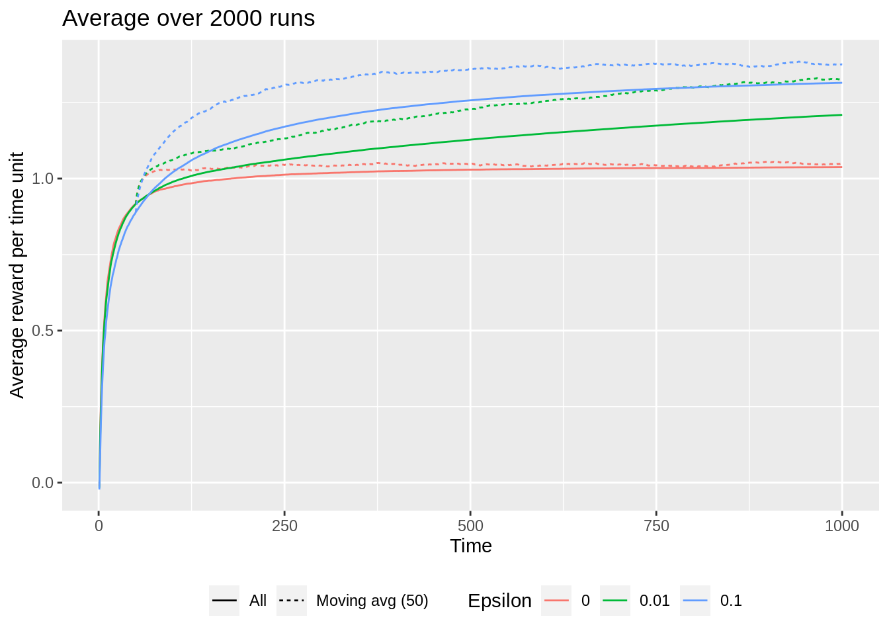
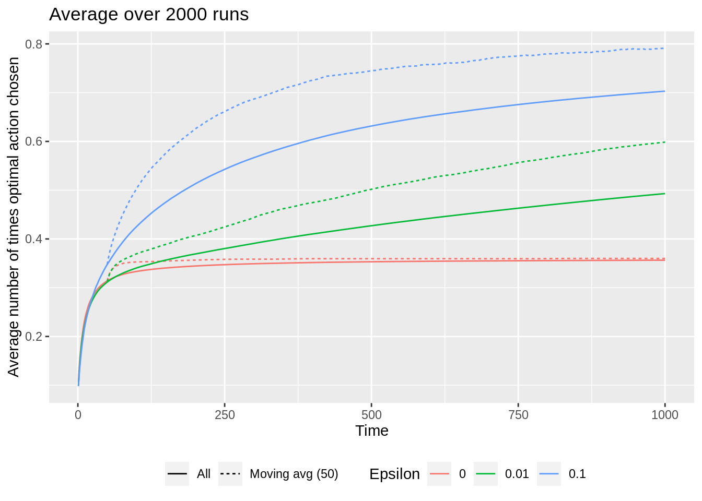
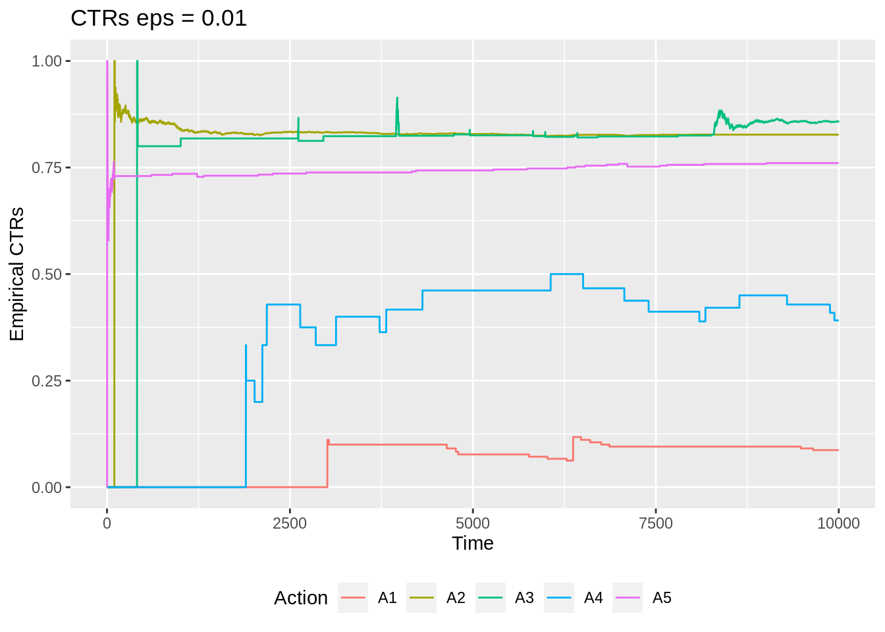
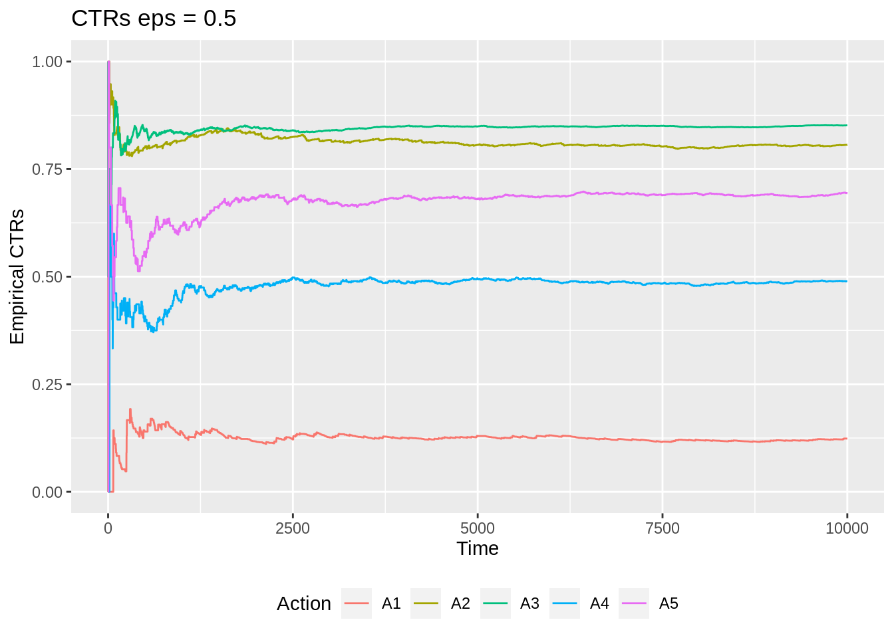

# (PART) Tabular methods {-}


# Multi-armed bandits {#mod-bandit}

This module consider the k-armed bandit problem which is a sequential decision problem with one state and $k$ actions. The problem is used to illustrate different learning methods used in RL. 

## Learning outcomes 

By the end of this module, you are expected to:

* Define a k-armed bandit and understand the nature of the problem. 
* Define the reward of a action (action-reward).
* Describe different methods for estimating the action-reward.
* Explain the differences between exploration and exploitation.
* Formulate an $\epsilon$-greedy algorithm for selecting the next action.
* Interpret the sample-average (variable step-size) versus exponential recency-weighted average (constant step-size) action-reward estimation.
* Argue why we might use a constant stepsize in the case of non-stationarity. 
* Understand the effect of optimistic initial values.
* Formulate an upper confidence bound action selection algorithm.

The learning outcomes relate to the [overall learning goals](#mod-lg-course) number 1, 3, 6, 9, 10 and 12 of the course.

<!-- SOLO increasing: identify · memorise · name · do simple procedure · collect data · -->
<!-- enumerate · describe · interpret · formulate · list · paraphrase · combine · do -->
<!-- algorithms · compare · contrast · explain causes · analyse · relate · derive · -->
<!-- evaluate · apply · argue · theorise · generalise · hypothesise · solve · reflect -->


## Textbook readings

For this week, you will need to read Chapter 2 - 2.7 in @Sutton18. Read it before continuing this module.


## The k-armed bandit problem

Multi-armed bandits attempt to find the best option among a collection of alternatives by learning through trial and error. The name derives from “one-armed bandit,” a slang term for a slot machine — which is a perfect analogy for how these algorithms work. 

<div class="figure" style="text-align: center">

<p class="caption">(\#fig:bandit)A 4-armed bandit.</p>
</div>

Imagine you are facing a wall with $k$ slot machines (see Figure \@ref(fig:bandit)), and each one pays out at a different rate. A natural way to figure out how to make the most money (rewards) would be to try each at random for a while (exploration), and start playing the higher paying ones once you have gained some experience (exploitation). That is, from an agent/environment point of view the agent considers a single state at time $t$ and have to choose among $k$ actions given the environment representing the $k$ bandits. Only the rewards from the $k$ bandits are unknown, but the agent observe samples of the reward of an action and can use this to estimate the expected reward of that action. The objective is to find an optimal policy that maximize the total expected reward. Note since the process only have a single state, this is the same as finding an optimal policy $\pi^*(s) = \pi^* = a^*$ that chooses the action with the highest expected reward. Due to uncertainty, there is an exploration vs exploitation dilemma. The agent have one action that seems to be most valuable at a time point, but it is highly likely, at least initially, that there are actions yet to explore that are more valuable.

<!-- For finding the optimal action a learning strategy that balance the exploration vs. exploitation trade-off. -->

<!-- To summarize: -->

<!-- * The agent are faced repeatedly with a choice of $k$ actions. -->
<!-- * After each choice, you receive a reward from a stationary probability distribution. -->
<!-- * Objective is to maximise total reward over some time period, say 100 time steps. -->

<!-- * Each action has an expected or mean reward based on its probability distribution. We shall call thjs the \textit{value} of the action. We do not know these values with certainty. -->
<!-- * Because of this uncertainty, there is always an exploration vs exploitation problem. We always have one action that we deem to be most valuable at any instant, but it is highly likely, at least initially, that there are actions we are yet to explore that are more valuable. -->

Multi-armed bandits can  be used in e.g. [digital advertising](https://research.facebook.com/blog/2021/4/auto-placement-of-ad-campaigns-using-multi-armed-bandits/). Suppose you are an advertiser seeking to optimize which ads ($k$ to choose among) to show visitors on a particular website. For each visitor, you can choose one out of a collection of ads, and your goal is to maximize the number of clicks over time. 

<div class="figure" style="text-align: center">

<p class="caption">(\#fig:bandit-choose)Which ad to choose?</p>
</div>

It is reasonable to assume that each of these ads will have different effects, and some will be more engaging than others. That is, each ad has some theoretical — but unknown — click-through-rate (CTR) that is assumed to not change over time. How do we go about solving which ad we should choose (see Figure \@ref(fig:bandit-choose))?


## Estimating the value of an action

How can the value of an action be estimated, i.e. the expected reward of an action $q_*(a) = \mathbb{E}[R_t | A_t = a]$. Assume that at time $t$ action $a$ has been chosen $N_t(a)$ times. Then the estimated action value is
\begin{equation} 
	Q_t(a) = \frac{R_1+R_2+\cdots+R_{N_t(a)}}{N_t(a)},
\end{equation}
Storing $Q_t(a)$ this way is cumbersome since memory and computation requirements grow over time. Instead an *incremental* approach is better. If we assume that $N_t(a) = n-1$ and set $Q_t(a) = Q_n$ then $Q_{n+1}$ becomes:
\begin{align}
  Q_{n+1} &= \frac{1}{n}\sum_{i=1}^{n}R_i \nonumber \\
		    &= \frac{1}{n}\left( R_{n} + \sum_{i=1}^{n-1} R_i \right) \nonumber \\
		    &= \frac{1}{n}\left( R_{n} + (n-1)\frac{1}{n-1}\sum_{i=1}^{n-1} R_i \right) \nonumber \\
		    &= \frac{1}{n}\left( R_{n} + (n-1)Q_n \right) \nonumber \\
	       &= Q_n + \frac{1}{n} \left[R_n - Q_n\right].
\end{align}
That is, we can update the estimate of the value of $a$ using the previous estimate, the observed reward and how many times the action has occurred ($n$). 

A greedy approach for selecting the next action is
\begin{equation}
A_t =\arg \max_a Q_t(a).
\end{equation}
Here $\arg\max_a$ means the value of $a$ for which $Q_t(a)$ is maximised. A pure greedy approach do not explore other actions. Instead an $\varepsilon$-greedy ppproach is used in which with probability $\varepsilon$ we take a random draw from all of the actions (choosing each action with equal probability) and hereby providing some exploration.

<!-- \begin{itemize} -->
<!-- 	\item Simplest action selection rule is to select the action with the highest estimated value. -->
<!-- 	\item \(\epsilon\)-greedy methods are where the agent selects the greedy option most of the time, and selects a random action with probability \(\epsilon\). -->
<!-- 	\item Three algorithms are tried: one with \(e\)=0 (pure greedy), one with \(e\)=0.01 and another with \(e\)=0.1 -->
<!-- 	\item Greedy method gets stuck performing sub-optimal actions. -->
<!-- 	\item \(e\)=0.1 explores more and usually finds the optimal action earlier, but never selects it more that 91\% of the time. -->
<!-- 	\item \(e\)=0.01 method improves more slowly, but eventually performs better than the e=0.1 method on both performance measures. -->
<!-- 	\item It is possible to reduce \(e\) over time to try to get the best of both high and low values. -->
<!-- \end{itemize} -->

<!-- Note this is the general formula  -->

<!-- \begin{equation} -->
<!-- NewEstimate \leftarrow OldEstimate + StepSize \left[Target - OldEstimate \right] -->
<!-- \end{equation} -->


Let us try to implement the algorithm using an R6 agent and environment class. First we define the agent that do actions based on an $\epsilon$-greedy strategy, stores the estimated $Q$ values and the number of times an action has been chosen:


```r
#' R6 Class representing the RL agent
RLAgent <- R6Class("RLAgent",
   public = list(
      #' @field qV Q estimates.
      qV = NULL,  
      
      #' @field nV Action counter.
      nV = NULL,  
      
      #' @field k Number of bandits.
      k = NULL,   
      
      #' @field epsilon Epsilon used in epsilon greed action selection.
      epsilon = NULL, 
      
      #' @description Create an object (when call new).
      #' @param k Number of bandits.
      #' @param epsilon Epsilon used in epsilon greed action selection.
      #' @return The new object.
      initialize = function(k = 10, epsilon = 0.01, ini =  0) {
         self$epsilon <- epsilon
         self$qV <- rep(ini, k)
         self$nV <- rep(0, k)
         self$k <- k
      },
      
      #' @description Clear learning.
      #' @param eps Epsilon.
      #' @return Action (index).
      clearLearning = function() {
         self$qV <- 0
         self$nV <- 0
      },
      
      #' @description Select next action using an epsilon greedy strategy.
      #' @return Action (index).
      selectActionEG = function() {   
         if (runif(1) <= self$epsilon) { # explore
            a <- sample(1:self$k, 1)
         } else { # exploit
            a <- which(self$qV == max(self$qV))
            a <- a[sample(length(a), 1)]
         }
         return(a)
      },
      
      #' @description Update learning values (including action counter).
      #' @param a Action.
      #' @param r Reward.
      #' @return NULL (invisible)
      updateQ = function(a, r) {
         self$nV[a] <- self$nV[a] + 1
         self$qV[a] <- self$qV[a] + 1/self$nV[a] * (r - self$qV[a])
         return(invisible(NULL))
      }
   )
)
```

Next, the environment generating rewards. The true mean reward $q_*(a)$ of an action were selected according to a normal (Gaussian) distribution with mean 0 and variance 1. The observed reward was then generated using a normal distribution with mean $q_*(a)$ and variance 1:


```r
#' R6 Class representing the RL environment
#' 
#' Assume that bandits are normal distributed with a mean and std.dev of one. 
RLEnvironment <- R6Class("RLEnvironment",
   public = list(
      #' @field mV Mean values
      mV = NULL,  
      
      #' @field k Number of bandits.
      k = NULL,   
      
      #' @description Create an object (when call new).
      #' @param k Number of bandits.
      #' @return The new object.
      initialize = function(k = 10) {
         self$mV <- rnorm(k)
      },
      
      #' @description Sample reward of a bandit.
      #' @param a Bandit (index).
      #' @return The reward.
      reward = function(a) {
         return(rnorm(1, self$mV[a]))
      },
      
      #' @description Returns action with best mean.
      optimalAction = function() return(which.max(self$mV))
   )
)
```

To test the RL algorithm we use a function returning two plots that compare the performance:


```r
#' Performance of the bandit algorithm using different epsilons.
#'
#' @param k Bandits.
#' @param steps Time steps.
#' @param runs Number of runs with a new environment generated.
#' @param epsilons Epsilons to be tested.
#' @param ini Initial value estimates.
#' @return Two plots in a list.
performance <- function(k = 10, steps = 1000, runs = 500, 
                        epsilons = c(0, 0.01, 0.1), ini = 0) {
   rew <- matrix(0, nrow = steps, ncol = length(epsilons))   # rewards (one col for each eps)
   best <- matrix(0, nrow = steps, ncol = length(epsilons))  # add 1 if find the best action
   for (run in 1:runs) {
      env <- RLEnvironment$new(k)
      oA <- env$optimalAction()
      # print(oA); print(env$mV)
      for (i in 1:length(epsilons)) {
         agent <- RLAgent$new(k, epsilons[i], ini)
         for (t in 1:steps) {
            a <- agent$selectActionEG()
            r <- env$reward(a)
            agent$updateQ(a, r)
            rew[t, i] <- rew[t, i] + r  # sum of rewards generated at t
            best[t, i] <- best[t, i] + (a == oA) # times find best actions
         }
      }
   }
   colnames(rew) <- epsilons
   colnames(best) <- epsilons
   dat1 <- tibble(t = 1:steps) %>%
      bind_cols(rew) %>%   # bind data together
      pivot_longer(!t, values_to = "reward", names_to = "epsilon") %>%   # move rewards to a single column
      group_by(epsilon) %>% 
      mutate(All = cumsum(reward/runs)/t, `Moving avg (50)` = rollapply(reward/runs, 50, mean, align = "right", fill = NA)) %>% 
      select(-reward) %>% 
      pivot_longer(!c(t, epsilon))
   dat2 <- tibble(t = 1:steps) %>%
      bind_cols(best) %>%   # bind data together
      pivot_longer(!t, values_to = "optimal", names_to = "epsilon") %>%   
      group_by(epsilon) %>% 
      mutate(All = cumsum(optimal/runs)/t, `Moving avg (50)` = rollapply(optimal/runs, 50, mean, align = "right", fill = NA)) %>% 
      select(-optimal) %>% 
      pivot_longer(!c(t, epsilon))
  # calc average
   pt1 <- dat1 %>% 
      ggplot(aes(x = t, y = value, col = epsilon, linetype = name)) +
      geom_line() +
      labs(y = "Average reward per time unit", x = "Time", title = str_c("Average over ", runs, " runs "), col = "Epsilon", linetype = "") +
      theme(legend.position = "bottom")
   pt2 <- dat2 %>% 
      ggplot(aes(x = t, y = value, col = epsilon, linetype = name)) +
      geom_line() +
      labs(y = "Average number of times optimal action chosen", x = "Time", title = str_c("Average over ", runs, " runs"), col = "Epsilon", linetype = "") +
      theme(legend.position = "bottom")
   return(list(ptR = pt1, ptO = pt2))
}
```

We test the performance using 2000 runs over 1000 time steps.


```r
pts <- performance(runs = 2000, steps = 1000)
pts$ptR
pts$ptO
```



The solid line shows averages over all the runs from $t=1$ to the considered time-step while the dotted line is a moving average over the last 50 time-steps. Since we are expected to learn over the time-steps the moving averages will in general be higher than the overall averages. Note that if we have 1000 time-steps a greedy approach in general is bad and an $\epsilon$-greedy approach is better ($\epsilon = 0.1 is best). That is, exploration is beneficial.


## The role of the step-size

In general we update the reward estimate of an action using 

\begin{equation}
	Q_{k+1} = Q_k +\alpha_n(a) \left[R_k - Q_k\right]
\end{equation}

Until now we have used the sample average $\alpha_n(a)= 1/n$; however, other choices of $\alpha_n(a)$ is possible. In general we will converge to the true reward if

\begin{equation}
    \sum_n \alpha_n(a) = \infty \quad\quad \mathsf{and} \quad\quad  \sum_n \alpha_n(a)^2 < \infty.
\end{equation}

Meaning that the coefficients must be large enough to recover from initial fluctuations, but not so large that they do not converge in the long run. However, if the process is non-stationary, i.e. the expected reward of an action change over time, then convergence is undesirable and we may want to use a constant $\alpha_n(a)= \alpha \in (0, 1]$ instead. This results in \(Q_{n+1}\) being a weighted average of the past rewards and the initial estimate \(Q_1\):

\begin{align}
Q_{n+1} &= Q_n +\alpha \left[R_n - Q_n\right] \nonumber \\
&= \alpha R_n + (1 - \alpha)Q_n \nonumber \\
&= \alpha R_n + (1 - \alpha)[\alpha R_{n-1} + (1 - \alpha)Q_{n-1}] \nonumber \\
&= \alpha R_n + (1 - \alpha)\alpha R_{n-1} + (1 - \alpha)^2 Q_{n-1}  \nonumber \\
&= \vdots \nonumber \\
&= (1-\alpha)^n Q_1 + \sum_{i=1}^{n} \alpha (1 - \alpha)^{n-i} R_i \\
\end{align}

Because the weight given to each reward depends on how many rewards ago it was observed, we can see that more recent rewards are given more weight. Note the weights \(\alpha\) sum to 1 here, ensuring it is indeed a weighted average where more weight is allocated to recent rewards. Since  the weight given to each reward decays exponentially into the past. This sometimes called an *exponential recency-weighted average*.


## Optimistic initial values

The methods discussed so far are dependent to some extent on the initial action-value estimate i.e. they are biased by their initial estimates. For methods with constant \(\alpha\) this bias is permanent. We may set initial value estimates artificially high to encourage exploration in the short run. For instance, by setting initial values of $Q$ to 5 rather than 0 we encourage exploration, even in the greedy case. Here the agent will almost always be disappointed with it's samples because they are less than the initial estimate and so will explore elsewhere until the values converge.


## Upper-Confidence Bound Action Selection

An $\epsilon$-greed algorithm choose the action to explore with equal probability in an exploration step. It would be better to select among non-greedy actions according to their potential for actually being optimal, taking into account both how close their estimates are to being maximal and the uncertainty in those estimates. One way to do this is to select actions using the \emph{upper-confidence bound}:
\begin{equation}
	A_t = \arg\max_a \left(Q_t(a) + c\sqrt{\frac{\ln t}{N_t(a)}}\right),
\end{equation}

Note the square root term is a measure of the uncertainty in our estimate. 

* It is proportional to \(t\) i.e. how many time-steps have passed and inversely proportional to \(N_t(a)\) i.e. how many times that action has been visited. 
* The more time has passed, and the less we have sampled an action, the higher our upper-confidence-bound. 
* As the timesteps increases, the denominator dominates the numerator as the ln term flattens. 
* Each time we select an action our uncertainty decreases because $N$ is the denominator of this equation. 
* If $N_t(a) = 0$ then we consider $a$ as a maximal action, i.e. we select first among actions with $N_t(a) = 0$.
* The parameter $c>0$ controls the degree of exploration. Higher $c$ results in more weight on the uncertainty. 

Since upper-confidence bound action selection select actions according to their potential, it is expected to perform better than $\epsilon$-greedy methods.


## Exercises {#sec-bandit-ex}

Below you will find a set of exercises. Always have a look at the exercises before you meet in your study group and try to solve them yourself. Are you stuck, see the [help page](#help). Some of the solutions to each exercise can be seen by pressing the button at each question. Beware, you will not learn by giving up too early. Put some effort into finding a solution!

### Exercise - Advertising

Suppose you are an advertiser seeking to optimize which ads to show visitors on a particular website. For each visitor, you can choose one out of a collection of ads, and your goal is to maximize the number of clicks over time. Assume that:

* You have $k=5$ adds to choose among.
* If add $A$ is chosen then the user clicks the add with probability $p_A$ which can be seen as the unknown click trough rate CTR (or an average reward).
* The CTRs are unknown and samples can be picked using the `RLAdEnv` class and the reward function which returns 1 if click on ad and 0 otherwise.


```r
#' R6 Class representing the RL advertising environment
RLAdEnv <- R6Class("RLAdEnv",
   public = list(
      #' @field mV Click trough rates
      mV = c(0.1, 0.83, 0.85, 0.5, 0.7),  
      
      #' @field k Number of ads.
      k = 5,   
      
      #' @description Sample reward of a bandit.
      #' @param a Bandit/ad (index).
      #' @return One if click on ad and zero otherwise.
      reward = function(a) {
         return(rbinom(1, 1, self$mV[a]))
      },
      
      #' @description Returns action with best mean.
      optimalAction = function() return(which.max(self$mV))
   )
)

env <- RLAdEnv$new()
env$reward(2)  # click on ad number two (return 0 or 1)?
#> [1] 1
env$optimalAction()  # the best ad
#> [1] 3
env$mV  # true CTRs
#> [1] 0.10 0.83 0.85 0.50 0.70
```

In the class the true CTRs can be observed but in practice this is hidden from the agent.  

Consider an $\epsilon$-greedy algorithm to find the best ad. Assume the webpage is visited by 10000 users per day. 

<!-- Q1 -->

<div class="modal fade bs-example-modal-lg" id="uqUutmgA4LlIz9yklEF6" tabindex="-1" role="dialog" aria-labelledby="uqUutmgA4LlIz9yklEF6-title"><div class="modal-dialog modal-lg" role="document"><div class="modal-content"><div class="modal-header"><button type="button" class="close" data-dismiss="modal" aria-label="Close"><span aria-hidden="true">&times;</span></button><h4 class="modal-title" id="uqUutmgA4LlIz9yklEF6-title">Solution</h4></div><div class="modal-body">

```{.r .fold-show}
set.seed(327)  # to get same results 

#' Performance of the bandit algorithm.
#' @param steps Steps (users).
#' @param epsilon Epsilon to be tested.
#' @return A list with statistics.
testEG <- function(epsilon, steps = 10000) {
   agent <- RLAgent$new(k = 5, epsilon = epsilon)
   rew <- 0
   for (t in 1:steps) {
      a <- agent$selectActionEG()
      r <- env$reward(a)
      rew <- rew + r
      agent$updateQ(a, r)
   }
   return(list(qV = agent$qV, avgReward = rew/steps))
}
testEG(0.01)
#> $qV
#> [1] 0.000 0.800 0.852 0.409 0.654
#> 
#> $avgReward
#> [1] 0.849
testEG(0.1)
#> $qV
#> [1] 0.119 0.843 0.849 0.516 0.685
#> 
#> $avgReward
#> [1] 0.824
testEG(0.5)
#> $qV
#> [1] 0.110 0.844 0.851 0.484 0.703
#> 
#> $avgReward
#> [1] 0.725

# True values
env$optimalAction()
#> [1] 3
env$mV
#> [1] 0.10 0.83 0.85 0.50 0.70
```


<p>Epsilon = 0.01 seems to give the best average.</p>

</div><div class="modal-footer"><button class="btn btn-default" data-dismiss="modal">Close</button></div></div></div></div><button class="btn btn-default btn-xs" style="float:right" data-toggle="modal" data-target="#uqUutmgA4LlIz9yklEF6">Solution</button>

   1) Run the $\epsilon$-greedy algorithm with $\epsilon = 0.01, 0.1, 0.5$ over the 10000 steps. What are the estimated CTRs? What is the average number of clicks per user?
   
<!-- Q2 -->

<div class="modal fade bs-example-modal-lg" id="9UNSaGJghbZYV0FR4kTI" tabindex="-1" role="dialog" aria-labelledby="9UNSaGJghbZYV0FR4kTI-title"><div class="modal-dialog modal-lg" role="document"><div class="modal-content"><div class="modal-header"><button type="button" class="close" data-dismiss="modal" aria-label="Close"><span aria-hidden="true">&times;</span></button><h4 class="modal-title" id="9UNSaGJghbZYV0FR4kTI-title">Solution</h4></div><div class="modal-body">

```{.r .fold-show}
## Test function modified with plot feature
testEG <- function(epsilon, steps = 10000) {
   agent <- RLAgent$new(k = 5, epsilon = epsilon)
   rew <- 0
   qVal <- matrix(0, nrow = 10000, ncol = 5)
   colnames(qVal) = str_c("A", 1:5)
   for (t in 1:steps) {
      a <- agent$selectActionEG()
      r <- env$reward(a)
      rew <- rew + r
      agent$updateQ(a, r)
      qVal[t,] <- agent$qV
   }
   # make plot
   dat <- tibble(t = 1:10000) %>%
      bind_cols(qVal) %>%   # bind data together
      pivot_longer(!t, values_to = "ctr", names_to = "action") 
   pt <- dat %>% 
      ggplot(aes(x = t, y = ctr, col = action)) +
      geom_line() +
      labs(y = "Empirical CTRs", x = "Time", title = str_c("CTRs eps = ", epsilon), col = "Action") +
      theme(legend.position = "bottom")
   return(list(qV = agent$qV, avgReward = rew/steps, plt = pt))
}
testEG(0.01)$plt
testEG(0.5)$plt
```


<p>As epsilon grows we estimate the true values better for all actions.</p>

</div><div class="modal-footer"><button class="btn btn-default" data-dismiss="modal">Close</button></div></div></div></div><button class="btn btn-default btn-xs" style="float:right" data-toggle="modal" data-target="#9UNSaGJghbZYV0FR4kTI">Solution</button>

   2) Make a plot of the empirical CTRs for $\epsilon = 0.01, 0.5$ over the 10000 time-steps, i.e. plot $Q_t(a)$. 
   
<!-- Q3 -->

<div class="modal fade bs-example-modal-lg" id="cJNysHsWq0UWK5lQcvNQ" tabindex="-1" role="dialog" aria-labelledby="cJNysHsWq0UWK5lQcvNQ-title"><div class="modal-dialog modal-lg" role="document"><div class="modal-content"><div class="modal-header"><button type="button" class="close" data-dismiss="modal" aria-label="Close"><span aria-hidden="true">&times;</span></button><h4 class="modal-title" id="cJNysHsWq0UWK5lQcvNQ-title">Solution</h4></div><div class="modal-body">

```{.r .fold-show}
## Test function modified with rewards
testEG <- function(epsilon, steps = 10000) {
   agent <- RLAgent$new(k = 5, epsilon = epsilon)
   rewards <- c(10, 8, 5, 15, 2)
   rew <- 0
   qVal <- matrix(0, nrow = 10000, ncol = 5)
   colnames(qVal) = str_c("A", 1:5)
   for (t in 1:steps) {
      a <- agent$selectActionEG()
      r <- env$reward(a) * rewards[a]
      rew <- rew + r
      agent$updateQ(a, r)
      qVal[t,] <- agent$qV
   }
   return(list(qV = agent$qV, avgReward = rew/steps))
}
testEG(0.01)
#> $qV
#> [1] 0.909 6.565 4.583 7.607 1.378
#> 
#> $avgReward
#> [1] 6.83
testEG(0.5)
#> $qV
#> [1] 0.952 6.640 4.290 7.459 1.355
#> 
#> $avgReward
#> [1] 5.74

# True average reward values
env$mV * c(10, 8, 5, 15, 2)
#> [1] 1.00 6.64 4.25 7.50 1.40
```


<p>The best action is now 4 and eps = 0.01 seems to give the best overall average reward.</p>

</div><div class="modal-footer"><button class="btn btn-default" data-dismiss="modal">Close</button></div></div></div></div><button class="btn btn-default btn-xs" style="float:right" data-toggle="modal" data-target="#cJNysHsWq0UWK5lQcvNQ">Solution</button>
   
   3) Assume that the rewards of ad clicks is equal to (10, 8, 5, 15, 2). Modify the algorithm so you look at rewards instead of CTRs. What is the best action to choose?
   
<!-- Q4 -->
We now modify the RLAgent and add an upper-confidence bound function `selectActionUCB`:


```r
#' R6 Class representing the RL agent
RLAgent <- R6Class("RLAgent",
   public = list(
      #' @field qV Q estimates.
      qV = NULL,  
      
      #' @field nV Action counter.
      nV = NULL,  
      
      #' @field k Number of bandits.
      k = NULL,   
      
      #' @field epsilon Epsilon used in epsilon greed action selection.
      epsilon = NULL, 
      
      #' @description Create an object (when call new).
      #' @param k Number of bandits.
      #' @param epsilon Epsilon used in epsilon greed action selection.
      #' @return The new object.
      initialize = function(k = 10, epsilon = 0.01, ini =  0) {
         self$epsilon <- epsilon
         self$qV <- rep(ini, k)
         self$nV <- rep(0, k)
         self$k <- k
      },
      
      #' @description Clear learning.
      #' @param eps Epsilon.
      #' @return Action (index).
      clearLearning = function() {
         self$qV <- 0
         self$nV <- 0
      },
      
      #' @description Select next action using an epsilon greedy strategy.
      #' @return Action (index).
      selectActionEG = function() {   
         if (runif(1) <= self$epsilon) { # explore
            a <- sample(1:self$k, 1)
         } else { # exploit
            a <- which(self$qV == max(self$qV))
            a <- a[sample(length(a), 1)]
         }
         return(a)
      },
      
      #' @description Select next action using UCB 
      #' @return Action (index).
      selectActionUCB = function(c, t) {   
         val <- self$qV + c * sqrt(log(t + 0.01)/self$nV)
         a <- which.max(val)
         return(a)
      },
      
      #' @description Update learning values (including action counter).
      #' @param a Action.
      #' @param r Reward.
      #' @return NULL (invisible)
      updateQ = function(a, r) {
         self$nV[a] <- self$nV[a] + 1
         self$qV[a] <- self$qV[a] + 1/self$nV[a] * (r - self$qV[a])
         return(invisible(NULL))
      }
   )
)
```
   

<div class="modal fade bs-example-modal-lg" id="mhFyML8wY85v311DV6ie" tabindex="-1" role="dialog" aria-labelledby="mhFyML8wY85v311DV6ie-title"><div class="modal-dialog modal-lg" role="document"><div class="modal-content"><div class="modal-header"><button type="button" class="close" data-dismiss="modal" aria-label="Close"><span aria-hidden="true">&times;</span></button><h4 class="modal-title" id="mhFyML8wY85v311DV6ie-title">Solution</h4></div><div class="modal-body">

```{.r .fold-show}
testUCB <- function(c = 2, steps = 10000) {
   agent <- RLAgent$new(k = 5)
   rewards <- c(10, 8, 5, 15, 2)
   rew <- 0
   for (t in 1:steps) {
      a <- agent$selectActionUCB(c, t)
      r <- env$reward(a) * rewards[a]
      rew <- rew + r
      agent$updateQ(a, r)
   }
   return(list(qV = agent$qV, avgReward = rew/steps))
}
testUCB(0.1)
#> $qV
#> [1] 0.00 6.63 3.75 0.00 0.00
#> 
#> $avgReward
#> [1] 6.63
testUCB(5)
#> $qV
#> [1] 2.22 6.48 3.68 7.46 1.43
#> 
#> $avgReward
#> [1] 7.28
testUCB(10)
#> $qV
#> [1] 0.556 6.586 3.952 7.502 1.680
#> 
#> $avgReward
#> [1] 7.4
testUCB(20)
#> $qV
#> [1] 1.48 6.62 4.25 7.56 1.42
#> 
#> $avgReward
#> [1] 7.25
```


<p>A value \(c = 10\) seems to be a good choice.</p>

</div><div class="modal-footer"><button class="btn btn-default" data-dismiss="modal">Close</button></div></div></div></div><button class="btn btn-default btn-xs" style="float:right" data-toggle="modal" data-target="#mhFyML8wY85v311DV6ie">Solution</button>

   4) Test the UCB algorithm for $c$ values $(0.1, 5, 10, 20)$. Which algorithm seems to find the best average reward?


[BSS]: https://bss.au.dk/en/
[bi-programme]: https://kandidat.au.dk/en/businessintelligence/

[course-help]: https://github.com/bss-osca/rl/issues
[cran]: https://cloud.r-project.org
[cheatsheet-readr]: https://rawgit.com/rstudio/cheatsheets/master/data-import.pdf
[course-welcome-to-the-tidyverse]: https://github.com/rstudio-education/welcome-to-the-tidyverse

[DataCamp]: https://www.datacamp.com/
[datacamp-signup]: https://www.datacamp.com/groups/shared_links/cbaee6c73e7d78549a9e32a900793b2d5491ace1824efc1760a6729735948215
[datacamp-r-intro]: https://learn.datacamp.com/courses/free-introduction-to-r
[datacamp-r-rmarkdown]: https://campus.datacamp.com/courses/reporting-with-rmarkdown
[datacamp-r-communicating]: https://learn.datacamp.com/courses/communicating-with-data-in-the-tidyverse
[datacamp-r-communicating-chap3]: https://campus.datacamp.com/courses/communicating-with-data-in-the-tidyverse/introduction-to-rmarkdown
[datacamp-r-communicating-chap4]: https://campus.datacamp.com/courses/communicating-with-data-in-the-tidyverse/customizing-your-rmarkdown-report
[datacamp-r-intermediate]: https://learn.datacamp.com/courses/intermediate-r
[datacamp-r-intermediate-chap1]: https://campus.datacamp.com/courses/intermediate-r/chapter-1-conditionals-and-control-flow
[datacamp-r-intermediate-chap2]: https://campus.datacamp.com/courses/intermediate-r/chapter-2-loops
[datacamp-r-intermediate-chap3]: https://campus.datacamp.com/courses/intermediate-r/chapter-3-functions
[datacamp-r-intermediate-chap4]: https://campus.datacamp.com/courses/intermediate-r/chapter-4-the-apply-family
[datacamp-r-functions]: https://learn.datacamp.com/courses/introduction-to-writing-functions-in-r
[datacamp-r-tidyverse]: https://learn.datacamp.com/courses/introduction-to-the-tidyverse
[datacamp-r-strings]: https://learn.datacamp.com/courses/string-manipulation-with-stringr-in-r
[datacamp-r-dplyr]: https://learn.datacamp.com/courses/data-manipulation-with-dplyr
[datacamp-r-dplyr-bakeoff]: https://learn.datacamp.com/courses/working-with-data-in-the-tidyverse
[datacamp-r-ggplot2-intro]: https://learn.datacamp.com/courses/introduction-to-data-visualization-with-ggplot2
[datacamp-r-ggplot2-intermediate]: https://learn.datacamp.com/courses/intermediate-data-visualization-with-ggplot2
[dplyr-cran]: https://CRAN.R-project.org/package=dplyr
[debug-in-r]: https://rstats.wtf/debugging-r-code.html

[google-form]: https://forms.gle/s39GeDGV9AzAXUo18
[google-grupper]: https://docs.google.com/spreadsheets/d/1DHxthd5AQywAU4Crb3hM9rnog2GqGQYZ2o175SQgn_0/edit?usp=sharing
[GitHub]: https://github.com/
[git-install]: https://git-scm.com/downloads
[github-actions]: https://github.com/features/actions
[github-pages]: https://pages.github.com/
[gh-rl-student]: https://github.com/bss-osca/rl-student
[gh-rl]: https://github.com/bss-osca/rl

[happy-git]: https://happygitwithr.com
[hg-install-git]: https://happygitwithr.com/install-git.html
[hg-why]: https://happygitwithr.com/big-picture.html#big-picture
[hg-github-reg]: https://happygitwithr.com/github-acct.html#github-acct
[hg-git-install]: https://happygitwithr.com/install-git.html#install-git
[hg-exist-github-first]: https://happygitwithr.com/existing-github-first.html
[hg-exist-github-last]: https://happygitwithr.com/existing-github-last.html
[hg-credential-helper]: https://happygitwithr.com/credential-caching.html
[hypothes.is]: https://web.hypothes.is/

[osca-programme]: https://kandidat.au.dk/en/operationsandsupplychainanalytics/

[Peergrade]: https://peergrade.io
[peergrade-signup]: https://app.peergrade.io/join
[point-and-click]: https://en.wikipedia.org/wiki/Point_and_click
[pkg-bookdown]: https://bookdown.org/yihui/bookdown/
[pkg-openxlsx]: https://ycphs.github.io/openxlsx/index.html
[pkg-ropensci-writexl]: https://docs.ropensci.org/writexl/
[pkg-jsonlite]: https://cran.r-project.org/web/packages/jsonlite/index.html

[R]: https://www.r-project.org
[RStudio]: https://rstudio.com
[rstudio-cloud]: https://rstudio.cloud/spaces/176810/join?access_code=LSGnG2EXTuzSyeYaNXJE77vP33DZUoeMbC0xhfCz
[r-cloud-mod12]: https://rstudio.cloud/spaces/176810/project/2963819
[r-cloud-mod13]: https://rstudio.cloud/spaces/176810/project/3020139
[r-cloud-mod14]: https://rstudio.cloud/spaces/176810/project/3020322
[r-cloud-mod15]: https://rstudio.cloud/spaces/176810/project/3020509
[r-cloud-mod16]: https://rstudio.cloud/spaces/176810/project/3026754
[r-cloud-mod17]: https://rstudio.cloud/spaces/176810/project/3034015
[r-cloud-mod18]: https://rstudio.cloud/spaces/176810/project/3130795
[r-cloud-mod19]: https://rstudio.cloud/spaces/176810/project/3266132
[rstudio-download]: https://rstudio.com/products/rstudio/download/#download
[rstudio-customizing]: https://support.rstudio.com/hc/en-us/articles/200549016-Customizing-RStudio
[rstudio-key-shortcuts]: https://support.rstudio.com/hc/en-us/articles/200711853-Keyboard-Shortcuts
[rstudio-workbench]: https://www.rstudio.com/wp-content/uploads/2014/04/rstudio-workbench.png
[r-markdown]: https://rmarkdown.rstudio.com/
[ropensci-writexl]: https://docs.ropensci.org/writexl/
[r4ds-pipes]: https://r4ds.had.co.nz/pipes.html
[r4ds-factors]: https://r4ds.had.co.nz/factors.html
[r4ds-strings]: https://r4ds.had.co.nz/strings.html
[r4ds-iteration]: https://r4ds.had.co.nz/iteration.html


[stat-545]: https://stat545.com
[stat-545-functions-part1]: https://stat545.com/functions-part1.html
[stat-545-functions-part2]: https://stat545.com/functions-part2.html
[stat-545-functions-part3]: https://stat545.com/functions-part3.html
[slides-welcome]: https://bss-osca.github.io/rl/slides/00-rl_welcome.html
[slides-m1-3]: https://bss-osca.github.io/rl/slides/01-welcome_r_part.html
[slides-m4-5]: https://bss-osca.github.io/rl/slides/02-programming.html
[slides-m6-8]: https://bss-osca.github.io/rl/slides/03-transform.html
[slides-m9]: https://bss-osca.github.io/rl/slides/04-plot.html
[slides-m83]: https://bss-osca.github.io/rl/slides/05-joins.html

[tidyverse-main-page]: https://www.tidyverse.org
[tidyverse-packages]: https://www.tidyverse.org/packages/
[tidyverse-core]: https://www.tidyverse.org/packages/#core-tidyverse
[tidyverse-ggplot2]: https://ggplot2.tidyverse.org/
[tidyverse-dplyr]: https://dplyr.tidyverse.org/
[tidyverse-tidyr]: https://tidyr.tidyverse.org/
[tidyverse-readr]: https://readr.tidyverse.org/
[tidyverse-purrr]: https://purrr.tidyverse.org/
[tidyverse-tibble]: https://tibble.tidyverse.org/
[tidyverse-stringr]: https://stringr.tidyverse.org/
[tidyverse-forcats]: https://forcats.tidyverse.org/
[tidyverse-readxl]: https://readxl.tidyverse.org
[tidyverse-googlesheets4]: https://googlesheets4.tidyverse.org/index.html
[tutorial-markdown]: https://commonmark.org/help/tutorial/
[tfa-course]: https://bss-osca.github.io/tfa/

[Udemy]: https://www.udemy.com/

[vba-yt-course1]: https://www.youtube.com/playlist?list=PLpOAvcoMay5S_hb2D7iKznLqJ8QG_pde0
[vba-course1-hello]: https://youtu.be/f42OniDWaIo

[vba-yt-course2]: https://www.youtube.com/playlist?list=PL3A6U40JUYCi4njVx59-vaUxYkG0yRO4m
[vba-course2-devel-tab]: https://youtu.be/awEOUaw9q58
[vba-course2-devel-editor]: https://youtu.be/awEOUaw9q58
[vba-course2-devel-project]: https://youtu.be/fp6PTbU7bXo
[vba-course2-devel-properties]: https://youtu.be/ks2QYKAd9Xw
[vba-course2-devel-hello]: https://youtu.be/EQ6tDWBc8G4

[video-install]: https://vimeo.com/415501284
[video-rstudio-intro]: https://vimeo.com/416391353
[video-packages]: https://vimeo.com/416743698
[video-projects]: https://vimeo.com/319318233
[video-r-intro-p1]: https://www.youtube.com/watch?v=vGY5i_J2c-c
[video-r-intro-p2]: https://www.youtube.com/watch?v=w8_XdYI3reU
[video-r-intro-p3]: https://www.youtube.com/watch?v=NuY6jY4qE7I
[video-subsetting]: https://www.youtube.com/watch?v=hWbgqzsQJF0&list=PLjTlxb-wKvXPqyY3FZDO8GqIaWuEDy-Od&index=10&t=0s
[video-datatypes]: https://www.youtube.com/watch?v=5AQM-yUX9zg&list=PLjTlxb-wKvXPqyY3FZDO8GqIaWuEDy-Od&index=10
[video-control-structures]: https://www.youtube.com/watch?v=s_h9ruNwI_0
[video-conditional-loops]: https://www.youtube.com/watch?v=2evtsnPaoDg
[video-functions]: https://www.youtube.com/watch?v=ffPeac3BigM
[video-tibble-vs-df]: https://www.youtube.com/watch?v=EBk6PnvE1R4
[video-dplyr]: https://www.youtube.com/watch?v=aywFompr1F4

[wiki-snake-case]: https://en.wikipedia.org/wiki/Snake_case
[wiki-camel-case]: https://en.wikipedia.org/wiki/Camel_case
[wiki-interpreted]: https://en.wikipedia.org/wiki/Interpreted_language
[wiki-literate-programming]: https://en.wikipedia.org/wiki/Literate_programming
[wiki-csv]: https://en.wikipedia.org/wiki/Comma-separated_values
[wiki-json]: https://en.wikipedia.org/wiki/JSON
