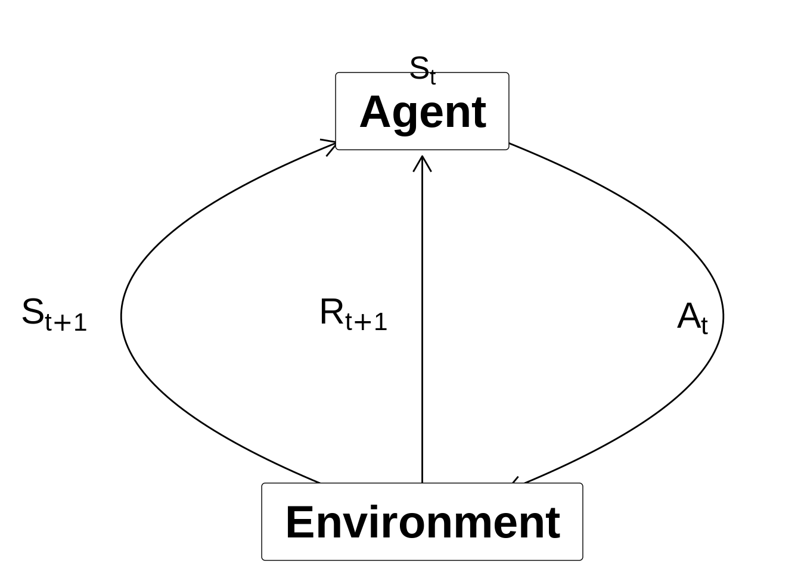
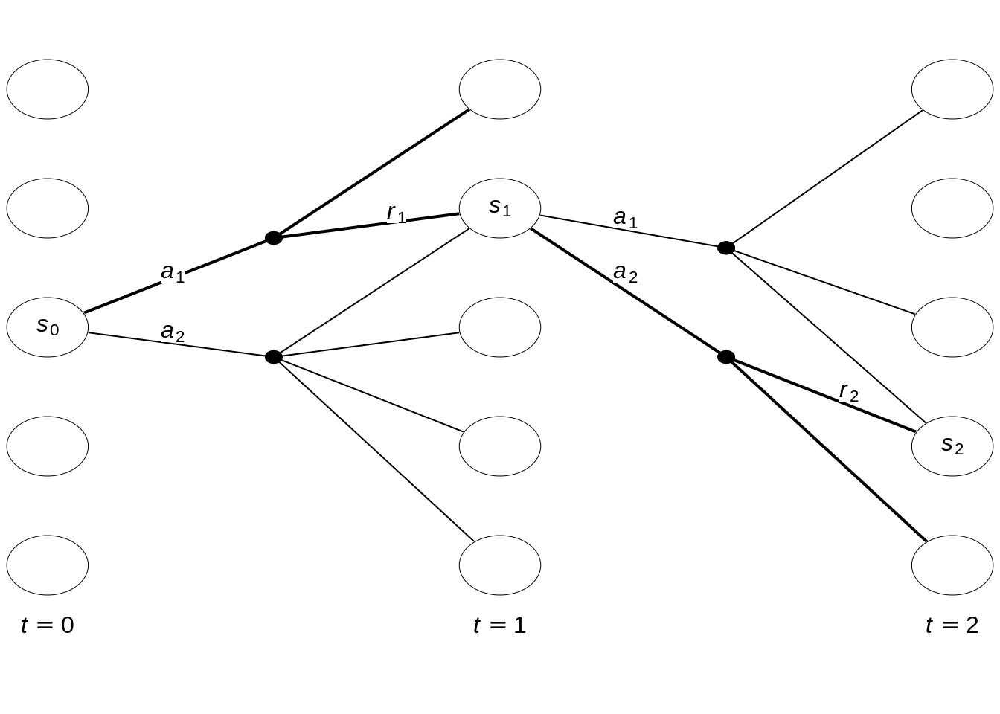

# Markov decision processes {#mod-mdp}

This module gives an introduction to Markov decision processes (MDPs) with a finite number of states and actions. This gives us a full model of a sequential decision problem. MDPs are a classical formalization of sequential decision making, where actions influence not just immediate rewards, but also what will be the next state, and hence future rewards. Thus MDPs involve delayed reward and the need to consider the trade-off between immediate and delayed reward. MDPs are a mathematically idealized form of the RL problem where a full description is known and the optimal policy can be found. Often in a RL problem some parts of this description is unknown and we hereby have to estimate the best policy by learning. For example, in the bandit problem the rewards was unknown.  

## Learning outcomes 

By the end of this module, you are expected to:

<!-- Understand Markov Decision Processes (MDP) -->
<!-- Describe how the dynamics of an MDP are defined -->
<!-- Understand the graphical representation of a Markov Decision Process -->
<!-- Explain how many diverse processes can be written in terms of the MDP framework -->
<!-- Describe how rewards relate to the goal of an agent -->
<!-- Understand episodes and identify episodic tasks -->
<!-- Formulate returns for continuing tasks using discounting -->
<!-- Describe how returns at successive time steps are related to each other -->
<!-- Understand when to formalize a task as episodic or continuing -->

<!-- The learning outcomes relate to the [overall learning goals](#mod-lg-course) number 2 and 4 of the course. -->

<!-- SOLO increasing: identify · memorise · name · do simple procedure · collect data · -->
<!-- enumerate · describe · interpret · formulate · list · paraphrase · combine · do -->
<!-- algorithms · compare · contrast · explain causes · analyse · relate · derive · -->
<!-- evaluate · apply · argue · theorise · generalise · hypothesise · solve · reflect -->

## Textbook readings

For this week, you will need to read Chapter 3-3.8 in @Sutton18. Read it before continuing this module. You do not have to put to much focus on the examples. A summary of the book notation can be seen [here](sutton-notation).

## A MDP as a model for the agent-environment

Let us recall the RL problem which considers an agent in an environment:

- Agent: The one who takes the action (computer, robot, decision maker), i.e. the decision making component of a system. Everything else is the environment. A general rule is that anything that the agent does not have absolute control over forms part of the environment. 
- Environment: The system/world where observations and rewards are found. 

At time step $t$ the agent is in state $S_t$ and takes action $A_{t}$ and observe the new state $S_{t+1}$ and reward $R_{t+1}$:

(\#fig:unnamed-chunk-4)Agent-environment representation.

Note we here assume that the *Markov property* is satisfied and the current state holds just as much information as the history of observations. That is, given the present state the future is independent of the past:

$$\Pr(S_{t+1} | S_t, A_t) = \Pr(S_{t+1} | S_1,...,S_t, A_t).$$
That is, the probability of seeing some next state $S_{t+1}$ given the current state is exactly equal to the probability of that next state given the entire history of states. 

A Markov decision process (MDP) is a mathematical model that for each time-step $t$ have defined states $S_t \in \mathcal{S}$, possible actions $A_t \in \mathcal{A}(s)$ given a state and rewards $R_t \in \mathcal{R} \subset \mathbb{R}$. Consider the example in Figure \@ref(fig:hgf1). Each time-step have five states $\mathcal{S} = \{1,2,3,4,5\}$. Assume that the agent start in state $s_0$ with two actions to choose among $\mathcal{A}(s_0) = \{a_1, a_2\}$. After choosing $a_1$ a transition to $s_1$ happens with reward $R_1 = r_1$. Next, in state $s_1$ the agent chooses action $a_2$ and a transition to $s_2$ happens with reward $r_2$. This continues as time evolves.

(\#fig:hgf1)State-expanded hypergraph

In a *finite* MDP, the sets of states, actions, and rewards all have a finite number of elements. In this case, the random variables have well defined discrete probability distributions dependent only on the preceding state and action which defines the \emph{dynamics} of the system:
\begin{equation}
    p(s', r | s, a) = \Pr(S_t = s', R_t = r | S_{t-1} = s, A_{t-1} = a),
\end{equation}
which can be used to find the *transition probabilities*:
\begin{equation}
    p(s' | s, a) = \Pr(S_t = s'| S_{t-1} = s, A_{t-1}=A) = \sum_{r \in \mathcal{R}} p(s', r | s, a), 
\end{equation}
and the *expected reward*:
\begin{equation}
    r(s, a) = \mathbb{E}[R_t | S_{t-1} = s, A_{t-1} = a] = \sum_{r \in \mathcal{R}} r \sum_{s' \in \mathcal{S}} p(s', r | s, a).
\end{equation}

That is, to define an MDP the following are needed:

* All states and actions are assumed known. 
* A finite number of states and actions. That is, we can store values using tabular methods. 
* The transition probabilities and expected rewards are given.

Moreover, for now a *stationary* MDP is considered, i.e. at each time-step all states, actions and probabilities are the same and hence the time index can be dropped.  

## Rewards and the objective function (goal)

The \emph{reward hypothesis} is a central assumption in reinforcement learning:

> All of what we mean by goals and purposes can be well thought of as the maximisation of the expected value of the cumulative sum of a received scalar signal (called reward).

This assumption can be questioned but it this course we assume it holds. The reward signal is our way of communicating to the agent what we want to achieve not how we want to achieve it.

The return \(G_t\) can be defined as the sum of future rewards; however, if the time horizon is infinite the return is also infinite. Hence we use a *discount factor* $0 \leq \gamma \leq 1$ and define the return as 

\begin{equation}
	G_t = R_{t+1} + \gamma R_{t+2} + \gamma^2 R_{t+3} + \cdots = \sum_{k=0}^{\infty} \gamma^k R_{t+k+1} 
\end{equation}

Discounting is important since it allows us to work with finite returns because if $\gamma < 1$ and the reward is bounded by a number $B$ then the return is always finite:

\begin{equation}
G_t = \sum_{k=0}^{\infty} \gamma^k R_{t+k+1} \leq B \sum_{k=0}^{\infty} \gamma^k  = B \frac{1}{1 - \gamma}
\end{equation}

Note gamma close to one put weight on future rewards while a gamma close to zero put weight on present rewards. Moreover, an infinite time-horizon is assumed. 

An MDP modelling a problem over a finite time-horizon can be transformed into an infinite time-horizon using an *absorbing state* with transitions only to itself and a reward of zero. This breaks the agent-environment interaction into *episodes* (e.g playing a board game). Each episode ends in the absorbing state, possibly with a different reward. Each starts independently of the last, with some distribution of starting states. Sequences of interaction without an absorbing state are called *continuing tasks*. 

The *objective function* is to choose actions such that the expected return is maximized. Let us formalize this mathematically in the next sections. 

## Policies and value functions

A *policy* $\pi$ is a distribution over actions, given some state:

$$\pi(a | s) = \Pr(A_t = a | S_t = s).$$
Since the MDP is stationary the policy is time-independent, i.e. given a state, we choose the same action no matter the time-step. If $\pi(a | s) = 1$ for each state, i.e. an action is chosen with probability one always then the policy is called *deterministic*. Otherwise a policy is called *stochastic*.

Given a policy we can define some value functions. The *state-value function* $v_\pi(s)$ denote the expected return starting from state $s$ when following the policy $\pi$:

$$
\begin{align}
  v_\pi(s) &= \mathbb{E}_\pi[G_t | S_t = s] \\
  &= \mathbb{E}_\pi[R_{t+1} + \gamma v_\pi(S_{t+1}) | S_t = s].
\end{align}
$$
Note the last equal sign comes from $G_t = R_{t+1} + \gamma G_{t+1}$.

The *action-value function* $q_\pi(s, a)$, denote the expected return starting from state $s$, taking action $a$ and from thereon following policy $\pi$:

$$
\begin{align}
  q_\pi(s, a) &= \mathbb{E}_\pi[G_t | S_t = s, A_t = a] \\
  &= \mathbb{E}_\pi[R_{t+1} + \gamma v_\pi(S_{t+1}) | S_t = s, A_t = a].
\end{align}
$$

This action-value, also known as "q-value", is very important, as it tells us directly what action to pick in a particular state. Given the definition of q-values, the state-value function is an average over the q-values of all actions we could take in that state:

\begin{equation}
v_\pi(s) = \sum_{a \in \mathcal{A}}\pi(a|s)q_\pi(s, a)
(\#eq:vq)
\end{equation}

A q-value (action-value) is equal to the expected reward $r(s,a)$ that we get from choosing action $a$ in state $s$, plus a discounted amount of the average state-value of all the future states:

$$q_\pi(s, a) = r(s,a) + \gamma\sum_{s' \in \mathcal{S}} p(s' | s, a) v_\pi(s')$$

Joining the equations, the state-value of a particular state $s$ now becomes the sum of weighted state-values of all possible
subsequent states $s'$, where the weights are the policy probabilities:

$$
\begin{align}
  v_\pi(s) &= \sum_{a \in \mathcal{A}}\pi(a | s)q_\pi(s, a) \\
  &= \sum_{a \in \mathcal{A}}\pi(a | s)\left( r(s,a) + \gamma\sum_{s' \in \mathcal{S}} p(s' | s, a) v_\pi(s')\right),
\end{align}
$$
which is known as the *Bellman equation*.
<!-- in exactly the same way we can define a q-value as a weighted sum of the -->
<!-- q-values of all states we could reach given we pick the action of the q-value: -->

<!-- $$ -->
<!-- \begin{align} -->
<!-- q_\pi(s, a) &= \mathcal{R}_s^a + \gamma\sum_{s' \in \mathcal{S}} P_{ss'}^a v_\pi(s') \\ -->
<!-- &= \mathcal{R}_s^a + \gamma \sum_{s' \in \mathcal{S}} \mathcal{P}_{ss'}^a \sum_{a' \in \mathcal{A}} \pi(a'|s')q_\pi(s',a') -->
<!-- \end{align} -->
<!-- $$ -->

## Optimal policies and value functions

The objective function of an MDP can now be stated mathematically which is to find an optimal policy $\pi_*$ with state-value function:

$$v_*(s) = \max_\pi v_\pi(s),$$
That is, a policy \(\pi '\) is defined as better than policy $\pi$ if its expected return is higher for all states. If the MDP has the right properties (details are not given here), there exists an optimal deterministic policy $\pi_*$ that is better than or equal to all other policies. For all such optimal policies (there may be more than one), we only need to find one optimal policy that have the *optimal state-value function* \(v_*\). 

We may rewrite $v_*(s)$ using Eq. \@ref(eq:vq):

\begin{align}
  v_*(s) &= \max_\pi v_\pi(s) \\
         &= \max_\pi \sum_{a \in \mathcal{A}}\pi(a|s)q_\pi(s, a) \\
         &= \max_\pi \max_a q_\pi(s, a)\qquad \text{(set $\pi(a|s) = 1$ where $q_\pi$ is largest)} \\
         &= \max_a \max_\pi q_\pi(s, a) \\
         &= \max_a q_*(s, a), \\
\end{align}

where the *optimal q-value/action-value function* \(q_*\) is:

\begin{align}
q_*(s, a) &= \max_\pi q_\pi(s, a) \\
          &= r(s,a) + \gamma\sum_{s' \in \mathcal{S}} p(s' | s, a) v_*(s') \\
          &= r(s,a) + \gamma\sum_{s' \in \mathcal{S}} p(s' | s, a) \max_{a'} q_*(s', a').
\end{align}

This is the the *Bellman optimality equation* for $q_*$ and the optimal policy is:

$$
\pi_*(a | s) =
\begin{cases}
1 \text{ if } a = \arg\max_{a \in \mathcal{A}} q_*(s, a) \\
0 \text { otherwise.}
\end{cases}
$$

Similar we can write the *Bellman optimality equation* for $v_*$:

\begin{align}
  v_*(s) &= \max_a q_*(s, a) \\
         &= \max_a r(s,a) + \gamma\sum_{s' \in \mathcal{S}} p(s' | s, a) v_*(s')
\end{align}

Using \(v_*\) the optimal expected long term return is turned into a quantity that is immediately available for each state. On the other hand if we do not store $q_*$, we can find $v_*$ by a one-step-ahead search, acting greedily.

## Optimality vs approximation 

\item Fully solving the Bellman optimality equations can be hugely expensive, especially if the number of states is huge, as is the case with most interesting problems.
\item Solving the Bellman optimality equation is akin to exhaustive search. We play out \textit{every} possible scenario until the terminal state and collect their expected reward. Our policy then defines the action that maximises this expected reward. 
\item In the continuous case the Bellman optimality equation is unsolvable as the recursion on the next state's value function would never end.
\end{itemize}

curse of dimdasf

## semi-MDPs (non-fixed time length)

## Exercises {#sec-mdp-ex}

Below you will find a set of exercises. Always have a look at the exercises before you meet in your study group and try to solve them yourself. Are you stuck, see the [help page](#help). Some of the solutions to each exercise can be seen by pressing the button at each question. Beware, you will not learn by giving up too early. Put some effort into finding a solution!

### Exercise - 

[BSS]: https://bss.au.dk/en/
[bi-programme]: https://kandidat.au.dk/en/businessintelligence/

[course-help]: https://github.com/bss-osca/rl/issues
[cran]: https://cloud.r-project.org
[cheatsheet-readr]: https://rawgit.com/rstudio/cheatsheets/master/data-import.pdf
[course-welcome-to-the-tidyverse]: https://github.com/rstudio-education/welcome-to-the-tidyverse

[DataCamp]: https://www.datacamp.com/
[datacamp-signup]: https://www.datacamp.com/groups/shared_links/cbaee6c73e7d78549a9e32a900793b2d5491ace1824efc1760a6729735948215
[datacamp-r-intro]: https://learn.datacamp.com/courses/free-introduction-to-r
[datacamp-r-rmarkdown]: https://campus.datacamp.com/courses/reporting-with-rmarkdown
[datacamp-r-communicating]: https://learn.datacamp.com/courses/communicating-with-data-in-the-tidyverse
[datacamp-r-communicating-chap3]: https://campus.datacamp.com/courses/communicating-with-data-in-the-tidyverse/introduction-to-rmarkdown
[datacamp-r-communicating-chap4]: https://campus.datacamp.com/courses/communicating-with-data-in-the-tidyverse/customizing-your-rmarkdown-report
[datacamp-r-intermediate]: https://learn.datacamp.com/courses/intermediate-r
[datacamp-r-intermediate-chap1]: https://campus.datacamp.com/courses/intermediate-r/chapter-1-conditionals-and-control-flow
[datacamp-r-intermediate-chap2]: https://campus.datacamp.com/courses/intermediate-r/chapter-2-loops
[datacamp-r-intermediate-chap3]: https://campus.datacamp.com/courses/intermediate-r/chapter-3-functions
[datacamp-r-intermediate-chap4]: https://campus.datacamp.com/courses/intermediate-r/chapter-4-the-apply-family
[datacamp-r-functions]: https://learn.datacamp.com/courses/introduction-to-writing-functions-in-r
[datacamp-r-tidyverse]: https://learn.datacamp.com/courses/introduction-to-the-tidyverse
[datacamp-r-strings]: https://learn.datacamp.com/courses/string-manipulation-with-stringr-in-r
[datacamp-r-dplyr]: https://learn.datacamp.com/courses/data-manipulation-with-dplyr
[datacamp-r-dplyr-bakeoff]: https://learn.datacamp.com/courses/working-with-data-in-the-tidyverse
[datacamp-r-ggplot2-intro]: https://learn.datacamp.com/courses/introduction-to-data-visualization-with-ggplot2
[datacamp-r-ggplot2-intermediate]: https://learn.datacamp.com/courses/intermediate-data-visualization-with-ggplot2
[dplyr-cran]: https://CRAN.R-project.org/package=dplyr
[debug-in-r]: https://rstats.wtf/debugging-r-code.html

[google-form]: https://forms.gle/s39GeDGV9AzAXUo18
[google-grupper]: https://docs.google.com/spreadsheets/d/1DHxthd5AQywAU4Crb3hM9rnog2GqGQYZ2o175SQgn_0/edit?usp=sharing
[GitHub]: https://github.com/
[git-install]: https://git-scm.com/downloads
[github-actions]: https://github.com/features/actions
[github-pages]: https://pages.github.com/
[gh-rl-student]: https://github.com/bss-osca/rl-student
[gh-rl]: https://github.com/bss-osca/rl

[happy-git]: https://happygitwithr.com
[hg-install-git]: https://happygitwithr.com/install-git.html
[hg-why]: https://happygitwithr.com/big-picture.html#big-picture
[hg-github-reg]: https://happygitwithr.com/github-acct.html#github-acct
[hg-git-install]: https://happygitwithr.com/install-git.html#install-git
[hg-exist-github-first]: https://happygitwithr.com/existing-github-first.html
[hg-exist-github-last]: https://happygitwithr.com/existing-github-last.html
[hg-credential-helper]: https://happygitwithr.com/credential-caching.html
[hypothes.is]: https://web.hypothes.is/

[osca-programme]: https://kandidat.au.dk/en/operationsandsupplychainanalytics/

[Peergrade]: https://peergrade.io
[peergrade-signup]: https://app.peergrade.io/join
[point-and-click]: https://en.wikipedia.org/wiki/Point_and_click
[pkg-bookdown]: https://bookdown.org/yihui/bookdown/
[pkg-openxlsx]: https://ycphs.github.io/openxlsx/index.html
[pkg-ropensci-writexl]: https://docs.ropensci.org/writexl/
[pkg-jsonlite]: https://cran.r-project.org/web/packages/jsonlite/index.html

[R]: https://www.r-project.org
[RStudio]: https://rstudio.com
[rstudio-cloud]: https://rstudio.cloud/spaces/176810/join?access_code=LSGnG2EXTuzSyeYaNXJE77vP33DZUoeMbC0xhfCz
[r-cloud-mod12]: https://rstudio.cloud/spaces/176810/project/2963819
[r-cloud-mod13]: https://rstudio.cloud/spaces/176810/project/3020139
[r-cloud-mod14]: https://rstudio.cloud/spaces/176810/project/3020322
[r-cloud-mod15]: https://rstudio.cloud/spaces/176810/project/3020509
[r-cloud-mod16]: https://rstudio.cloud/spaces/176810/project/3026754
[r-cloud-mod17]: https://rstudio.cloud/spaces/176810/project/3034015
[r-cloud-mod18]: https://rstudio.cloud/spaces/176810/project/3130795
[r-cloud-mod19]: https://rstudio.cloud/spaces/176810/project/3266132
[rstudio-download]: https://rstudio.com/products/rstudio/download/#download
[rstudio-customizing]: https://support.rstudio.com/hc/en-us/articles/200549016-Customizing-RStudio
[rstudio-key-shortcuts]: https://support.rstudio.com/hc/en-us/articles/200711853-Keyboard-Shortcuts
[rstudio-workbench]: https://www.rstudio.com/wp-content/uploads/2014/04/rstudio-workbench.png
[r-markdown]: https://rmarkdown.rstudio.com/
[ropensci-writexl]: https://docs.ropensci.org/writexl/
[r4ds-pipes]: https://r4ds.had.co.nz/pipes.html
[r4ds-factors]: https://r4ds.had.co.nz/factors.html
[r4ds-strings]: https://r4ds.had.co.nz/strings.html
[r4ds-iteration]: https://r4ds.had.co.nz/iteration.html

[stat-545]: https://stat545.com
[stat-545-functions-part1]: https://stat545.com/functions-part1.html
[stat-545-functions-part2]: https://stat545.com/functions-part2.html
[stat-545-functions-part3]: https://stat545.com/functions-part3.html
[slides-welcome]: https://bss-osca.github.io/rl/slides/00-rl_welcome.html
[slides-m1-3]: https://bss-osca.github.io/rl/slides/01-welcome_r_part.html
[slides-m4-5]: https://bss-osca.github.io/rl/slides/02-programming.html
[slides-m6-8]: https://bss-osca.github.io/rl/slides/03-transform.html
[slides-m9]: https://bss-osca.github.io/rl/slides/04-plot.html
[slides-m83]: https://bss-osca.github.io/rl/slides/05-joins.html
[sutton-notation]: https://bss-osca.github.io/rl/sutton-notation.pdf

[tidyverse-main-page]: https://www.tidyverse.org
[tidyverse-packages]: https://www.tidyverse.org/packages/
[tidyverse-core]: https://www.tidyverse.org/packages/#core-tidyverse
[tidyverse-ggplot2]: https://ggplot2.tidyverse.org/
[tidyverse-dplyr]: https://dplyr.tidyverse.org/
[tidyverse-tidyr]: https://tidyr.tidyverse.org/
[tidyverse-readr]: https://readr.tidyverse.org/
[tidyverse-purrr]: https://purrr.tidyverse.org/
[tidyverse-tibble]: https://tibble.tidyverse.org/
[tidyverse-stringr]: https://stringr.tidyverse.org/
[tidyverse-forcats]: https://forcats.tidyverse.org/
[tidyverse-readxl]: https://readxl.tidyverse.org
[tidyverse-googlesheets4]: https://googlesheets4.tidyverse.org/index.html
[tutorial-markdown]: https://commonmark.org/help/tutorial/
[tfa-course]: https://bss-osca.github.io/tfa/

[Udemy]: https://www.udemy.com/

[vba-yt-course1]: https://www.youtube.com/playlist?list=PLpOAvcoMay5S_hb2D7iKznLqJ8QG_pde0
[vba-course1-hello]: https://youtu.be/f42OniDWaIo

[vba-yt-course2]: https://www.youtube.com/playlist?list=PL3A6U40JUYCi4njVx59-vaUxYkG0yRO4m
[vba-course2-devel-tab]: https://youtu.be/awEOUaw9q58
[vba-course2-devel-editor]: https://youtu.be/awEOUaw9q58
[vba-course2-devel-project]: https://youtu.be/fp6PTbU7bXo
[vba-course2-devel-properties]: https://youtu.be/ks2QYKAd9Xw
[vba-course2-devel-hello]: https://youtu.be/EQ6tDWBc8G4

[video-install]: https://vimeo.com/415501284
[video-rstudio-intro]: https://vimeo.com/416391353
[video-packages]: https://vimeo.com/416743698
[video-projects]: https://vimeo.com/319318233
[video-r-intro-p1]: https://www.youtube.com/watch?v=vGY5i_J2c-c
[video-r-intro-p2]: https://www.youtube.com/watch?v=w8_XdYI3reU
[video-r-intro-p3]: https://www.youtube.com/watch?v=NuY6jY4qE7I
[video-subsetting]: https://www.youtube.com/watch?v=hWbgqzsQJF0&list=PLjTlxb-wKvXPqyY3FZDO8GqIaWuEDy-Od&index=10&t=0s
[video-datatypes]: https://www.youtube.com/watch?v=5AQM-yUX9zg&list=PLjTlxb-wKvXPqyY3FZDO8GqIaWuEDy-Od&index=10
[video-control-structures]: https://www.youtube.com/watch?v=s_h9ruNwI_0
[video-conditional-loops]: https://www.youtube.com/watch?v=2evtsnPaoDg
[video-functions]: https://www.youtube.com/watch?v=ffPeac3BigM
[video-tibble-vs-df]: https://www.youtube.com/watch?v=EBk6PnvE1R4
[video-dplyr]: https://www.youtube.com/watch?v=aywFompr1F4

[wiki-snake-case]: https://en.wikipedia.org/wiki/Snake_case
[wiki-camel-case]: https://en.wikipedia.org/wiki/Camel_case
[wiki-interpreted]: https://en.wikipedia.org/wiki/Interpreted_language
[wiki-literate-programming]: https://en.wikipedia.org/wiki/Literate_programming
[wiki-csv]: https://en.wikipedia.org/wiki/Comma-separated_values
[wiki-json]: https://en.wikipedia.org/wiki/JSON
