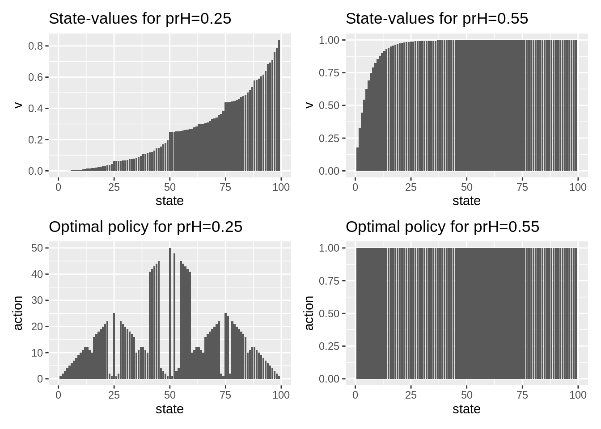
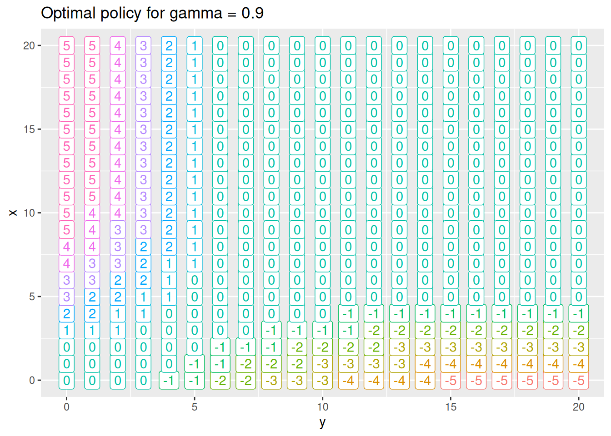
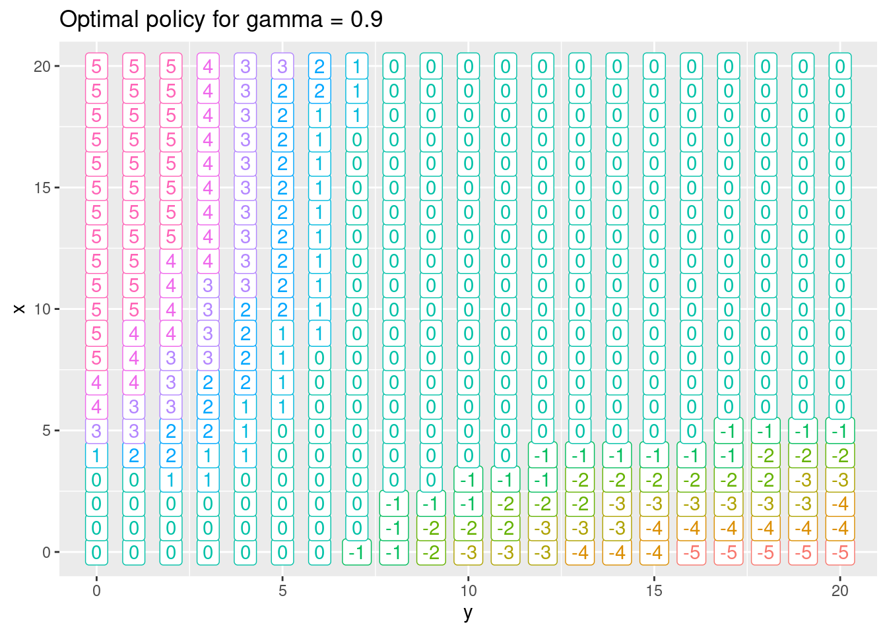

<!-- Various algorithms for the RL course -->


# Dynamic programming {#mod-dp}

The term *Dynamic Programming* (*DP*) refers to a collection of algorithms that can be used to compute optimal policies of a model with full information about the dynamics, e.g. a Markov Decision Process (MDP). A DP model must satisfy the *principle of optimality*. That is, an optimal policy must consist for optimal sub-polices or alternatively the optimal value function in a state can be calculated using optimal value functions in future states. This is indeed what is described with the Bellman optimality equations. 

DP do both *policy evaluation* (prediction) and *control*. Policy evaluation give us the value function $v_\pi$ given a policy $\pi$. Control refer to finding the best policy or optimizing the value function. This can be done using the Bellman optimality equations.

Two main problems arise with DP. First, often we do not have full information about the MDP model, e.g. the rewards or transition probabilities are unknown. Second, we need to calculate the value function in all states using the rewards, actions, and transition probabilities. Hence, using DP may be computationally expensive if we have a large number of states and actions.

Note the term programming in DP have nothing to do with a computer program but comes from that the mathematical model is called a "program". 


## Learning outcomes 

By the end of this module, you are expected to:

* Describe the distinction between policy evaluation and control.
* Identify when DP can be applied, as well as its limitations.
* Explain and apply iterative policy evaluation for estimating state-values given a policy.
* Interpret the policy improvement theorem.
* Explain and apply policy iteration for finding an optimal policy.
* Explain and apply value iteration for finding an optimal policy.
* Describe the ideas behind generalized policy iteration.
* Interpret the distinction between synchronous and asynchronous dynamic programming methods.

The learning outcomes relate to the [overall learning goals](#mod-lg-course) number 2, 4, 6, 7, 8, 10 and 12 of the course.

<!-- SOLO increasing: identify · memorise · name · do simple procedure · collect data · -->
<!-- enumerate · describe · interpret · formulate · list · paraphrase · combine · do -->
<!-- algorithms · compare · contrast · explain causes · analyse · relate · derive · -->
<!-- evaluate · apply · argue · theorise · generalise · hypothesise · solve · reflect -->


## Textbook readings

For this week, you will need to read Chapter 4-4.7 in @Sutton18. Read it before continuing this module. A summary of the book notation can be seen [here][sutton-notation].


```{=html}
<div>
Slides for this module can be seen
<a href="https://bss-osca.github.io/rl/slides/05_dp-slides.html" target="_blank">here.</a>
You do not have to look at them before the lecture!
</div>
```

## Policy evaluation {#sec-dp-pe}

The state-value function can be represented using the Bellman equation \@ref(eq:bell-state):
$$
v_\pi(s) = \sum_{a \in \mathcal{A}}\pi(a | s)\left( r(s,a) + \gamma\sum_{s' \in \mathcal{S}} p(s' | s, a) v_\pi(s')\right).            
(\#eq:bm-pol-eval)
$$

If the dynamics are known perfectly, this becomes a system of $|\mathcal{S}|$ simultaneous linear equations in $|\mathcal{S}|$ unknowns $v_\pi(s), s \in \mathcal{S}$. This linear system can be solved using e.g. some software. However, inverting the matrix can be computationally expensive for a large state space. Instead we consider an iterative method and a sequence of value function approximations $v_0, v_1, v_2, \ldots$, with initial approximation $v_0$ chosen arbitrarily e.g. $v_0(s) = 0 \:  \forall s$ (ensuring terminal state = 0). We can use *a sweep* with the Bellman equation to update the values:

\begin{equation}
v_{k+1}(s) = \sum_{a \in \mathcal{A}}\pi(a | s)\left( r(s,a) + \gamma\sum_{s' \in \mathcal{S}} p(s' | s, a) v_k(s')\right) 
\end{equation}

We call this update an *expected update* because it is based on the expectation over all possible next states, rather than a sample of reward from the next state. This update will converge to $v_\pi$ after a number of sweeps of the state-space. Since we do not want an infinite number of sweeps we introduce a threshold $\theta$ (see Figure \@ref(fig:policy-eval-alg)). Note the algorithm uses two arrays to maintain the state-value ($v$ and $V$). Alternatively, a single array could be used that update values in place, i.e. $V$ is used in place of $v$. Hence, state-values are updated faster. 

<div class="figure" style="text-align: center">

<p class="caption">(\#fig:policy-eval-alg)Iterative policy evaluation [@Sutton18].</p>
</div>


## Policy Improvement

From the Bellman optimality equation \@ref(eq:bell-opt-state) we have 

$$
\begin{align}
\pi_*(s) &= \arg\max_{a \in \mathcal{A}} q_*(s, a) \\
         &= \arg\max_{a \in \mathcal{A}} \left(r(s,a) + \gamma\sum_{s' \in \mathcal{S}} p(s' | s, a) v_*(s')\right).
\end{align}
(\#eq:pi-det)
$$
That is, a deterministic optimal policy can be found by choosing *greedy* the best action given the optimal value function. If we apply this greed action selection to the value function for a policy $\pi$ and pick the action with most $q$:
$$
\begin{align}
\pi'(s) &= \arg\max_{a \in \mathcal{A}} q_\pi(s, a) \\
         &= \arg\max_{a \in \mathcal{A}} \left(r(s,a) + \gamma\sum_{s' \in \mathcal{S}} p(s' | s, a) v_\pi(s')\right),
\end{align}
(\#eq:pi-mark-det)
$$
then 
$$
q_\pi(s, \pi'(s)) \geq q_\pi(s, \pi(s)) = v_\pi(s) \quad \forall s \in \mathcal{S}.
$$
Note if $\pi'(s) = \pi(s), \forall s\in\mathcal{S}$ then the Bellman optimality equation \@ref(eq:bell-opt-state) holds and $\pi$ must be optimal; Otherwise, 
$$
\begin{align}
  v_\pi(s) &\leq q_\pi(s, \pi'(s)) = \mathbb{E}_{\pi'}[R_{t+1} + \gamma v_\pi(S_{t+1}) | S_t = s] \\
&\leq \mathbb{E}_{\pi'}[R_{t+1} + \gamma q_\pi(S_{t+1}, \pi'(S_{t+1})) | S_t = s] \\
&\leq \mathbb{E}_{\pi'}[R_{t+1} + \gamma (R_{t+2} + \gamma^2 v_\pi(S_{t+2})) | S_t = s] \\
&\leq \mathbb{E}_{\pi'}[R_{t+1} + \gamma R_{t+2} + \gamma^2 q_\pi(S_{t+2}, \pi'(S_{t+2})) | S_t = s] \\
&\leq \mathbb{E}_{\pi'}[R_{t+1} + \gamma R_{t+2} + \gamma^2 R_{t+3} + ...)) | S_t = s] \\
&= v_{\pi'}(s),
\end{align}
$$
That is, policy $\pi'$ is strictly better than policy $\pi$ since there is at least one state $s$ for which $v_{\pi'}(s) > v_\pi(s)$. We can formalize the above deductions in a theorem.

::: {.theorem name="Policy improvement theorem"}
Let $\pi$, $\pi'$ be any pair of deterministic policies, such that
\begin{equation}
    q_\pi(s, \pi'(s)) \geq v_\pi(s) \quad \forall s \in \mathcal{S}.
\end{equation}
That is, $\pi'$ is as least as good as $\pi$.
:::


## Policy Iteration

Given the policy improvement theorem we can now improve policies iteratively until we find an optimal policy: 

1. Pick an arbitrary initial policy $\pi$.
2. Given a policy $\pi$, estimate $v_\pi(s)$ via the policy evaluation algorithm.
3. Generate a new, improved policy $\pi' \geq \pi$ by *greedily* picking $\pi' = \text{greedy}(v_\pi)$ using Eq. \@ref(eq:pi-mark-det). If $\pi'=\pi$ then stop ($\pi_*$ has been found); otherwise go to Step 2.

The algorithm is given in Figure \@ref(fig:policy-ite-alg). The sequence of calculations will be: 
$$\pi_0 \xrightarrow[]{E} v_{\pi_0} \xrightarrow[]{I} \pi_1 \xrightarrow[]{E} v_{\pi_1} \xrightarrow[]{I} \pi_2 \xrightarrow[]{E} v_{\pi_2}  \ldots \xrightarrow[]{I} \pi_* \xrightarrow[]{E} v_{*}$$
The number of steps of policy iteration needed to find the optimal policy are often low.

<div class="figure" style="text-align: center">

<p class="caption">(\#fig:policy-ite-alg)Policy iteration [@Sutton18].</p>
</div>


## Value Iteration

Policy iteration requires full policy evaluation at each iteration step. This could be an computationally expensive process which requires may sweeps of the state space. In *value iteration*, the policy evaluation is stopped after one sweep of the state space. Value iteration is achieved by turning the Bellman optimality equation into an update rule:
$$
v_{k+1}(s) = \max_a \left(r(s,a) + \gamma\sum_{s'} p(s'|s, a)v_k(s')\right)
$$
Value iteration effectively combines, in each of its sweeps, one sweep of policy evaluation and one sweep of policy improvement, since it performs a greedy update while also evaluating the current policy. Also, it is important to understand that the value-iteration algorithm does not require a policy to work. No actions have to be chosen. Rather, the state-values are updated and after the last step of value-iteration the optimal policy $\pi_*$ is found:

$$
\pi_*(s) = \arg\max_{a \in \mathcal{A}} \left(r(s,a) + \gamma\sum_{s' \in \mathcal{S}} p(s' | s, a) v_*(s')\right),
$$
The algorithm is given in Figure \@ref(fig:value-ite-alg). Since we do not want an infinite number of iterations we introduce a threshold $\theta$. The sequence of calculations will be (where G denotes greedy action selection): 
$$v_{0} \xrightarrow[]{EI} v_{1} \xrightarrow[]{EI} v_{2}  \ldots \xrightarrow[]{EI} v_{*} \xrightarrow[]{G} \pi_{*}$$
<div class="figure" style="text-align: center">

<p class="caption">(\#fig:value-ite-alg)Value iteration [@Sutton18].</p>
</div>


## Generalized policy iteration

Generalised Policy Iteration (GPI) is the process of letting policy evaluation and policy improvement interact, independent of granularity. For instance, improvement/evaluation can be performed by doing complete sweeps of the state space (policy iteration), or improve the state-value using a single sweep of the state space (value iteration). GPI can also do *asynchronous* updates of the state-value where states are updated individually, in any order. This can
significantly improve computation. Examples on asynchronous DP are

* *In-place DP* mentioned in Section \@ref(sec-dp-pe) where instead of keeping a copy of the old and new value function in each value-iteration update, you can just update the value functions in-place. Hence asynchronous updates in other parts of the state-space will directly be affected resulting in faster updates. 

* *Prioritized sweeping* where we keep track of how "effective" or "significant" updates to our state-values are. States where the updates are more significant are likely further away from converging to the optimal value. As such, we would like to update them first. For this, we would compute the *Bellman error*:
$$|v_{k+1}(s) - v_k(s)|,$$
and keep these values in a priority queue. You can then efficiently pop the top of it to always get the state you should update next.

* *Prioritize local updates* where you update nearby states given the current state, e.g. if your robot is in a particular region of the grid, it is much more important to update nearby states than faraway ones.

GPI works and will convergence to the optimal policy and optimal value function if the states are visited (in theory) an infinite number of times. That is, you must explore the whole state space for GPI to work.


## Example - Factory Storage

Let us consider Exercise \@ref(ex-mdp-1-storage) where a factory has a storage tank with a capacity of 4 $\mathrm{m}^{3}$ for temporarily storing waste produced by the factory. Each week the factory produces $0,1$, 2 or 3 $\mathrm{m}^{3}$ waste with respective probabilities 
$$p_{0}=\displaystyle \frac{1}{8},\ p_{1}=\displaystyle \frac{1}{2},\ p_{2}=\displaystyle \frac{1}{4} \text{ and } p_{3}=\displaystyle \frac{1}{8}.$$ 
If the amount of waste produced in one week exceeds the remaining capacity of the tank, the excess is specially removed at a cost of $30 per cubic metre. At the end of each week there is a regular opportunity to remove all waste from the storage tank at a fixed cost of $25 and a variable cost of $5 per cubic metre. 

The problem can be modelled as a finite MDP where a state denote the amount of waste in the tank at the end of week $n$ just before the regular removal opportunity $$\mathcal{S} = \{ 0,1,2,3,4 \}.$$
The action space is $$\mathcal{A}(s) = \{ empty, keep \}.$$
The expected cost of a given state and action is the cost of empting the container and the expected cost of a special removal during the next week. Hence the expected reward is $$r(s, e) = -(25 + 5s)$$ 
and $$r(s,k) = -30\sum_{i>4-s} (s+i-4)p_i.$$
Finally, the transition probabilities are: 
$$
\begin{align} 
   p(s'|s,k) &= p_{s'-s}\text{ if } s\leq s' \leq 3, \\
   p(4|s,k)  &= \sum_{i\geq 4-s} p_i, \\
   p(s'|s,e) &= p_{s'}\text{ if }  0\leq s' \leq 4, \\
   p(s'|s,a) &=  0 \text{ otherwise.}
\end{align}
$$

For solving the MDP we implement an MDP R6 class in R:


```r
library(R6)
library(hash)
library(tidyverse)

#' R6 class representing the MDP
#' 
#' Note since the MDP is a model with full information, we combine the agent and environment into a single class.
MDPClass <- R6Class("MDPClass",
   public = list(
      
      #' @field model The Markov decision process (model). The model is represented 
      #' using a hash list for the states. Each states contains a list with `actions`: a hash 
      #' list with actions and `pi` a vector with policy pr (named vector with only 
      #' positive values). The `actions` hash list contains actions with trans 
      #' pr `pr` (named vector only with positive values) and expected reward `reward`.
      model = NULL,  
      
      #' @field sV The state-values stored in a hash. Value updates are done in-place (one-array version).
      v = NULL,
      
      #' @description Create an object (when call new).
      #' @return The new object.
      initialize = function() {
         self$model <- hash()
         self$v <- hash()
      },
      
      #' @description Add the states (keys/strings in the hash)
      #' @param s A vector of states (converted to strings).
      addStateSpace = function(s) {
         keys <- make.keys(s)
         self$model[keys] <- list(pi = NA)   # don't use pi = NULL since then won't be defined 
         self$setStateValue()  # so v defined
         return(invisible(NULL))
      },
      
      #' @description Add the actions to a state
      #' @param stateStr State key/string.
      #' @param a A vector of actions (converted to strings).
      addActionSpace = function(stateStr, a) {
         a <- make.keys(a)
         self$model[[stateStr]]$actions <- hash()
         self$model[[stateStr]]$actions[a] <- NA
         return(invisible(NULL))
      },
      
      #' @description Add expected reward and trans pr to an action
      #' @param stateStr State key/string.
      #' @param actionStr Action key/string.
      #' @param r The expected reward.
      #' @param pr A named vector with positive trans pr. The name of an element must be the state key.
      addAction = function(stateStr, actionStr, r, pr) {
         if (!has.key(stateStr, self$model)) {
            self$addStateSpace(stateStr)
            # self$model[make.keys(stateStr)] <- hash(pi = NA, actions = hash())
         } 
         self$model[[stateStr]]$actions[[actionStr]] <- list(r = r, pr = pr)
         return(invisible(NULL))
      },
      
      #' @description Set the state-value of states
      #' @param stateStr A vector of state keys.
      #' @param value The value.
      setStateValue = function(stateStr = keys(self$model), value = 0) {
         self$v[stateStr] <- value
         return(invisible(NULL))
      },
      
      #' @description Set the policy to a random determistic policy.
      setRandomDeterministicPolicy = function() {
         stateStr = keys(self$model)
         for (s in stateStr) {
            self$model[[s]]$pi <- 1
            names(self$model[[s]]$pi) <- sample(self$getActionKeys(s), 1)
         }
         return(invisible(NULL))
      },
      
      #' @description Set a deterministic policy
      #' @param sa A named vector with action keys and names equal state keys-
      setDeterministicPolicy = function(sa) {
         states <- names(sa)
         pi = 1
         for (i in 1:length(sa)) {
            names(pi) <- sa[i]
            s <- states[i]
            self$model[[s]]$pi <- pi
         }
         return(invisible(NULL))
      },
      
      #' @description Set the policy to the named vector pi for a set of states
      #' @param states States under consideration.
      #' @param pi A named vector with policy pr (only psitive values).
      setPolicy = function(states, pi) {
         for (s in states) {
            self$model[[s]]$pi <- pi
         }
         return(invisible(NULL))
      },
      
      #' @description Return the state keys
      getStateKeys = function() {
         keys(self$model)
      },
      
      #' @description Return the action keys
      #' @param s The state considered.
      getActionKeys = function(s) {
         keys(self$model[[s]]$actions) 
      },
      
      #' @description Return the expected reward and trans pr of actions in a state
      #' @param s The state considered.
      getActionInfo = function(s) {
         as.list(self$model[[s]]$actions) 
      },
      
      #' @description Return the current policy as a tibble
      getPolicy = function() {
         # if (all(sapply(self$model, FUN = function(s) {s$pi}) == 1)) { # deterministic policy
         #    sapply(self$model, FUN = function(s) {names(s$pi)})
         # } else {
         map_dfr(self$getStateKeys(), .f = function(s) {
               list(state = s, action = names(self$model[[s]]$pi), pr = self$model[[s]]$pi)
            })
      },
      
      #' @description Return the state-values as a tibble
      #' @param s A vector of state keys.
      getStateValues = function(s = keys(self$v)) {
         tibble(state = s, v = values(self$v, keys = s))
      },
      
      #' @description Return a matrix with trans pr for a given action. 
      #' @param a Action key.
      getTransPrActionMat = function(a) {
         states <- keys(self$model)
         m <- matrix(0, nrow = length(states), ncol = length(states))
         colnames(m) <- states
         rownames(m) <- states
         for (s in states) {
            m[s, names(self$model[[s]]$actions[[a]]$pr)] <- self$model[[s]]$actions[[a]]$pr
         }
         return(m)
      },
      
      #' @description Returns all rewards in a matrix
      getRewardMat = function() {
         states <- keys(self$model)
         actions <- unique(unlist(sapply(states, function(s) self$getActionKeys(s))))
         m <- matrix(NA, nrow = length(states), ncol = length(actions))
         colnames(m) <- actions
         rownames(m) <- states
         for (s in states) {
            for (a in self$getActionKeys(s)) {
               m[s, a] <- self$model[[s]]$actions[[a]]$r
            }
         }
         return(m)
      },
      
      #' @description Bellman calculations for a given state and action
      #' @param gamma Discount rate.
      #' @param s State key.
      #' @param a Action key.
      bellmanCalc = function(gamma, s, a) {
         pr <- self$model[[s]]$actions[[a]]$pr
         r <- self$model[[s]]$actions[[a]]$r
         nS <- names(pr)
         vS <- values(self$v, nS)
         return(r + gamma * sum(pr * vS))
      },
      
      #' @description Iterative policy evaluation of current policy (defined by pi)
      #' @param gamma Discount rate.
      #' @param theta Threshold parameter.
      #' @param maxIte Maximum number of iterations.
      #' @param reset If true set all state-values to 0.
      policyEval = function(gamma, theta = 0.00001, maxIte = 10000, reset = TRUE) {
         if (reset) self$setStateValue()  # set to 0
         for (ite in 1:maxIte) { 
            delta <- 0   # Bellman error 
            for (s in keys(self$model)) {
               v <- self$v[[s]]  
               # update
               pi <- self$model[[s]]$pi
               actions <- names(pi)
               val =  0
               for (a in actions) {
                  # pr <- self$model[[s]]$actions[[a]]$pr
                  # r <- self$model[[s]]$actions[[a]]$r
                  # nS <- names(pr)
                  # vS <- values(self$v, nS)
                  val <- val + pi[a] * self$bellmanCalc(gamma, s, a)
               }
               self$v[[s]] <- val
               delta <- max(delta, abs(v-val))
            }
            if (delta < theta) break
         }
         if (ite == maxIte) warning("Policy evaluation algorithm stopped at max iterations allowed:", maxIte)
      },

      #' @description Policy iteration using iterative policy eval
      #' @param gamma Discount rate.
      #' @param theta Threshold parameter.
      #' @param maxIteEval Maximum number of iterations when evaluate policy.
      #' @param maxItePolicy Maximum number of policy iterations.
      policyIte = function(gamma, theta = 0.00001, maxIteEval = 10000, maxItePolicy = 100) {
         self$setRandomDeterministicPolicy()
         for (ite in 1:maxItePolicy) {
            self$policyEval(gamma, theta, maxIteEval, reset = FALSE)
            stable <- TRUE
            for (s in keys(self$model)) {
               piOld <- names(self$model[[s]]$pi)
               actions <- self$getActionKeys(s)
               vMax =  -Inf
               for (a in actions) {
                  val <- self$bellmanCalc(gamma, s, a)
                  if (val > vMax) {
                     names(self$model[[s]]$pi) <- a
                     vMax <- val
                  }
               }
               if (piOld != names(self$model[[s]]$pi) ) stable <- FALSE
            }
            if (stable) break
         }
         if (ite == maxItePolicy) warning("Policy Iteration algorithm stopped at max iterations allowed:", maxItePolicy)
         message(str_c("Policy iteration algorihm finished in ", ite, " iterations."))
         return(invisible(NULL))
      },
      
      #' @description Value iteration
      #' @param gamma Discount rate.
      #' @param theta Threshold parameter.
      #' @param maxIte Maximum number of iterations.
      #' @param reset If true initialize all state-values to 0.
      valueIte = function(gamma, theta = 0.00001, maxIte = 10000, reset = TRUE) {
         self$setRandomDeterministicPolicy()
         if (reset) self$setStateValue()  # set to 0
         for (ite in 1:maxIte) { 
            delta <- 0   # Bellman error 
            for (s in keys(self$model)) {
               v <- self$v[[s]]  
               actions <- self$getActionKeys(s)
               vMax =  -Inf
               for (a in actions) {
                  val <- self$bellmanCalc(gamma, s, a)
                  if (val > vMax) {
                     vMax <- val
                     names(self$model[[s]]$pi) <- a
                  }
               }
               self$v[[s]] <- vMax
               delta <- max(delta, abs(v-vMax))
            }
            if (delta < theta) break
         }
         if (ite == maxIte) warning("Value iteration algorithm stopped at max iterations allowed:", maxIte)         
         message(str_c("Value iteration algorihm finished in ", ite, " iterations."))
         return(invisible(NULL))
      }
   )
)
```

You may have a look at the code and try to get an overview. Let us now try to solve the problem. First we need some functions for calculating the reward and transition probabilities:


```r
#' Expected reward of an action
#' @param s Waste amount (state).
#' @param a Action (keep or empty).
#' @return The expected reward
reward <-function(s, a) {
   i <- as.numeric(s)
   p<-c(1/8, 1/2, 1/4, 1/8)
   if (a=="keep") {
      if (i<2) return(0)   # no excess waste
      k <- (4-i+1):3
      return(-30*sum( (i+k-4)*p[k+1] ) )
   }
   if (a=="empty") {
      return(-1*(25 + 5*i))
   }
   return(NULL)
}

#' Find transition probabilities
#' @param s Waste amount (state).
#' @param a Action (keep or empty).
#' @return The trans pr and id 
transPr<-function(s, a) {
   i <- as.numeric(s)
   p<-c(1/8, 1/2, 1/4, 1/8)
   pr<-NULL
   id<-NULL
   if (a=="keep") {
      if (i<4) for (j in i:3) {
         pr<-c(pr,p[j-i+1])
         id<-c(id,j)
      }
      if (i>0) {
         pr<-c(pr,sum(p[(4-i):3+1]))
         id<-c(id,4)
      }
   }
   if (a=="empty") {
      for (j in 0:3) {
         pr<-c(pr,p[j+1])
         id<-c(id,j)
      }
   }
   names(pr) <- id
   return(pr)
}
```

For instance the expected reward in state 4 under action keep is:


```r
s <- 3
a <- "keep"
reward(s, a)
#> [1] -15
transPr(s, a)
#>     3     4 
#> 0.125 0.875
```

We are now ready to build the model:


```r
mdp <- MDPClass$new()
mdp$addStateSpace(0:4)   # add state keys
for (s in mdp$getStateKeys()) mdp$addActionSpace(s, c("empty", "keep"))  # add action keys
# Add trans pr and rewards
for (s in mdp$getStateKeys()) {
   for (a in mdp$getActionKeys(s)) {
      mdp$addAction(s, a, r = reward(s,a), pr = transPr(s,a))
   }
}
```

We may check that we have built the MDP correct using: 


```r
mdp$getTransPrActionMat("keep")
#>       0     1     2     3     4
#> 0 0.125 0.500 0.250 0.125 0.000
#> 1 0.000 0.125 0.500 0.250 0.125
#> 2 0.000 0.000 0.125 0.500 0.375
#> 3 0.000 0.000 0.000 0.125 0.875
#> 4 0.000 0.000 0.000 0.000 1.000
mdp$getTransPrActionMat("empty")
#>       0   1    2     3 4
#> 0 0.125 0.5 0.25 0.125 0
#> 1 0.125 0.5 0.25 0.125 0
#> 2 0.125 0.5 0.25 0.125 0
#> 3 0.125 0.5 0.25 0.125 0
#> 4 0.125 0.5 0.25 0.125 0
mdp$getRewardMat()
#>   empty   keep empty keep empty keep empty keep empty keep
#> 0   -25   0.00    NA   NA    NA   NA    NA   NA    NA   NA
#> 1   -30   0.00    NA   NA    NA   NA    NA   NA    NA   NA
#> 2   -35  -3.75    NA   NA    NA   NA    NA   NA    NA   NA
#> 3   -40 -15.00    NA   NA    NA   NA    NA   NA    NA   NA
#> 4   -45 -41.25    NA   NA    NA   NA    NA   NA    NA   NA
mdp$getActionInfo("3")
#> $keep
#> $keep$r
#> [1] -15
#> 
#> $keep$pr
#>     3     4 
#> 0.125 0.875 
#> 
#> 
#> $empty
#> $empty$r
#> [1] -40
#> 
#> $empty$pr
#>     0     1     2     3 
#> 0.125 0.500 0.250 0.125
```

Let us try to evaluate a fixed policy given a discount rate of 0.5:


```r
sa <- c("0" = "keep", "1" = "keep", "2" = "keep", "3" = "keep", "4" = "empty")
mdp$setDeterministicPolicy(sa)
mdp$getPolicy()
#> # A tibble: 5 × 3
#>   state action    pr
#>   <chr> <chr>  <dbl>
#> 1 0     keep       1
#> 2 1     keep       1
#> 3 2     keep       1
#> 4 3     keep       1
#> 5 4     empty      1
mdp$policyEval(gamma = 0.5)
mdp$getStateValues()
#> # A tibble: 5 × 2
#>   state     v
#>   <chr> <dbl>
#> 1 0     -10.7
#> 2 1     -16.3
#> 3 2     -26.3
#> 4 3     -42.0
#> 5 4     -55.7
```

Let us try to find the optimal policy using policy iteration:


```r
mdp$policyIte(gamma = 0.5)
mdp$getPolicy()
#> # A tibble: 5 × 3
#>   state action    pr
#>   <chr> <chr>  <dbl>
#> 1 0     keep       1
#> 2 1     keep       1
#> 3 2     keep       1
#> 4 3     keep       1
#> 5 4     empty      1
mdp$getStateValues()
#> # A tibble: 5 × 2
#>   state     v
#>   <chr> <dbl>
#> 1 0     -10.7
#> 2 1     -16.3
#> 3 2     -26.3
#> 4 3     -42.0
#> 5 4     -55.7
```

If we do value iteration we should get the same results:


```r
mdp$valueIte(0.5)
mdp$getPolicy()
#> # A tibble: 5 × 3
#>   state action    pr
#>   <chr> <chr>  <dbl>
#> 1 0     keep       1
#> 2 1     keep       1
#> 3 2     keep       1
#> 4 3     keep       1
#> 5 4     empty      1
mdp$getStateValues()
#> # A tibble: 5 × 2
#>   state     v
#>   <chr> <dbl>
#> 1 0     -10.7
#> 2 1     -16.3
#> 3 2     -26.3
#> 4 3     -42.0
#> 5 4     -55.7
```

Finally, let us try to solve the problem with a discount rate of 0.99:


```r
mdp$policyIte(gamma =0.99)
mdp$getPolicy()
#> # A tibble: 5 × 3
#>   state action    pr
#>   <chr> <chr>  <dbl>
#> 1 0     keep       1
#> 2 1     keep       1
#> 3 2     keep       1
#> 4 3     empty      1
#> 5 4     empty      1
mdp$getStateValues()
#> # A tibble: 5 × 2
#>   state      v
#>   <chr>  <dbl>
#> 1 0     -1750.
#> 2 1     -1762.
#> 3 2     -1776.
#> 4 3     -1790.
#> 5 4     -1795.
```

Note we now empty also at 3 m$^3$.


## Summary 

Read Chapter 4.8 in @Sutton18.

## Exercises

Below you will find a set of exercises. Always have a look at the exercises before you meet in your study group and try to solve them yourself. Are you stuck, see the [help page](#help). Sometimes solutions can be seen by pressing the button besides a question. Beware, you will not learn by giving up too early. Put some effort into finding a solution!

### Exercise - Gambler's problem {#ex-dp-gambler}

Consider the gambler's problem in Exercise \@ref(ex-mdp-1-gambler).

<!-- Q1 -->


<div class="modal fade bs-example-modal-lg" id="j07wo84UznmsqZ5n8HNd" tabindex="-1" role="dialog" aria-labelledby="j07wo84UznmsqZ5n8HNd-title"><div class="modal-dialog modal-lg" role="document"><div class="modal-content"><div class="modal-header"><button type="button" class="close" data-dismiss="modal" aria-label="Close"><span aria-hidden="true">&times;</span></button><h4 class="modal-title" id="j07wo84UznmsqZ5n8HNd-title">Solution</h4></div><div class="modal-body">

```{.r .fold-show}
#' MDP model for the gamblers problem.
#' @param prH Probability of head.
#' @return The mdp object (R6 class).
buildGamblerModel <- function(prH) {
   mdp <- MDPClass$new()      # initialize mdp object
   mdp$addStateSpace(0:101)   # add states (states are keys in a hash and are always converted to strings), 101 represent finished
   for (s in mdp$getStateKeys()) {  # add actions for each state (only the key of the action)
      i <- as.numeric(s)
      if (i > 0 & i < 100) mdp$addActionSpace(s, 1:min(i, 100-i))
      if (i == 0) mdp$addActionSpace(s, "Loose")  
      if (i == 100) mdp$addActionSpace(s, "Win")  
      if (i == 101) mdp$addActionSpace(s, "Dummy")
   }
   # Add trans pr and expected reward to the actions
   for (s in as.character(1:99)) {
      for (a in mdp$getActionKeys(s)) {
         iS <- as.numeric(s)
         iA <- as.numeric(a)
         transPr <- c(prH, 1- prH)
         names(transPr) <- c(iS+iA, iS-iA)
         mdp$addAction(s, a, r = 0, pr = transPr)
      }
   }
   # add special actions
   mdp$addAction(s = "0", a = "Loose", r = 0, pr = c("101" = 1))
   mdp$addAction(s = "100", a = "Win", r = 1, pr = c("101" = 1))
   mdp$addAction(s = "101", a = "Dummy", r = 0, pr = c("101" = 1))
   return(mdp)
}
```


<p>We make a function that return the mdp object</p>

</div><div class="modal-footer"><button class="btn btn-default" data-dismiss="modal">Close</button></div></div></div></div><button class="btn btn-default btn-xs" style="float:right" data-toggle="modal" data-target="#j07wo84UznmsqZ5n8HNd">Solution</button>

1) Build the model in R.


<!-- Q2 -->

<div class="modal fade bs-example-modal-lg" id="XEis9Auwrliu0sC0hGHD" tabindex="-1" role="dialog" aria-labelledby="XEis9Auwrliu0sC0hGHD-title"><div class="modal-dialog modal-lg" role="document"><div class="modal-content"><div class="modal-header"><button type="button" class="close" data-dismiss="modal" aria-label="Close"><span aria-hidden="true">&times;</span></button><h4 class="modal-title" id="XEis9Auwrliu0sC0hGHD-title">Solution</h4></div><div class="modal-body">

```{.r .fold-show}
solveGambler <- function(prH) {
   mdp <- buildGamblerModel(prH)
   mdp$valueIte(gamma = 1, theta = 0.0001)
   df <- left_join(mdp$getStateValues(), mdp$getPolicy(), by = "state") %>% 
      select(-pr)
   df <- df %>% 
      mutate(state = as.numeric(state)) %>% 
      filter(state > 0, state < 100) %>% 
      mutate(action = as.numeric(action)) 
   ptPr <- ggplot(df, aes(x = state, y = v)) +
      geom_col() + 
      labs(title = str_c("State-values for prH=", prH))
   ptPolicy <- ggplot(df, aes(x = state, y = action)) +
      geom_col() +
      labs(title = str_c("Optimal policy for prH=", prH))
   return(list(ptPr = ptPr, ptPolicy = ptPolicy, policy = df))   
}
res04 <- solveGambler(prH = 0.4)
res04$ptPr
res04$ptPolicy
```


<p>There is a lot of different optimal policies. In general since \(p_h\) is below 0.5 we want to find a policy with as few flips as possible.</p>

</div><div class="modal-footer"><button class="btn btn-default" data-dismiss="modal">Close</button></div></div></div></div><button class="btn btn-default btn-xs" style="float:right" data-toggle="modal" data-target="#XEis9Auwrliu0sC0hGHD">Solution</button>


2) Solve the problem using value iteration with $p_h = 0.4$. Plot the policy with states 1-99 on the x-axis and action on the y-axis. Plot the state-values given states 1-99 on the x-axis. Your policy may not look like the policy in the book, why?


<!-- Q3 -->

<div class="modal fade bs-example-modal-lg" id="WkOmu6qfmOqv5yIsnKTw" tabindex="-1" role="dialog" aria-labelledby="WkOmu6qfmOqv5yIsnKTw-title"><div class="modal-dialog modal-lg" role="document"><div class="modal-content"><div class="modal-header"><button type="button" class="close" data-dismiss="modal" aria-label="Close"><span aria-hidden="true">&times;</span></button><h4 class="modal-title" id="WkOmu6qfmOqv5yIsnKTw-title">Solution</h4></div><div class="modal-body">

```{.r .fold-show}
# Solve the problems
res025 <- solveGambler(prH = 0.25)
res055 <- solveGambler(prH = 0.55)
# State-values
res025$policy %>% filter(state %in% c(10,67))
#> # A tibble: 2 × 3
#>   state       v action
#>   <dbl>   <dbl>  <dbl>
#> 1    10 0.00708     10
#> 2    67 0.309       17
res055$policy %>% filter(state %in% c(10,67))
#> # A tibble: 2 × 3
#>   state     v action
#>   <dbl> <dbl>  <dbl>
#> 1    10 0.855      1
#> 2    67 1.00       1
# Plot results
library(patchwork)
(res025$ptPr + res055$ptPr) / (res025$ptPolicy + res055$ptPolicy)
```


</div><div class="modal-footer"><button class="btn btn-default" data-dismiss="modal">Close</button></div></div></div></div><button class="btn btn-default btn-xs" style="float:right" data-toggle="modal" data-target="#WkOmu6qfmOqv5yIsnKTw">Solution</button>

3) Solve the problem using value iteration with $p_h = 0.22$ and $0.55$ and plot the results. What is the probability of winning in state 10 and 67?


### Exercise - Maintenance problem {#ex-dp-maintain}

At the beginning of each day a piece of equipment is inspected to reveal its actual working condition. The equipment will be found in one of the working conditions $s = 1,\ldots, N$ where the working condition $s$ is better than the working condition
$s+1$. 

The equipment deteriorates in time. If the present working condition is $s$ and no repair is done, then at the beginning of the next day the equipment has working condition $s'$ with probability $q_{ss'}$. It is assumed that $q_{ss'}=0$ for $s'<s$ and $\sum_{s'\geq s}q_{ss'}=1$. 

The working condition $s=N$ represents a malfunction that requires an enforced repair taking two days. For the intermediate states $s$ with $1<s<N$ there is a choice between preventively repairing the equipment and letting the equipment operate for the present day. A preventive repair takes only one day. A repaired system has the working condition $s=1$. 

The cost of an enforced repair upon failure is $C_{f}$ and the cost of a preemptive repair in working condition $s$ is $C_{p,s}$. We wish to determine a maintenance rule which minimizes the repair cost.

The problem can be formulated as an MDP. Since an enforced repair takes two days and the state of the system has to be defined at the beginning of each day, we need an auxiliary state for the situation in which an enforced repair is in progress already for one day.


<!-- Q1 -->

<div class="modal fade bs-example-modal-lg" id="a2g8JMMUtTarIbhRJyxi" tabindex="-1" role="dialog" aria-labelledby="a2g8JMMUtTarIbhRJyxi-title"><div class="modal-dialog modal-lg" role="document"><div class="modal-content"><div class="modal-header"><button type="button" class="close" data-dismiss="modal" aria-label="Close"><span aria-hidden="true">&times;</span></button><h4 class="modal-title" id="a2g8JMMUtTarIbhRJyxi-title">Solution</h4></div><div class="modal-body">

<p>\[\mathcal{S}=\{1,2,\ \ldots,\ N,\ N+1\}.\] State \(s\) with \(1\leq s\leq N\) corresponds to the situation in which an inspection reveals working condition \(s\), while state \(N+1\) corresponds to the situation in which an enforced repair is in progress already for one day.</p>

</div><div class="modal-footer"><button class="btn btn-default" data-dismiss="modal">Close</button></div></div></div></div><button class="btn btn-default btn-xs" style="float:right" data-toggle="modal" data-target="#a2g8JMMUtTarIbhRJyxi">Solution</button>

1) Define the state space $\mathcal{S}$, i.e. the the set of possible states of the system.


<!-- Q2 -->

<div class="modal fade bs-example-modal-lg" id="deZrd07MEYtXL8H1jVet" tabindex="-1" role="dialog" aria-labelledby="deZrd07MEYtXL8H1jVet-title"><div class="modal-dialog modal-lg" role="document"><div class="modal-content"><div class="modal-header"><button type="button" class="close" data-dismiss="modal" aria-label="Close"><span aria-hidden="true">&times;</span></button><h4 class="modal-title" id="deZrd07MEYtXL8H1jVet-title">Solution</h4></div><div class="modal-body">

<p>The set of possible actions in state \(s\) is chosen as \[\mathcal{A}(1)=\{0\},\ \mathcal{A}(s)=\{0,1\} \text{ for } 1<s<N, \mathcal{A}(N)=\mathcal{A}(N+1)=\{2\}.\]</p>

</div><div class="modal-footer"><button class="btn btn-default" data-dismiss="modal">Close</button></div></div></div></div><button class="btn btn-default btn-xs" style="float:right" data-toggle="modal" data-target="#deZrd07MEYtXL8H1jVet">Solution</button>

2) Consider actions
$$
a=\left\{\begin{array}{ll}
0 & \text{if no repair.}\\
1 & \text{if preventive repair.}\\
2 & \text{if forced repair.}\\
\end{array}\right.
$$
Define the action space $\mathcal{A}(s)$ for all states $s$.


<!-- Q3 -->

<div class="modal fade bs-example-modal-lg" id="y97r59Aw0QmzOHVRi8lO" tabindex="-1" role="dialog" aria-labelledby="y97r59Aw0QmzOHVRi8lO-title"><div class="modal-dialog modal-lg" role="document"><div class="modal-content"><div class="modal-header"><button type="button" class="close" data-dismiss="modal" aria-label="Close"><span aria-hidden="true">&times;</span></button><h4 class="modal-title" id="y97r59Aw0QmzOHVRi8lO-title">Solution</h4></div><div class="modal-body">

<p>The expected reward is \(r(N+1,2) = 0\) and for \(0 < s < N\) is \(r(s,0) = 0\), \(r(s,1) = -C_{ps}\). Finally, \(r(N,2) = -C_{f}\) and \(r(N+1,2) = 0\).</p>

</div><div class="modal-footer"><button class="btn btn-default" data-dismiss="modal">Close</button></div></div></div></div><button class="btn btn-default btn-xs" style="float:right" data-toggle="modal" data-target="#y97r59Aw0QmzOHVRi8lO">Solution</button>

3) Assume that the number of possible working conditions equals $N=5$. What is the expected reward $r(s,a)$?


<!-- Q4 -->

<div class="modal fade bs-example-modal-lg" id="RKCCqXvEc4uWQAkCbshb" tabindex="-1" role="dialog" aria-labelledby="RKCCqXvEc4uWQAkCbshb-title"><div class="modal-dialog modal-lg" role="document"><div class="modal-content"><div class="modal-header"><button type="button" class="close" data-dismiss="modal" aria-label="Close"><span aria-hidden="true">&times;</span></button><h4 class="modal-title" id="RKCCqXvEc4uWQAkCbshb-title">Solution</h4></div><div class="modal-body">

<p>The transition probabilities \(p(s'|s,a)\): \[p(s'|s,0) = q_{ij}, \text{ for } 1 \leq s<N,\] \[p(1|s,1) = 1 \text{ for } 1<s<N,\] \[p(N+1|N,2) = p(1|N+1,2) =1,\] and zero otherwise.</p>

</div><div class="modal-footer"><button class="btn btn-default" data-dismiss="modal">Close</button></div></div></div></div><button class="btn btn-default btn-xs" style="float:right" data-toggle="modal" data-target="#RKCCqXvEc4uWQAkCbshb">Solution</button>

4) What is the transition probabilities?


<!-- Q5 -->
5) Try make a drawing of the state-expanded hypergraph for stage $t$ and $t+1$.


<!-- Q6 -->

<div class="modal fade bs-example-modal-lg" id="kLWYOFyto0wTV6EKv84v" tabindex="-1" role="dialog" aria-labelledby="kLWYOFyto0wTV6EKv84v-title"><div class="modal-dialog modal-lg" role="document"><div class="modal-content"><div class="modal-header"><button type="button" class="close" data-dismiss="modal" aria-label="Close"><span aria-hidden="true">&times;</span></button><h4 class="modal-title" id="kLWYOFyto0wTV6EKv84v-title">Solution</h4></div><div class="modal-body">

```{.r .fold-show}
Q <- matrix(c(
   0.90, 0.10, 0, 0, 0,
   0, 0.80, 0.10, 0.05, 0.05,
   0, 0, 0.70, 0.10, 0.20,
   0, 0, 0, 0.50, 0.50), nrow=4, byrow=T)
row.names(Q) <- str_c(1:4)
colnames(Q) <- str_c(1:5)

mdp <- MDPClass$new()      # initialize mdp object
mdp$addStateSpace(1:6)   # add states (states are keys in a hash and are always converted to strings), 101 represent finished
for (s in mdp$getStateKeys()) {  # add actions for each state (only the key of the action)
   i <- as.numeric(s)
   if (i == 1) mdp$addActionSpace(s, "nr")  
   if (i > 1 & i <= 4) mdp$addActionSpace(s, c("nr", "pr"))
   if (i == 5) mdp$addActionSpace(s, "fr")  
   if (i == 6) mdp$addActionSpace(s, "fr")
}
# check some of the keys
mdp$getActionKeys("2")
#> [1] "nr" "pr"
mdp$getActionKeys("1")
#> [1] "nr"
mdp$getActionKeys("6")
#> [1] "fr"

## Add trans pr and expected reward to the actions
cPR<-c(0,7,7,5,0,0)
for (s in mdp$getStateKeys()) {
   for (a in mdp$getActionKeys(s)) {
      i <- as.numeric(s)
      if (a == "nr") {
         rew <- 0
         transPr <- Q[i, Q[i,] > 0]
      }
      if (a == "pr") {
         rew <- -cPR[i]
         transPr <- 1
         names(transPr) <- "1"
      }
      if (a == "fr" & i == 5) {
         rew = -10
         transPr <- 1
         names(transPr) <- "6"
      } 
      if (a == "fr" & i == 6) {
         rew = 0
         transPr <- 1
         names(transPr) <- "1"
      } 
      mdp$addAction(s, a, r = rew, pr = transPr)
   }
}
# check some of the keys
mdp$getActionInfo("1")
#> $nr
#> $nr$r
#> [1] 0
#> 
#> $nr$pr
#>   1   2 
#> 0.9 0.1
mdp$getActionInfo("2")
#> $nr
#> $nr$r
#> [1] 0
#> 
#> $nr$pr
#>    2    3    4    5 
#> 0.80 0.10 0.05 0.05 
#> 
#> 
#> $pr
#> $pr$r
#> [1] -7
#> 
#> $pr$pr
#> 1 
#> 1
mdp$getActionInfo("5")
#> $fr
#> $fr$r
#> [1] -10
#> 
#> $fr$pr
#> 6 
#> 1
mdp$getActionInfo("6")
#> $fr
#> $fr$r
#> [1] 0
#> 
#> $fr$pr
#> 1 
#> 1
```


</div><div class="modal-footer"><button class="btn btn-default" data-dismiss="modal">Close</button></div></div></div></div><button class="btn btn-default btn-xs" style="float:right" data-toggle="modal" data-target="#kLWYOFyto0wTV6EKv84v">Solution</button>

6) The repair costs are given by $C_{f}=10,\ C_{p2}=7,\ C_{p3}=7$ and $C_{p4}=5$ and the deterioration probabilities $q_{ij}$ are given by matrix Q:

   
   ```r
   Q <- matrix(c(
      0.90, 0.10, 0, 0, 0,
      0, 0.80, 0.10, 0.05, 0.05,
      0, 0, 0.70, 0.10, 0.20,
      0, 0, 0, 0.50, 0.50), nrow=4, byrow=T)
   Q
   #>      [,1] [,2] [,3] [,4] [,5]
   #> [1,]  0.9  0.1  0.0 0.00 0.00
   #> [2,]  0.0  0.8  0.1 0.05 0.05
   #> [3,]  0.0  0.0  0.7 0.10 0.20
   #> [4,]  0.0  0.0  0.0 0.50 0.50
   ```
   
   Build the MDP in R.


<!-- Q7 -->

<div class="modal fade bs-example-modal-lg" id="3ch7Apdc21Pr651u8D8a" tabindex="-1" role="dialog" aria-labelledby="3ch7Apdc21Pr651u8D8a-title"><div class="modal-dialog modal-lg" role="document"><div class="modal-content"><div class="modal-header"><button type="button" class="close" data-dismiss="modal" aria-label="Close"><span aria-hidden="true">&times;</span></button><h4 class="modal-title" id="3ch7Apdc21Pr651u8D8a-title">Solution</h4></div><div class="modal-body">

```{.r .fold-show}
mdp$valueIte(gamma = 0.6)
# mdp$policyIte(gamma = 0.6)
df <- left_join(mdp$getStateValues(), mdp$getPolicy(), by = "state") %>% 
select(-pr)
df
#> # A tibble: 6 × 3
#>   state        v action
#>   <chr>    <dbl> <chr> 
#> 1 1      -0.146  nr    
#> 2 2      -1.12   nr    
#> 3 3      -2.53   nr    
#> 4 4      -4.31   nr    
#> 5 5     -10.1    fr    
#> 6 6      -0.0876 fr
```


<p>In state 3 the discounted cost is 2.53.</p>

</div><div class="modal-footer"><button class="btn btn-default" data-dismiss="modal">Close</button></div></div></div></div><button class="btn btn-default btn-xs" style="float:right" data-toggle="modal" data-target="#3ch7Apdc21Pr651u8D8a">Solution</button>

7) Find the optimal policy given a discount rate of $\gamma = 0.6$. What is the average discounted cost of being in state 3?


<!-- Q8 -->

<div class="modal fade bs-example-modal-lg" id="q1TZc2ud3FhyYEpx8ppe" tabindex="-1" role="dialog" aria-labelledby="q1TZc2ud3FhyYEpx8ppe-title"><div class="modal-dialog modal-lg" role="document"><div class="modal-content"><div class="modal-header"><button type="button" class="close" data-dismiss="modal" aria-label="Close"><span aria-hidden="true">&times;</span></button><h4 class="modal-title" id="q1TZc2ud3FhyYEpx8ppe-title">Solution</h4></div><div class="modal-body">

```{.r .fold-show}
mdp$valueIte(gamma = 0.99)
# mdp$policyIte(gamma = 0.99)
df1 <- left_join(mdp$getStateValues(), mdp$getPolicy(), by = "state") %>% 
select(-pr)
df
#> # A tibble: 6 × 3
#>   state        v action
#>   <chr>    <dbl> <chr> 
#> 1 1      -0.146  nr    
#> 2 2      -1.12   nr    
#> 3 3      -2.53   nr    
#> 4 4      -4.31   nr    
#> 5 5     -10.1    fr    
#> 6 6      -0.0876 fr
df1
#> # A tibble: 6 × 3
#>   state     v action
#>   <chr> <dbl> <chr> 
#> 1 1     -41.3 nr    
#> 2 2     -45.5 nr    
#> 3 3     -47.4 nr    
#> 4 4     -45.9 pr    
#> 5 5     -50.5 fr    
#> 6 6     -40.9 fr
```


<p>A higher discont rate put more weight on future values, i.e. you have to look further ahead resulting in more iterations. This also results in a higher disconted cost, since costs in the future have higher weight. The optimal policy looks a bit different compared to the policy we found for \(\gamma = 0.6\). However, if the policy is the same for two different discount rates then you will have the same rewards/costs and hence the same cost of the policy. The discounted cost will not be the same since you use the discount rate to say how much you value the future.</p>

</div><div class="modal-footer"><button class="btn btn-default" data-dismiss="modal">Close</button></div></div></div></div><button class="btn btn-default btn-xs" style="float:right" data-toggle="modal" data-target="#q1TZc2ud3FhyYEpx8ppe">Solution</button>

8) Find the optimal policy using value iteration given a discount rate of $\gamma = 0.99$. Why do the algorithm need more iterations compared to when $\gamma = 0.6$? Why are the average discounted costs higher compared to when $\gamma = 0.6$? Is it more costly to use this optimal policy?


### Exercise - Car rental {#ex-dp-rental}

Consider the car rental problem in Exercise \@ref(ex-mdp-2-car). Note the inventory dynamics (number of cars) at each parking lot is independent of the other given an action $a$. Let us consider Location 1 and assume that we are in state $x$ and chose action $a$.

The reward equals the reward of rentals minus the cost of movements. Note we have $\bar{x} = x - a$ and $\bar{y} = x + a$ after movement. Hence $$r(s,a) = \mathbb{E}[10(\min(D_1, \bar{x}) + \min(D_2, \bar{y}) )-2\mid a \mid]$$ 
where $$\mathbb{E}[\min(D, z)] = \sum_{i=0}^{z-1} i\Pr(D = i) + \Pr(D \geq z)z.$$

Let us make a reward function in R:


```r
# Mean of min(D,z). Assume z >= 0
meanMinD <- function(z, lambda) {
   if (z == 0) return(0)
   sum(dpois(0:(z-1), lambda) * 0:(z-1)) + ppois(z-1, lambda, lower.tail = F) * z
}

reward <- function(x, y, a) {
   10 * meanMinD(x-a, 3) + 10 * meanMinD(y+a, 4) - 2 * abs(a)
}

reward(20, 0, 0)
#> [1] 30
reward(20, 0, 5)
#> [1] 55.9
```

Let us have a look at the state transition, the number of cars after rental requests $\bar{x} - \min(D_1, \bar{x})$. Next, the number of returned cars are added: $\bar{x} - \min(D_1, \bar{x}) +  H_1$. Finally, note that if this number is above 20 (parking lot capacity), then we only have 20 cars, i.e. the inventory dynamics (number of cars at the end of the day) is $$X = \min(20,  \bar{x} - \min(D_1, \bar{x}) +  H_1))).$$ 
Similar for Location 2, if $\bar{y}= y+a$ we have $$Y = \min(20, \bar{y} - \min(D_2, \bar{y}) + H_2)).$$

Since the dynamics is independent given action a, the transition probabilities can be split: $$ p((x',y') | (x,y), a) = p(x' | x, a) p(y' | y, a).$$ 

Let us consider Location 1. If $x' < 20$ then 
$$
\begin{align} 
   p(x' | x, a) &= \Pr(x' = x-a - \min(D_1, x-a) +  H_1)\\ 
                &= \Pr(x' = \bar{x} - \min(D_1, \bar{x}) +  H_1)\\ 
                &= \Pr(H_1 - \min(D_1, \bar{x}) = x' - \bar{x}) \\ 
                &= \sum_{i=0}^{\bar{x}} \Pr(\min(D_1, \bar{x}) = i)\Pr(H_1 = x' - \bar{x} + i) \\ 
                &= \sum_{i=0}^{\bar{x}}\left( (\mathbf{1}_{(i<\bar{x})} \Pr(D_1 = i) + \mathbf{1}_{(i=\bar{x})} \Pr(D_1 \geq \bar{x}))\Pr(H_1 = x' - \bar{x} + i)\right) \\
                &= p(x' | \bar{x}).
\end{align}
$$ 

If $x' = 20$ then 
$$
\begin{align} 
   p(x' | x, a) &= \Pr(20 \leq \bar{x} - \min(D_1, \bar{x}) +  H_1)\\ 
                &= \Pr(H_1 - \min(D_1, \bar{x}) \geq 20 - \bar{x}) \\ 
                &= \sum_{i=0}^{\bar{x}} \Pr(\min(D_1, \bar{x}) = i)\Pr(H_1 \geq 20 - \bar{x} + i) \\ 
                &= \sum_{i=0}^{\bar{x}}\left( (\mathbf{1}_{(i<\bar{x})} \Pr(D_1 =i) + \mathbf{1}_{(i=\bar{x})} \Pr(D_1 \geq \bar{x}))\Pr(H_1 \geq 20 - \bar{x} + i)\right)\\
                &= p(x' = 20 | \bar{x}).
\end{align}
$$ 

Similar for Location 2. That is we need to calculate and store $p(x'| \bar{x})$ and $p(y'| \bar{y})$ to find $$ p((x',y') | (x,y), a) = p(x' | \bar{x} = x-a) p(y' | \bar{y} = y+a).$$ This is done in R using two matrices:


```r
library(tidyverse)
lD <- c(3,4)
lH <- c(3,2)

# Pr(min(D_i, k) = d)
# assume that d<=k
prMin <- function(i, k, d) {
   if (k == 0) return(1)
   v <- c(dpois(0:(k-1), lD[i]), ppois(k-1, lD[i], lower.tail = F))
   return(v[d+1])
   # if (d == k) return(1 - pD[i, d])     # 1-pr(D <= d-1)
   # if (d < k) return(dD[i, d+1])
   # return(NA)
}

# Pr(xN | x, a)
transPrX <- function(xN, xBar) {
   if (xN == 20) {
      return(sum(prMin(1, xBar, 0:(xBar)) * ppois(xN - xBar + 0:(xBar) - 1, lH[1], lower.tail = F)))
   }
   if (xN < 20) {
      return(sum(prMin(1, xBar, 0:(xBar)) * dpois(xN - xBar + 0:(xBar), lH[1])))
   }
   error("Error in calculations!")
}

# Pr(yN | y, a)
transPrY <- function(yN, yBar) {
   if (yN == 20) {
      return(sum(prMin(2, yBar, 0:(yBar)) * ppois(yN - yBar + 0:(yBar) - 1, lH[2], lower.tail = F)))
   }
   if (yN < 20) {
      return(sum(prMin(2, yBar, 0:(yBar)) * dpois(yN - yBar + 0:(yBar), lH[2])))
   }
   error("Error in calculations!")
}

mat <- matrix(0, nrow = 21, ncol = 21)
colnames(mat) <- str_c(0:20)
rownames(mat) <- str_c(0:20)
matTransPrX <- mat     # matTransPrX[r,c] = Pr(xN = c-1 | xBar = r-1)
matTransPrY <- mat
for (r in 1:21) {
   xBar <- r-1
   for (c in 1:21) {
      xN <- c-1
      matTransPrX[r,c] <- transPrX(xN, xBar)
      matTransPrY[r,c] <- transPrY(xN, xBar)
   }
}
# check
rowSums(matTransPrX)
#>  0  1  2  3  4  5  6  7  8  9 10 11 12 13 14 15 16 17 18 19 20 
#>  1  1  1  1  1  1  1  1  1  1  1  1  1  1  1  1  1  1  1  1  1
rowSums(matTransPrY)
#>  0  1  2  3  4  5  6  7  8  9 10 11 12 13 14 15 16 17 18 19 20 
#>  1  1  1  1  1  1  1  1  1  1  1  1  1  1  1  1  1  1  1  1  1
```


<!-- Q1 -->

<div class="modal fade bs-example-modal-lg" id="xHMNInVgcTqbnSmyEl2z" tabindex="-1" role="dialog" aria-labelledby="xHMNInVgcTqbnSmyEl2z-title"><div class="modal-dialog modal-lg" role="document"><div class="modal-content"><div class="modal-header"><button type="button" class="close" data-dismiss="modal" aria-label="Close"><span aria-hidden="true">&times;</span></button><h4 class="modal-title" id="xHMNInVgcTqbnSmyEl2z-title">Solution</h4></div><div class="modal-body">

```{.r .fold-show}
mdp <- MDPClass$new()      # initialize mdp object
states <- expand_grid(x = 0:20, y = 0:20) %>% 
   mutate (state = str_c(x,",",y)) %>% 
   pull(state)
mdp$addStateSpace(states)   # add states (states are keys in a hash and are always converted to strings)
for (s in mdp$getStateKeys()) {  # add actions for each state (only the key of the action)
    x <- str_split(s, ",", simplify = T)
    y <- as.numeric(x[2])
    x <- as.numeric(x[1])
    a <- (-min(5, y, 20-x)):(min(5, x, 20-y))
    mdp$addActionSpace(s, a)
}
# check some of the keys
mdp$getActionKeys("6,7")
#>  [1] "-1" "-2" "-3" "-4" "-5" "0"  "1"  "2"  "3"  "4"  "5"
mdp$getActionKeys("0,3")
#> [1] "-1" "-2" "-3" "0"
mdp$getActionKeys("0,0")
#> [1] "0"
mdp$getActionKeys("20,20")
#> [1] "0"
mdp$getStateKeys()
#>   [1] "0,0"   "0,1"   "0,10"  "0,11"  "0,12"  "0,13"  "0,14"  "0,15"  "0,16"  "0,17"  "0,18" 
#>  [12] "0,19"  "0,2"   "0,20"  "0,3"   "0,4"   "0,5"   "0,6"   "0,7"   "0,8"   "0,9"   "1,0"  
#>  [23] "1,1"   "1,10"  "1,11"  "1,12"  "1,13"  "1,14"  "1,15"  "1,16"  "1,17"  "1,18"  "1,19" 
#>  [34] "1,2"   "1,20"  "1,3"   "1,4"   "1,5"   "1,6"   "1,7"   "1,8"   "1,9"   "10,0"  "10,1" 
#>  [45] "10,10" "10,11" "10,12" "10,13" "10,14" "10,15" "10,16" "10,17" "10,18" "10,19" "10,2" 
#>  [56] "10,20" "10,3"  "10,4"  "10,5"  "10,6"  "10,7"  "10,8"  "10,9"  "11,0"  "11,1"  "11,10"
#>  [67] "11,11" "11,12" "11,13" "11,14" "11,15" "11,16" "11,17" "11,18" "11,19" "11,2"  "11,20"
#>  [78] "11,3"  "11,4"  "11,5"  "11,6"  "11,7"  "11,8"  "11,9"  "12,0"  "12,1"  "12,10" "12,11"
#>  [89] "12,12" "12,13" "12,14" "12,15" "12,16" "12,17" "12,18" "12,19" "12,2"  "12,20" "12,3" 
#> [100] "12,4"  "12,5"  "12,6"  "12,7"  "12,8"  "12,9"  "13,0"  "13,1"  "13,10" "13,11" "13,12"
#> [111] "13,13" "13,14" "13,15" "13,16" "13,17" "13,18" "13,19" "13,2"  "13,20" "13,3"  "13,4" 
#> [122] "13,5"  "13,6"  "13,7"  "13,8"  "13,9"  "14,0"  "14,1"  "14,10" "14,11" "14,12" "14,13"
#> [133] "14,14" "14,15" "14,16" "14,17" "14,18" "14,19" "14,2"  "14,20" "14,3"  "14,4"  "14,5" 
#> [144] "14,6"  "14,7"  "14,8"  "14,9"  "15,0"  "15,1"  "15,10" "15,11" "15,12" "15,13" "15,14"
#> [155] "15,15" "15,16" "15,17" "15,18" "15,19" "15,2"  "15,20" "15,3"  "15,4"  "15,5"  "15,6" 
#> [166] "15,7"  "15,8"  "15,9"  "16,0"  "16,1"  "16,10" "16,11" "16,12" "16,13" "16,14" "16,15"
#> [177] "16,16" "16,17" "16,18" "16,19" "16,2"  "16,20" "16,3"  "16,4"  "16,5"  "16,6"  "16,7" 
#> [188] "16,8"  "16,9"  "17,0"  "17,1"  "17,10" "17,11" "17,12" "17,13" "17,14" "17,15" "17,16"
#> [199] "17,17" "17,18" "17,19" "17,2"  "17,20" "17,3"  "17,4"  "17,5"  "17,6"  "17,7"  "17,8" 
#> [210] "17,9"  "18,0"  "18,1"  "18,10" "18,11" "18,12" "18,13" "18,14" "18,15" "18,16" "18,17"
#> [221] "18,18" "18,19" "18,2"  "18,20" "18,3"  "18,4"  "18,5"  "18,6"  "18,7"  "18,8"  "18,9" 
#> [232] "19,0"  "19,1"  "19,10" "19,11" "19,12" "19,13" "19,14" "19,15" "19,16" "19,17" "19,18"
#> [243] "19,19" "19,2"  "19,20" "19,3"  "19,4"  "19,5"  "19,6"  "19,7"  "19,8"  "19,9"  "2,0"  
#> [254] "2,1"   "2,10"  "2,11"  "2,12"  "2,13"  "2,14"  "2,15"  "2,16"  "2,17"  "2,18"  "2,19" 
#> [265] "2,2"   "2,20"  "2,3"   "2,4"   "2,5"   "2,6"   "2,7"   "2,8"   "2,9"   "20,0"  "20,1" 
#> [276] "20,10" "20,11" "20,12" "20,13" "20,14" "20,15" "20,16" "20,17" "20,18" "20,19" "20,2" 
#> [287] "20,20" "20,3"  "20,4"  "20,5"  "20,6"  "20,7"  "20,8"  "20,9"  "3,0"   "3,1"   "3,10" 
#> [298] "3,11"  "3,12"  "3,13"  "3,14"  "3,15"  "3,16"  "3,17"  "3,18"  "3,19"  "3,2"   "3,20" 
#> [309] "3,3"   "3,4"   "3,5"   "3,6"   "3,7"   "3,8"   "3,9"   "4,0"   "4,1"   "4,10"  "4,11" 
#> [320] "4,12"  "4,13"  "4,14"  "4,15"  "4,16"  "4,17"  "4,18"  "4,19"  "4,2"   "4,20"  "4,3"  
#> [331] "4,4"   "4,5"   "4,6"   "4,7"   "4,8"   "4,9"   "5,0"   "5,1"   "5,10"  "5,11"  "5,12" 
#> [342] "5,13"  "5,14"  "5,15"  "5,16"  "5,17"  "5,18"  "5,19"  "5,2"   "5,20"  "5,3"   "5,4"  
#> [353] "5,5"   "5,6"   "5,7"   "5,8"   "5,9"   "6,0"   "6,1"   "6,10"  "6,11"  "6,12"  "6,13" 
#> [364] "6,14"  "6,15"  "6,16"  "6,17"  "6,18"  "6,19"  "6,2"   "6,20"  "6,3"   "6,4"   "6,5"  
#> [375] "6,6"   "6,7"   "6,8"   "6,9"   "7,0"   "7,1"   "7,10"  "7,11"  "7,12"  "7,13"  "7,14" 
#> [386] "7,15"  "7,16"  "7,17"  "7,18"  "7,19"  "7,2"   "7,20"  "7,3"   "7,4"   "7,5"   "7,6"  
#> [397] "7,7"   "7,8"   "7,9"   "8,0"   "8,1"   "8,10"  "8,11"  "8,12"  "8,13"  "8,14"  "8,15" 
#> [408] "8,16"  "8,17"  "8,18"  "8,19"  "8,2"   "8,20"  "8,3"   "8,4"   "8,5"   "8,6"   "8,7"  
#> [419] "8,8"   "8,9"   "9,0"   "9,1"   "9,10"  "9,11"  "9,12"  "9,13"  "9,14"  "9,15"  "9,16" 
#> [430] "9,17"  "9,18"  "9,19"  "9,2"   "9,20"  "9,3"   "9,4"   "9,5"   "9,6"   "9,7"   "9,8"  
#> [441] "9,9"

# Add trans pr and expected reward to the actions. This may take some time!!
states <- expand_grid(x = 0:20, y = 0:20) %>% 
   mutate (state = str_c(x,",",y), pr = 0) 
for (s in mdp$getStateKeys()) {
   for (aS in mdp$getActionKeys(s)) {
      x <- str_split(s, ",", simplify = T)
      y <- as.numeric(x[2])
      x <- as.numeric(x[1])
      a <- as.numeric(aS) 
      xBar <- x-a
      yBar <- y+a
      for (i in 1:nrow(states)) {
         states$pr[i] <- matTransPrX[xBar+1, states$x[i] + 1] * matTransPrX[yBar+1, states$y[i] + 1]
      }
      transPr <- states$pr
      names(transPr) <- states$state
      mdp$addAction(s, aS, r = reward(x, y, a), pr = transPr)
   }
}
# check some of the keys
mdp$getActionInfo("20,20")
#> $`0`
#> $`0`$r
#> [1] 70
#> 
#> $`0`$pr
#>      0,0      0,1      0,2      0,3      0,4      0,5      0,6      0,7      0,8      0,9     0,10 
#> 1.71e-23 1.49e-22 9.92e-22 6.11e-21 3.56e-20 1.96e-19 1.01e-18 4.93e-18 2.24e-17 9.45e-17 3.69e-16 
#>     0,11     0,12     0,13     0,14     0,15     0,16     0,17     0,18     0,19     0,20      1,0 
#> 1.32e-15 4.34e-15 1.29e-14 3.44e-14 8.18e-14 1.71e-13 3.09e-13 4.80e-13 6.29e-13 2.41e-12 1.49e-22 
#>      1,1      1,2      1,3      1,4      1,5      1,6      1,7      1,8      1,9     1,10     1,11 
#> 1.30e-21 8.65e-21 5.33e-20 3.10e-19 1.71e-18 8.85e-18 4.30e-17 1.95e-16 8.24e-16 3.22e-15 1.15e-14 
#>     1,12     1,13     1,14     1,15     1,16     1,17     1,18     1,19     1,20      2,0      2,1 
#> 3.79e-14 1.12e-13 3.00e-13 7.13e-13 1.49e-12 2.70e-12 4.19e-12 5.49e-12 2.11e-11 9.92e-22 8.65e-21 
#>      2,2      2,3      2,4      2,5      2,6      2,7      2,8      2,9     2,10     2,11     2,12 
#> 5.74e-20 3.54e-19 2.06e-18 1.13e-17 5.88e-17 2.86e-16 1.30e-15 5.47e-15 2.14e-14 7.66e-14 2.51e-13 
#>     2,13     2,14     2,15     2,16     2,17     2,18     2,19     2,20      3,0      3,1      3,2 
#> 7.47e-13 1.99e-12 4.73e-12 9.88e-12 1.79e-11 2.78e-11 3.64e-11 1.40e-10 6.11e-21 5.33e-20 3.54e-19 
#>      3,3      3,4      3,5      3,6      3,7      3,8      3,9     3,10     3,11     3,12     3,13 
#> 2.18e-18 1.27e-17 6.98e-17 3.62e-16 1.76e-15 7.98e-15 3.37e-14 1.31e-13 4.72e-13 1.55e-12 4.60e-12 
#>     3,14     3,15     3,16     3,17     3,18     3,19     3,20      4,0      4,1      4,2      4,3 
#> 1.23e-11 2.91e-11 6.08e-11 1.10e-10 1.71e-10 2.24e-10 8.60e-10 3.56e-20 3.10e-19 2.06e-18 1.27e-17 
#>      4,4      4,5      4,6      4,7      4,8      4,9     4,10     4,11     4,12     4,13     4,14 
#> 7.39e-17 4.07e-16 2.11e-15 1.02e-14 4.65e-14 1.96e-13 7.66e-13 2.75e-12 9.01e-12 2.68e-11 7.15e-11 
#>     4,15     4,16     4,17     4,18     4,19     4,20      5,0      5,1      5,2      5,3      5,4 
#> 1.70e-10 3.54e-10 6.42e-10 9.97e-10 1.31e-09 5.01e-09 1.96e-19 1.71e-18 1.13e-17 6.98e-17 4.07e-16 
#>      5,5      5,6      5,7      5,8      5,9     5,10     5,11     5,12     5,13     5,14     5,15 
#> 2.24e-15 1.16e-14 5.64e-14 2.56e-13 1.08e-12 4.21e-12 1.51e-11 4.96e-11 1.47e-10 3.94e-10 9.34e-10 
#>     5,16     5,17     5,18     5,19     5,20      6,0      6,1      6,2      6,3      6,4      6,5 
#> 1.95e-09 3.54e-09 5.49e-09 7.19e-09 2.76e-08 1.01e-18 8.85e-18 5.88e-17 3.62e-16 2.11e-15 1.16e-14 
#>      6,6      6,7      6,8      6,9     6,10     6,11     6,12     6,13     6,14     6,15     6,16 
#> 6.01e-14 2.92e-13 1.33e-12 5.59e-12 2.18e-11 7.84e-11 2.57e-10 7.64e-10 2.04e-09 4.84e-09 1.01e-08 
#>     6,17     6,18     6,19     6,20      7,0      7,1      7,2      7,3      7,4      7,5      7,6 
#> 1.83e-08 2.84e-08 3.73e-08 1.43e-07 4.93e-18 4.30e-17 2.86e-16 1.76e-15 1.02e-14 5.64e-14 2.92e-13 
#>      7,7      7,8      7,9     7,10     7,11     7,12     7,13     7,14     7,15     7,16     7,17 
#> 1.42e-12 6.44e-12 2.72e-11 1.06e-10 3.81e-10 1.25e-09 3.71e-09 9.91e-09 2.35e-08 4.91e-08 8.90e-08 
#>     7,18     7,19     7,20      8,0      8,1      8,2      8,3      8,4      8,5      8,6      8,7 
#> 1.38e-07 1.81e-07 6.95e-07 2.24e-17 1.95e-16 1.30e-15 7.98e-15 4.65e-14 2.56e-13 1.33e-12 6.44e-12 
#>      8,8      8,9     8,10     8,11     8,12     8,13     8,14     8,15     8,16     8,17     8,18 
#> 2.92e-11 1.23e-10 4.82e-10 1.73e-09 5.67e-09 1.68e-08 4.50e-08 1.07e-07 2.23e-07 4.04e-07 6.27e-07 
#>     8,19     8,20      9,0      9,1      9,2      9,3      9,4      9,5      9,6      9,7      9,8 
#> 8.22e-07 3.15e-06 9.45e-17 8.24e-16 5.47e-15 3.37e-14 1.96e-13 1.08e-12 5.59e-12 2.72e-11 1.23e-10 
#>      9,9     9,10     9,11     9,12     9,13     9,14     9,15     9,16     9,17     9,18     9,19 
#> 5.21e-10 2.03e-09 7.30e-09 2.39e-08 7.11e-08 1.90e-07 4.51e-07 9.41e-07 1.71e-06 2.65e-06 3.47e-06 
#>     9,20     10,0     10,1     10,2     10,3     10,4     10,5     10,6     10,7     10,8     10,9 
#> 1.33e-05 3.69e-16 3.22e-15 2.14e-14 1.31e-13 7.66e-13 4.21e-12 2.18e-11 1.06e-10 4.82e-10 2.03e-09 
#>    10,10    10,11    10,12    10,13    10,14    10,15    10,16    10,17    10,18    10,19    10,20 
#> 7.94e-09 2.85e-08 9.34e-08 2.78e-07 7.41e-07 1.76e-06 3.67e-06 6.66e-06 1.03e-05 1.35e-05 5.20e-05 
#>     11,0     11,1     11,2     11,3     11,4     11,5     11,6     11,7     11,8     11,9    11,10 
#> 1.32e-15 1.15e-14 7.66e-14 4.72e-13 2.75e-12 1.51e-11 7.84e-11 3.81e-10 1.73e-09 7.30e-09 2.85e-08 
#>    11,11    11,12    11,13    11,14    11,15    11,16    11,17    11,18    11,19    11,20     12,0 
#> 1.02e-07 3.35e-07 9.96e-07 2.66e-06 6.32e-06 1.32e-05 2.39e-05 3.71e-05 4.86e-05 1.87e-04 4.34e-15 
#>     12,1     12,2     12,3     12,4     12,5     12,6     12,7     12,8     12,9    12,10    12,11 
#> 3.79e-14 2.51e-13 1.55e-12 9.01e-12 4.96e-11 2.57e-10 1.25e-09 5.67e-09 2.39e-08 9.34e-08 3.35e-07 
#>    12,12    12,13    12,14    12,15    12,16    12,17    12,18    12,19    12,20     13,0     13,1 
#> 1.10e-06 3.27e-06 8.72e-06 2.07e-05 4.32e-05 7.84e-05 1.22e-04 1.59e-04 6.12e-04 1.29e-14 1.12e-13 
#>     13,2     13,3     13,4     13,5     13,6     13,7     13,8     13,9    13,10    13,11    13,12 
#> 7.47e-13 4.60e-12 2.68e-11 1.47e-10 7.64e-10 3.71e-09 1.68e-08 7.11e-08 2.78e-07 9.96e-07 3.27e-06 
#>    13,13    13,14    13,15    13,16    13,17    13,18    13,19    13,20     14,0     14,1     14,2 
#> 9.71e-06 2.59e-05 6.15e-05 1.28e-04 2.33e-04 3.61e-04 4.74e-04 1.82e-03 3.44e-14 3.00e-13 1.99e-12 
#>     14,3     14,4     14,5     14,6     14,7     14,8     14,9    14,10    14,11    14,12    14,13 
#> 1.23e-11 7.15e-11 3.94e-10 2.04e-09 9.91e-09 4.50e-08 1.90e-07 7.41e-07 2.66e-06 8.72e-06 2.59e-05 
#>    14,14    14,15    14,16    14,17    14,18    14,19    14,20     15,0     15,1     15,2     15,3 
#> 6.92e-05 1.64e-04 3.43e-04 6.22e-04 9.65e-04 1.26e-03 4.85e-03 8.18e-14 7.13e-13 4.73e-12 2.91e-11 
#>     15,4     15,5     15,6     15,7     15,8     15,9    15,10    15,11    15,12    15,13    15,14 
#> 1.70e-10 9.34e-10 4.84e-09 2.35e-08 1.07e-07 4.51e-07 1.76e-06 6.32e-06 2.07e-05 6.15e-05 1.64e-04 
#>    15,15    15,16    15,17    15,18    15,19    15,20     16,0     16,1     16,2     16,3     16,4 
#> 3.90e-04 8.15e-04 1.48e-03 2.29e-03 3.00e-03 1.15e-02 1.71e-13 1.49e-12 9.88e-12 6.08e-11 3.54e-10 
#>     16,5     16,6     16,7     16,8     16,9    16,10    16,11    16,12    16,13    16,14    16,15 
#> 1.95e-09 1.01e-08 4.91e-08 2.23e-07 9.41e-07 3.67e-06 1.32e-05 4.32e-05 1.28e-04 3.43e-04 8.15e-04 
#>    16,16    16,17    16,18    16,19    16,20     17,0     17,1     17,2     17,3     17,4     17,5 
#> 1.70e-03 3.08e-03 4.78e-03 6.27e-03 2.41e-02 3.09e-13 2.70e-12 1.79e-11 1.10e-10 6.42e-10 3.54e-09 
#>     17,6     17,7     17,8     17,9    17,10    17,11    17,12    17,13    17,14    17,15    17,16 
#> 1.83e-08 8.90e-08 4.04e-07 1.71e-06 6.66e-06 2.39e-05 7.84e-05 2.33e-04 6.22e-04 1.48e-03 3.08e-03 
#>    17,17    17,18    17,19    17,20     18,0     18,1     18,2     18,3     18,4     18,5     18,6 
#> 5.59e-03 8.67e-03 1.14e-02 4.36e-02 4.80e-13 4.19e-12 2.78e-11 1.71e-10 9.97e-10 5.49e-09 2.84e-08 
#>     18,7     18,8     18,9    18,10    18,11    18,12    18,13    18,14    18,15    18,16    18,17 
#> 1.38e-07 6.27e-07 2.65e-06 1.03e-05 3.71e-05 1.22e-04 3.61e-04 9.65e-04 2.29e-03 4.78e-03 8.67e-03 
#>    18,18    18,19    18,20     19,0     19,1     19,2     19,3     19,4     19,5     19,6     19,7 
#> 1.34e-02 1.76e-02 6.77e-02 6.29e-13 5.49e-12 3.64e-11 2.24e-10 1.31e-09 7.19e-09 3.73e-08 1.81e-07 
#>     19,8     19,9    19,10    19,11    19,12    19,13    19,14    19,15    19,16    19,17    19,18 
#> 8.22e-07 3.47e-06 1.35e-05 4.86e-05 1.59e-04 4.74e-04 1.26e-03 3.00e-03 6.27e-03 1.14e-02 1.76e-02 
#>    19,19    19,20     20,0     20,1     20,2     20,3     20,4     20,5     20,6     20,7     20,8 
#> 2.31e-02 8.87e-02 2.41e-12 2.11e-11 1.40e-10 8.60e-10 5.01e-09 2.76e-08 1.43e-07 6.95e-07 3.15e-06 
#>     20,9    20,10    20,11    20,12    20,13    20,14    20,15    20,16    20,17    20,18    20,19 
#> 1.33e-05 5.20e-05 1.87e-04 6.12e-04 1.82e-03 4.85e-03 1.15e-02 2.41e-02 4.36e-02 6.77e-02 8.87e-02 
#>    20,20 
#> 3.40e-01
sum(mdp$getActionInfo("20,20")$"0"$pr)
#> [1] 1
mdp$getActionInfo("20,0")
#> $`0`
#> $`0`$r
#> [1] 30
#> 
#> $`0`$pr
#>      0,0      0,1      0,2      0,3      0,4      0,5      0,6      0,7      0,8      0,9     0,10 
#> 2.06e-13 6.18e-13 9.27e-13 9.27e-13 6.96e-13 4.17e-13 2.09e-13 8.94e-14 3.35e-14 1.12e-14 3.35e-15 
#>     0,11     0,12     0,13     0,14     0,15     0,16     0,17     0,18     0,19     0,20      1,0 
#> 9.15e-16 2.29e-16 5.28e-17 1.13e-17 2.26e-18 4.24e-19 7.48e-20 1.25e-20 1.97e-21 3.44e-22 1.80e-12 
#>      1,1      1,2      1,3      1,4      1,5      1,6      1,7      1,8      1,9     1,10     1,11 
#> 5.39e-12 8.09e-12 8.09e-12 6.07e-12 3.64e-12 1.82e-12 7.80e-13 2.92e-13 9.75e-14 2.92e-14 7.98e-15 
#>     1,12     1,13     1,14     1,15     1,16     1,17     1,18     1,19     1,20      2,0      2,1 
#> 1.99e-15 4.60e-16 9.86e-17 1.97e-17 3.70e-18 6.53e-19 1.09e-19 1.72e-20 3.00e-21 1.19e-11 3.58e-11 
#>      2,2      2,3      2,4      2,5      2,6      2,7      2,8      2,9     2,10     2,11     2,12 
#> 5.37e-11 5.37e-11 4.03e-11 2.42e-11 1.21e-11 5.18e-12 1.94e-12 6.47e-13 1.94e-13 5.30e-14 1.32e-14 
#>     2,13     2,14     2,15     2,16     2,17     2,18     2,19     2,20      3,0      3,1      3,2 
#> 3.06e-15 6.55e-16 1.31e-16 2.46e-17 4.33e-18 7.22e-19 1.14e-19 1.99e-20 7.34e-11 2.20e-10 3.30e-10 
#>      3,3      3,4      3,5      3,6      3,7      3,8      3,9     3,10     3,11     3,12     3,13 
#> 3.30e-10 2.48e-10 1.49e-10 7.44e-11 3.19e-11 1.20e-11 3.98e-12 1.20e-12 3.26e-13 8.15e-14 1.88e-14 
#>     3,14     3,15     3,16     3,17     3,18     3,19     3,20      4,0      4,1      4,2      4,3 
#> 4.03e-15 8.06e-16 1.51e-16 2.67e-17 4.44e-18 7.02e-19 1.23e-19 4.28e-10 1.28e-09 1.93e-09 1.93e-09 
#>      4,4      4,5      4,6      4,7      4,8      4,9     4,10     4,11     4,12     4,13     4,14 
#> 1.44e-09 8.67e-10 4.33e-10 1.86e-10 6.96e-11 2.32e-11 6.96e-12 1.90e-12 4.75e-13 1.10e-13 2.35e-14 
#>     4,15     4,16     4,17     4,18     4,19     4,20      5,0      5,1      5,2      5,3      5,4 
#> 4.70e-15 8.80e-16 1.55e-16 2.59e-17 4.09e-18 7.15e-19 2.36e-09 7.07e-09 1.06e-08 1.06e-08 7.95e-09 
#>      5,5      5,6      5,7      5,8      5,9     5,10     5,11     5,12     5,13     5,14     5,15 
#> 4.77e-09 2.38e-09 1.02e-09 3.83e-10 1.28e-10 3.83e-11 1.05e-11 2.61e-12 6.03e-13 1.29e-13 2.58e-14 
#>     5,16     5,17     5,18     5,19     5,20      6,0      6,1      6,2      6,3      6,4      6,5 
#> 4.85e-15 8.55e-16 1.43e-16 2.25e-17 3.93e-18 1.22e-08 3.66e-08 5.49e-08 5.49e-08 4.12e-08 2.47e-08 
#>      6,6      6,7      6,8      6,9     6,10     6,11     6,12     6,13     6,14     6,15     6,16 
#> 1.24e-08 5.30e-09 1.99e-09 6.62e-10 1.99e-10 5.42e-11 1.35e-11 3.12e-12 6.70e-13 1.34e-13 2.51e-14 
#>     6,17     6,18     6,19     6,20      7,0      7,1      7,2      7,3      7,4      7,5      7,6 
#> 4.43e-15 7.39e-16 1.17e-16 2.04e-17 5.93e-08 1.78e-07 2.67e-07 2.67e-07 2.00e-07 1.20e-07 6.01e-08 
#>      7,7      7,8      7,9     7,10     7,11     7,12     7,13     7,14     7,15     7,16     7,17 
#> 2.57e-08 9.65e-09 3.22e-09 9.65e-10 2.63e-10 6.58e-11 1.52e-11 3.25e-12 6.51e-13 1.22e-13 2.15e-14 
#>     7,18     7,19     7,20      8,0      8,1      8,2      8,3      8,4      8,5      8,6      8,7 
#> 3.59e-15 5.67e-16 9.91e-17 2.69e-07 8.08e-07 1.21e-06 1.21e-06 9.09e-07 5.45e-07 2.73e-07 1.17e-07 
#>      8,8      8,9     8,10     8,11     8,12     8,13     8,14     8,15     8,16     8,17     8,18 
#> 4.38e-08 1.46e-08 4.38e-09 1.19e-09 2.99e-10 6.89e-11 1.48e-11 2.95e-12 5.54e-13 9.77e-14 1.63e-14 
#>     8,19     8,20      9,0      9,1      9,2      9,3      9,4      9,5      9,6      9,7      9,8 
#> 2.57e-15 4.50e-16 1.14e-06 3.41e-06 5.11e-06 5.11e-06 3.83e-06 2.30e-06 1.15e-06 4.93e-07 1.85e-07 
#>      9,9     9,10     9,11     9,12     9,13     9,14     9,15     9,16     9,17     9,18     9,19 
#> 6.16e-08 1.85e-08 5.04e-09 1.26e-09 2.91e-10 6.23e-11 1.25e-11 2.34e-12 4.13e-13 6.88e-14 1.09e-14 
#>     9,20     10,0     10,1     10,2     10,3     10,4     10,5     10,6     10,7     10,8     10,9 
#> 1.90e-15 4.44e-06 1.33e-05 2.00e-05 2.00e-05 1.50e-05 8.98e-06 4.49e-06 1.92e-06 7.22e-07 2.41e-07 
#>    10,10    10,11    10,12    10,13    10,14    10,15    10,16    10,17    10,18    10,19    10,20 
#> 7.22e-08 1.97e-08 4.92e-09 1.14e-09 2.43e-10 4.87e-11 9.13e-12 1.61e-12 2.68e-13 4.24e-14 7.41e-15 
#>     11,0     11,1     11,2     11,3     11,4     11,5     11,6     11,7     11,8     11,9    11,10 
#> 1.59e-05 4.78e-05 7.16e-05 7.16e-05 5.37e-05 3.22e-05 1.61e-05 6.91e-06 2.59e-06 8.64e-07 2.59e-07 
#>    11,11    11,12    11,13    11,14    11,15    11,16    11,17    11,18    11,19    11,20     12,0 
#> 7.07e-08 1.77e-08 4.08e-09 8.73e-10 1.75e-10 3.28e-11 5.78e-12 9.63e-13 1.52e-13 2.66e-14 5.22e-05 
#>     12,1     12,2     12,3     12,4     12,5     12,6     12,7     12,8     12,9    12,10    12,11 
#> 1.57e-04 2.35e-04 2.35e-04 1.76e-04 1.06e-04 5.29e-05 2.27e-05 8.49e-06 2.83e-06 8.49e-07 2.32e-07 
#>    12,12    12,13    12,14    12,15    12,16    12,17    12,18    12,19    12,20     13,0     13,1 
#> 5.79e-08 1.34e-08 2.86e-09 5.73e-10 1.07e-10 1.90e-11 3.16e-12 4.99e-13 8.72e-14 1.55e-04 4.65e-04 
#>     13,2     13,3     13,4     13,5     13,6     13,7     13,8     13,9    13,10    13,11    13,12 
#> 6.98e-04 6.98e-04 5.24e-04 3.14e-04 1.57e-04 6.73e-05 2.52e-05 8.41e-06 2.52e-06 6.88e-07 1.72e-07 
#>    13,13    13,14    13,15    13,16    13,17    13,18    13,19    13,20     14,0     14,1     14,2 
#> 3.97e-08 8.51e-09 1.70e-09 3.19e-10 5.63e-11 9.39e-12 1.48e-12 2.59e-13 4.14e-04 1.24e-03 1.86e-03 
#>     14,3     14,4     14,5     14,6     14,7     14,8     14,9    14,10    14,11    14,12    14,13 
#> 1.86e-03 1.40e-03 8.39e-04 4.19e-04 1.80e-04 6.74e-05 2.25e-05 6.74e-06 1.84e-06 4.59e-07 1.06e-07 
#>    14,14    14,15    14,16    14,17    14,18    14,19    14,20     15,0     15,1     15,2     15,3 
#> 2.27e-08 4.54e-09 8.52e-10 1.50e-10 2.51e-11 3.96e-12 6.92e-13 9.83e-04 2.95e-03 4.43e-03 4.43e-03 
#>     15,4     15,5     15,6     15,7     15,8     15,9    15,10    15,11    15,12    15,13    15,14 
#> 3.32e-03 1.99e-03 9.96e-04 4.27e-04 1.60e-04 5.33e-05 1.60e-05 4.36e-06 1.09e-06 2.52e-07 5.40e-08 
#>    15,15    15,16    15,17    15,18    15,19    15,20     16,0     16,1     16,2     16,3     16,4 
#> 1.08e-08 2.02e-09 3.57e-10 5.95e-11 9.40e-12 1.64e-12 2.05e-03 6.16e-03 9.24e-03 9.24e-03 6.93e-03 
#>     16,5     16,6     16,7     16,8     16,9    16,10    16,11    16,12    16,13    16,14    16,15 
#> 4.16e-03 2.08e-03 8.91e-04 3.34e-04 1.11e-04 3.34e-05 9.11e-06 2.28e-06 5.26e-07 1.13e-07 2.25e-08 
#>    16,16    16,17    16,18    16,19    16,20     17,0     17,1     17,2     17,3     17,4     17,5 
#> 4.22e-09 7.45e-10 1.24e-10 1.96e-11 3.43e-12 3.72e-03 1.12e-02 1.67e-02 1.67e-02 1.26e-02 7.53e-03 
#>     17,6     17,7     17,8     17,9    17,10    17,11    17,12    17,13    17,14    17,15    17,16 
#> 3.77e-03 1.61e-03 6.05e-04 2.02e-04 6.05e-05 1.65e-05 4.13e-06 9.53e-07 2.04e-07 4.08e-08 7.66e-09 
#>    17,17    17,18    17,19    17,20     18,0     18,1     18,2     18,3     18,4     18,5     18,6 
#> 1.35e-09 2.25e-10 3.56e-11 6.21e-12 5.77e-03 1.73e-02 2.60e-02 2.60e-02 1.95e-02 1.17e-02 5.85e-03 
#>     18,7     18,8     18,9    18,10    18,11    18,12    18,13    18,14    18,15    18,16    18,17 
#> 2.51e-03 9.40e-04 3.13e-04 9.40e-05 2.56e-05 6.41e-06 1.48e-06 3.17e-07 6.34e-08 1.19e-08 2.10e-09 
#>    18,18    18,19    18,20     19,0     19,1     19,2     19,3     19,4     19,5     19,6     19,7 
#> 3.49e-10 5.52e-11 9.64e-12 7.57e-03 2.27e-02 3.41e-02 3.41e-02 2.55e-02 1.53e-02 7.66e-03 3.28e-03 
#>     19,8     19,9    19,10    19,11    19,12    19,13    19,14    19,15    19,16    19,17    19,18 
#> 1.23e-03 4.11e-04 1.23e-04 3.36e-05 8.40e-06 1.94e-06 4.15e-07 8.31e-08 1.56e-08 2.75e-09 4.58e-10 
#>    19,19    19,20     20,0     20,1     20,2     20,3     20,4     20,5     20,6     20,7     20,8 
#> 7.23e-11 1.26e-11 2.90e-02 8.71e-02 1.31e-01 1.31e-01 9.80e-02 5.88e-02 2.94e-02 1.26e-02 4.73e-03 
#>     20,9    20,10    20,11    20,12    20,13    20,14    20,15    20,16    20,17    20,18    20,19 
#> 1.58e-03 4.73e-04 1.29e-04 3.22e-05 7.44e-06 1.59e-06 3.19e-07 5.98e-08 1.05e-08 1.76e-09 2.77e-10 
#>    20,20 
#> 4.85e-11 
#> 
#> 
#> $`1`
#> $`1`$r
#> [1] 37.8
#> 
#> $`1`$pr
#>      0,0      0,1      0,2      0,3      0,4      0,5      0,6      0,7      0,8      0,9     0,10 
#> 1.32e-12 4.02e-12 6.13e-12 6.23e-12 4.75e-12 2.90e-12 1.47e-12 6.41e-13 2.44e-13 8.26e-14 2.52e-14 
#>     0,11     0,12     0,13     0,14     0,15     0,16     0,17     0,18     0,19     0,20      1,0 
#> 6.96e-15 1.77e-15 4.14e-16 8.99e-17 1.82e-17 3.46e-18 6.20e-19 1.05e-19 1.67e-20 2.97e-21 1.10e-11 
#>      1,1      1,2      1,3      1,4      1,5      1,6      1,7      1,8      1,9     1,10     1,11 
#> 3.37e-11 5.14e-11 5.23e-11 3.99e-11 2.43e-11 1.24e-11 5.38e-12 2.05e-12 6.93e-13 2.11e-13 5.84e-14 
#>     1,12     1,13     1,14     1,15     1,16     1,17     1,18     1,19     1,20      2,0      2,1 
#> 1.48e-14 3.47e-15 7.54e-16 1.53e-16 2.91e-17 5.20e-18 8.78e-19 1.41e-19 2.49e-20 6.98e-11 2.13e-10 
#>      2,2      2,3      2,4      2,5      2,6      2,7      2,8      2,9     2,10     2,11     2,12 
#> 3.25e-10 3.30e-10 2.52e-10 1.54e-10 7.81e-11 3.40e-11 1.29e-11 4.38e-12 1.33e-12 3.69e-13 9.37e-14 
#>     2,13     2,14     2,15     2,16     2,17     2,18     2,19     2,20      3,0      3,1      3,2 
#> 2.19e-14 4.76e-15 9.66e-16 1.84e-16 3.29e-17 5.55e-18 8.88e-19 1.58e-19 4.07e-10 1.24e-09 1.89e-09 
#>      3,3      3,4      3,5      3,6      3,7      3,8      3,9     3,10     3,11     3,12     3,13 
#> 1.93e-09 1.47e-09 8.96e-10 4.55e-10 1.98e-10 7.55e-11 2.55e-11 7.78e-12 2.15e-12 5.46e-13 1.28e-13 
#>     3,14     3,15     3,16     3,17     3,18     3,19     3,20      4,0      4,1      4,2      4,3 
#> 2.78e-14 5.63e-15 1.07e-15 1.92e-16 3.24e-17 5.18e-18 9.19e-19 2.24e-09 6.83e-09 1.04e-08 1.06e-08 
#>      4,4      4,5      4,6      4,7      4,8      4,9     4,10     4,11     4,12     4,13     4,14 
#> 8.08e-09 4.93e-09 2.50e-09 1.09e-09 4.15e-10 1.41e-10 4.28e-11 1.18e-11 3.00e-12 7.03e-13 1.53e-13 
#>     4,15     4,16     4,17     4,18     4,19     4,20      5,0      5,1      5,2      5,3      5,4 
#> 3.10e-14 5.89e-15 1.05e-15 1.78e-16 2.85e-17 5.05e-18 1.16e-08 3.54e-08 5.40e-08 5.49e-08 4.19e-08 
#>      5,5      5,6      5,7      5,8      5,9     5,10     5,11     5,12     5,13     5,14     5,15 
#> 2.55e-08 1.30e-08 5.65e-09 2.15e-09 7.28e-10 2.22e-10 6.14e-11 1.56e-11 3.64e-12 7.92e-13 1.61e-13 
#>     5,16     5,17     5,18     5,19     5,20      6,0      6,1      6,2      6,3      6,4      6,5 
#> 3.05e-14 5.46e-15 9.22e-16 1.48e-16 2.62e-17 5.64e-08 1.72e-07 2.62e-07 2.67e-07 2.04e-07 1.24e-07 
#>      6,6      6,7      6,8      6,9     6,10     6,11     6,12     6,13     6,14     6,15     6,16 
#> 6.30e-08 2.74e-08 1.05e-08 3.54e-09 1.08e-09 2.98e-10 7.56e-11 1.77e-11 3.85e-12 7.80e-13 1.48e-13 
#>     6,17     6,18     6,19     6,20      7,0      7,1      7,2      7,3      7,4      7,5      7,6 
#> 2.65e-14 4.48e-15 7.17e-16 1.27e-16 2.56e-07 7.81e-07 1.19e-06 1.21e-06 9.24e-07 5.63e-07 2.86e-07 
#>      7,7      7,8      7,9     7,10     7,11     7,12     7,13     7,14     7,15     7,16     7,17 
#> 1.25e-07 4.74e-08 1.61e-08 4.89e-09 1.35e-09 3.43e-10 8.04e-11 1.75e-11 3.54e-12 6.73e-13 1.20e-13 
#>     7,18     7,19     7,20      8,0      8,1      8,2      8,3      8,4      8,5      8,6      8,7 
#> 2.03e-14 3.26e-15 5.78e-16 1.08e-06 3.30e-06 5.03e-06 5.11e-06 3.90e-06 2.38e-06 1.21e-06 5.26e-07 
#>      8,8      8,9     8,10     8,11     8,12     8,13     8,14     8,15     8,16     8,17     8,18 
#> 2.00e-07 6.78e-08 2.06e-08 5.71e-09 1.45e-09 3.39e-10 7.37e-11 1.50e-11 2.84e-12 5.08e-13 8.59e-14 
#>     8,19     8,20      9,0      9,1      9,2      9,3      9,4      9,5      9,6      9,7      9,8 
#> 1.37e-14 2.44e-15 4.21e-06 1.29e-05 1.96e-05 2.00e-05 1.52e-05 9.28e-06 4.71e-06 2.05e-06 7.82e-07 
#>      9,9     9,10     9,11     9,12     9,13     9,14     9,15     9,16     9,17     9,18     9,19 
#> 2.65e-07 8.06e-08 2.23e-08 5.66e-09 1.32e-09 2.88e-10 5.84e-11 1.11e-11 1.98e-12 3.35e-13 5.36e-14 
#>     9,20     10,0     10,1     10,2     10,3     10,4     10,5     10,6     10,7     10,8     10,9 
#> 9.52e-15 1.51e-05 4.62e-05 7.05e-05 7.16e-05 5.46e-05 3.33e-05 1.69e-05 7.37e-06 2.81e-06 9.50e-07 
#>    10,10    10,11    10,12    10,13    10,14    10,15    10,16    10,17    10,18    10,19    10,20 
#> 2.89e-07 8.00e-08 2.03e-08 4.75e-09 1.03e-09 2.09e-10 3.98e-11 7.12e-12 1.20e-12 1.93e-13 3.42e-14 
#>     11,0     11,1     11,2     11,3     11,4     11,5     11,6     11,7     11,8     11,9    11,10 
#> 4.96e-05 1.51e-04 2.31e-04 2.35e-04 1.79e-04 1.09e-04 5.55e-05 2.42e-05 9.20e-06 3.11e-06 9.48e-07 
#>    11,11    11,12    11,13    11,14    11,15    11,16    11,17    11,18    11,19    11,20     12,0 
#> 2.62e-07 6.66e-08 1.56e-08 3.39e-09 6.87e-10 1.31e-10 2.34e-11 3.94e-12 6.31e-13 1.12e-13 1.47e-04 
#>     12,1     12,2     12,3     12,4     12,5     12,6     12,7     12,8     12,9    12,10    12,11 
#> 4.50e-04 6.86e-04 6.98e-04 5.32e-04 3.25e-04 1.65e-04 7.18e-05 2.73e-05 9.25e-06 2.82e-06 7.80e-07 
#>    12,12    12,13    12,14    12,15    12,16    12,17    12,18    12,19    12,20     13,0     13,1 
#> 1.98e-07 4.63e-08 1.01e-08 2.04e-09 3.88e-10 6.94e-11 1.17e-11 1.88e-12 3.33e-13 3.94e-04 1.20e-03 
#>     13,2     13,3     13,4     13,5     13,6     13,7     13,8     13,9    13,10    13,11    13,12 
#> 1.83e-03 1.86e-03 1.42e-03 8.66e-04 4.40e-04 1.92e-04 7.30e-05 2.47e-05 7.52e-06 2.08e-06 5.28e-07 
#>    13,13    13,14    13,15    13,16    13,17    13,18    13,19    13,20     14,0     14,1     14,2 
#> 1.24e-07 2.69e-08 5.45e-09 1.04e-09 1.85e-10 3.13e-11 5.01e-12 8.89e-13 9.34e-04 2.85e-03 4.35e-03 
#>     14,3     14,4     14,5     14,6     14,7     14,8     14,9    14,10    14,11    14,12    14,13 
#> 4.43e-03 3.37e-03 2.06e-03 1.05e-03 4.55e-04 1.73e-04 5.87e-05 1.79e-05 4.94e-06 1.25e-06 2.94e-07 
#>    14,14    14,15    14,16    14,17    14,18    14,19    14,20     15,0     15,1     15,2     15,3 
#> 6.38e-08 1.29e-08 2.46e-09 4.40e-10 7.43e-11 1.19e-11 2.11e-12 1.95e-03 5.95e-03 9.09e-03 9.24e-03 
#>     15,4     15,5     15,6     15,7     15,8     15,9    15,10    15,11    15,12    15,13    15,14 
#> 7.04e-03 4.30e-03 2.18e-03 9.50e-04 3.62e-04 1.22e-04 3.73e-05 1.03e-05 2.62e-06 6.13e-07 1.33e-07 
#>    15,15    15,16    15,17    15,18    15,19    15,20     16,0     16,1     16,2     16,3     16,4 
#> 2.70e-08 5.14e-09 9.19e-10 1.55e-10 2.48e-11 4.41e-12 3.54e-03 1.08e-02 1.65e-02 1.67e-02 1.28e-02 
#>     16,5     16,6     16,7     16,8     16,9    16,10    16,11    16,12    16,13    16,14    16,15 
#> 7.78e-03 3.95e-03 1.72e-03 6.56e-04 2.22e-04 6.76e-05 1.87e-05 4.74e-06 1.11e-06 2.41e-07 4.90e-08 
#>    16,16    16,17    16,18    16,19    16,20     17,0     17,1     17,2     17,3     17,4     17,5 
#> 9.31e-09 1.66e-09 2.81e-10 4.50e-11 7.98e-12 5.49e-03 1.67e-02 2.56e-02 2.60e-02 1.98e-02 1.21e-02 
#>     17,6     17,7     17,8     17,9    17,10    17,11    17,12    17,13    17,14    17,15    17,16 
#> 6.14e-03 2.67e-03 1.02e-03 3.44e-04 1.05e-04 2.90e-05 7.36e-06 1.72e-06 3.75e-07 7.60e-08 1.44e-08 
#>    17,17    17,18    17,19    17,20     18,0     18,1     18,2     18,3     18,4     18,5     18,6 
#> 2.58e-09 4.36e-10 6.98e-11 1.24e-11 7.19e-03 2.20e-02 3.35e-02 3.41e-02 2.60e-02 1.58e-02 8.05e-03 
#>     18,7     18,8     18,9    18,10    18,11    18,12    18,13    18,14    18,15    18,16    18,17 
#> 3.50e-03 1.33e-03 4.52e-04 1.37e-04 3.81e-05 9.65e-06 2.26e-06 4.91e-07 9.96e-08 1.89e-08 3.39e-09 
#>    18,18    18,19    18,20     19,0     19,1     19,2     19,3     19,4     19,5     19,6     19,7 
#> 5.72e-10 9.15e-11 1.62e-11 7.88e-03 2.41e-02 3.67e-02 3.73e-02 2.85e-02 1.74e-02 8.82e-03 3.84e-03 
#>     19,8     19,9    19,10    19,11    19,12    19,13    19,14    19,15    19,16    19,17    19,18 
#> 1.46e-03 4.95e-04 1.51e-04 4.17e-05 1.06e-05 2.48e-06 5.38e-07 1.09e-07 2.08e-08 3.71e-09 6.27e-10 
#>    19,19    19,20     20,0     20,1     20,2     20,3     20,4     20,5     20,6     20,7     20,8 
#> 1.00e-10 1.78e-11 1.97e-02 6.02e-02 9.18e-02 9.34e-02 7.12e-02 4.34e-02 2.20e-02 9.60e-03 3.66e-03 
#>     20,9    20,10    20,11    20,12    20,13    20,14    20,15    20,16    20,17    20,18    20,19 
#> 1.24e-03 3.77e-04 1.04e-04 2.65e-05 6.19e-06 1.35e-06 2.73e-07 5.19e-08 9.28e-09 1.57e-09 2.51e-10 
#>    20,20 
#> 4.45e-11 
#> 
#> 
#> $`2`
#> $`2`$r
#> [1] 44.9
#> 
#> $`2`$pr
#>      0,0      0,1      0,2      0,3      0,4      0,5      0,6      0,7      0,8      0,9     0,10 
#> 7.09e-12 2.26e-11 3.63e-11 3.92e-11 3.19e-11 2.08e-11 1.13e-11 5.31e-12 2.17e-12 7.91e-13 2.59e-13 
#>     0,11     0,12     0,13     0,14     0,15     0,16     0,17     0,18     0,19     0,20      1,0 
#> 7.69e-14 2.09e-14 5.24e-15 1.22e-15 2.63e-16 5.33e-17 1.01e-17 1.82e-18 3.08e-19 5.83e-20 5.72e-11 
#>      1,1      1,2      1,3      1,4      1,5      1,6      1,7      1,8      1,9     1,10     1,11 
#> 1.82e-10 2.93e-10 3.16e-10 2.57e-10 1.68e-10 9.14e-11 4.28e-11 1.75e-11 6.38e-12 2.09e-12 6.20e-13 
#>     1,12     1,13     1,14     1,15     1,16     1,17     1,18     1,19     1,20      2,0      2,1 
#> 1.69e-13 4.22e-14 9.81e-15 2.12e-15 4.29e-16 8.17e-17 1.46e-17 2.48e-18 4.70e-19 3.43e-10 1.09e-09 
#>      2,2      2,3      2,4      2,5      2,6      2,7      2,8      2,9     2,10     2,11     2,12 
#> 1.76e-09 1.89e-09 1.54e-09 1.01e-09 5.49e-10 2.57e-10 1.05e-10 3.83e-11 1.25e-11 3.72e-12 1.01e-12 
#>     2,13     2,14     2,15     2,16     2,17     2,18     2,19     2,20      3,0      3,1      3,2 
#> 2.53e-13 5.88e-14 1.27e-14 2.58e-15 4.90e-16 8.78e-17 1.49e-17 2.82e-18 1.89e-09 6.02e-09 9.67e-09 
#>      3,3      3,4      3,5      3,6      3,7      3,8      3,9     3,10     3,11     3,12     3,13 
#> 1.04e-08 8.48e-09 5.54e-09 3.02e-09 1.41e-09 5.79e-10 2.11e-10 6.89e-11 2.05e-11 5.57e-12 1.39e-12 
#>     3,14     3,15     3,16     3,17     3,18     3,19     3,20      4,0      4,1      4,2      4,3 
#> 3.24e-13 7.01e-14 1.42e-14 2.70e-15 4.84e-16 8.20e-17 1.55e-17 9.78e-09 3.12e-08 5.01e-08 5.40e-08 
#>      4,4      4,5      4,6      4,7      4,8      4,9     4,10     4,11     4,12     4,13     4,14 
#> 4.39e-08 2.87e-08 1.56e-08 7.32e-09 3.00e-09 1.09e-09 3.57e-10 1.06e-10 2.88e-11 7.22e-12 1.68e-12 
#>     4,15     4,16     4,17     4,18     4,19     4,20      5,0      5,1      5,2      5,3      5,4 
#> 3.63e-13 7.35e-14 1.40e-14 2.50e-15 4.24e-16 8.04e-17 4.75e-08 1.51e-07 2.43e-07 2.62e-07 2.13e-07 
#>      5,5      5,6      5,7      5,8      5,9     5,10     5,11     5,12     5,13     5,14     5,15 
#> 1.39e-07 7.60e-08 3.56e-08 1.46e-08 5.30e-09 1.73e-09 5.15e-10 1.40e-10 3.51e-11 8.15e-12 1.76e-12 
#>     5,16     5,17     5,18     5,19     5,20      6,0      6,1      6,2      6,3      6,4      6,5 
#> 3.57e-13 6.79e-14 1.22e-14 2.06e-15 3.91e-16 2.16e-07 6.87e-07 1.10e-06 1.19e-06 9.69e-07 6.33e-07 
#>      6,6      6,7      6,8      6,9     6,10     6,11     6,12     6,13     6,14     6,15     6,16 
#> 3.45e-07 1.61e-07 6.61e-08 2.41e-08 7.87e-09 2.34e-09 6.36e-10 1.59e-10 3.70e-11 8.00e-12 1.62e-12 
#>     6,17     6,18     6,19     6,20      7,0      7,1      7,2      7,3      7,4      7,5      7,6 
#> 3.08e-13 5.52e-14 9.36e-15 1.77e-15 9.10e-07 2.90e-06 4.66e-06 5.03e-06 4.09e-06 2.67e-06 1.46e-06 
#>      7,7      7,8      7,9     7,10     7,11     7,12     7,13     7,14     7,15     7,16     7,17 
#> 6.81e-07 2.79e-07 1.02e-07 3.32e-08 9.87e-09 2.68e-09 6.72e-10 1.56e-10 3.38e-11 6.84e-12 1.30e-12 
#>     7,18     7,19     7,20      8,0      8,1      8,2      8,3      8,4      8,5      8,6      8,7 
#> 2.33e-13 3.95e-14 7.48e-15 3.55e-06 1.13e-05 1.82e-05 1.96e-05 1.60e-05 1.04e-05 5.68e-06 2.66e-06 
#>      8,8      8,9     8,10     8,11     8,12     8,13     8,14     8,15     8,16     8,17     8,18 
#> 1.09e-06 3.96e-07 1.30e-07 3.85e-08 1.05e-08 2.62e-09 6.10e-10 1.32e-10 2.67e-11 5.08e-12 9.10e-13 
#>     8,19     8,20      9,0      9,1      9,2      9,3      9,4      9,5      9,6      9,7      9,8 
#> 1.54e-13 2.92e-14 1.28e-05 4.06e-05 6.53e-05 7.05e-05 5.73e-05 3.74e-05 2.04e-05 9.55e-06 3.91e-06 
#>      9,9     9,10     9,11     9,12     9,13     9,14     9,15     9,16     9,17     9,18     9,19 
#> 1.42e-06 4.65e-07 1.38e-07 3.76e-08 9.42e-09 2.19e-09 4.73e-10 9.58e-11 1.82e-11 3.27e-12 5.54e-13 
#>     9,20     10,0     10,1     10,2     10,3     10,4     10,5     10,6     10,7     10,8     10,9 
#> 1.05e-13 4.18e-05 1.33e-04 2.14e-04 2.31e-04 1.88e-04 1.23e-04 6.69e-05 3.13e-05 1.28e-05 4.66e-06 
#>    10,10    10,11    10,12    10,13    10,14    10,15    10,16    10,17    10,18    10,19    10,20 
#> 1.53e-06 4.53e-07 1.23e-07 3.09e-08 7.17e-09 1.55e-09 3.14e-10 5.97e-11 1.07e-11 1.81e-12 3.44e-13 
#>     11,0     11,1     11,2     11,3     11,4     11,5     11,6     11,7     11,8     11,9    11,10 
#> 1.24e-04 3.96e-04 6.36e-04 6.86e-04 5.58e-04 3.65e-04 1.99e-04 9.30e-05 3.81e-05 1.39e-05 4.53e-06 
#>    11,11    11,12    11,13    11,14    11,15    11,16    11,17    11,18    11,19    11,20     12,0 
#> 1.35e-06 3.66e-07 9.18e-08 2.13e-08 4.61e-09 9.34e-10 1.78e-10 3.18e-11 5.39e-12 1.02e-12 3.32e-04 
#>     12,1     12,2     12,3     12,4     12,5     12,6     12,7     12,8     12,9    12,10    12,11 
#> 1.06e-03 1.70e-03 1.83e-03 1.49e-03 9.73e-04 5.31e-04 2.48e-04 1.02e-04 3.70e-05 1.21e-05 3.60e-06 
#>    12,12    12,13    12,14    12,15    12,16    12,17    12,18    12,19    12,20     13,0     13,1 
#> 9.78e-07 2.45e-07 5.69e-08 1.23e-08 2.49e-09 4.74e-10 8.49e-11 1.44e-11 2.73e-12 7.88e-04 2.51e-03 
#>     13,2     13,3     13,4     13,5     13,6     13,7     13,8     13,9    13,10    13,11    13,12 
#> 4.03e-03 4.35e-03 3.54e-03 2.31e-03 1.26e-03 5.90e-04 2.41e-04 8.79e-05 2.87e-05 8.54e-06 2.32e-06 
#>    13,13    13,14    13,15    13,16    13,17    13,18    13,19    13,20     14,0     14,1     14,2 
#> 5.82e-07 1.35e-07 2.92e-08 5.92e-09 1.13e-09 2.02e-10 3.42e-11 6.48e-12 1.64e-03 5.24e-03 8.42e-03 
#>     14,3     14,4     14,5     14,6     14,7     14,8     14,9    14,10    14,11    14,12    14,13 
#> 9.09e-03 7.39e-03 4.82e-03 2.63e-03 1.23e-03 5.04e-04 1.83e-04 6.00e-05 1.78e-05 4.85e-06 1.21e-06 
#>    14,14    14,15    14,16    14,17    14,18    14,19    14,20     15,0     15,1     15,2     15,3 
#> 2.82e-07 6.10e-08 1.24e-08 2.35e-09 4.21e-10 7.14e-11 1.35e-11 2.98e-03 9.50e-03 1.53e-02 1.65e-02 
#>     15,4     15,5     15,6     15,7     15,8     15,9    15,10    15,11    15,12    15,13    15,14 
#> 1.34e-02 8.74e-03 4.77e-03 2.23e-03 9.14e-04 3.32e-04 1.09e-04 3.23e-05 8.79e-06 2.20e-06 5.11e-07 
#>    15,15    15,16    15,17    15,18    15,19    15,20     16,0     16,1     16,2     16,3     16,4 
#> 1.11e-07 2.24e-08 4.26e-09 7.63e-10 1.29e-10 2.45e-11 4.62e-03 1.47e-02 2.37e-02 2.56e-02 2.08e-02 
#>     16,5     16,6     16,7     16,8     16,9    16,10    16,11    16,12    16,13    16,14    16,15 
#> 1.36e-02 7.40e-03 3.46e-03 1.42e-03 5.16e-04 1.69e-04 5.01e-05 1.36e-05 3.42e-06 7.93e-07 1.72e-07 
#>    16,16    16,17    16,18    16,19    16,20     17,0     17,1     17,2     17,3     17,4     17,5 
#> 3.47e-08 6.61e-09 1.18e-09 2.01e-10 3.80e-11 6.06e-03 1.93e-02 3.11e-02 3.35e-02 2.72e-02 1.78e-02 
#>     17,6     17,7     17,8     17,9    17,10    17,11    17,12    17,13    17,14    17,15    17,16 
#> 9.70e-03 4.54e-03 1.86e-03 6.76e-04 2.21e-04 6.57e-05 1.79e-05 4.48e-06 1.04e-06 2.25e-07 4.56e-08 
#>    17,17    17,18    17,19    17,20     18,0     18,1     18,2     18,3     18,4     18,5     18,6 
#> 8.66e-09 1.55e-09 2.63e-10 4.99e-11 6.64e-03 2.12e-02 3.40e-02 3.67e-02 2.99e-02 1.95e-02 1.06e-02 
#>     18,7     18,8     18,9    18,10    18,11    18,12    18,13    18,14    18,15    18,16    18,17 
#> 4.97e-03 2.04e-03 7.41e-04 2.43e-04 7.21e-05 1.96e-05 4.91e-06 1.14e-06 2.47e-07 4.99e-08 9.50e-09 
#>    18,18    18,19    18,20     19,0     19,1     19,2     19,3     19,4     19,5     19,6     19,7 
#> 1.70e-09 2.88e-10 5.46e-11 6.06e-03 1.93e-02 3.11e-02 3.35e-02 2.72e-02 1.78e-02 9.70e-03 4.54e-03 
#>     19,8     19,9    19,10    19,11    19,12    19,13    19,14    19,15    19,16    19,17    19,18 
#> 1.86e-03 6.76e-04 2.21e-04 6.57e-05 1.79e-05 4.48e-06 1.04e-06 2.25e-07 4.56e-08 8.66e-09 1.55e-09 
#>    19,19    19,20     20,0     20,1     20,2     20,3     20,4     20,5     20,6     20,7     20,8 
#> 2.63e-10 4.99e-11 1.06e-02 3.36e-02 5.40e-02 5.83e-02 4.74e-02 3.10e-02 1.69e-02 7.90e-03 3.23e-03 
#>     20,9    20,10    20,11    20,12    20,13    20,14    20,15    20,16    20,17    20,18    20,19 
#> 1.18e-03 3.85e-04 1.14e-04 3.11e-05 7.80e-06 1.81e-06 3.92e-07 7.93e-08 1.51e-08 2.70e-09 4.58e-10 
#>    20,20 
#> 8.68e-11 
#> 
#> 
#> $`3`
#> $`3`$r
#> [1] 50.5
#> 
#> $`3`$pr
#>      0,0      0,1      0,2      0,3      0,4      0,5      0,6      0,7      0,8      0,9     0,10 
#> 3.10e-11 1.05e-10 1.83e-10 2.20e-10 2.03e-10 1.51e-10 9.48e-11 5.08e-11 2.38e-11 9.82e-12 3.62e-12 
#>     0,11     0,12     0,13     0,14     0,15     0,16     0,17     0,18     0,19     0,20      1,0 
#> 1.20e-12 3.63e-13 1.00e-13 2.55e-14 6.02e-15 1.32e-15 2.70e-16 5.20e-17 9.43e-18 1.92e-18 2.39e-10 
#>      1,1      1,2      1,3      1,4      1,5      1,6      1,7      1,8      1,9     1,10     1,11 
#> 8.11e-10 1.42e-09 1.70e-09 1.57e-09 1.17e-09 7.33e-10 3.93e-10 1.84e-10 7.59e-11 2.80e-11 9.30e-12 
#>     1,12     1,13     1,14     1,15     1,16     1,17     1,18     1,19     1,20      2,0      2,1 
#> 2.81e-12 7.76e-13 1.97e-13 4.65e-14 1.02e-14 2.09e-15 4.02e-16 7.29e-17 1.49e-17 1.36e-09 4.61e-09 
#>      2,2      2,3      2,4      2,5      2,6      2,7      2,8      2,9     2,10     2,11     2,12 
#> 8.06e-09 9.67e-09 8.90e-09 6.65e-09 4.16e-09 2.23e-09 1.04e-09 4.31e-10 1.59e-10 5.28e-11 1.59e-11 
#>     2,13     2,14     2,15     2,16     2,17     2,18     2,19     2,20      3,0      3,1      3,2 
#> 4.41e-12 1.12e-12 2.64e-13 5.80e-14 1.19e-14 2.29e-15 4.14e-16 8.45e-17 7.05e-09 2.39e-08 4.17e-08 
#>      3,3      3,4      3,5      3,6      3,7      3,8      3,9     3,10     3,11     3,12     3,13 
#> 5.01e-08 4.61e-08 3.45e-08 2.16e-08 1.16e-08 5.41e-09 2.24e-09 8.24e-10 2.74e-10 8.27e-11 2.28e-11 
#>     3,14     3,15     3,16     3,17     3,18     3,19     3,20      4,0      4,1      4,2      4,3 
#> 5.81e-12 1.37e-12 3.00e-13 6.16e-14 1.18e-14 2.15e-15 4.38e-16 3.42e-08 1.16e-07 2.03e-07 2.43e-07 
#>      4,4      4,5      4,6      4,7      4,8      4,9     4,10     4,11     4,12     4,13     4,14 
#> 2.24e-07 1.67e-07 1.05e-07 5.62e-08 2.63e-08 1.09e-08 4.00e-09 1.33e-09 4.01e-10 1.11e-10 2.82e-11 
#>     4,15     4,16     4,17     4,18     4,19     4,20      5,0      5,1      5,2      5,3      5,4 
#> 6.65e-12 1.46e-12 2.99e-13 5.75e-14 1.04e-14 2.13e-15 1.55e-07 5.26e-07 9.20e-07 1.10e-06 1.02e-06 
#>      5,5      5,6      5,7      5,8      5,9     5,10     5,11     5,12     5,13     5,14     5,15 
#> 7.59e-07 4.75e-07 2.55e-07 1.19e-07 4.93e-08 1.82e-08 6.03e-09 1.82e-09 5.03e-10 1.28e-10 3.02e-11 
#>     5,16     5,17     5,18     5,19     5,20      6,0      6,1      6,2      6,3      6,4      6,5 
#> 6.62e-12 1.36e-12 2.61e-13 4.73e-14 9.65e-15 6.55e-07 2.22e-06 3.88e-06 4.66e-06 4.29e-06 3.20e-06 
#>      6,6      6,7      6,8      6,9     6,10     6,11     6,12     6,13     6,14     6,15     6,16 
#> 2.01e-06 1.08e-06 5.03e-07 2.08e-07 7.66e-08 2.55e-08 7.69e-09 2.12e-09 5.40e-10 1.27e-10 2.79e-11 
#>     6,17     6,18     6,19     6,20      7,0      7,1      7,2      7,3      7,4      7,5      7,6 
#> 5.73e-12 1.10e-12 2.00e-13 4.07e-14 2.56e-06 8.67e-06 1.52e-05 1.82e-05 1.67e-05 1.25e-05 7.83e-06 
#>      7,7      7,8      7,9     7,10     7,11     7,12     7,13     7,14     7,15     7,16     7,17 
#> 4.20e-06 1.97e-06 8.12e-07 2.99e-07 9.94e-08 3.00e-08 8.29e-09 2.11e-09 4.97e-10 1.09e-10 2.24e-11 
#>     7,18     7,19     7,20      8,0      8,1      8,2      8,3      8,4      8,5      8,6      8,7 
#> 4.30e-12 7.79e-13 1.59e-13 9.18e-06 3.11e-05 5.44e-05 6.53e-05 6.01e-05 4.49e-05 2.81e-05 1.51e-05 
#>      8,8      8,9     8,10     8,11     8,12     8,13     8,14     8,15     8,16     8,17     8,18 
#> 7.05e-06 2.91e-06 1.07e-06 3.57e-07 1.08e-07 2.98e-08 7.57e-09 1.78e-09 3.91e-10 8.03e-11 1.54e-11 
#>     8,19     8,20      9,0      9,1      9,2      9,3      9,4      9,5      9,6      9,7      9,8 
#> 2.80e-12 5.71e-13 3.01e-05 1.02e-04 1.78e-04 2.14e-04 1.97e-04 1.47e-04 9.22e-05 4.95e-05 2.31e-05 
#>      9,9     9,10     9,11     9,12     9,13     9,14     9,15     9,16     9,17     9,18     9,19 
#> 9.55e-06 3.52e-06 1.17e-06 3.53e-07 9.76e-08 2.48e-08 5.85e-09 1.28e-09 2.63e-10 5.06e-11 9.17e-12 
#>     9,20     10,0     10,1     10,2     10,3     10,4     10,5     10,6     10,7     10,8     10,9 
#> 1.87e-12 8.95e-05 3.03e-04 5.30e-04 6.36e-04 5.86e-04 4.37e-04 2.74e-04 1.47e-04 6.87e-05 2.84e-05 
#>    10,10    10,11    10,12    10,13    10,14    10,15    10,16    10,17    10,18    10,19    10,20 
#> 1.05e-05 3.48e-06 1.05e-06 2.90e-07 7.38e-08 1.74e-08 3.81e-09 7.82e-10 1.50e-10 2.73e-11 5.56e-12 
#>     11,0     11,1     11,2     11,3     11,4     11,5     11,6     11,7     11,8     11,9    11,10 
#> 2.39e-04 8.09e-04 1.42e-03 1.70e-03 1.56e-03 1.17e-03 7.31e-04 3.92e-04 1.84e-04 7.58e-05 2.79e-05 
#>    11,11    11,12    11,13    11,14    11,15    11,16    11,17    11,18    11,19    11,20     12,0 
#> 9.28e-06 2.80e-06 7.74e-07 1.97e-07 4.64e-08 1.02e-08 2.09e-09 4.02e-10 7.28e-11 1.48e-11 5.67e-04 
#>     12,1     12,2     12,3     12,4     12,5     12,6     12,7     12,8     12,9    12,10    12,11 
#> 1.92e-03 3.36e-03 4.03e-03 3.71e-03 2.77e-03 1.74e-03 9.32e-04 4.36e-04 1.80e-04 6.63e-05 2.20e-05 
#>    12,12    12,13    12,14    12,15    12,16    12,17    12,18    12,19    12,20     13,0     13,1 
#> 6.65e-06 1.84e-06 4.68e-07 1.10e-07 2.42e-08 4.96e-09 9.54e-10 1.73e-10 3.52e-11 1.18e-03 4.01e-03 
#>     13,2     13,3     13,4     13,5     13,6     13,7     13,8     13,9    13,10    13,11    13,12 
#> 7.02e-03 8.42e-03 7.75e-03 5.79e-03 3.63e-03 1.95e-03 9.10e-04 3.76e-04 1.38e-04 4.60e-05 1.39e-05 
#>    13,13    13,14    13,15    13,16    13,17    13,18    13,19    13,20     14,0     14,1     14,2 
#> 3.84e-06 9.77e-07 2.30e-07 5.05e-08 1.03e-08 1.99e-09 3.61e-10 7.36e-11 2.15e-03 7.27e-03 1.27e-02 
#>     14,3     14,4     14,5     14,6     14,7     14,8     14,9    14,10    14,11    14,12    14,13 
#> 1.53e-02 1.41e-02 1.05e-02 6.57e-03 3.53e-03 1.65e-03 6.81e-04 2.51e-04 8.34e-05 2.52e-05 6.96e-06 
#>    14,14    14,15    14,16    14,17    14,18    14,19    14,20     15,0     15,1     15,2     15,3 
#> 1.77e-06 4.17e-07 9.15e-08 1.88e-08 3.61e-09 6.54e-10 1.33e-10 3.33e-03 1.13e-02 1.97e-02 2.37e-02 
#>     15,4     15,5     15,6     15,7     15,8     15,9    15,10    15,11    15,12    15,13    15,14 
#> 2.18e-02 1.63e-02 1.02e-02 5.47e-03 2.56e-03 1.06e-03 3.89e-04 1.29e-04 3.91e-05 1.08e-05 2.75e-06 
#>    15,15    15,16    15,17    15,18    15,19    15,20     16,0     16,1     16,2     16,3     16,4 
#> 6.47e-07 1.42e-07 2.91e-08 5.60e-09 1.01e-09 2.07e-10 4.37e-03 1.48e-02 2.59e-02 3.11e-02 2.86e-02 
#>     16,5     16,6     16,7     16,8     16,9    16,10    16,11    16,12    16,13    16,14    16,15 
#> 2.14e-02 1.34e-02 7.17e-03 3.35e-03 1.39e-03 5.11e-04 1.70e-04 5.12e-05 1.42e-05 3.60e-06 8.49e-07 
#>    16,16    16,17    16,18    16,19    16,20     17,0     17,1     17,2     17,3     17,4     17,5 
#> 1.86e-07 3.82e-08 7.34e-09 1.33e-09 2.71e-10 4.79e-03 1.62e-02 2.84e-02 3.40e-02 3.13e-02 2.34e-02 
#>     17,6     17,7     17,8     17,9    17,10    17,11    17,12    17,13    17,14    17,15    17,16 
#> 1.47e-02 7.86e-03 3.68e-03 1.52e-03 5.60e-04 1.86e-04 5.61e-05 1.55e-05 3.95e-06 9.30e-07 2.04e-07 
#>    17,17    17,18    17,19    17,20     18,0     18,1     18,2     18,3     18,4     18,5     18,6 
#> 4.18e-08 8.05e-09 1.46e-09 2.97e-10 4.37e-03 1.48e-02 2.59e-02 3.11e-02 2.86e-02 2.14e-02 1.34e-02 
#>     18,7     18,8     18,9    18,10    18,11    18,12    18,13    18,14    18,15    18,16    18,17 
#> 7.17e-03 3.35e-03 1.39e-03 5.11e-04 1.70e-04 5.12e-05 1.42e-05 3.60e-06 8.49e-07 1.86e-07 3.82e-08 
#>    18,18    18,19    18,20     19,0     19,1     19,2     19,3     19,4     19,5     19,6     19,7 
#> 7.34e-09 1.33e-09 2.71e-10 3.33e-03 1.13e-02 1.97e-02 2.37e-02 2.18e-02 1.63e-02 1.02e-02 5.47e-03 
#>     19,8     19,9    19,10    19,11    19,12    19,13    19,14    19,15    19,16    19,17    19,18 
#> 2.56e-03 1.06e-03 3.89e-04 1.29e-04 3.91e-05 1.08e-05 2.75e-06 6.47e-07 1.42e-07 2.91e-08 5.60e-09 
#>    19,19    19,20     20,0     20,1     20,2     20,3     20,4     20,5     20,6     20,7     20,8 
#> 1.01e-09 2.07e-10 4.27e-03 1.45e-02 2.53e-02 3.04e-02 2.79e-02 2.09e-02 1.31e-02 7.01e-03 3.28e-03 
#>     20,9    20,10    20,11    20,12    20,13    20,14    20,15    20,16    20,17    20,18    20,19 
#> 1.35e-03 4.99e-04 1.66e-04 5.01e-05 1.38e-05 3.52e-06 8.30e-07 1.82e-07 3.73e-08 7.18e-09 1.30e-09 
#>    20,20 
#> 2.65e-10 
#> 
#> 
#> $`4`
#> $`4`$r
#> [1] 54.2
#> 
#> $`4`$pr
#>      0,0      0,1      0,2      0,3      0,4      0,5      0,6      0,7      0,8      0,9     0,10 
#> 1.08e-10 3.94e-10 7.64e-10 1.05e-09 1.14e-09 1.02e-09 7.58e-10 4.80e-10 2.62e-10 1.25e-10 5.22e-11 
#>     0,11     0,12     0,13     0,14     0,15     0,16     0,17     0,18     0,19     0,20      1,0 
#> 1.95e-11 6.53e-12 1.99e-12 5.53e-13 1.42e-13 3.35e-14 7.38e-15 1.52e-15 2.93e-16 6.40e-17 8.03e-10 
#>      1,1      1,2      1,3      1,4      1,5      1,6      1,7      1,8      1,9     1,10     1,11 
#> 2.92e-09 5.65e-09 7.78e-09 8.44e-09 7.51e-09 5.61e-09 3.56e-09 1.94e-09 9.22e-10 3.86e-10 1.44e-10 
#>     1,12     1,13     1,14     1,15     1,16     1,17     1,18     1,19     1,20      2,0      2,1 
#> 4.83e-11 1.47e-11 4.09e-12 1.05e-12 2.48e-13 5.46e-14 1.12e-14 2.17e-15 4.74e-16 4.31e-09 1.57e-08 
#>      2,2      2,3      2,4      2,5      2,6      2,7      2,8      2,9     2,10     2,11     2,12 
#> 3.03e-08 4.17e-08 4.53e-08 4.03e-08 3.01e-08 1.91e-08 1.04e-08 4.95e-09 2.07e-09 7.73e-10 2.59e-10 
#>     2,13     2,14     2,15     2,16     2,17     2,18     2,19     2,20      3,0      3,1      3,2 
#> 7.90e-11 2.20e-11 5.62e-12 1.33e-12 2.93e-13 6.03e-14 1.16e-14 2.54e-15 2.09e-08 7.62e-08 1.47e-07 
#>      3,3      3,4      3,5      3,6      3,7      3,8      3,9     3,10     3,11     3,12     3,13 
#> 2.03e-07 2.20e-07 1.96e-07 1.46e-07 9.27e-08 5.06e-08 2.40e-08 1.01e-08 3.76e-09 1.26e-09 3.84e-10 
#>     3,14     3,15     3,16     3,17     3,18     3,19     3,20      4,0      4,1      4,2      4,3 
#> 1.07e-10 2.73e-11 6.47e-12 1.42e-12 2.93e-13 5.65e-14 1.24e-14 9.50e-08 3.45e-07 6.69e-07 9.20e-07 
#>      4,4      4,5      4,6      4,7      4,8      4,9     4,10     4,11     4,12     4,13     4,14 
#> 9.98e-07 8.89e-07 6.63e-07 4.21e-07 2.29e-07 1.09e-07 4.57e-08 1.70e-08 5.72e-09 1.74e-09 4.84e-10 
#>     4,15     4,16     4,17     4,18     4,19     4,20      5,0      5,1      5,2      5,3      5,4 
#> 1.24e-10 2.93e-11 6.46e-12 1.33e-12 2.56e-13 5.61e-14 4.01e-07 1.46e-06 2.82e-06 3.88e-06 4.21e-06 
#>      5,5      5,6      5,7      5,8      5,9     5,10     5,11     5,12     5,13     5,14     5,15 
#> 3.75e-06 2.80e-06 1.77e-06 9.68e-07 4.60e-07 1.93e-07 7.19e-08 2.41e-08 7.35e-09 2.04e-09 5.23e-10 
#>     5,16     5,17     5,18     5,19     5,20      6,0      6,1      6,2      6,3      6,4      6,5 
#> 1.24e-10 2.73e-11 5.61e-12 1.08e-12 2.37e-13 1.56e-06 5.69e-06 1.10e-05 1.52e-05 1.64e-05 1.46e-05 
#>      6,6      6,7      6,8      6,9     6,10     6,11     6,12     6,13     6,14     6,15     6,16 
#> 1.09e-05 6.93e-06 3.78e-06 1.80e-06 7.52e-07 2.81e-07 9.42e-08 2.87e-08 7.98e-09 2.04e-09 4.83e-10 
#>     6,17     6,18     6,19     6,20      7,0      7,1      7,2      7,3      7,4      7,5      7,6 
#> 1.06e-10 2.19e-11 4.22e-12 9.23e-13 5.62e-06 2.04e-05 3.95e-05 5.44e-05 5.90e-05 5.25e-05 3.92e-05 
#>      7,7      7,8      7,9     7,10     7,11     7,12     7,13     7,14     7,15     7,16     7,17 
#> 2.49e-05 1.36e-05 6.45e-06 2.70e-06 1.01e-06 3.38e-07 1.03e-07 2.86e-08 7.33e-09 1.73e-09 3.82e-10 
#>     7,18     7,19     7,20      8,0      8,1      8,2      8,3      8,4      8,5      8,6      8,7 
#> 7.86e-11 1.52e-11 3.31e-12 1.84e-05 6.69e-05 1.30e-04 1.78e-04 1.93e-04 1.72e-04 1.29e-04 8.15e-05 
#>      8,8      8,9     8,10     8,11     8,12     8,13     8,14     8,15     8,16     8,17     8,18 
#> 4.45e-05 2.11e-05 8.85e-06 3.30e-06 1.11e-06 3.37e-07 9.39e-08 2.40e-08 5.69e-09 1.25e-09 2.58e-10 
#>     8,19     8,20      9,0      9,1      9,2      9,3      9,4      9,5      9,6      9,7      9,8 
#> 4.97e-11 1.09e-11 5.47e-05 1.99e-04 3.85e-04 5.30e-04 5.75e-04 5.12e-04 3.82e-04 2.42e-04 1.32e-04 
#>      9,9     9,10     9,11     9,12     9,13     9,14     9,15     9,16     9,17     9,18     9,19 
#> 6.28e-05 2.63e-05 9.81e-06 3.29e-06 1.00e-06 2.79e-07 7.14e-08 1.69e-08 3.72e-09 7.65e-10 1.48e-10 
#>     9,20     10,0     10,1     10,2     10,3     10,4     10,5     10,6     10,7     10,8     10,9 
#> 3.23e-11 1.46e-04 5.31e-04 1.03e-03 1.42e-03 1.53e-03 1.37e-03 1.02e-03 6.47e-04 3.53e-04 1.68e-04 
#>    10,10    10,11    10,12    10,13    10,14    10,15    10,16    10,17    10,18    10,19    10,20 
#> 7.02e-05 2.62e-05 8.79e-06 2.68e-06 7.45e-07 1.91e-07 4.51e-08 9.93e-09 2.04e-09 3.94e-10 8.62e-11 
#>     11,0     11,1     11,2     11,3     11,4     11,5     11,6     11,7     11,8     11,9    11,10 
#> 3.47e-04 1.26e-03 2.44e-03 3.36e-03 3.64e-03 3.25e-03 2.42e-03 1.54e-03 8.38e-04 3.98e-04 1.67e-04 
#>    11,11    11,12    11,13    11,14    11,15    11,16    11,17    11,18    11,19    11,20     12,0 
#> 6.22e-05 2.09e-05 6.36e-06 1.77e-06 4.53e-07 1.07e-07 2.36e-08 4.85e-09 9.36e-10 2.05e-10 7.24e-04 
#>     12,1     12,2     12,3     12,4     12,5     12,6     12,7     12,8     12,9    12,10    12,11 
#> 2.63e-03 5.10e-03 7.02e-03 7.61e-03 6.78e-03 5.06e-03 3.21e-03 1.75e-03 8.31e-04 3.48e-04 1.30e-04 
#>    12,12    12,13    12,14    12,15    12,16    12,17    12,18    12,19    12,20     13,0     13,1 
#> 4.36e-05 1.33e-05 3.69e-06 9.45e-07 2.24e-07 4.93e-08 1.01e-08 1.95e-09 4.27e-10 1.31e-03 4.77e-03 
#>     13,2     13,3     13,4     13,5     13,6     13,7     13,8     13,9    13,10    13,11    13,12 
#> 9.24e-03 1.27e-02 1.38e-02 1.23e-02 9.17e-03 5.81e-03 3.17e-03 1.51e-03 6.31e-04 2.35e-04 7.90e-05 
#>    13,13    13,14    13,15    13,16    13,17    13,18    13,19    13,20     14,0     14,1     14,2 
#> 2.41e-05 6.69e-06 1.71e-06 4.05e-07 8.93e-08 1.84e-08 3.54e-09 7.75e-10 2.04e-03 7.40e-03 1.43e-02 
#>     14,3     14,4     14,5     14,6     14,7     14,8     14,9    14,10    14,11    14,12    14,13 
#> 1.97e-02 2.14e-02 1.91e-02 1.42e-02 9.02e-03 4.92e-03 2.34e-03 9.79e-04 3.65e-04 1.23e-04 3.73e-05 
#>    14,14    14,15    14,16    14,17    14,18    14,19    14,20     15,0     15,1     15,2     15,3 
#> 1.04e-05 2.66e-06 6.29e-07 1.39e-07 2.85e-08 5.50e-09 1.20e-09 2.67e-03 9.71e-03 1.88e-02 2.59e-02 
#>     15,4     15,5     15,6     15,7     15,8     15,9    15,10    15,11    15,12    15,13    15,14 
#> 2.80e-02 2.50e-02 1.86e-02 1.18e-02 6.45e-03 3.06e-03 1.28e-03 4.79e-04 1.61e-04 4.89e-05 1.36e-05 
#>    15,15    15,16    15,17    15,18    15,19    15,20     16,0     16,1     16,2     16,3     16,4 
#> 3.48e-06 8.25e-07 1.82e-07 3.74e-08 7.21e-09 1.58e-09 2.93e-03 1.06e-02 2.06e-02 2.84e-02 3.07e-02 
#>     16,5     16,6     16,7     16,8     16,9    16,10    16,11    16,12    16,13    16,14    16,15 
#> 2.74e-02 2.04e-02 1.30e-02 7.07e-03 3.36e-03 1.41e-03 5.25e-04 1.76e-04 5.36e-05 1.49e-05 3.82e-06 
#>    16,16    16,17    16,18    16,19    16,20     17,0     17,1     17,2     17,3     17,4     17,5 
#> 9.04e-07 1.99e-07 4.09e-08 7.90e-09 1.73e-09 2.67e-03 9.71e-03 1.88e-02 2.59e-02 2.80e-02 2.50e-02 
#>     17,6     17,7     17,8     17,9    17,10    17,11    17,12    17,13    17,14    17,15    17,16 
#> 1.86e-02 1.18e-02 6.45e-03 3.06e-03 1.28e-03 4.79e-04 1.61e-04 4.89e-05 1.36e-05 3.48e-06 8.25e-07 
#>    17,17    17,18    17,19    17,20     18,0     18,1     18,2     18,3     18,4     18,5     18,6 
#> 1.82e-07 3.74e-08 7.21e-09 1.58e-09 2.04e-03 7.40e-03 1.43e-02 1.97e-02 2.14e-02 1.91e-02 1.42e-02 
#>     18,7     18,8     18,9    18,10    18,11    18,12    18,13    18,14    18,15    18,16    18,17 
#> 9.02e-03 4.92e-03 2.34e-03 9.79e-04 3.65e-04 1.23e-04 3.73e-05 1.04e-05 2.66e-06 6.29e-07 1.39e-07 
#>    18,18    18,19    18,20     19,0     19,1     19,2     19,3     19,4     19,5     19,6     19,7 
#> 2.85e-08 5.50e-09 1.20e-09 1.31e-03 4.77e-03 9.24e-03 1.27e-02 1.38e-02 1.23e-02 9.17e-03 5.81e-03 
#>     19,8     19,9    19,10    19,11    19,12    19,13    19,14    19,15    19,16    19,17    19,18 
#> 3.17e-03 1.51e-03 6.31e-04 2.35e-04 7.90e-05 2.41e-05 6.69e-06 1.71e-06 4.05e-07 8.93e-08 1.84e-08 
#>    19,19    19,20     20,0     20,1     20,2     20,3     20,4     20,5     20,6     20,7     20,8 
#> 3.54e-09 7.75e-10 1.30e-03 4.72e-03 9.14e-03 1.26e-02 1.36e-02 1.21e-02 9.06e-03 5.75e-03 3.14e-03 
#>     20,9    20,10    20,11    20,12    20,13    20,14    20,15    20,16    20,17    20,18    20,19 
#> 1.49e-03 6.24e-04 2.33e-04 7.81e-05 2.38e-05 6.62e-06 1.69e-06 4.01e-07 8.83e-08 1.82e-08 3.50e-09 
#>    20,20 
#> 7.66e-10 
#> 
#> 
#> $`5`
#> $`5`$r
#> [1] 55.9
#> 
#> $`5`$pr
#>      0,0      0,1      0,2      0,3      0,4      0,5      0,6      0,7      0,8      0,9     0,10 
#> 3.07e-10 1.20e-09 2.59e-09 4.13e-09 5.33e-09 5.74e-09 5.17e-09 3.92e-09 2.51e-09 1.38e-09 6.61e-10 
#>     0,11     0,12     0,13     0,14     0,15     0,16     0,17     0,18     0,19     0,20      1,0 
#> 2.78e-10 1.04e-10 3.50e-11 1.07e-11 2.97e-12 7.62e-13 1.81e-13 3.98e-14 8.18e-15 1.92e-15 2.17e-09 
#>      1,1      1,2      1,3      1,4      1,5      1,6      1,7      1,8      1,9     1,10     1,11 
#> 8.49e-09 1.83e-08 2.92e-08 3.77e-08 4.06e-08 3.66e-08 2.77e-08 1.78e-08 9.78e-09 4.68e-09 1.97e-09 
#>     1,12     1,13     1,14     1,15     1,16     1,17     1,18     1,19     1,20      2,0      2,1 
#> 7.37e-10 2.48e-10 7.56e-11 2.10e-11 5.39e-12 1.28e-12 2.81e-13 5.79e-14 1.36e-14 1.10e-08 4.29e-08 
#>      2,2      2,3      2,4      2,5      2,6      2,7      2,8      2,9     2,10     2,11     2,12 
#> 9.26e-08 1.47e-07 1.91e-07 2.05e-07 1.85e-07 1.40e-07 8.98e-08 4.94e-08 2.36e-08 9.94e-09 3.72e-09 
#>     2,13     2,14     2,15     2,16     2,17     2,18     2,19     2,20      3,0      3,1      3,2 
#> 1.25e-09 3.82e-10 1.06e-10 2.72e-11 6.45e-12 1.42e-12 2.92e-13 6.88e-14 4.98e-08 1.95e-07 4.21e-07 
#>      3,3      3,4      3,5      3,6      3,7      3,8      3,9     3,10     3,11     3,12     3,13 
#> 6.70e-07 8.65e-07 9.32e-07 8.39e-07 6.35e-07 4.08e-07 2.24e-07 1.07e-07 4.51e-08 1.69e-08 5.68e-09 
#>     3,14     3,15     3,16     3,17     3,18     3,19     3,20      4,0      4,1      4,2      4,3 
#> 1.73e-09 4.83e-10 1.24e-10 2.93e-11 6.45e-12 1.33e-12 3.12e-13 2.10e-07 8.21e-07 1.77e-06 2.82e-06 
#>      4,4      4,5      4,6      4,7      4,8      4,9     4,10     4,11     4,12     4,13     4,14 
#> 3.65e-06 3.93e-06 3.54e-06 2.68e-06 1.72e-06 9.46e-07 4.52e-07 1.90e-07 7.12e-08 2.40e-08 7.31e-09 
#>     4,15     4,16     4,17     4,18     4,19     4,20      5,0      5,1      5,2      5,3      5,4 
#> 2.03e-09 5.21e-10 1.23e-10 2.72e-11 5.60e-12 1.32e-12 8.19e-07 3.20e-06 6.92e-06 1.10e-05 1.42e-05 
#>      5,5      5,6      5,7      5,8      5,9     5,10     5,11     5,12     5,13     5,14     5,15 
#> 1.53e-05 1.38e-05 1.05e-05 6.71e-06 3.69e-06 1.76e-06 7.42e-07 2.78e-07 9.35e-08 2.85e-08 7.94e-09 
#>     5,16     5,17     5,18     5,19     5,20      6,0      6,1      6,2      6,3      6,4      6,5 
#> 2.03e-09 4.82e-10 1.06e-10 2.18e-11 5.14e-12 2.94e-06 1.15e-05 2.48e-05 3.95e-05 5.11e-05 5.50e-05 
#>      6,6      6,7      6,8      6,9     6,10     6,11     6,12     6,13     6,14     6,15     6,16 
#> 4.96e-05 3.75e-05 2.41e-05 1.32e-05 6.33e-06 2.66e-06 9.98e-07 3.36e-07 1.02e-07 2.85e-08 7.30e-09 
#>     6,17     6,18     6,19     6,20      7,0      7,1      7,2      7,3      7,4      7,5      7,6 
#> 1.73e-09 3.81e-10 7.84e-11 1.84e-11 9.64e-06 3.77e-05 8.14e-05 1.30e-04 1.68e-04 1.80e-04 1.62e-04 
#>      7,7      7,8      7,9     7,10     7,11     7,12     7,13     7,14     7,15     7,16     7,17 
#> 1.23e-04 7.89e-05 4.34e-05 2.08e-05 8.74e-06 3.27e-06 1.10e-06 3.35e-07 9.34e-08 2.39e-08 5.67e-09 
#>     7,18     7,19     7,20      8,0      8,1      8,2      8,3      8,4      8,5      8,6      8,7 
#> 1.25e-09 2.57e-10 6.05e-11 2.87e-05 1.12e-04 2.42e-04 3.85e-04 4.98e-04 5.36e-04 4.83e-04 3.65e-04 
#>      8,8      8,9     8,10     8,11     8,12     8,13     8,14     8,15     8,16     8,17     8,18 
#> 2.34e-04 1.29e-04 6.17e-05 2.60e-05 9.72e-06 3.27e-06 9.97e-07 2.78e-07 7.11e-08 1.69e-08 3.71e-09 
#>     8,19     8,20      9,0      9,1      9,2      9,3      9,4      9,5      9,6      9,7      9,8 
#> 7.64e-10 1.80e-10 7.65e-05 2.99e-04 6.46e-04 1.03e-03 1.33e-03 1.43e-03 1.29e-03 9.76e-04 6.26e-04 
#>      9,9     9,10     9,11     9,12     9,13     9,14     9,15     9,16     9,17     9,18     9,19 
#> 3.45e-04 1.65e-04 6.93e-05 2.59e-05 8.73e-06 2.66e-06 7.41e-07 1.90e-07 4.50e-08 9.91e-09 2.04e-09 
#>     9,20     10,0     10,1     10,2     10,3     10,4     10,5     10,6     10,7     10,8     10,9 
#> 4.80e-10 1.82e-04 7.10e-04 1.53e-03 2.44e-03 3.16e-03 3.40e-03 3.06e-03 2.32e-03 1.49e-03 8.18e-04 
#>    10,10    10,11    10,12    10,13    10,14    10,15    10,16    10,17    10,18    10,19    10,20 
#> 3.91e-04 1.65e-04 6.16e-05 2.07e-05 6.32e-06 1.76e-06 4.51e-07 1.07e-07 2.35e-08 4.84e-09 1.14e-09 
#>     11,0     11,1     11,2     11,3     11,4     11,5     11,6     11,7     11,8     11,9    11,10 
#> 3.79e-04 1.48e-03 3.20e-03 5.10e-03 6.59e-03 7.09e-03 6.39e-03 4.84e-03 3.10e-03 1.71e-03 8.17e-04 
#>    11,11    11,12    11,13    11,14    11,15    11,16    11,17    11,18    11,19    11,20     12,0 
#> 3.44e-04 1.29e-04 4.33e-05 1.32e-05 3.68e-06 9.41e-07 2.23e-07 4.91e-08 1.01e-08 2.38e-09 6.87e-04 
#>     12,1     12,2     12,3     12,4     12,5     12,6     12,7     12,8     12,9    12,10    12,11 
#> 2.69e-03 5.80e-03 9.24e-03 1.19e-02 1.29e-02 1.16e-02 8.77e-03 5.62e-03 3.10e-03 1.48e-03 6.23e-04 
#>    12,12    12,13    12,14    12,15    12,16    12,17    12,18    12,19    12,20     13,0     13,1 
#> 2.33e-04 7.84e-05 2.39e-05 6.66e-06 1.71e-06 4.04e-07 8.91e-08 1.83e-08 4.31e-09 1.07e-03 4.17e-03 
#>     13,2     13,3     13,4     13,5     13,6     13,7     13,8     13,9    13,10    13,11    13,12 
#> 9.00e-03 1.43e-02 1.85e-02 2.00e-02 1.80e-02 1.36e-02 8.73e-03 4.80e-03 2.30e-03 9.66e-04 3.62e-04 
#>    13,13    13,14    13,15    13,16    13,17    13,18    13,19    13,20     14,0     14,1     14,2 
#> 1.22e-04 3.71e-05 1.03e-05 2.65e-06 6.27e-07 1.38e-07 2.84e-08 6.69e-09 1.40e-03 5.47e-03 1.18e-02 
#>     14,3     14,4     14,5     14,6     14,7     14,8     14,9    14,10    14,11    14,12    14,13 
#> 1.88e-02 2.43e-02 2.62e-02 2.36e-02 1.78e-02 1.14e-02 6.30e-03 3.01e-03 1.27e-03 4.74e-04 1.60e-04 
#>    14,14    14,15    14,16    14,17    14,18    14,19    14,20     15,0     15,1     15,2     15,3 
#> 4.87e-05 1.36e-05 3.47e-06 8.22e-07 1.81e-07 3.73e-08 8.77e-09 1.53e-03 5.99e-03 1.29e-02 2.06e-02 
#>     15,4     15,5     15,6     15,7     15,8     15,9    15,10    15,11    15,12    15,13    15,14 
#> 2.66e-02 2.87e-02 2.58e-02 1.96e-02 1.25e-02 6.90e-03 3.30e-03 1.39e-03 5.20e-04 1.75e-04 5.33e-05 
#>    15,15    15,16    15,17    15,18    15,19    15,20     16,0     16,1     16,2     16,3     16,4 
#> 1.49e-05 3.80e-06 9.01e-07 1.99e-07 4.09e-08 9.61e-09 1.40e-03 5.47e-03 1.18e-02 1.88e-02 2.43e-02 
#>     16,5     16,6     16,7     16,8     16,9    16,10    16,11    16,12    16,13    16,14    16,15 
#> 2.62e-02 2.36e-02 1.78e-02 1.14e-02 6.30e-03 3.01e-03 1.27e-03 4.74e-04 1.60e-04 4.87e-05 1.36e-05 
#>    16,16    16,17    16,18    16,19    16,20     17,0     17,1     17,2     17,3     17,4     17,5 
#> 3.47e-06 8.22e-07 1.81e-07 3.73e-08 8.77e-09 1.07e-03 4.17e-03 9.00e-03 1.43e-02 1.85e-02 2.00e-02 
#>     17,6     17,7     17,8     17,9    17,10    17,11    17,12    17,13    17,14    17,15    17,16 
#> 1.80e-02 1.36e-02 8.73e-03 4.80e-03 2.30e-03 9.66e-04 3.62e-04 1.22e-04 3.71e-05 1.03e-05 2.65e-06 
#>    17,17    17,18    17,19    17,20     18,0     18,1     18,2     18,3     18,4     18,5     18,6 
#> 6.27e-07 1.38e-07 2.84e-08 6.69e-09 6.87e-04 2.69e-03 5.80e-03 9.24e-03 1.19e-02 1.29e-02 1.16e-02 
#>     18,7     18,8     18,9    18,10    18,11    18,12    18,13    18,14    18,15    18,16    18,17 
#> 8.77e-03 5.62e-03 3.10e-03 1.48e-03 6.23e-04 2.33e-04 7.84e-05 2.39e-05 6.66e-06 1.71e-06 4.04e-07 
#>    18,18    18,19    18,20     19,0     19,1     19,2     19,3     19,4     19,5     19,6     19,7 
#> 8.91e-08 1.83e-08 4.31e-09 3.79e-04 1.48e-03 3.20e-03 5.10e-03 6.59e-03 7.09e-03 6.39e-03 4.84e-03 
#>     19,8     19,9    19,10    19,11    19,12    19,13    19,14    19,15    19,16    19,17    19,18 
#> 3.10e-03 1.71e-03 8.17e-04 3.44e-04 1.29e-04 4.33e-05 1.32e-05 3.68e-06 9.41e-07 2.23e-07 4.91e-08 
#>    19,19    19,20     20,0     20,1     20,2     20,3     20,4     20,5     20,6     20,7     20,8 
#> 1.01e-08 2.38e-09 3.01e-04 1.17e-03 2.54e-03 4.04e-03 5.22e-03 5.62e-03 5.06e-03 3.83e-03 2.46e-03 
#>     20,9    20,10    20,11    20,12    20,13    20,14    20,15    20,16    20,17    20,18    20,19 
#> 1.35e-03 6.47e-04 2.72e-04 1.02e-04 3.43e-05 1.05e-05 2.91e-06 7.46e-07 1.77e-07 3.89e-08 8.01e-09 
#>    20,20 
#> 1.88e-09
sum(mdp$getActionInfo("20,20")$"0"$pr)
#> [1] 1
```


</div><div class="modal-footer"><button class="btn btn-default" data-dismiss="modal">Close</button></div></div></div></div><button class="btn btn-default btn-xs" style="float:right" data-toggle="modal" data-target="#xHMNInVgcTqbnSmyEl2z">Solution</button>


<div class="modal fade bs-example-modal-lg" id="ceDSfRdmcUbYtgfzsk7O" tabindex="-1" role="dialog" aria-labelledby="ceDSfRdmcUbYtgfzsk7O-title"><div class="modal-dialog modal-lg" role="document"><div class="modal-content"><div class="modal-header"><button type="button" class="close" data-dismiss="modal" aria-label="Close"><span aria-hidden="true">&times;</span></button><h4 class="modal-title" id="ceDSfRdmcUbYtgfzsk7O-title">Hint</h4></div><div class="modal-body">

```r
mdp <- MDPClass$new()      # initialize mdp object
states <- expand_grid(x = 0:20, y = 0:20) %>% 
   mutate (state = str_c(x,",",y)) %>% 
   pull(state)
mdp$addStateSpace(states)   # add states (states are keys in a hash and are always converted to strings)
for (s in mdp$getStateKeys()) {  # add actions for each state (only the key of the action)
    x <- str_split(s, ",", simplify = T)
    y <- as.numeric(x[2])
    x <- as.numeric(x[1])
    ___
    mdp$addActionSpace(s, a)
}
# check some of the keys
mdp$getActionKeys("6,7")
mdp$getActionKeys("0,3")
mdp$getActionKeys("0,0")
mdp$getActionKeys("20,20")
mdp$getStateKeys()

# Add trans pr and expected reward to the actions. This may take some time!!
states <- expand_grid(x = 0:20, y = 0:20) %>% 
   mutate (state = str_c(x,",",y), pr = 0) 
for (s in mdp$getStateKeys()) {
   for (aS in mdp$getActionKeys(s)) {
      x <- str_split(s, ",", simplify = T)
      y <- as.numeric(x[2])
      x <- as.numeric(x[1])
      a <- as.numeric(aS) 
      xBar <- x-a
      yBar <- y+a
      ___
      mdp$addAction(s, aS, r = reward(x, y, a), pr = transPr)
   }
}
# check some of the keys
mdp$getActionInfo("20,20")
sum(mdp$getActionInfo("20,20")$"0"$pr)
mdp$getActionInfo("20,0")
sum(mdp$getActionInfo("20,20")$"0"$pr)
```


</div><div class="modal-footer"><button class="btn btn-default" data-dismiss="modal">Close</button></div></div></div></div><button class="btn btn-default btn-xs" style="float:right" data-toggle="modal" data-target="#ceDSfRdmcUbYtgfzsk7O">Hint</button>

1) Build the model in R.


<!-- Q2 -->

<div class="modal fade bs-example-modal-lg" id="HuQdXiOd1CamQ1ffV2wQ" tabindex="-1" role="dialog" aria-labelledby="HuQdXiOd1CamQ1ffV2wQ-title"><div class="modal-dialog modal-lg" role="document"><div class="modal-content"><div class="modal-header"><button type="button" class="close" data-dismiss="modal" aria-label="Close"><span aria-hidden="true">&times;</span></button><h4 class="modal-title" id="HuQdXiOd1CamQ1ffV2wQ-title">Solution</h4></div><div class="modal-body">

```{.r .fold-show}
mdp$policyIte(gamma = 0.5, theta = 0.9)
df <- left_join(mdp$getStateValues(), mdp$getPolicy(), by = "state") %>% 
   select(-pr) %>% 
   separate(state, into = c("x", "y"), sep = ",", remove = F, convert = T) %>% 
   mutate(a = as.numeric(action))
df %>% filter(state %in% c("1,15", "10,3"))
#> # A tibble: 2 × 6
#>   state     x     y     v action     a
#>   <chr> <int> <int> <dbl> <chr>  <dbl>
#> 1 1,15      1    15  127. -4        -4
#> 2 10,3     10     3  126. 3          3
ggplot(df, aes(x = y, y = x, label = a, col = factor(a))) +
   geom_label() +
   scale_fill_brewer(palette = "Set2") + 
   labs(title = str_c("Optimal policy for gamma = 0.9")) + 
   theme(legend.position = "none")
```


<p>The threshold value affect the precision of the state-value. Here values with a difference below 0.9 is considered as the same.</p>

</div><div class="modal-footer"><button class="btn btn-default" data-dismiss="modal">Close</button></div></div></div></div><button class="btn btn-default btn-xs" style="float:right" data-toggle="modal" data-target="#HuQdXiOd1CamQ1ffV2wQ">Solution</button>

2) Solve the problem using policy iteration with a discount rate $\gamma = 0.5$ and threshold parameter $\theta = 0.9$. What is the optimal action in state $(1,15)$? What is the expected total discounted reward of being in state $(10,3)$? How do theta affect the state-values? Make a plot of the optimal policy with $x$ on the y-axis and $y$ on the x-axis, plotting the action. 


<!-- Q3 -->

<div class="modal fade bs-example-modal-lg" id="JcQckbFznXkt6RIa3jzS" tabindex="-1" role="dialog" aria-labelledby="JcQckbFznXkt6RIa3jzS-title"><div class="modal-dialog modal-lg" role="document"><div class="modal-content"><div class="modal-header"><button type="button" class="close" data-dismiss="modal" aria-label="Close"><span aria-hidden="true">&times;</span></button><h4 class="modal-title" id="JcQckbFznXkt6RIa3jzS-title">Solution</h4></div><div class="modal-body">

```{.r .fold-show}
mdp$valueIte(gamma = 0.5, theta = 0.9)
df1 <- left_join(mdp$getStateValues(), mdp$getPolicy(), by = "state") %>% 
   select(-pr) %>% 
   separate(state, into = c("x", "y"), sep = ",", remove = F, convert = T) %>% 
   mutate(a = as.numeric(action))
all(abs(df$v - df1$v) <= 0.9)  # check if state values af close to each other (should return TRUE)
#> [1] TRUE
any(df$action != df1$action)   # there may be different policies giving the same approx. state-value
#> [1] TRUE
```


</div><div class="modal-footer"><button class="btn btn-default" data-dismiss="modal">Close</button></div></div></div></div><button class="btn btn-default btn-xs" style="float:right" data-toggle="modal" data-target="#JcQckbFznXkt6RIa3jzS">Solution</button>

3) Solve the problem using value iteration. Check if the policy and state-values are the same as in Question 1. If not why could this be okay?


<!-- Q4 -->

<div class="modal fade bs-example-modal-lg" id="dH1CM37sywXMfb6I5aK8" tabindex="-1" role="dialog" aria-labelledby="dH1CM37sywXMfb6I5aK8-title"><div class="modal-dialog modal-lg" role="document"><div class="modal-content"><div class="modal-header"><button type="button" class="close" data-dismiss="modal" aria-label="Close"><span aria-hidden="true">&times;</span></button><h4 class="modal-title" id="dH1CM37sywXMfb6I5aK8-title">Solution</h4></div><div class="modal-body">

```{.r .fold-show}
mdp$policyIte(gamma = 0.9, theta = 0.9)
df <- left_join(mdp$getStateValues(), mdp$getPolicy(), by = "state") %>% 
   select(-pr) %>% 
   separate(state, into = c("x", "y"), sep = ",", remove = F, convert = T) %>% 
   mutate(a = as.numeric(action))
df
#> # A tibble: 441 × 6
#>    state     x     y     v action     a
#>    <chr> <int> <int> <dbl> <chr>  <dbl>
#>  1 0,0       0     0  531. 0          0
#>  2 0,1       0     1  541. 0          0
#>  3 0,10      0    10  622. -3        -3
#>  4 0,11      0    11  629. -3        -3
#>  5 0,12      0    12  634. -3        -3
#>  6 0,13      0    13  639. -4        -4
#>  7 0,14      0    14  643. -4        -4
#>  8 0,15      0    15  647. -4        -4
#>  9 0,16      0    16  651. -5        -5
#> 10 0,17      0    17  654. -5        -5
#> # … with 431 more rows
#> # ℹ Use `print(n = ...)` to see more rows
ggplot(df, aes(x = y, y = x, label = a, col = factor(a))) +
   geom_label() +
   scale_fill_brewer(palette = "Set2") + 
   labs(title = str_c("Optimal policy for gamma = 0.9")) + 
   theme(legend.position = "none")
```


<p>A higher discount rate result in higher discounted rewards since look further into the future.</p>

</div><div class="modal-footer"><button class="btn btn-default" data-dismiss="modal">Close</button></div></div></div></div><button class="btn btn-default btn-xs" style="float:right" data-toggle="modal" data-target="#dH1CM37sywXMfb6I5aK8">Solution</button>

4) Solve the problem using policy iteration with a discount rate $\gamma = 0.9$ and threshold parameter $\theta = 0.9$. Why are the state-values higher now?


[BSS]: https://bss.au.dk/en/
[bi-programme]: https://kandidat.au.dk/en/businessintelligence/

[course-help]: https://github.com/bss-osca/rl/issues
[cran]: https://cloud.r-project.org
[cheatsheet-readr]: https://rawgit.com/rstudio/cheatsheets/master/data-import.pdf
[course-welcome-to-the-tidyverse]: https://github.com/rstudio-education/welcome-to-the-tidyverse

[DataCamp]: https://www.datacamp.com/
[datacamp-signup]: https://www.datacamp.com/groups/shared_links/cbaee6c73e7d78549a9e32a900793b2d5491ace1824efc1760a6729735948215
[datacamp-r-intro]: https://learn.datacamp.com/courses/free-introduction-to-r
[datacamp-r-rmarkdown]: https://campus.datacamp.com/courses/reporting-with-rmarkdown
[datacamp-r-communicating]: https://learn.datacamp.com/courses/communicating-with-data-in-the-tidyverse
[datacamp-r-communicating-chap3]: https://campus.datacamp.com/courses/communicating-with-data-in-the-tidyverse/introduction-to-rmarkdown
[datacamp-r-communicating-chap4]: https://campus.datacamp.com/courses/communicating-with-data-in-the-tidyverse/customizing-your-rmarkdown-report
[datacamp-r-intermediate]: https://learn.datacamp.com/courses/intermediate-r
[datacamp-r-intermediate-chap1]: https://campus.datacamp.com/courses/intermediate-r/chapter-1-conditionals-and-control-flow
[datacamp-r-intermediate-chap2]: https://campus.datacamp.com/courses/intermediate-r/chapter-2-loops
[datacamp-r-intermediate-chap3]: https://campus.datacamp.com/courses/intermediate-r/chapter-3-functions
[datacamp-r-intermediate-chap4]: https://campus.datacamp.com/courses/intermediate-r/chapter-4-the-apply-family
[datacamp-r-functions]: https://learn.datacamp.com/courses/introduction-to-writing-functions-in-r
[datacamp-r-tidyverse]: https://learn.datacamp.com/courses/introduction-to-the-tidyverse
[datacamp-r-strings]: https://learn.datacamp.com/courses/string-manipulation-with-stringr-in-r
[datacamp-r-dplyr]: https://learn.datacamp.com/courses/data-manipulation-with-dplyr
[datacamp-r-dplyr-bakeoff]: https://learn.datacamp.com/courses/working-with-data-in-the-tidyverse
[datacamp-r-ggplot2-intro]: https://learn.datacamp.com/courses/introduction-to-data-visualization-with-ggplot2
[datacamp-r-ggplot2-intermediate]: https://learn.datacamp.com/courses/intermediate-data-visualization-with-ggplot2
[dplyr-cran]: https://CRAN.R-project.org/package=dplyr
[debug-in-r]: https://rstats.wtf/debugging-r-code.html

[google-form]: https://forms.gle/s39GeDGV9AzAXUo18
[google-grupper]: https://docs.google.com/spreadsheets/d/1DHxthd5AQywAU4Crb3hM9rnog2GqGQYZ2o175SQgn_0/edit?usp=sharing
[GitHub]: https://github.com/
[git-install]: https://git-scm.com/downloads
[github-actions]: https://github.com/features/actions
[github-pages]: https://pages.github.com/
[gh-rl-student]: https://github.com/bss-osca/rl-student
[gh-rl]: https://github.com/bss-osca/rl

[happy-git]: https://happygitwithr.com
[hg-install-git]: https://happygitwithr.com/install-git.html
[hg-why]: https://happygitwithr.com/big-picture.html#big-picture
[hg-github-reg]: https://happygitwithr.com/github-acct.html#github-acct
[hg-git-install]: https://happygitwithr.com/install-git.html#install-git
[hg-exist-github-first]: https://happygitwithr.com/existing-github-first.html
[hg-exist-github-last]: https://happygitwithr.com/existing-github-last.html
[hg-credential-helper]: https://happygitwithr.com/credential-caching.html
[hypothes.is]: https://web.hypothes.is/

[osca-programme]: https://kandidat.au.dk/en/operationsandsupplychainanalytics/

[Peergrade]: https://peergrade.io
[peergrade-signup]: https://app.peergrade.io/join
[point-and-click]: https://en.wikipedia.org/wiki/Point_and_click
[pkg-bookdown]: https://bookdown.org/yihui/bookdown/
[pkg-openxlsx]: https://ycphs.github.io/openxlsx/index.html
[pkg-ropensci-writexl]: https://docs.ropensci.org/writexl/
[pkg-jsonlite]: https://cran.r-project.org/web/packages/jsonlite/index.html

[R]: https://www.r-project.org
[RStudio]: https://rstudio.com
[rstudio-cloud]: https://rstudio.cloud/spaces/176810/join?access_code=LSGnG2EXTuzSyeYaNXJE77vP33DZUoeMbC0xhfCz
[r-cloud-mod12]: https://rstudio.cloud/spaces/176810/project/2963819
[r-cloud-mod13]: https://rstudio.cloud/spaces/176810/project/3020139
[r-cloud-mod14]: https://rstudio.cloud/spaces/176810/project/3020322
[r-cloud-mod15]: https://rstudio.cloud/spaces/176810/project/3020509
[r-cloud-mod16]: https://rstudio.cloud/spaces/176810/project/3026754
[r-cloud-mod17]: https://rstudio.cloud/spaces/176810/project/3034015
[r-cloud-mod18]: https://rstudio.cloud/spaces/176810/project/3130795
[r-cloud-mod19]: https://rstudio.cloud/spaces/176810/project/3266132
[rstudio-download]: https://rstudio.com/products/rstudio/download/#download
[rstudio-customizing]: https://support.rstudio.com/hc/en-us/articles/200549016-Customizing-RStudio
[rstudio-key-shortcuts]: https://support.rstudio.com/hc/en-us/articles/200711853-Keyboard-Shortcuts
[rstudio-workbench]: https://www.rstudio.com/wp-content/uploads/2014/04/rstudio-workbench.png
[r-markdown]: https://rmarkdown.rstudio.com/
[ropensci-writexl]: https://docs.ropensci.org/writexl/
[r4ds-pipes]: https://r4ds.had.co.nz/pipes.html
[r4ds-factors]: https://r4ds.had.co.nz/factors.html
[r4ds-strings]: https://r4ds.had.co.nz/strings.html
[r4ds-iteration]: https://r4ds.had.co.nz/iteration.html


[stat-545]: https://stat545.com
[stat-545-functions-part1]: https://stat545.com/functions-part1.html
[stat-545-functions-part2]: https://stat545.com/functions-part2.html
[stat-545-functions-part3]: https://stat545.com/functions-part3.html
[slides-welcome]: https://bss-osca.github.io/rl/slides/00-rl_welcome.html
[slides-m1-3]: https://bss-osca.github.io/rl/slides/01-welcome_r_part.html
[slides-m4-5]: https://bss-osca.github.io/rl/slides/02-programming.html
[slides-m6-8]: https://bss-osca.github.io/rl/slides/03-transform.html
[slides-m9]: https://bss-osca.github.io/rl/slides/04-plot.html
[slides-m83]: https://bss-osca.github.io/rl/slides/05-joins.html
[sutton-notation]: https://bss-osca.github.io/rl/sutton-notation.pdf

[tidyverse-main-page]: https://www.tidyverse.org
[tidyverse-packages]: https://www.tidyverse.org/packages/
[tidyverse-core]: https://www.tidyverse.org/packages/#core-tidyverse
[tidyverse-ggplot2]: https://ggplot2.tidyverse.org/
[tidyverse-dplyr]: https://dplyr.tidyverse.org/
[tidyverse-tidyr]: https://tidyr.tidyverse.org/
[tidyverse-readr]: https://readr.tidyverse.org/
[tidyverse-purrr]: https://purrr.tidyverse.org/
[tidyverse-tibble]: https://tibble.tidyverse.org/
[tidyverse-stringr]: https://stringr.tidyverse.org/
[tidyverse-forcats]: https://forcats.tidyverse.org/
[tidyverse-readxl]: https://readxl.tidyverse.org
[tidyverse-googlesheets4]: https://googlesheets4.tidyverse.org/index.html
[tutorial-markdown]: https://commonmark.org/help/tutorial/
[tfa-course]: https://bss-osca.github.io/tfa/

[Udemy]: https://www.udemy.com/

[vba-yt-course1]: https://www.youtube.com/playlist?list=PLpOAvcoMay5S_hb2D7iKznLqJ8QG_pde0
[vba-course1-hello]: https://youtu.be/f42OniDWaIo

[vba-yt-course2]: https://www.youtube.com/playlist?list=PL3A6U40JUYCi4njVx59-vaUxYkG0yRO4m
[vba-course2-devel-tab]: https://youtu.be/awEOUaw9q58
[vba-course2-devel-editor]: https://youtu.be/awEOUaw9q58
[vba-course2-devel-project]: https://youtu.be/fp6PTbU7bXo
[vba-course2-devel-properties]: https://youtu.be/ks2QYKAd9Xw
[vba-course2-devel-hello]: https://youtu.be/EQ6tDWBc8G4

[video-install]: https://vimeo.com/415501284
[video-rstudio-intro]: https://vimeo.com/416391353
[video-packages]: https://vimeo.com/416743698
[video-projects]: https://vimeo.com/319318233
[video-r-intro-p1]: https://www.youtube.com/watch?v=vGY5i_J2c-c
[video-r-intro-p2]: https://www.youtube.com/watch?v=w8_XdYI3reU
[video-r-intro-p3]: https://www.youtube.com/watch?v=NuY6jY4qE7I
[video-subsetting]: https://www.youtube.com/watch?v=hWbgqzsQJF0&list=PLjTlxb-wKvXPqyY3FZDO8GqIaWuEDy-Od&index=10&t=0s
[video-datatypes]: https://www.youtube.com/watch?v=5AQM-yUX9zg&list=PLjTlxb-wKvXPqyY3FZDO8GqIaWuEDy-Od&index=10
[video-control-structures]: https://www.youtube.com/watch?v=s_h9ruNwI_0
[video-conditional-loops]: https://www.youtube.com/watch?v=2evtsnPaoDg
[video-functions]: https://www.youtube.com/watch?v=ffPeac3BigM
[video-tibble-vs-df]: https://www.youtube.com/watch?v=EBk6PnvE1R4
[video-dplyr]: https://www.youtube.com/watch?v=aywFompr1F4

[wiki-snake-case]: https://en.wikipedia.org/wiki/Snake_case
[wiki-camel-case]: https://en.wikipedia.org/wiki/Camel_case
[wiki-interpreted]: https://en.wikipedia.org/wiki/Interpreted_language
[wiki-literate-programming]: https://en.wikipedia.org/wiki/Literate_programming
[wiki-csv]: https://en.wikipedia.org/wiki/Comma-separated_values
[wiki-json]: https://en.wikipedia.org/wiki/JSON


