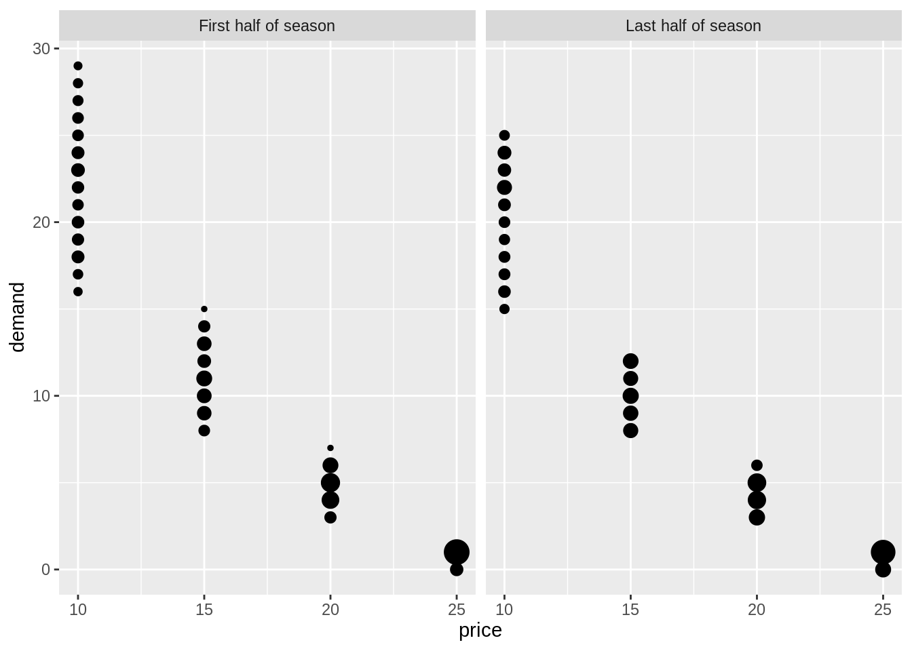
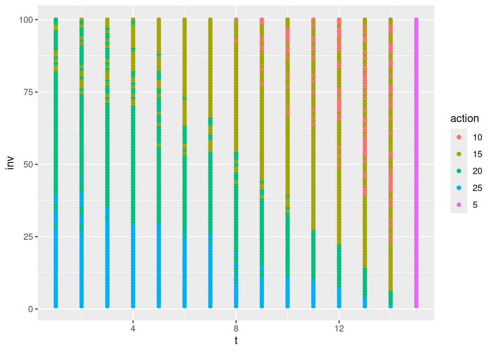
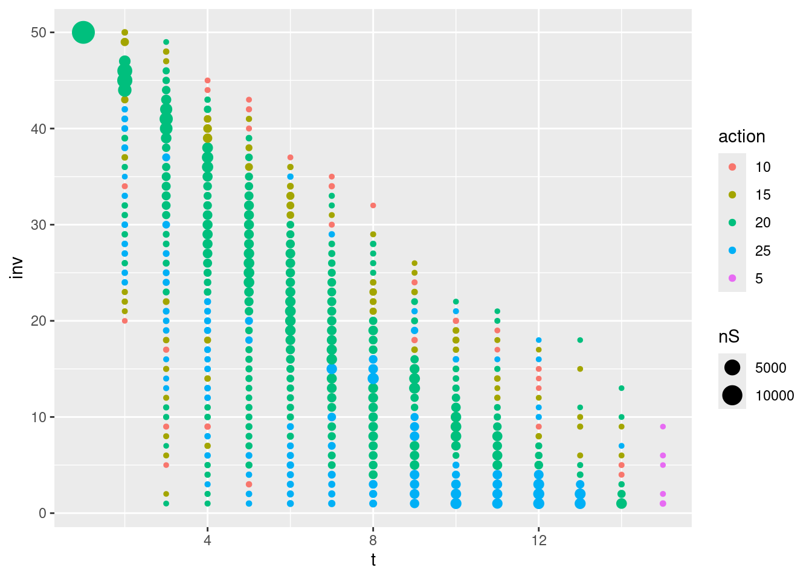

<!-- Various algorithms for the RL course -->


# Monte Carlo methods for prediction and control {#mod-mc}

The term "Monte Carlo" (MC) is often used for an estimation method which involves a random component. MC methods of RL learn state and action values by sampling and averaging returns. MC do not use dynamics where we estimate the value in the current state using the value in the next state (like in dynamic programming). Instead the MC methods estimate the values by considering different *sample-paths* (state, action and reward realizations). Compared to a Markov decision process, MC methods are model-free since they not require full knowledge of the transition probabilities and rewards (a model of the environment) instead MC methods learn the value function directly from experience. Often though, the sample-path is generated using simulation, i.e. some knowledge about the environment is given, but it is only used to generate sample transitions. For instance, consider an MDP model for the game Blackjack. Here calculating all the transition probabilities may be tedious and error-prone in terms of coding and numerical precision. Instead we can simulate a game (a sample-path) and use the simulations to evaluate/predict the value function of a policy and then use control to find a good policy. That is, we still use a generalised policy iteration framework, but instead of computing the value function using the MDP model a priori, we learn it from experience. 

MC methods can be used for processes with episodes, i.e. where there is a terminal state. This reduces the length of the sample-path and the value of the states visited on the path can be updated based on the reward received.


## Learning outcomes 

By the end of this module, you are expected to:

* Identify the difference between model-based and model-free RL.
* Identify problems that can be solved using Monte-Carlo methods.
* Describe how MC methods can be used to estimate value functions from sample data.
* Do MC prediction to estimate the value function for a given policy.
* Explain why it is important to maintain exploration in MC algorithms.
* Do policy improvement (control) using MC in a generalized policy improvement algorithm.
* Compare different ways of exploring the state-action space.
* Argue why off-policy learning can help deal with the exploration problem.
* Use importance sampling to estimate the expected value of a target distribution using samples from a different distribution.
* Use importance sampling in off-policy learning to predict the value-function of a target policy.
* Explain how to modify the MC prediction and improvement algorithm for off-policy learning.

The learning outcomes relate to the [overall learning goals](#mod-lg-course) number 3, 4, 9 and 12 of the course.

<!-- SOLO increasing: identify · memorise · name · do simple procedure · collect data · -->
<!-- enumerate · describe · interpret · formulate · list · paraphrase · combine · do -->
<!-- algorithms · compare · contrast · explain causes · analyse · relate · derive · -->
<!-- evaluate · apply · argue · theorise · generalise · hypothesise · solve · reflect -->


## Textbook readings

For this week, you will need to read Chapter 5-5.7 in @Sutton18. Read it before continuing this module. A summary of the book notation can be seen [here][sutton-notation].


```{=html}
<div>
Slides for this module can be seen
<a href="https://bss-osca.github.io/rl/slides/06_mc-slides.html" target="_blank">here.</a>
You do not have to look at them before the lecture!
</div>
```

## MC prediction (evaluation)

Given a policy $\pi$, we want to estimate the state-value function. Recall that the state value function is 
\[
v_\pi(s) = \mathbb{E}_\pi[G_t | S_t = s].
\]
where the return is 
\[
G_t = R_{t+1} + \gamma R_{t+2} + \gamma^2 R_{t+3} + \cdots = \sum_{k=0}^{\infty} \gamma^k R_{t+k+1} = R_{t+1} + \gamma G_{t+1}
\]
Now given policy $\pi$ and a sample-path (episode) $S_0, A_0, R_1, S_1, A_1, \ldots, S_{T-1}, A_{T-1}, R_T$ ending in the terminal state at time $T$, we can calculate the realized return for each state in the sample-path. Each time we have a new sample-path a new realized return for the states is given and the average for the returns in a state is an estimate of the state-value. With enough observations, the sample average converges to the true state-value under the policy $\pi$.

Given a policy $\pi$ and a set of sample-paths, there are two ways to estimate the state values $v_\pi(s)$:

* First visit MC: average returns from first visit to state $s$.
* Every visit MC: average returns following every visit to state $s$.

First visit MC generates iid estimates of $v_\pi(s)$ with finite variance, so the sequence of estimates converges to the expected value by the law of large numbers as the number of observations grow. Every visit MC does not generate independent estimates, but still converges.

An algorithm for first visit MC is given in Figure \@ref(fig:mc-prediction-alg). The state-value estimate is stored in a vector $V$ and the returns for each state in a list. Given a sample-path we add the return to the states on the path by scanning the path backwards and updating $G$. Note since the algorithm considers first visit MC, a check of occurrence of the state earlier in the path done. If this check is dropped, we have a every visit MC algorithm instead. Moreover, the computation needed to update the state-value does not depend on the size of the process/MDP but only of the length of the sample-path.

<div class="figure" style="text-align: center">

<p class="caption">(\#fig:mc-prediction-alg)MC policy prediction [@Sutton18].</p>
</div>

The algorithm maintains a list of all returns for each state which may require a lot of memory. Instead as incremental update of $V$ can be done. Adapting Eq. \@ref(eq:avg), we have that the sample average can be updated using: 

$$
  V(s) \leftarrow V(s) + \frac{1}{n} \left[G - V(s)\right].
$$
where $n$ denote the number of realized returns found for state $s$ and $G$ the current realized return. The state-value vector must be initialized to zero and a vector counting the number of returns found for each state must be stored.


<!-- ### Blackjack - MC prediction -->


### MC prediction of action-values

With a model of the environment we only need to estimate the state-value function, since it is easy to determine the policy from the state-values using the Bellman optimality equations \@ref(eq:bell-opt-state-policy). However, if we do not know the expected reward and transition probabilities state values are not enough. In that case, it is useful to estimate action-values since the optimal policy can be found using $q_*$ (see Eq. \@ref(eq:bell-opt-state-policy)). To find $q_*$, we first need to predict action-values for a policy $\pi$. This is essentially the same as for state-values, only we now talk about state-action pairs being visited, i.e. taking action $a$ in state $s$ instead. 

If $\pi$ is deterministic, then we will only estimate the values of actions that $\pi$ dictates. Therefore some exploration are needed in order to have estimates for all action-values. Two possibilities are:

1. Make $\pi$ stochastic, e.g. $\varepsilon$-soft that that have non-zero probability of selecting each state-action pair. 
2. Use *exploring starts*, which specifies that ever state-action pair has non-zero probability of being selected as the starting state of an sample-path. 


## MC control (improvement)

We are now ready to formulate a generalized policy iteration (GPI) algorithm using MC to predict the action-values $q(s,a)$. Policy improvement is done by selecting the next policy greedy with respect to the action-value function:
\[
    \pi(s) = \arg\max_a q(s, a).
\]
That is, we generate a sequence of policies and action-value functions
$$\pi_0 \xrightarrow[]{E} q_{\pi_0} \xrightarrow[]{I} \pi_1 \xrightarrow[]{E} q_{\pi_1} \xrightarrow[]{I} \pi_2 \xrightarrow[]{E} q_{\pi_2} \xrightarrow[]{I} \ldots \xrightarrow[]{I} \pi_* \xrightarrow[]{E} q_{*}.$$
Hence the policy improvement theorem applies for all $s \in \mathcal{S}$:

\begin{align}
    q_{\pi_k}(s, a=\pi_{k+1}(s)) &= q_{\pi_k}(s, \arg\max_a q_{\pi_k}(s, a)) \\
                    &= \max_a q_{\pi_k}(s, a) \\
                    &\geq q_{\pi_k}(s, \pi_k(s))\\
                    &= v_{\pi_k}(s)
\end{align}

That is, $\pi_{k+1}$ is better than $\pi_k$ or optimal. 

It is important to understand the major difference between model-based GPI (remember that a model means the transition probability matrix and reward distribution are known) and model-free GPI. We cannot simply use a 100% greedy strategy all the time, since all our action-values are estimates. As such, we now need to introduce an element of exploration into our algorithm to estimate the action-values. For convergence to the optimal policy a model-free GPI algorithm must satisfy:

1. *Infinite exploration*: all state-action $(s,a)$ pairs should be explored infinitely many times as the number of iterations go to infinity (in the limit), i.e. as the number of iterations $k$ goes to infinity the number of visits $n_k$ does too $$\lim_{k\rightarrow\infty} n_k(s, a) = \infty.$$
2. *Greedy in the limit*: while we maintain infinite exploration, we do eventually need to converge to the optimal policy:
  $$\lim_{k\rightarrow\infty} \pi_k(a|s) = 1 \text{ for } a = \arg\max_a q(s, a).$$

### GPI with exploring starts

An algorithm using exploring starts and first visit MC is given in Figure \@ref(fig:mc-gpi-es-alg). It satisfies the convergence properties and and incremental implementation can be used to update $Q$. Note that to predict the action-values for a policy, we in general need a large number of sample-paths. However, much like we did with value iteration, we do not need to fully evaluate the value function for a given policy. Instead we can merely move the value toward the correct value and then switch to policy improvement thereafter. To stop the algorithm from having infinitely many sample-paths we may stop the algorithm once the $q_{\pi_k}$ stop moving within a certain error.

<div class="figure" style="text-align: center">

<p class="caption">(\#fig:mc-gpi-es-alg)GPI using MC policy prediction with exploring starts [@Sutton18].</p>
</div>

<!-- ### Blackjack - MC control -->

### GPI using $\epsilon$-soft policies

Note by using exploring starts in Algorithm \@ref(fig:mc-gpi-es-alg), the 'infinite exploration' convergence assumption is satisfied. However exploring starts may be hard to use in practice. Another approach to ensure infinite exploration is to use a soft policy, i.e. assign a non-zero probability to each possible action in a state. An on-policy algorithm using $\epsilon$-greedy policies is given in Figure \@ref(fig:mc-gpi-on-policy-alg). Here we put probability $1 - \varepsilon + \frac{\varepsilon}{|\mathcal{A}(s)|}$ on the maximal action and $\frac{\varepsilon}{|\mathcal{A}(s)|}$ on each of the others. Note using $\epsilon$-greedy policy selection will improve the current policy; otherwise we have found best policy amongst the $\epsilon$-soft policies. If we want to find the optimal policy we have to ensure the 'greedy in the limit' convergence assumption. This can be done by decreasing $\epsilon$ as the number of iterations increase (e.g. $\epsilon = 1/k$).

<div class="figure" style="text-align: center">

<p class="caption">(\#fig:mc-gpi-on-policy-alg)On-policy GPI using MC policy prediction [@Sutton18].</p>
</div>

An incremental approach for updating $Q$ can be used by storing the number of times $n_a$, action $a$ has been visited in state $s$ and then update $Q(s,a)$ using $$Q_{n+1} = Q_n + \frac{1}{n_a}(G-Q_n),$$
where $Q_n$ denote the previous value.

Finally, the algorithm in Figure \@ref(fig:mc-gpi-on-policy-alg) do not mention how to find the start state of an episode. In general all states that we want to approximate must be used as start state. 


### GPI using upper-confience bound action selection 

GPI using exploring starts or $\epsilon$-soft policies may be slow. Often speed-ups can be done by using e.g. upper-confidence bounds (UCB) for action selection. Recall from Module \@ref(mod-bandit) that UCB select actions according to their potential for actually being optimal, taking into account both how close their estimates are to being maximal and the uncertainty in those estimates. That is, the next action $a'$ given a state $s$ is selected using:
$$
	a' = \arg\max_a \left(Q(s,a) + c\sqrt{\frac{\ln n_s}{n_a}}\right),
$$
where $n_s$ denote the number of times state $s$ has been visited and $n_a$ denote the number of times action $a$ has been visited (both numbers must be stored). The parameter $c>0$ controls the degree of exploration. Higher $c$ results in more weight on the uncertainty. However, one problem with UCB is that it is hard to decide on which value of $c$ to use in advance.   
<!-- Preliminary testing showed that using UCB instead of $\epsilon$-greedy policies worked better.  -->


### Example - Seasonal inventory and sales planning {#mc-seasonal}


In the following example we try to implement an algorithm that uses generalized policy iteration with every-visit estimation using epsilon-greedy action selection.

We consider seasonal product such as garden furnitures. Assume that the maximum inventory level is $Q$ items, i.e. we can buy at most $Q$ items at the start of the season for a price of $14. The product can be sold for at most $T$ weeks and at the end of the period (week $T$), the remaining inventory is sold to an outlet store for $5 per item. 

The demand depends on the sales price which based on historic observations is assumed in the interval $[10,25].$ In general a higher sales price result in a lower demand. Moreover, in the first half part of the season the demand is on average 10% higher given a fixed sales price compared to the last half part of the season. Historic observed demands can be seen in Figure \@ref(fig:demand). 

<div class="figure" style="text-align: center">

<p class="caption">(\#fig:demand)Observed demands given price (scaled based on number of observations).</p>
</div>
   
Let $s = (q,t)$ denote the state of the system in the start of a week, where $q$ is the inventory and $t$ the week number. Then the state space is $$\mathcal{S} = \{ s = (q,t) | 1 \leq q \leq Q, 1 \leq t \leq T \} \cup \{ 0 \},$$
where state $s = 0$ denote the terminal state (inventory empty).
Let us limit us to actions $$\mathcal{A}(q,t) = \{ 10,15,20,25 \}, \mathcal{A}(0) = \{ d \}, $$ where action $a$ denote the price and $d$ denote the dummy action with deterministic transition to state $0$.

The inventory dynamics for transitions not to the terminal state are $$t' = t + 1,$$ $$q' = q - min(q, D),$$ 
where $D$ denote the demand. Moreover, if $t = T$ or $q' = 0$, then a transition to the terminal state happens.  

For $t=1$ the reward of an state $(q,t)$ is sales price times the number of sold items minus the purchase cost. For $1<t<T$ the reward is sales price times the number of sold (we assume an inventory cost of zero), while for $t=T$ the reward is the scrap price times the inventory. 

Let us define a R6 class representing the environment for this problem


```r
library(R6)
library(hash)
library(tidyverse)

#' R6 Class representing the RL environment for the problem
RLEnvSeasonal <- R6Class("RLEnvSeasonal",
   public = list(
      
      #' @field maxInv Max inventory level.
      maxInv = NA,  
      
      #' @field maxT Max number of weeks to sell product.
      maxT = NA,
      
      #' @field scrapPrice Scrap price per item in week maxT.
      scrapPrice = NA,
      
      #' @field purchasePrice Purchase price per item.
      purchasePrice = NA,
      
      #' @field prices Possible sales prices per item.
      prices = NA,

      #' @description Create an object (when call new).
      #' @param maxInv Max inventory level.
      #' @param maxT Max number of weeks to sell product.
      #' @param scrapPrice Scrap price per item in week maxT.
      #' @param purchasePrice Purchase price per item.
      #' @return The new object.
      initialize = function(maxInv, maxT, scrapPrice, purchasePrice, prices) {
         self$maxInv <- maxInv 
         self$maxT <- maxT
         self$scrapPrice <- scrapPrice
         self$purchasePrice <- purchasePrice
         self$prices <- prices
      },
      
      
      #' @description Return all states (keys).
      getStates = function() {
         states <- expand_grid(l = 1:env$maxInv, t = 1:env$maxT) %>% mutate(s = str_c(l, ",", t)) %>% pull(s)
         states <- c(states, "0")
         return(states)
      },
      
      #' @description Return all actions (keys) for a state.
      #' @param s State considered.
      getActions = function(s) {
         if (s == "0") return("dummy")
         q <- str_split(s, ",", simplify = T)
         t <- as.numeric(q[2])
         q <- as.numeric(q[1])
         if (t == self$maxT) return(str_c(self$scrapPrice))
         return(str_c(self$prices))
      },
      
      #' @description Stochastic demand sample. 
      #' @param price Sales price.
      #' @param t Week.
      getDemand = function(price, t) {
         l1 = matrix(c(10,20, 12,12), ncol = 2, byrow = T)  # points (price, demand) for first line
         l2 = matrix(c(12,12, 15,10), ncol = 2, byrow = T)  
         l3 = matrix(c(15,10), ncol = 2, byrow = T)  
         
         if (price <= max(l1[1,1],l1[2,1])) {
            a <- (l1[1,2]-l1[2,2])/(l1[1,1]-l1[2,1])
            b <- l1[1,2] - a * l1[1,1] 
            d <- a * price + b 
            dS <- d * runif(1, 0.75, 1.25)
         } else if (price >= min(l2[1,1],l2[2,1]) & price <= max(l2[1,1],l2[2,1])) {
            a <- (l2[1,2]-l2[2,2])/(l2[1,1]-l2[2,1])
            b <- l2[1,2] - a * l2[1,1] 
            d <- a * price + b 
            dS <- d * runif(1, 0.75, 1.25)
         } else if (price >= l3[1,1]) {
            d <- -4*log(price - l3[1,1] + 1) + l3[1,2]
            dS <- d * runif(1, 1, 2)
         }
         if (t <= self$maxT/2) {
            dS <- runif(1, 1, 1.2) * dS
         }
         # if (stochastic) return(round(dS)) else return(round(d))
         return(round(dS))
      },
      
      #' @description Returns the simulated transition probabilities and reward. 
      getTransPrR = function(s, a, runs = 10000) {
         q <- str_split(s, ",", simplify = T)
         t <- as.numeric(q[2])
         q <- as.numeric(q[1])
         if (q == 0) {
            return(list(pr = c("0" = 1), r = 0))
         }
         if (t == env$maxT) {
            return(list(pr = c("0" = 1), r = env$scrapPrice * q))
         }
         a <- as.numeric(a)
         df <- tibble(sim = 1:runs) %>% 
            rowwise() %>% 
            mutate(demand = self$getDemand(a, t)) %>% 
            ungroup() %>% 
            mutate(qN = q - pmin(q, demand), reward = a * pmin(q, demand))
         reward <- mean(df$reward)
         if (t == 1) reward <- reward - q * self$purchasePrice
         df <- df %>% 
            count(qN) %>% 
            mutate(pr = n/sum(n), qN = if_else(qN == 0, "0", str_c(qN, ",", t+1)))
         pr <- df %>% pull(pr, name = qN)
         return(list(pr = pr, r = reward))
      },
      
      #' @description Returns an episode as a tibble with cols s, a, r (last col the terminal reward).
      #' @param agent The agent that holds the model with current policy stored in pi. 
      getEpisodePi = function(agent, startState) {
         if (startState == "0") {
            return(tibble::tibble(!!!c("s", "a", "r"), .rows = 0))  # empty tibble
         }
         q <- str_split(startState, ",", simplify = T)
         t <- as.numeric(q[2])
         q <- as.numeric(q[1])
         df <- tibble(s = rep(NA_character_, 100 * self$maxInv), a = NA_character_, r = NA_real_)  # a tibble with more rows than used
         for (i in 1:nrow(df)) {
            if (q == 0) {
               df <- df[1:(i-1),]  # remove unused rows
               break  # have reached terminal state
            }
            s <- str_c(q, ",", t)
            a <- agent$getActionPi(s)
            if (t == self$maxT) { # sell remaining
               r <- self$scrapPrice * q
               q <- 0  # new q value
            } else {
               price <- as.numeric(a)
               d <- self$getDemand(price, t)
               if (t == 1) {
                  r <- price * min(q, d) - q * self$purchasePrice
               } else {
                  r <- price * min(q, d)
               }
               q <- q - min(q, d)  # new q value
               t <- t + 1 # new t value
            }
            df$s[i] <- s
            df$a[i] <- a
            df$r[i] <- r
         }
         return(df)
      },
      
      #' @description Returns an episode as a tibble with cols s, a, r (last col the terminal reward).
      #' @param agent The agent that holds the model with current policy. 
      getEpisode = function(agent, startState, coeff = 1, eps = 0.1) {
         if (startState == "0") {
            return(tibble::tibble(!!!c("s", "a", "r"), .rows = 0))  # empty tibble
         }
         q <- str_split(startState, ",", simplify = T)
         t <- as.numeric(q[2])
         q <- as.numeric(q[1])
         df <- tibble(s = rep(NA_character_, 100 * self$maxInv), a = NA_character_, r = NA_real_)  # a tibble with more rows than used
         # q <- sample(1:self$maxInv, 1)  # pick start inventory random
         # q <- 1
         # t <- 1
         for (i in 1:nrow(df)) {
            if (q == 0) {
               df <- df[1:(i-1),]  # remove unused rows
               break  # have reached terminal state
            }
            s <- str_c(q, ",", t)
            if (t == self$maxT) { # sell remaining
               a <- agent$getActionUCB(s, coeff)
               r <- self$scrapPrice * q
               q <- 0  # new q value
            } else {
               # actions <- names(agent$model[[s]]$pi)
               # a <- actions[sample(1:length(actions), 1, prob = agent$model[[s]]$pi)]
               # a <- agent$getActionUCB(s, coeff)
               # epsN <- eps * (1/(agent$model[[s]]$n+1))^0.28
               epsN <- eps
               a <- agent$getActionEG(s, epsN)
               # cat(a, " ")
               price <- as.numeric(a)
               d <- self$getDemand(price, t)
               if (t == 1) {
                  r <- price * min(q, d) - q * self$purchasePrice
               } else {
                  r <- price * min(q, d)
               }
               q <- q - min(q, d)  # new q value
               t <- t + 1 # new t value
            }
            df$s[i] <- s
            df$a[i] <- a
            df$r[i] <- r
         }
         return(df)
      }
   )
)
```

Note that we define methods for getting the state and actions, an episode and the demand. Moreover, for this problem we many also use simulation to get the transition probabilities and the expected reward of a state-action pair (see method `getTransPrR`). That is, we may solve the problem using an MDP first and compare. Let us define the environment:


```r
set.seed(876)
prices <- c(10, 15, 20, 25)
env <- RLEnvSeasonal$new(maxInv = 100, maxT = 15, scrapPrice = 5, purchasePrice = 14, prices)
```

First let us try to find the optimal policy using an MDP:


```r
## Build the MDP
mdp <- MDPClass$new()                           # initialize mdp object
mdp$addStateSpace(env$getStates())              # add states
for (s in mdp$getStateKeys()) {                 # add actions
   mdp$addActionSpace(s, env$getActions(s))
} 
for (s in mdp$getStateKeys()) {                 # add trans pr and reward (this will take some time!)
   for (a in mdp$getActionKeys(s)) {
      lst <- env$getTransPrR(s, a, runs = 1000)
      mdp$addAction(s, a, r = lst$r, pr = lst$pr)
   }
}
## Solve the MDP
mdp$policyIte(gamma = 1)
# mdp$valueIte(gamma = 1)
dfMDP <- left_join(mdp$getStateValues(), mdp$getPolicy(), by = "state") %>% 
   select(-pr) %>% 
   separate(state, into = c("inv", "t"), remove = F, convert = T)
```

Let us plot the optimal policy (see Figure \@ref(fig:seasonal-mdp-plot)):


```r
dfMDP %>% filter(!is.na(t)) %>% 
   ggplot(aes(x = t, y = inv, col = action)) +
   geom_point()
```

<div class="figure" style="text-align: center">

<p class="caption">(\#fig:seasonal-mdp-plot)Optimal policy for the MDP.</p>
</div>

Note in general we change the price based on a diagonal line running from upper-left to lower-right. Some time two prices oscillate given a time due to state-values close to each other. 

The best inventory level to order can be found by searching among the state-values at time one. 


```r
res <- dfMDP %>% 
   filter(t == 1) %>% 
   arrange(desc(v)) %>% 
   print()
#> # A tibble: 100 × 5
#>    state   inv     t     v action
#>    <chr> <int> <int> <dbl> <chr> 
#>  1 64,1     64     1  358. 20    
#>  2 62,1     62     1  358. 20    
#>  3 63,1     63     1  358. 20    
#>  4 61,1     61     1  357. 20    
#>  5 65,1     65     1  357. 20    
#>  6 66,1     66     1  355. 20    
#>  7 60,1     60     1  355. 20    
#>  8 67,1     67     1  353. 20    
#>  9 59,1     59     1  352. 20    
#> 10 68,1     68     1  351. 20    
#> # … with 90 more rows
#> # ℹ Use `print(n = ...)` to see more rows
```

This is approx around 64 items. If ordering 100 items we would loose:


```r
res$v[1] - dfMDP %>% 
   filter(state == "100,1") %>% pull(v)
#> 64,1.20 
#>    91.3
```

Let us now try to use RL and MC to approximate the best policy. First, we define a generic RL agent:


```r
library(R6)
library(hash)
library(tidyverse)

## Generic RL agent for tabular data (R6 class)
RLAgent <- R6Class("RLAgent",
   public = list(
      #' @field model The model is used to represent the information we have. The
      #' model is represented using a hash list for the states. Each states contains 
      #'    - A list with `actions` (a hash #' list with actions).
      #'    - `pi` (a named vector with policy pr (only positive values).
      #'    - `piG` the greedy action (a string). 
      #'    - `n` a visit counter
      #' The `actions` hash list contains 
      #'    - The action-values `q`.
      #'    - `n` a visit counter.
      model = NULL,  
      
      #' @description Create an object (when call new).
      initialize = function() {
         self$model <- hash()
         return(invisible(NULL))
      },

      #' @description Add state and action to the hash (only if not already added)
      #' @param s State key/string.
      #' @param a Action key/string.
      addStateAction = function(s, a) {
         if (!has.key(s, self$model)) addStates(s)
         if (!has.key(a, self$model[[s]]$actions)) self$model[[s]]$actions[[a]] <- list(q = 0, n = 0)
         return(invisible(NULL))
      },
      
      #' @description Add the states (keys) and define void policy and empty action hash. 
      #' @param states A vector of states (converted to strings).
      addStates = function(states) {
         keys <- make.keys(states)
         self$model[keys] <- list(pi = NA)   # don't use pi = NULL since then won't be defined 
         for (s in keys) {
            self$model[[s]]$v <- NA
            self$model[[s]]$actions <- hash()
            self$model[[s]]$n <- 0  # counter visited
         }
         return(invisible(NULL))
      },
      
      #' @description Add the actions to a state
      #' @param s State (key).
      #' @param actions A vector of actions (converted to strings).
      addActions = function(s, actions) {
         keys <- make.keys(actions)
         for (a in keys) {
            self$addStateAction(s, a)
         }
         return(invisible(NULL))
      },
      
      #' @description Add states and actions to the hash with initial values. If already exists nothing happens. 
      #' @param df A tibble with string columns `s` (states) and `a` (actions).
      addStatesAndActions = function(df) {
         for (i in 1:nrow(df)) {
            self$addStateAction(df$s[i], df$a[i])
         }
         return(invisible(NULL))
      },
      
      #' @description Set the action-values for all actions.
      #' @param value The value.
      setActionValue = function(value = 0) {
         for (s in keys(self$model)) {
            for (a in keys(self$model[[s]]$actions)) {
               self$model[[s]]$actions[[a]]$q = value
            }
         }
         return(invisible(NULL))
      },
      
      #' @description Set the state-value of states
      #' @param states A vector of states.
      #' @param value The value.
      setStateValue = function(states = keys(self$model), value = 0) {
         for (s in states) {
            self$model[[s]]$v <- value
         }
         return(invisible(NULL))
      },
      
      #' @description Set the action visit counter values for all actions.
      #' @param ctrValue Counter value.
      setActionCtrValue = function(ctrValue = 0) {
         for (s in keys(self$model)) {
            for (a in keys(self$model[[s]]$actions)) {
               self$model[[s]]$actions[[a]]$n = ctrValue
            }
         }
         return(invisible(NULL))
      },
      
      #' @description Set the action-values for a single action (including the counter values).
      #' @param value The value.
      #' @param ctrValue Counter value.
      setActionValueSingle = function(value = 0, ctrValue = 0, s, a) {
         self$model[[s]]$actions[[a]]$q = value
         self$model[[s]]$actions[[a]]$n = ctrValue
         return(invisible(NULL))
      },
      
      #' @description Set the policy to a random epsilon-greedy policy.
      #' @param eps Epsilon used in epsilon-greedy policy.
      setRandomEpsGreedyPolicy = function(eps) {
         states <- keys(self$model)
         for (s in states) {
            actions <- self$getActionKeys(s)
            self$model[[s]]$pi <- rep(eps/length(actions), length(actions))
            names(self$model[[s]]$pi) <- actions
            piG <- sample(self$getActionKeys(s), 1)
            self$model[[s]]$pi[piG] <- self$model[[s]]$pi[piG] + 1 - eps
         }
         return(invisible(NULL))
      },
      
      #' @description Set the policy to the optimal epsilon-greedy policy 
      #' @param eps Epsilon used in epsilon-greedy policy.
      #' @param states States under consideration.
      setEpsGreedyPolicy = function(eps, states) {
         for (s in states) {
            actions <- self$getActionKeys(s)
            self$model[[s]]$pi <- rep(eps/length(actions), length(actions))
            names(self$model[[s]]$pi) <- actions
            idx <- nnet::which.is.max(unlist(values(self$model[[s]]$actions)["q",]))  # choose among max values at random
            # idx <- which.max(unlist(values(self$model[[s]]$actions)["q",]))  # choose first max 
            # self$model[[s]]$piG <- actions[idx]
            self$model[[s]]$pi[idx] <- self$model[[s]]$pi[idx] + 1 - eps
         }
         return(invisible(NULL))
      },
      
      #' @description Set the greedy policy based on action-values. 
      #' @param states States under consideration.
      setGreedyPolicy = function(states = self$getStateKeys()) {
         for (s in states) {
            pi <- 1
            actions <- self$getActionKeys(s)
            # idx <- nnet::which.is.max(unlist(values(self$model[[s]]$actions)["q",]))  # choose among max values at random
            idx <- which.max(unlist(values(self$model[[s]]$actions)["q",]))  # choose first max
            names(pi) <- actions[idx]
            self$model[[s]]$pi <- pi
         }
         return(invisible(NULL))
      },
      
      #' @description Set the policy to the named vector pi for a set of states
      #' @param states States under consideration.
      #' @param pi A named vector with policy pr (only psitive values).
      setPolicy = function(states, pi) {
         for (s in states) {
            self$model[[s]]$pi <- pi
         }
         return(invisible(NULL))
      },
      
      #' @description Set the state visit counter values for all states.
      #' @param ctrValue Counter value.
      setStateCtrValue = function(ctrValue = 0) {
         for (s in keys(self$model)) {
            self$model[[s]]$n = ctrValue
         }
         return(invisible(NULL))
      },
      
      #' @description Return the state keys
      getStateKeys = function() {
         keys(self$model)
      },
      
      #' @description Return the state-value for a state and policy using the q/action-values 
      #' @param s A state.
      getStateValueQ = function(s) {
         pi <- self$model[[s]]$pi
         # print(pi)
         val <- 0
         for (a in names(pi)) {
            val <- val + pi[a] * self$model[[s]]$actions[[a]]$q
            # print(self$model[[s]]$actions[[a]]$q)
         }
         # print(val)
         return(val)
      },
      
      #' @description Return the state-values as a tibble
      #' @param s A vector of state keys.
      getStateValues = function(s = keys(self$model)) {
         tibble(state = s) %>% rowwise() %>% mutate(v = self$model[[state]]$v) 
      },
      
      #' @description Return the action keys
      #' @param s The state considered.
      getActionKeys = function(s) {
         keys(self$model[[s]]$actions) 
      },
      
      #' @description Return information about actions stored in a state
      #' @param s The state considered.
      getActionInfo = function(s) {
         as.list(self$model[[s]]$actions) 
      },
      
      #' @description Return the current policy as a tibble
      getPolicy = function(states = self$getStateKeys()) {
         map_dfr(states, .f = function(s) {
               list(state = s, action = names(self$model[[s]]$pi), pr = self$model[[s]]$pi)
            })
      },
      
      #' @description Returns all action-values in a matrix (cols: actions, rows: states)
      getStateActionQMat = function() {
         states <- keys(self$model)
         actions <- unique(unlist(sapply(states, function(s) self$getActionKeys(s))))
         m <- matrix(NA, nrow = length(states), ncol = length(actions))
         colnames(m) <- actions
         rownames(m) <- states
         for (s in states) {
            for (a in self$getActionKeys(s)) {
               m[s, a] <- self$model[[s]]$actions[[a]]$q
            }
         }
         return(m)
      },
      
      #' @description Return the action-values as a tibble
      #' @param states A vector of state keys.
      getActionValues = function(states = keys(self$model)) {
         map_dfr(states, .f = function(s) {
               list(state = s, action = keys(self$model[[s]]$actions), q = unlist(values(self$model[[s]]$actions)["q",]), n = unlist(values(self$model[[s]]$actions)["n",]))
            })
      },
      
      #' @description Select next action using upper-confidence bound. Also update the visit counters for both state and selected action.
      #' @return Action.
      getActionUCB = function(s, coeff = 1) { 
         actions <- self$getActionKeys(s)
         self$model[[s]]$n <- self$model[[s]]$n + 1  # visit s
         qV <- unlist(values(self$model[[s]]$actions)["q",])
         nA <- unlist(values(self$model[[s]]$actions)["n",])
         nS <- self$model[[s]]$n
         val <- qV + coeff * sqrt(log(nS + 0.0001)/nA)
         idx <- which.max(val)
         a <- actions[idx]
         self$model[[s]]$actions[[a]]$n <- self$model[[s]]$actions[[a]]$n + 1  # note there is a risk here if use every-visit for an episode then will update more than once implying slower convergence. 
         return(a)
      },
      
      #' @description Select next action using epsilon-greedy policy based on action-values. Also update the visit counters for both state and selected action.
      #' @return Action.
      getActionEG = function(s, eps) {
         self$model[[s]]$n <- self$model[[s]]$n + 1  # visit s
         q <- unlist(values(self$model[[s]]$actions)["q",])
         actions <- self$getActionKeys(s)
         pi <- rep(eps/length(q), length(q))
         idx <- nnet::which.is.max(q)  # choose among max values at random
         # idx <- which.max(unlist(values(self$model[[s]]$actions)["q",]))  # choose first max 
         pi[idx] <- pi[idx] + 1 - eps
         a <- actions[sample(1:length(actions), 1, prob = pi)]
         self$model[[s]]$actions[[a]]$n <- self$model[[s]]$actions[[a]]$n + 1  # note there is a risk here if use every-visit for an episode then will update more than once implying slower convergence. 
         return(a)
      },
      
      #' @description Find maximum action value in a state.
      #' @return Value.
      getMaxActionValue = function(s) {
         q <- unlist(values(self$model[[s]]$actions)["q",])
         return(max(q))
      },
      
      #' @description Find expected action value in a state based on current policy
      #' @return Value.
      getExpActionValue = function(s) {
         pi <- self$model[[s]]$pi
         a <- names(pi)
         for (i in seq_along(pi)) {
            pi[i] <- pi[i] * self$model[[s]]$actions[[a[i]]]$q
         }
         return(sum(pi))
      },
      
      #' @description Return and action sampled from the current policy pi. Also update the visit counters for both state and selected action.
      #' @param s The state considered.
      getActionPi = function(s) {
         self$model[[s]]$n <- self$model[[s]]$n + 1  # visit s
         pi <- self$model[[s]]$pi
         actions <- names(pi)
         a <- sample(actions, 1, prob = pi)
         self$model[[s]]$actions[[a]]$n <- self$model[[s]]$actions[[a]]$n + 1  # note there is a risk here if use every-visit for an episode then will update more than once implying slower convergence. 
         return(a)
      },
      
# 
#       getActionPi = function(s) {
#          pi <- self$model[[s]]$pi
#          return(sample(names(pi), 1, prob = pi))
#       },
      
      #' @description Policy evaluation using TD(0)
      #' @param env The environment which must have a method `getTimeStepData(s,a)` that return a list with elements `r` (reward) and `sN` (next state). 
      #' @param gamma Discount rate.
      #' @param alpha Step-size (use a fixed step-size).
      #' @param maxE Maximum number of episodes generated.  
      #' @param maxEL Maximum episode length.
      #' @param reset If true initialize all state-values to 0.
      #' @param states Possible start states of each episode (one picked at random).
      #' @param ... Further arguments passed to `getEpisode` e.g the coefficient used for upper-confidence bound action selection. 
      policyEvalTD0 = function(env, gamma = 1, alpha = 0.1, maxE = 1000, maxEL = 10000, reset = TRUE, states = self$getStateKeys()) {
         if (reset) self$setStateValue(self$getStateKeys())      # set to 0
         for (ite in 1:maxE) {
            s <- sample(states, 1)  # pick start state among states
            for (i in 1:maxEL) {  # for episode with ss as start (max length 100000)
               a <- self$getActionPi(s)
               dat <- env$getTimeStepData(s,a)  # get next state and reward
               r <- dat$r
               sN <- dat$sN
               if (is.na(sN) | is.na(a)) break  # start generating new episode
               oldV <- self$model[[s]]$v
               self$model[[s]]$v <- oldV + alpha * (r + gamma * self$model[[sN]]$v - oldV)
               s <- sN
            }
            if (i == maxEL) break
         }
      },
      
      
      #' @description Policy evaluation using every-visit Monte Carlo sampling.  
      #' @param env The environment which must have a method `getEpisode(agent, s, coeff)` that return an episode as a tibble with 
      #'    cols s, a, r (last col the terminal reward). This method also must update the visit counters if needed! This is also 
      #'    the method that decides which action selection method is used. 
      #' @param gamma Discount rate.
      #' @param theta Threshold parameter.
      #' @param minIte Minimum number of iterations for each start state (all `states` are used a start state in one iteration).
      #' @param maxIte Maximum number of iterations for each start state (all `states` are used a start state in one iteration).
      #' @param reset If true initialize all state-values to 0.
      #' @param states Start states in the episodes, which all are visited using a for loop.
      #' @param verbose If true then print info for each episode.
      policyEvalMC = function(env, gamma = 1, theta = 0.1, minIte = 100, maxIte = 1000, reset = TRUE, states = self$getStateKeys(), verbose = FALSE) {
         if (reset) {
            self$setStateValue()      # set to 0
            self$setActionCtrValue()   # reset counter
            self$setStateCtrValue()    # reset counter
         }
         for (ite in 1:maxIte) {
            delta <- 0
            for (ss in states) {  # for episode with s as start
               df <- env$getEpisodePi(self, ss)  # an episode stored in a tibble with cols s, a, r (last col the terminal reward)
               if (nrow(df) == 0) next
               df <- df %>% mutate(nS = NA, g = NA, oldV = NA, v = NA)
               gain <- 0
               for (i in nrow(df):1) {
                  s <- df$s[i]
                  a <- df$a[i]
                  gain <- df$r[i] + gamma * gain
                  ctr <- self$model[[s]]$n
                  oldV <- self$model[[s]]$v
                  stepSize <- (1/ctr)
                  self$model[[s]]$v <- oldV + stepSize * (gain - oldV)
                  newV <- self$model[[s]]$v
                  delta <- max(delta, abs(oldV - newV))
                  if (verbose) df$g[i] <- gain; df$nS[i] <- ctr; df$oldV[i] <- oldV; df$v[i] <- newV
               }
               if (verbose) print(df)
            }
            if (delta < theta & ite >= minIte) break
         }
         if (ite == maxIte) warning("Polcy eval algorithm stopped at max iterations allowed: ", maxIte)
         message(str_c("Policy eval algorihm finished in ", ite, " iterations."))
         return(invisible(NULL))
      },
      
      #' @description Generalized policy iteration using on policy every-visit Monte Carlo sampling.  
      #' @param env The environment which must have a method `getEpisode(agent, s, coeff)` that return an episode as a tibble with 
      #'    cols s, a, r (last col the terminal reward). This method also must update the visit counters if needed! This is also 
      #'    the method that decides which action selection method is used. 
      #' @param gamma Discount rate.
      #' @param theta Threshold parameter.
      #' @param minIte Minimum number of iterations for each start state (all `states` are used a start state in one iteration).
      #' @param maxIte Maximum number of iterations for each start state (all `states` are used a start state in one iteration).
      #' @param reset If true initialize all action-values to 0.
      #' @param states Start states in the episodes, which all are visited using a for loop.
      #' @param eps Epsilon used for the epsilon-greedy policy.
      #' @param verbose If true then print info for each episode.
      gpiOnPolicyMC = function(env, gamma = 1, theta = 0.1, minIte = 100, maxIte = 1000, reset = TRUE, states = self$getStateKeys(), eps = 0.1, verbose = FALSE) {
         if (reset) {
            self$setActionValue()      # set to 0
            self$setActionCtrValue()   # reset counter
            self$setStateCtrValue()    # reset counter
         }
         # self$setRandomEpsGreedyPolicy(epsilon)
         self$setEpsGreedyPolicy(eps, self$getStateKeys())
         # self$setGreedyPolicy()
         for (ite in 1:maxIte) {
            delta <- 0
            # stable <- TRUE
            for (ss in states) {  # for episode with s as start
               df <- env$getEpisode(self, ss, eps)  # an episode stored in a tibble with cols s, a, r (last col the terminal reward)
               if (nrow(df) == 0) next
               df <- df %>% mutate(nA = NA, nS = NA, oldQ = NA, q = NA, g = NA, oldV = NA, v = NA)
               gain <- 0
               for (i in nrow(df):1) {
                  s <- df$s[i]
                  a <- df$a[i]
                  gain <- df$r[i] + gamma * gain
                  ctr <- self$model[[s]]$actions[[a]]$n
                  oldQ <- self$model[[s]]$actions[[a]]$q
                  oldV <- self$getStateValueQ(s)
                  stepSize <- (1/ctr)^0.5
                  self$model[[s]]$actions[[a]]$q <- oldQ + stepSize * (gain - oldQ)
                  # self$model[[s]]$actions[[a]]$q <- oldQ + 0.1 * (gain - oldQ)
                  self$setEpsGreedyPolicy(eps, s)
                  newV <- self$getStateValueQ(s)
                  delta <- max(delta, abs(oldV - newV))
                  if (verbose) df$oldQ[i] <- oldQ; df$q[i] <- self$model[[s]]$actions[[a]]$q; df$g[i] <- gain; df$nA[i] <- ctr; df$nS[i] <- self$model[[s]]$n; df$oldV[i] <- oldV; df$v[i] <- newV
               }
               if (verbose) print(df)
            }
            if (delta < theta & ite >= minIte) break
         }
         if (ite == maxIte) warning("GPI algorithm stopped at max iterations allowed: ", maxIte)
         message(str_c("GPI algorihm finished in ", ite, " iterations."))
         return(invisible(NULL))
      },
      
      #' @description Generalized policy iteration using on policy SARSA.  
      #' @param env The environment which must have a method `getTimeStepData(s,a)` that return a list with elements `r` (reward) and `sN` (next state). 
      #' @param gamma Discount rate.
      #' @param maxE Maximum number of episodes generated.
      #' @param maxEL Maximum length of episode. If model with continuing tasks use this to set the length of training.
      #' @param reset If true initialize all action-values to 0.
      #' @param states Possible start states of an episode. One selected randomly.
      #' @param eps Epsilon used for the epsilon-greedy policy.
      #' @param alpha Step-size (use a fixed step-size).
      gpiOnPolicySARSA = function(env, gamma = 1, maxE = 1000, maxEL = 10000, reset = TRUE, states = self$getStateKeys(), eps = 0.1, alpha = 0.1, verbose = FALSE) {
         if (reset) {
            self$setActionValue()      # set to 0
            self$setActionCtrValue()
         }
         self$setEpsGreedyPolicy(eps, self$getStateKeys())
         for (ite in 1:maxE) {
            s <- sample(states, 1)  # pick start state among possible start states
            a <- self$getActionPi(s)
            for (i in 1:maxEL) {  # for episode with s as start (max length 100000)
               dat <- env$getTimeStepData(s,a)  # get next state and reward
               r <- dat$r
               sN <- dat$sN
               if (is.na(sN) | is.na(a)) break  # start generating new episode
               aN <- self$getActionPi(sN)
               oldQ <- self$model[[s]]$actions[[a]]$q  
               self$model[[s]]$actions[[a]]$q <- oldQ + alpha * (r + gamma * self$model[[sN]]$actions[[aN]]$q - oldQ)
               if (verbose) cat("(s,a,r,s,a) = (", s, ",", a, ",", r, ",", sN, ",", aN, "), r = ", r, " oldQ = ", oldQ, " Q(sN, aN) = ", self$model[[sN]]$actions[[aN]]$q, " newQ = ", self$model[[s]]$actions[[a]]$q, "\n", sep = "")
               self$setEpsGreedyPolicy(eps, s)
               s <- sN
               a <- aN
            }
            if (i == maxEL) break
         }
         message("GPI algorithm stopped with ", ite, " episodes.")
         message("GPI algorithm stopped with episode of length ", i, ".")
         return(invisible(NULL))
      },
      
      #' @description Generalized policy iteration using off policy Q-learning.  
      #' @param env The environment which must have a method `getTimeStepData(s,a)` that return a list with elements `r` (reward) and `sN` (next state). 
      #' @param gamma Discount rate.
      #' @param maxE Maximum number of episodes generated.
      #' @param maxEL Maximum length of episode. If model with continuing tasks use this to set the length of training.
      #' @param reset If true initialize all action-values to 0.
      #' @param states Possible start states of an episode. One selected randomly.
      #' @param eps Epsilon used for the epsilon-greedy policy.
      #' @param alpha Step-size (use a fixed step-size).
      gpiOffPolicyQLearning = function(env, gamma = 1, maxE = 1000, maxEL = 10000, reset = TRUE, states = self$getStateKeys(), eps = 0.1, alpha = 0.1, verbose = FALSE) {
         if (reset) {
            self$setActionValue()      # set to 0
            self$setActionCtrValue()
         }
         self$setEpsGreedyPolicy(eps, self$getStateKeys())
         for (ite in 1:maxE) {
            s <- sample(states, 1)  # pick start state among possible start states
            for (i in 1:maxEL) {  # for episode with s as start (max length 100000)
               a <- self$getActionPi(s)
               dat <- env$getTimeStepData(s,a)  # get next state and reward
               r <- dat$r
               sN <- dat$sN
               if (is.na(sN) | is.na(a)) break  # start generating new episode
               oldQ <- self$model[[s]]$actions[[a]]$q  
               maxQ <- self$getMaxActionValue(sN)
               self$model[[s]]$actions[[a]]$q <- oldQ + alpha * (r + gamma * maxQ - oldQ)
               if (verbose) cat("(s,a,r,s) = (", s, ",", a, ",", r, ",", sN, "), r = ", r, " oldQ = ", oldQ, " maxQ(sN) = ", maxQ, " newQ = ", self$model[[s]]$actions[[a]]$q, "\n", sep = "")
               self$setEpsGreedyPolicy(eps, s)
               s <- sN
            }
            if (i == maxEL) break
         }
         self$setGreedyPolicy()
         message("GPI algorithm stopped with ", ite, " episodes.")
         message("GPI algorithm stopped with episode of length ", i, ".")
         return(invisible(NULL))
      },

      #' @description Generalized policy iteration using off policy Q-learning.  
      #' @param env The environment which must have a method `getTimeStepData(s,a)` that return a list with elements `r` (reward) and `sN` (next state). 
      #' @param gamma Discount rate.
      #' @param maxE Maximum number of episodes generated.
      #' @param maxEL Maximum length of episode. If model with continuing tasks use this to set the length of training.
      #' @param reset If true initialize all action-values to 0.
      #' @param states Possible start states of an episode. One selected randomly.
      #' @param eps Epsilon used for the epsilon-greedy policy.
      #' @param alpha Step-size (use a fixed step-size).
      gpiOnPolicyExpSARSA = function(env, gamma = 1, maxE = 1000, maxEL = 10000, reset = TRUE, states = self$getStateKeys(), eps = 0.1, alpha = 0.1, verbose = FALSE) {
         if (reset) {
            self$setActionValue()      # set to 0
            self$setActionCtrValue()
         }
         self$setEpsGreedyPolicy(eps, self$getStateKeys())
         for (ite in 1:maxE) {
            s <- sample(states, 1)  # pick start state among possible start states
            for (i in 1:maxEL) {  # for episode with s as start (max length 100000)
               a <- self$getActionPi(s)
               dat <- env$getTimeStepData(s,a)  # get next state and reward
               r <- dat$r
               sN <- dat$sN
               if (is.na(sN) | is.na(a)) break  # start generating new episode
               oldQ <- self$model[[s]]$actions[[a]]$q  
               expQ <- self$getExpActionValue(sN)
               self$model[[s]]$actions[[a]]$q <- oldQ + alpha * (r + gamma * expQ - oldQ)
               if (verbose) cat("(s,a,r,s) = (", s, ",", a, ",", r, ",", sN, "), r = ", r, " oldQ = ", oldQ, " expQ(sN) = ", expQ, " newQ = ", self$model[[s]]$actions[[a]]$q, "\n", sep = "")
               self$setEpsGreedyPolicy(eps, s)
               s <- sN
            }
            if (i == maxEL) break
         }
         message("GPI algorithm stopped with ", ite, " episodes.")
         message("GPI algorithm stopped with episode of length ", i, ".")
         return(invisible(NULL))
      }
   )
)
```

Pay attention to the `gpiOnPolicyMC` method which uses generalized policy iteration with every-visit estimation using on-policy sampling and an epsilon greedy policy for action selection. Note that `gpiOnPolicyMC` also takes a set of states as input which are the starting states of the episodes generated (all used in each iteration). Moreover, we do not use a step size equal $1/n_a$ but $(1/n_a)^{0.5}$ which decrease slower. Finally, the stopping criteria is added by comparing the the differences in the state-values for each state in an episode. Note the value of $\theta$ gives no guarantee that the action-values will be close to the optimal ones, since we not sample episodes. For instance if two similar episodes are generated early in run then they may be so alike that that the state-values are almost equal and hence the algorithm stops.   

We define the RL agent:


```r
agent <- RLAgent$new()
agent$addStates(env$getStates())   # add states
for (s in agent$getStateKeys()) {  # add actions
   agent$addActions(s, env$getActions(s))
} 
agent$getActionKeys("2,5")
#> [1] "10" "15" "20" "25"
```

Given the current policy an episode can be extracted using: 


Each row contains the state, action and reward for a time-step. Let us try to approximate the optimal state-value and action in state $(50,1)$.


```r
set.seed(232)
time <- 1
i <- 50
state = str_c(i, ",", time)
agent$gpiOnPolicyMC(env, minIte = 2000, maxIte = 50000, states = state, reset = T, eps = 0.2, theta = 0.2)
dfRL <- agent$getActionValues() %>% 
   separate(state, sep = ",", into = c("inv", "t"), remove = F, convert = T)
```

Let us consider the action-values at state $(50,1)$


```r
dfRL %>%
   filter(inv == i, t == time) %>% 
   left_join(dfMDP)
#> # A tibble: 4 × 7
#>   state   inv     t action     q     n     v
#>   <chr> <int> <int> <chr>  <dbl> <dbl> <dbl>
#> 1 50,1     50     1 10      51.1   356   NA 
#> 2 50,1     50     1 15     192.    346   NA 
#> 3 50,1     50     1 20     244.  13156  311.
#> 4 50,1     50     1 25     222.    378   NA
```

Note that actions in state $(50,1)$ are sampled differently (based on the epsilon-greedy policy). The best action found (the one with the highest action-value) also seems to be the optimal action w.r.t. the MDP. 

Let us make a plot of the greedy action for the visited states:


```r
visits <- dfRL %>% group_by(state) %>% summarise(nS = sum(n)) 
df1 <- dfRL %>% 
   group_by(state) %>%
   slice_max(q, with_ties = F) %>% 
   left_join(visits) %>% 
   filter(n != 0)  
df1 %>% 
   ggplot(aes(x = t, y = inv, size = nS, col = action)) +
   geom_point() 
```



Observe that the states are now sampled differently. Some states are visited many times (many episodes visit that state) while others are not visited often. For the states visited often we have a better approximation of best action compared to states which are visited rarely. Here the action is more or less random, e.g. the action in state $(5,3)$ should not set the price to 10 (setting the price to 25 would be better since we only have 5 items left).


## Off-policy MC prediction {#sec-mc-off-policy}

Until now we have only considered what is denoted *on-policy* algorithms for finding the optimal policy. Here we both evaluate or improve the policy that is used to make decisions. To ensure infinite exploration we use for instance exploring starts or $\epsilon$-soft policies. *Off-policy* methods use a different approach by considering two policies: a policy $b$ used to generate the sample-path (behaviour policy) and a policy $\pi$ that is learned for control (target policy). We update the target policy using the sample-paths from the behaviour policy. The behaviour policy explores the environment for us during training and must ensure infinite exploration. Moreover, the *coverage* assumption must be satisfied: $$\pi(a|s) > 0 \rightarrow b(a|s) > 0$$ That is, every action in $\pi$ must also be taken, at least occasionally, by $b$. Put differently, to learn $\pi$ we must sample paths that occur when using $\pi$. Note target policy $\pi$ may be deterministic by using greedy selection with respect to action-value estimates (greedy in the limit satisfied).

Off-policy learning methods are powerful and more general than on-policy methods (on-policy methods being a special case of off-policy where target and behaviour policies are the same). They can be used to learn from data generated by a conventional non-learning controller or from a human expert.

But how do we estimate the expected return using the target policy when we only have sample-paths from the behaviour policy? For this we need to introduce *importance sampling*, a general technique for estimating expected values under one distribution given samples from another. Let us first explain it using two distributions $a$ and $b$ where we want to estimated the mean of $a$ given data/samples from $b$, then
$$
\begin{align}
  \mathbb{E}_{a}[X] &= \sum_{x\in X} a(x)x \\
  &= \sum_{x\in X} a(x)\frac{b(x)}{b(x)}x \\
  &= \sum_{x\in X} b(x)\frac{a(x)}{b(x)}x \\
  &= \sum_{x\in X} b(x)\rho(x)x \\
  &= \mathbb{E}_{b}\left[\rho(X)X\right].
\end{align}
$$
Hence to the mean of $a$ can be found by finding the mean of $\rho(X)X$ where $X$ is has a $b$ distribution and $\rho(x) = a(x)/b(x)$ denote the *importance sampling ratio*. Note given samples $(x_1,\ldots,x_n)$ from $b$ we then can calculate the sample average using
$$
\begin{align}
  \mathbb{E}_{a}[X] &= \mathbb{E}_{b}\left[\rho(X)X\right] \\
  &\approx \frac{1}{n}\sum_{i = 1}^n \rho(x_i)x_i \\
\end{align}
(\#eq:is-approx)
$$


<!-- Example with two distributions -->

Now let us use importance sampling on the target policy $\pi$ and behaviour policy $b$. Given state $S_t$ and sample path, we want to find 
$$v_\pi(s) = \mathbb{E}_{\pi}[G_t|S_t = s] = \mathbb{E}_{b}[\rho(G_t)G_t|S_t = s],$$
or since we base our estimates on sample-paths, we are in fact interested in estimating the action-values 
$$q_\pi(s,a) = \mathbb{E}_{\pi}[G_t|S_t = s, A_t = a] = \mathbb{E}_{b}[\rho(G_t)G_t|S_t = s, A_t = a].$$
For this we need the importance sampling ratio given a certain sample-path $S_t, A_t, R_{t+1}, \ldots, R_T, S_T$ with return $G_t$:
$$
\begin{align}
    \rho(G_t) &= \frac{\Pr{}(S_t, A_t, \dots S_T| S_t = s, A_t = a, \pi)}{\Pr{}(S_t, A_t, \dots, S_T)| S_t = s, A_t = a, b)} \\
                 &= \frac{\prod_{k=t}^{T-1}\pi(A_k|S_k)\Pr{}(S_{k+1}|S_k, A_k)}{\prod_{k=t}^{T-1}b(A_k|S_k)\Pr{}(S_{k+1}|S_k, A_k)}\\
                 &=\prod_{k=t}^{T-1}\frac{\pi(A_k|S_k)}{b(A_k|S_k)}.
\end{align}
(\#eq:isr)
$$
Note the transition probabilities cancel out, i.e. the ratio does not depend on the MDP dynamics by only the policies. Moreover, importance sampling ratios are only non-zero for sample-paths where the target-policy has non-zero probability of acting exactly like the behaviour policy $b$. So, if the behaviour policy takes 10 steps in an sample-path, each of these 10 steps have to have been possible by the target policy, else $\pi(a|s) = 0$ and $\rho_{t:T-1} = 0$.

We can now approx. $q_\pi(s,a)$ by rewriting Eq. \@ref(eq:is-approx) for $\pi$ given returns from $b$ to
$$
    q_\pi(s,a) = \mathbb{E}_{\pi}[G_t|S_t = s, A_t = a] \approx \frac{1}{n} \sum_{i = 1}^n \rho_iG_i,
    (\#eq:ois)
$$
where we assume that given the sample-paths (episodes), have $n$ observations of the return $(G_1, \ldots, G_n)$ in state $s$ taking action $a$ with the  importance sampling ratio $\rho_i$ calculated using Eq. \@ref(eq:isr). As a result if we consider the prediction algorithm in Figure \@ref(fig:mc-prediction-alg) it must be modified by:

* Generate an sample-path using policy $b$ instead of $\pi$.
* Add a variable W representing the importance sampling ratio which must be set to 1 on line containing $G \leftarrow 0$.
* Modify line $G \leftarrow \gamma G + R_{t+1}$ to $G \leftarrow \gamma WG + R_{t+1}$ since we now need to multiply with the importance sampling ratio.
* Add a line after the last with $W \leftarrow W \pi(A_t|S_t)/b(A_t|S_t)$, i.e. we update the importance sampling ratio.
* Note if $\pi(A_t|S_t) = 0$ then we may stop the inner loop earlier ($W=0$ for the remaining $t$). 
* Finally, an incremental update of $V$ can be done having a vector counting the number of of returns found for each state. Then the incremental update is 
$$
  V(s) \leftarrow V(s) + \frac{1}{n} \left[WG - V(s)\right].
  (\#eq:upd)
$$
where $n$ denote the number of realized returns found for state $s$ and $G$ the current realized return. 

### Weighted importance sampling 

When using a sample average the importance sampling method is called *ordinary importance sampling*. Ordinary importance sampling may result in a high variance which is not good. As a result we may use other weights and instead of Eq. \@ref(eq:ois) use the estimate (*weighted importance sampling*):
$$
    q_\pi(s,a) = \mathbb{E}_{\pi}[G_t|S_t = s, A_t = a] \approx \frac{1}{\sum_{i = 1}^n \rho_i} \sum_{i = 1}^n \rho_iG_i.
$$
An incremental update then becomes:

$$
\begin{align}
    q_\pi(s,a) &\approx V_{n+1} \\
    &= \frac{1}{\sum_{i = 1}^n \rho_i} \sum_{i = 1}^n \rho_iG_i \\
    &= \frac{1}{C_n} \sum_{i = 1}^n W_iG_i \\
    &= \frac{1}{C_n} (W_nG_n + C_{n-1}\frac{1}{C_{n-1}} \sum_{i = 1}^{n-1} W_iG_i) \\
    &= \frac{1}{C_n} (W_nG_n + C_{n-1}V_n) \\
    &= \frac{1}{C_n} (W_nG_n + (C_{n} - W_{n}) V_n) \\
    &= \frac{1}{C_n} (W_nG_n + C_{n}V_n - W_{n} V_n) \\
    &= V_n + \frac{W_n}{C_n} (G_n  - V_n),
\end{align}
(\#eq:wpd)
$$
where $C_n = \sum_{i = 1}^n \rho_i$ is the sum of the ratios and and $W_n$ the ratio for the n'th return. Using weighted importance sampling gives a smaller variance and hence faster convergence. An off-policy prediction algorithm using weighted importance sampling and incremental updates is given in Figure \@ref(fig:mc-pred-off-policy-alg). 

<div class="figure" style="text-align: center">

<p class="caption">(\#fig:mc-pred-off-policy-alg)Off-policy MC prediction [@Sutton18].</p>
</div>

Note both Eq. \@ref(eq:upd) and Eq. \@ref(eq:wpd) follows the general incremental formula: 
\begin{equation}
New Estimate \leftarrow Old Estimate + Step Size \left[Observation - Old Estimate \right].
\end{equation}
For ordinary importance sampling the step-size is $1/n$ and for weighted importance sampling the step-size is $W_n/C_n$.


## Off-policy control (improvement)

Having discussed a framework for off-policy MC prediction, we can now give a GPI algorithm for off-policy MC control that estimate $\pi_*$ and $q_*$ by using rewards obtained through behaviour policy $b$. We will focus on using weighted importance sampling with incremental updates. The algorithm is given in Figure \@ref(fig:mc-gpi-off-policy-alg). The target policy $\pi$ is the greedy policy with respect to $Q$, which is an estimate of $q_\pi$. This algorithm converges to $q_\pi$ as long as an infinite number of returns are observed for each state-action pair. This can be achieved by making $b$ $\varepsilon$-soft. The policy $\pi$ converges to $\pi_*$ at all encountered states even if $b$ changes (to another $\varepsilon$-soft policy) between or within sample-paths. Note we exit the inner loop if $A_t \neq \pi(S_t)$ which implies $W=0$.

<div class="figure" style="text-align: center">

<p class="caption">(\#fig:mc-gpi-off-policy-alg)Off-policy GPI [@Sutton18].</p>
</div>

Notice that this policy only learns from sample-paths in which $b$ selects only greedy actions after some timestep. This can greatly slow learning.


## Summary 

Read Chapter 5.10 in @Sutton18.


## Exercises

Below you will find a set of exercises. Always have a look at the exercises before you meet in your study group and try to solve them yourself. Are you stuck, see the [help page](#help). Sometimes solutions can be seen by pressing the button besides a question. Beware, you will not learn by giving up too early. Put some effort into finding a solution!

### Exercise - Seasonal inventory and sales planning {#ex-mc-seasonal}

Consider the seasonal product in Example \@ref(mc-seasonal). 


```r
set.seed(876)
prices <- c(10, 15, 20, 25)
env <- RLEnvSeasonal$new(maxInv = 100, maxT = 15, scrapPrice = 5, purchasePrice = 14, prices)
```

<!-- Q1 -->


<div class="modal fade bs-example-modal-lg" id="nsd3QCYiHPGPH3UKIUYD" tabindex="-1" role="dialog" aria-labelledby="nsd3QCYiHPGPH3UKIUYD-title"><div class="modal-dialog modal-lg" role="document"><div class="modal-content"><div class="modal-header"><button type="button" class="close" data-dismiss="modal" aria-label="Close"><span aria-hidden="true">&times;</span></button><h4 class="modal-title" id="nsd3QCYiHPGPH3UKIUYD-title">Solution</h4></div><div class="modal-body">

<p>With a low inventory level, there is a high probability of selling everything even for the highest price. This effect is more dominant if the number of time-steps left is high and decrease as we approach week 15. Contrary with a high inventory level there is a low probability of selling everything (if the price is set to high) and therefore we have to use a lower price. This effect is more dominant if the number of time-steps left is low.</p>

</div><div class="modal-footer"><button class="btn btn-default" data-dismiss="modal">Close</button></div></div></div></div><button class="btn btn-default btn-xs" style="float:right" data-toggle="modal" data-target="#nsd3QCYiHPGPH3UKIUYD">Solution</button>

1) Consider the optimal policy for the MDP modelling the problem in Figure \@ref(fig:seasonal-mdp-plot). Here the optimal price is high at the lower-left and decrease as we approach the upper-right. Explain why this from an intuitive point of view seems correct. 


<!-- Q2 -->

<div class="modal fade bs-example-modal-lg" id="bEkJ0EFEHXBqbuGwrGhb" tabindex="-1" role="dialog" aria-labelledby="bEkJ0EFEHXBqbuGwrGhb-title"><div class="modal-dialog modal-lg" role="document"><div class="modal-content"><div class="modal-header"><button type="button" class="close" data-dismiss="modal" aria-label="Close"><span aria-hidden="true">&times;</span></button><h4 class="modal-title" id="bEkJ0EFEHXBqbuGwrGhb-title">Solution</h4></div><div class="modal-body">

<p>The optimal policy is found using a threshold value, i.e the MDP finds an optimal policy with state-values within the threshold. Hence small differences in state-value may produce different optimal prices. Another reason could be that we have multiple optimal policies.</p>

</div><div class="modal-footer"><button class="btn btn-default" data-dismiss="modal">Close</button></div></div></div></div><button class="btn btn-default btn-xs" style="float:right" data-toggle="modal" data-target="#bEkJ0EFEHXBqbuGwrGhb">Solution</button>

2) Consider the optimal policy for the MDP modelling the problem in Figure \@ref(fig:seasonal-mdp-plot). For a fixed time $t$ the optimal price does not always decrease as the inventory level increase. Some time two prices oscillate (e.g. first green, then red and then green again). Give possible reasons for this happening. 


<!-- Q3 -->

<div class="modal fade bs-example-modal-lg" id="EJMHpaXfpP8T291cLSEm" tabindex="-1" role="dialog" aria-labelledby="EJMHpaXfpP8T291cLSEm-title"><div class="modal-dialog modal-lg" role="document"><div class="modal-content"><div class="modal-header"><button type="button" class="close" data-dismiss="modal" aria-label="Close"><span aria-hidden="true">&times;</span></button><h4 class="modal-title" id="EJMHpaXfpP8T291cLSEm-title">Solution</h4></div><div class="modal-body">

<p>In state \((1,1)\) the optimal price is 25 (we only have one item left to sell over 15 weeks) and in state \((100,15)\) the optimal price is 10 (we can not sell all items in one week so set price low).</p>

</div><div class="modal-footer"><button class="btn btn-default" data-dismiss="modal">Close</button></div></div></div></div><button class="btn btn-default btn-xs" style="float:right" data-toggle="modal" data-target="#EJMHpaXfpP8T291cLSEm">Solution</button>

3) Let us consider two extreme states $(1,1)$ and $(100,15)$. From an intuitively point of view, what is the optimal action/price to do in these states?


<!-- Q4 -->

<div class="modal fade bs-example-modal-lg" id="yzXPhW8qUIm7pChXQz4c" tabindex="-1" role="dialog" aria-labelledby="yzXPhW8qUIm7pChXQz4c-title"><div class="modal-dialog modal-lg" role="document"><div class="modal-content"><div class="modal-header"><button type="button" class="close" data-dismiss="modal" aria-label="Close"><span aria-hidden="true">&times;</span></button><h4 class="modal-title" id="yzXPhW8qUIm7pChXQz4c-title">Solution</h4></div><div class="modal-body">

<p>Since the epsilon-greedy policy selects \(a=20\) (at random) first, \(a=20\) becomes the greedy action that is selected with highest probability. In this run, when selecting the next action, 20 is always selected and hence only \(q\) for \(a=20\) is updated 10 times (minimum number of iterations). Afterwards differences in state-values of states in the current episode are compared (<code>oldV</code> and <code>v</code> column). Since they are the same the algorithm stop. That is, we never get a chance to have a view on action \(a=25\) or put differently, the stopping criteria may not work well for episodes with small length.</p>

</div><div class="modal-footer"><button class="btn btn-default" data-dismiss="modal">Close</button></div></div></div></div><button class="btn btn-default btn-xs" style="float:right" data-toggle="modal" data-target="#yzXPhW8qUIm7pChXQz4c">Solution</button>

4) Consider state $(1,1)$ and let us try approximating best epsilon-greedy policy using MC with the verbose option so it prints out info about each episode:


```r
set.seed(79)
time <- 1
i <- 1
state = str_c(i, ",", time)
agent$gpiOnPolicyMC(env, minIte = 10, maxIte = 100000, states = state, reset = T, eps = 0.2, verbose = T)
#> # A tibble: 1 × 10
#>   s     a         r    nA    nS  oldQ     q     g  oldV     v
#>   <chr> <chr> <dbl> <dbl> <dbl> <dbl> <dbl> <dbl> <dbl> <dbl>
#> 1 1,1   20        6     1     1     0     6     6     0   5.1
#> # A tibble: 1 × 10
#>   s     a         r    nA    nS  oldQ     q     g  oldV     v
#>   <chr> <chr> <dbl> <dbl> <dbl> <dbl> <dbl> <dbl> <dbl> <dbl>
#> 1 1,1   20        6     2     2     6     6     6   5.1   5.1
#> # A tibble: 1 × 10
#>   s     a         r    nA    nS  oldQ     q     g  oldV     v
#>   <chr> <chr> <dbl> <dbl> <dbl> <dbl> <dbl> <dbl> <dbl> <dbl>
#> 1 1,1   20        6     3     3     6     6     6   5.1   5.1
#> # A tibble: 1 × 10
#>   s     a         r    nA    nS  oldQ     q     g  oldV     v
#>   <chr> <chr> <dbl> <dbl> <dbl> <dbl> <dbl> <dbl> <dbl> <dbl>
#> 1 1,1   20        6     4     4     6     6     6   5.1   5.1
#> # A tibble: 1 × 10
#>   s     a         r    nA    nS  oldQ     q     g  oldV     v
#>   <chr> <chr> <dbl> <dbl> <dbl> <dbl> <dbl> <dbl> <dbl> <dbl>
#> 1 1,1   20        6     5     5     6     6     6   5.1   5.1
#> # A tibble: 1 × 10
#>   s     a         r    nA    nS  oldQ     q     g  oldV     v
#>   <chr> <chr> <dbl> <dbl> <dbl> <dbl> <dbl> <dbl> <dbl> <dbl>
#> 1 1,1   20        6     6     6     6     6     6   5.1   5.1
#> # A tibble: 1 × 10
#>   s     a         r    nA    nS  oldQ     q     g  oldV     v
#>   <chr> <chr> <dbl> <dbl> <dbl> <dbl> <dbl> <dbl> <dbl> <dbl>
#> 1 1,1   20        6     7     7     6     6     6   5.1   5.1
#> # A tibble: 1 × 10
#>   s     a         r    nA    nS  oldQ     q     g  oldV     v
#>   <chr> <chr> <dbl> <dbl> <dbl> <dbl> <dbl> <dbl> <dbl> <dbl>
#> 1 1,1   20        6     8     8     6     6     6   5.1   5.1
#> # A tibble: 1 × 10
#>   s     a         r    nA    nS  oldQ     q     g  oldV     v
#>   <chr> <chr> <dbl> <dbl> <dbl> <dbl> <dbl> <dbl> <dbl> <dbl>
#> 1 1,1   20        6     9     9     6     6     6   5.1   5.1
#> # A tibble: 1 × 10
#>   s     a         r    nA    nS  oldQ     q     g  oldV     v
#>   <chr> <chr> <dbl> <dbl> <dbl> <dbl> <dbl> <dbl> <dbl> <dbl>
#> 1 1,1   20        6    10    10     6     6     6   5.1   5.1
dfRL <- agent$getActionValues() %>% 
   separate(state, sep = ",", into = c("inv", "t"), remove = F, convert = T)
dfRL %>%
   filter(inv == i, t == time) %>% 
   left_join(dfMDP)
#> # A tibble: 4 × 7
#>   state   inv     t action     q     n     v
#>   <chr> <int> <int> <chr>  <dbl> <dbl> <dbl>
#> 1 1,1       1     1 10         0     0  NA  
#> 2 1,1       1     1 15         0     0  NA  
#> 3 1,1       1     1 20         6    10  NA  
#> 4 1,1       1     1 25         0     0  11.0
```

Why do we not estimate the optimal action here and why do the algorithm stop. Hint: You may have a look at method `gpiOnPolicyMC` in the RLAgent class.


<!-- Q5 -->

<div class="modal fade bs-example-modal-lg" id="E1UWYwFVTUG6TatvgDC4" tabindex="-1" role="dialog" aria-labelledby="E1UWYwFVTUG6TatvgDC4-title"><div class="modal-dialog modal-lg" role="document"><div class="modal-content"><div class="modal-header"><button type="button" class="close" data-dismiss="modal" aria-label="Close"><span aria-hidden="true">&times;</span></button><h4 class="modal-title" id="E1UWYwFVTUG6TatvgDC4-title">Solution</h4></div><div class="modal-body">

<p>Since the initial action-value is high, all actions will be explored with high probability first. This may help the algorithm to get a good start.</p>

</div><div class="modal-footer"><button class="btn btn-default" data-dismiss="modal">Close</button></div></div></div></div><button class="btn btn-default btn-xs" style="float:right" data-toggle="modal" data-target="#E1UWYwFVTUG6TatvgDC4">Solution</button>

5) Let us try to set the action-value high initially:


```r
set.seed(105)
agent$setActionValue(1000)
agent$setActionCtrValue()   # reset counter
agent$setStateCtrValue()    # reset counter
agent$getActionValues("1,1")
#> # A tibble: 4 × 4
#>   state action     q     n
#>   <chr> <chr>  <dbl> <dbl>
#> 1 1,1   10      1000     0
#> 2 1,1   15      1000     0
#> 3 1,1   20      1000     0
#> 4 1,1   25      1000     0
agent$gpiOnPolicyMC(env, minIte = 5, maxIte = 100000, states = state, reset = F, eps = 0.2, verbose = T)
#> # A tibble: 1 × 10
#>   s     a         r    nA    nS  oldQ     q     g  oldV     v
#>   <chr> <chr> <dbl> <dbl> <dbl> <dbl> <dbl> <dbl> <dbl> <dbl>
#> 1 1,1   15        1     1     1  1000     1     1  1000  950.
#> # A tibble: 2 × 10
#>   s     a         r    nA    nS  oldQ     q     g  oldV     v
#>   <chr> <chr> <dbl> <dbl> <dbl> <dbl> <dbl> <dbl> <dbl> <dbl>
#> 1 1,1   25      -14     1     2  1000    11    11  950.  901.
#> 2 1,2   25       25     1     1  1000    25    25 1000   951.
#> # A tibble: 1 × 10
#>   s     a         r    nA    nS  oldQ     q     g  oldV     v
#>   <chr> <chr> <dbl> <dbl> <dbl> <dbl> <dbl> <dbl> <dbl> <dbl>
#> 1 1,1   10       -4     1     3  1000    -4    -4  901.  850.
#> # A tibble: 1 × 10
#>   s     a         r    nA    nS  oldQ     q     g  oldV     v
#>   <chr> <chr> <dbl> <dbl> <dbl> <dbl> <dbl> <dbl> <dbl> <dbl>
#> 1 1,1   20        6     1     4  1000     6     6  850.   9.5
#> # A tibble: 2 × 10
#>   s     a         r    nA    nS  oldQ     q     g  oldV     v
#>   <chr> <chr> <dbl> <dbl> <dbl> <dbl> <dbl> <dbl> <dbl> <dbl>
#> 1 1,1   25      -14     2     5    11    11    11   9.5   9.5
#> 2 1,2   25       25     2     2    25    25    25 951.  951.
dfRL <- agent$getActionValues() %>% 
   separate(state, sep = ",", into = c("inv", "t"), remove = F, convert = T)
dfRL %>%
   filter(inv == i, t == time) %>% 
   left_join(dfMDP)
#> # A tibble: 4 × 7
#>   state   inv     t action     q     n     v
#>   <chr> <int> <int> <chr>  <dbl> <dbl> <dbl>
#> 1 1,1       1     1 10        -4     1  NA  
#> 2 1,1       1     1 15         1     1  NA  
#> 3 1,1       1     1 20         6     1  NA  
#> 4 1,1       1     1 25        11     2  11.0
```

What happens with the sequence of episodes?

<!-- Q6 -->

<div class="modal fade bs-example-modal-lg" id="H1htBI4rrFF4QyQbhqTQ" tabindex="-1" role="dialog" aria-labelledby="H1htBI4rrFF4QyQbhqTQ-title"><div class="modal-dialog modal-lg" role="document"><div class="modal-content"><div class="modal-header"><button type="button" class="close" data-dismiss="modal" aria-label="Close"><span aria-hidden="true">&times;</span></button><h4 class="modal-title" id="H1htBI4rrFF4QyQbhqTQ-title">Solution</h4></div><div class="modal-body">

<p>Since we do simulations (we here do 3) each simulation may produce different results depending on how the algorithm starts. That is, we need more iterations for converging to the correct state-value.</p>

</div><div class="modal-footer"><button class="btn btn-default" data-dismiss="modal">Close</button></div></div></div></div><button class="btn btn-default btn-xs" style="float:right" data-toggle="modal" data-target="#H1htBI4rrFF4QyQbhqTQ">Solution</button>

6) Consider state $(1,1)$ and let us try approximating best epsilon-greedy policy using MC using more episodes:


```r
set.seed(749)
agent$gpiOnPolicyMC(env, minIte = 100, maxIte = 100000, states = state, reset = T, eps = 0.2)
agent$getStateValueQ(state)  # get the state-value v(s) of the epsilon-greedy policy
#>   10 
#> 9.34
agent$gpiOnPolicyMC(env, minIte = 1000, maxIte = 100000, states = state, reset = T, eps = 0.2)
agent$getStateValueQ(state)  # get the state-value v(s) of the epsilon-greedy policy
#>   10 
#> 9.03
agent$gpiOnPolicyMC(env, minIte = 2000, maxIte = 100000, states = state, reset = T, eps = 0.2)
agent$getStateValueQ(state)  # get the state-value v(s) of the epsilon-greedy policy
#>   10 
#> 9.49
```

Why is the state-value not increasing monotone as number of iterations increase?


<!-- Q7 -->

<div class="modal fade bs-example-modal-lg" id="nTZymV5TdwF3iCGuz0Kj" tabindex="-1" role="dialog" aria-labelledby="nTZymV5TdwF3iCGuz0Kj-title"><div class="modal-dialog modal-lg" role="document"><div class="modal-content"><div class="modal-header"><button type="button" class="close" data-dismiss="modal" aria-label="Close"><span aria-hidden="true">&times;</span></button><h4 class="modal-title" id="nTZymV5TdwF3iCGuz0Kj-title">Solution</h4></div><div class="modal-body">

<p>No, the q-values are the averages over all the generated episodes (also those generated using bad policies). With enough simulations these numbers will converge against the action-values for the best epsilon-greedy policy (\(\epsilon = 0.5\) here), not the optimal greedy policy.</p>

</div><div class="modal-footer"><button class="btn btn-default" data-dismiss="modal">Close</button></div></div></div></div><button class="btn btn-default btn-xs" style="float:right" data-toggle="modal" data-target="#nTZymV5TdwF3iCGuz0Kj">Solution</button>

7) Consider state $(25,8)$ and let us approximate the best epsilon-greedy policy:

```r
set.seed(281)
time <- 8
i <- 25
state = str_c(i, ",", time)
agent$setActionValue(1000)
agent$setActionCtrValue()   # reset counter
agent$setStateCtrValue()    # reset counter
agent$gpiOnPolicyMC(env, minIte = 5000, maxIte = 100000, states = state, reset = F, eps = 0.5)
dfRL <- agent$getActionValues() %>% 
   separate(state, sep = ",", into = c("inv", "t"), remove = F, convert = T)
dfRL %>%
   filter(inv == i, t == time) %>% 
   left_join(dfMDP)
#> # A tibble: 4 × 7
#>   state   inv     t action     q     n     v
#>   <chr> <int> <int> <chr>  <dbl> <dbl> <dbl>
#> 1 25,8     25     8 10      295.   148   NA 
#> 2 25,8     25     8 15      436.  1491   NA 
#> 3 25,8     25     8 20      480.  3566  502.
#> 4 25,8     25     8 25      438.   135   NA
```

As can be seen the the optimal state value for the MDP is not equal the action-value for that action. Should that have been the case if run enough simulations?


<!-- Q8 -->

8) Consider the very optimistic policy which set the price to 25 (where possible):


```r
## Set the policy to price 25
states <- agent$getStateKeys() %>% setdiff("0") 
states <- states[!str_detect(states, ",15")]
pi = c("25" = 1)
agent$setPolicy(states, pi)
# set last time-step
states <- agent$getStateKeys() %>% setdiff("0") 
states <- states[str_detect(states, ",15")]
pi = c("5" = 1)
agent$setPolicy(states, pi)
# set dummy
pi = c("dummy" = 1)
agent$setPolicy("0", pi)
## Check
agent$getPolicy()
#> # A tibble: 1,501 × 3
#>    state action    pr
#>    <chr> <chr>  <dbl>
#>  1 0     dummy      1
#>  2 1,1   25         1
#>  3 1,10  25         1
#>  4 1,11  25         1
#>  5 1,12  25         1
#>  6 1,13  25         1
#>  7 1,14  25         1
#>  8 1,15  5          1
#>  9 1,2   25         1
#> 10 1,3   25         1
#> # … with 1,491 more rows
#> # ℹ Use `print(n = ...)` to see more rows
```

We may generate an episode using:


```r
env$getEpisodePi(agent, "5,1")
#> # A tibble: 7 × 3
#>   s     a         r
#>   <chr> <chr> <dbl>
#> 1 5,1   25      -45
#> 2 4,2   25       25
#> 3 3,3   25        0
#> 4 3,4   25        0
#> 5 3,5   25       25
#> 6 2,6   25       25
#> 7 1,7   25       25
```

Let us try to evaluate this policy in states $(5,1)$ and $(100,10)$:


```r
set.seed(6778)
agent$policyEvalMC(env, states = "5,1")
agent$getStateValues("5,1")
#> # A tibble: 1 × 2
#> # Rowwise: 
#>   state     v
#>   <chr> <dbl>
#> 1 5,1      55
dfMDP %>% filter(state == "5,1")
#> # A tibble: 1 × 5
#>   state   inv     t     v action
#>   <chr> <int> <int> <dbl> <chr> 
#> 1 5,1       5     1  55.0 25
agent$policyEvalMC(env, states = "100,10")
agent$getStateValues("100,10")
#> # A tibble: 1 × 2
#> # Rowwise: 
#>   state      v
#>   <chr>  <dbl>
#> 1 100,10  578.
dfMDP %>% filter(state == "100,10")
#> # A tibble: 1 × 5
#>   state    inv     t     v action
#>   <chr>  <int> <int> <dbl> <chr> 
#> 1 100,10   100    10 1001. 15
```


<div class="modal fade bs-example-modal-lg" id="Y0jNdC3WCMCtd5h79qoX" tabindex="-1" role="dialog" aria-labelledby="Y0jNdC3WCMCtd5h79qoX-title"><div class="modal-dialog modal-lg" role="document"><div class="modal-content"><div class="modal-header"><button type="button" class="close" data-dismiss="modal" aria-label="Close"><span aria-hidden="true">&times;</span></button><h4 class="modal-title" id="Y0jNdC3WCMCtd5h79qoX-title">Solution</h4></div><div class="modal-body">

<p>For state \((5,1)\) it is optimal to set the price high for all states in the sample-path and we estimate the optimal policy. For state \((100,10)\) it is not optimal to set the price high, i.e. the state-value we estimate here is not the optimal one.</p>

</div><div class="modal-footer"><button class="btn btn-default" data-dismiss="modal">Close</button></div></div></div></div><button class="btn btn-default btn-xs" style="float:right" data-toggle="modal" data-target="#Y0jNdC3WCMCtd5h79qoX">Solution</button>

Why do we have state-values close and not close to the optimal values for the MDP?


[BSS]: https://bss.au.dk/en/
[bi-programme]: https://kandidat.au.dk/en/businessintelligence/

[course-help]: https://github.com/bss-osca/rl/issues
[cran]: https://cloud.r-project.org
[cheatsheet-readr]: https://rawgit.com/rstudio/cheatsheets/master/data-import.pdf
[course-welcome-to-the-tidyverse]: https://github.com/rstudio-education/welcome-to-the-tidyverse

[DataCamp]: https://www.datacamp.com/
[datacamp-signup]: https://www.datacamp.com/groups/shared_links/cbaee6c73e7d78549a9e32a900793b2d5491ace1824efc1760a6729735948215
[datacamp-r-intro]: https://learn.datacamp.com/courses/free-introduction-to-r
[datacamp-r-rmarkdown]: https://campus.datacamp.com/courses/reporting-with-rmarkdown
[datacamp-r-communicating]: https://learn.datacamp.com/courses/communicating-with-data-in-the-tidyverse
[datacamp-r-communicating-chap3]: https://campus.datacamp.com/courses/communicating-with-data-in-the-tidyverse/introduction-to-rmarkdown
[datacamp-r-communicating-chap4]: https://campus.datacamp.com/courses/communicating-with-data-in-the-tidyverse/customizing-your-rmarkdown-report
[datacamp-r-intermediate]: https://learn.datacamp.com/courses/intermediate-r
[datacamp-r-intermediate-chap1]: https://campus.datacamp.com/courses/intermediate-r/chapter-1-conditionals-and-control-flow
[datacamp-r-intermediate-chap2]: https://campus.datacamp.com/courses/intermediate-r/chapter-2-loops
[datacamp-r-intermediate-chap3]: https://campus.datacamp.com/courses/intermediate-r/chapter-3-functions
[datacamp-r-intermediate-chap4]: https://campus.datacamp.com/courses/intermediate-r/chapter-4-the-apply-family
[datacamp-r-functions]: https://learn.datacamp.com/courses/introduction-to-writing-functions-in-r
[datacamp-r-tidyverse]: https://learn.datacamp.com/courses/introduction-to-the-tidyverse
[datacamp-r-strings]: https://learn.datacamp.com/courses/string-manipulation-with-stringr-in-r
[datacamp-r-dplyr]: https://learn.datacamp.com/courses/data-manipulation-with-dplyr
[datacamp-r-dplyr-bakeoff]: https://learn.datacamp.com/courses/working-with-data-in-the-tidyverse
[datacamp-r-ggplot2-intro]: https://learn.datacamp.com/courses/introduction-to-data-visualization-with-ggplot2
[datacamp-r-ggplot2-intermediate]: https://learn.datacamp.com/courses/intermediate-data-visualization-with-ggplot2
[dplyr-cran]: https://CRAN.R-project.org/package=dplyr
[debug-in-r]: https://rstats.wtf/debugging-r-code.html

[google-form]: https://forms.gle/s39GeDGV9AzAXUo18
[google-grupper]: https://docs.google.com/spreadsheets/d/1DHxthd5AQywAU4Crb3hM9rnog2GqGQYZ2o175SQgn_0/edit?usp=sharing
[GitHub]: https://github.com/
[git-install]: https://git-scm.com/downloads
[github-actions]: https://github.com/features/actions
[github-pages]: https://pages.github.com/
[gh-rl-student]: https://github.com/bss-osca/rl-student
[gh-rl]: https://github.com/bss-osca/rl

[happy-git]: https://happygitwithr.com
[hg-install-git]: https://happygitwithr.com/install-git.html
[hg-why]: https://happygitwithr.com/big-picture.html#big-picture
[hg-github-reg]: https://happygitwithr.com/github-acct.html#github-acct
[hg-git-install]: https://happygitwithr.com/install-git.html#install-git
[hg-exist-github-first]: https://happygitwithr.com/existing-github-first.html
[hg-exist-github-last]: https://happygitwithr.com/existing-github-last.html
[hg-credential-helper]: https://happygitwithr.com/credential-caching.html
[hypothes.is]: https://web.hypothes.is/

[osca-programme]: https://kandidat.au.dk/en/operationsandsupplychainanalytics/

[Peergrade]: https://peergrade.io
[peergrade-signup]: https://app.peergrade.io/join
[point-and-click]: https://en.wikipedia.org/wiki/Point_and_click
[pkg-bookdown]: https://bookdown.org/yihui/bookdown/
[pkg-openxlsx]: https://ycphs.github.io/openxlsx/index.html
[pkg-ropensci-writexl]: https://docs.ropensci.org/writexl/
[pkg-jsonlite]: https://cran.r-project.org/web/packages/jsonlite/index.html

[R]: https://www.r-project.org
[RStudio]: https://rstudio.com
[rstudio-cloud]: https://rstudio.cloud/spaces/176810/join?access_code=LSGnG2EXTuzSyeYaNXJE77vP33DZUoeMbC0xhfCz
[r-cloud-mod12]: https://rstudio.cloud/spaces/176810/project/2963819
[r-cloud-mod13]: https://rstudio.cloud/spaces/176810/project/3020139
[r-cloud-mod14]: https://rstudio.cloud/spaces/176810/project/3020322
[r-cloud-mod15]: https://rstudio.cloud/spaces/176810/project/3020509
[r-cloud-mod16]: https://rstudio.cloud/spaces/176810/project/3026754
[r-cloud-mod17]: https://rstudio.cloud/spaces/176810/project/3034015
[r-cloud-mod18]: https://rstudio.cloud/spaces/176810/project/3130795
[r-cloud-mod19]: https://rstudio.cloud/spaces/176810/project/3266132
[rstudio-download]: https://rstudio.com/products/rstudio/download/#download
[rstudio-customizing]: https://support.rstudio.com/hc/en-us/articles/200549016-Customizing-RStudio
[rstudio-key-shortcuts]: https://support.rstudio.com/hc/en-us/articles/200711853-Keyboard-Shortcuts
[rstudio-workbench]: https://www.rstudio.com/wp-content/uploads/2014/04/rstudio-workbench.png
[r-markdown]: https://rmarkdown.rstudio.com/
[ropensci-writexl]: https://docs.ropensci.org/writexl/
[r4ds-pipes]: https://r4ds.had.co.nz/pipes.html
[r4ds-factors]: https://r4ds.had.co.nz/factors.html
[r4ds-strings]: https://r4ds.had.co.nz/strings.html
[r4ds-iteration]: https://r4ds.had.co.nz/iteration.html


[stat-545]: https://stat545.com
[stat-545-functions-part1]: https://stat545.com/functions-part1.html
[stat-545-functions-part2]: https://stat545.com/functions-part2.html
[stat-545-functions-part3]: https://stat545.com/functions-part3.html
[slides-welcome]: https://bss-osca.github.io/rl/slides/00-rl_welcome.html
[slides-m1-3]: https://bss-osca.github.io/rl/slides/01-welcome_r_part.html
[slides-m4-5]: https://bss-osca.github.io/rl/slides/02-programming.html
[slides-m6-8]: https://bss-osca.github.io/rl/slides/03-transform.html
[slides-m9]: https://bss-osca.github.io/rl/slides/04-plot.html
[slides-m83]: https://bss-osca.github.io/rl/slides/05-joins.html
[sutton-notation]: https://bss-osca.github.io/rl/misc/sutton-notation.pdf

[tidyverse-main-page]: https://www.tidyverse.org
[tidyverse-packages]: https://www.tidyverse.org/packages/
[tidyverse-core]: https://www.tidyverse.org/packages/#core-tidyverse
[tidyverse-ggplot2]: https://ggplot2.tidyverse.org/
[tidyverse-dplyr]: https://dplyr.tidyverse.org/
[tidyverse-tidyr]: https://tidyr.tidyverse.org/
[tidyverse-readr]: https://readr.tidyverse.org/
[tidyverse-purrr]: https://purrr.tidyverse.org/
[tidyverse-tibble]: https://tibble.tidyverse.org/
[tidyverse-stringr]: https://stringr.tidyverse.org/
[tidyverse-forcats]: https://forcats.tidyverse.org/
[tidyverse-readxl]: https://readxl.tidyverse.org
[tidyverse-googlesheets4]: https://googlesheets4.tidyverse.org/index.html
[tutorial-markdown]: https://commonmark.org/help/tutorial/
[tfa-course]: https://bss-osca.github.io/tfa/

[Udemy]: https://www.udemy.com/

[vba-yt-course1]: https://www.youtube.com/playlist?list=PLpOAvcoMay5S_hb2D7iKznLqJ8QG_pde0
[vba-course1-hello]: https://youtu.be/f42OniDWaIo

[vba-yt-course2]: https://www.youtube.com/playlist?list=PL3A6U40JUYCi4njVx59-vaUxYkG0yRO4m
[vba-course2-devel-tab]: https://youtu.be/awEOUaw9q58
[vba-course2-devel-editor]: https://youtu.be/awEOUaw9q58
[vba-course2-devel-project]: https://youtu.be/fp6PTbU7bXo
[vba-course2-devel-properties]: https://youtu.be/ks2QYKAd9Xw
[vba-course2-devel-hello]: https://youtu.be/EQ6tDWBc8G4

[video-install]: https://vimeo.com/415501284
[video-rstudio-intro]: https://vimeo.com/416391353
[video-packages]: https://vimeo.com/416743698
[video-projects]: https://vimeo.com/319318233
[video-r-intro-p1]: https://www.youtube.com/watch?v=vGY5i_J2c-c
[video-r-intro-p2]: https://www.youtube.com/watch?v=w8_XdYI3reU
[video-r-intro-p3]: https://www.youtube.com/watch?v=NuY6jY4qE7I
[video-subsetting]: https://www.youtube.com/watch?v=hWbgqzsQJF0&list=PLjTlxb-wKvXPqyY3FZDO8GqIaWuEDy-Od&index=10&t=0s
[video-datatypes]: https://www.youtube.com/watch?v=5AQM-yUX9zg&list=PLjTlxb-wKvXPqyY3FZDO8GqIaWuEDy-Od&index=10
[video-control-structures]: https://www.youtube.com/watch?v=s_h9ruNwI_0
[video-conditional-loops]: https://www.youtube.com/watch?v=2evtsnPaoDg
[video-functions]: https://www.youtube.com/watch?v=ffPeac3BigM
[video-tibble-vs-df]: https://www.youtube.com/watch?v=EBk6PnvE1R4
[video-dplyr]: https://www.youtube.com/watch?v=aywFompr1F4

[wiki-snake-case]: https://en.wikipedia.org/wiki/Snake_case
[wiki-camel-case]: https://en.wikipedia.org/wiki/Camel_case
[wiki-interpreted]: https://en.wikipedia.org/wiki/Interpreted_language
[wiki-literate-programming]: https://en.wikipedia.org/wiki/Literate_programming
[wiki-csv]: https://en.wikipedia.org/wiki/Comma-separated_values
[wiki-json]: https://en.wikipedia.org/wiki/JSON


