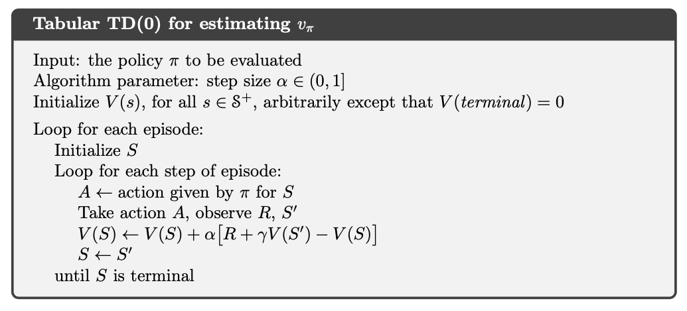
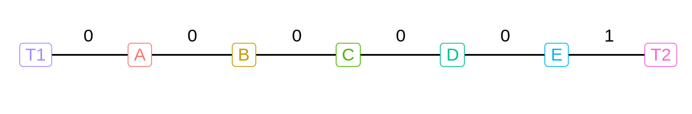

# Temporal difference methods for prediction {#mod-td-pred}

One of the most fundamental concepts in reinforcement learning is temporal difference (TD) learning. TD learning is a combination of Monte Carlo (MC) and dynamic programming (DP) ideas: Like MC, TD can predict using a model-free environment and learn from experience. Like DP, TD update estimates based on other learned estimates, without waiting for a final outcome (bootstrap). That is, TD can learn on-line and do not need to wait until the whole sample-path is found. TD is in general learn more efficiently than MC due to bootstrapping. In this module prediction using TD is considered. 


## Learning outcomes 

By the end of this module, you are expected to:

* Describe what Temporal Difference (TD) learning is.
* Formulate the incremental update formula for TD learning.
* Define the temporal-difference error.
* Interpret the role of a fixed step-size.
* Identify key advantages of TD methods over DP and MC methods.
* Explain the TD(0) prediction algorithm.
* Understand the benefits of learning online with TD compared to MC methods.

The learning outcomes relate to the [overall learning goals](#mod-lg-course) number 3, 4, 6, 9, and 12 of the course.

<!-- SOLO increasing: identify · memorise · name · do simple procedure · collect data · -->
<!-- enumerate · describe · interpret · formulate · list · paraphrase · combine · do -->
<!-- algorithms · compare · contrast · explain causes · analyse · relate · derive · -->
<!-- evaluate · apply · argue · theorise · generalise · hypothesise · solve · reflect -->


## Textbook readings

For this week, you will need to read Chapter 6-6.3 in @Sutton18. Read it before continuing this module. A summary of the book notation can be seen [here][sutton-notation]. 


```{=html}
<div>
Slides for this module can be seen
<a href="https://bss-osca.github.io/rl/slides/07_td-pred-slides.html" target="_blank">here.</a>
You do not have to look at them before the lecture!
</div>
```

## What is TD learning?

Given a policy $\pi$, we want to estimate the state-value function. Recall that the state value function is 
\[
v_\pi(s) = \mathbb{E}_\pi[G_t | S_t = s].
\]
where the return is 
\[
G_t = R_{t+1} + \gamma R_{t+2} + \gamma^2 R_{t+3} + \cdots = \sum_{k=0}^{\infty} \gamma^k R_{t+k+1} = R_{t+1} + \gamma G_{t+1}
\]

Let $V$ denote the state-value estimate. Under MC prediction we used an incremental update formula:
$$
  V(S_t) \leftarrow V(S_t) + \alpha_n\left[G_t - V(S_t)\right],
$$
where $n$ denote the number of observations and $\alpha_n$ the step-size. Different values of $\alpha_n$ was discussed in Module \@ref(mod-mc). Here we assumed a stationary environment (state set, transition probabilities etc. is the same for each stage $t$) e.g. for the sample average $\alpha_n = 1/n$. If the environment is non-stationary (e.g. transition probabilities change over time) then a fixed step-size may be appropriate. Let us for the remaining of this module consider a non-stationary process with fixed step-size:
$$
  V(S_t) \leftarrow V(S_t) + \alpha\left[G_t - V(S_t)\right],
$$

Note as pointed out in Section \@ref(sec-bandit-step-size), a fixed step-size corresponds to a weighted average of the past observed returns and the initial estimate of $S_t$:
$$
\begin{align}
V_{n+1} &= V_n +\alpha \left[G_n - V_n\right] \nonumber \\
&= \alpha G_n + (1 - \alpha)V_n \nonumber \\
&= \alpha G_n + (1 - \alpha)[\alpha G_{n-1} + (1 - \alpha)V_{n-1}] \nonumber \\
&= \alpha G_n + (1 - \alpha)\alpha G_{n-1} + (1 - \alpha)^2 V_{n-1}  \nonumber \\
& \vdots \nonumber \\
&= (1-\alpha)^n V_1 + \sum_{i=1}^{n} \alpha (1 - \alpha)^{n-i} G_i \\
\end{align}
$$
That is, a larger weight is used for recent observations compared to old observations. 

For MC prediction we needed the sample path to get the realized return $G_t$. However, since 
$$
\begin{align}
v_\pi(s) &= \mathbb{E}_\pi[G_t | S_t = s] \\
         &= \mathbb{E}_\pi[R_{t+1} + \gamma G_{t+1} | S_t = s] \\
         &= \mathbb{E}_\pi[R_{t+1}| S_t = s] + \gamma \mathbb{E}_\pi[G_{t+1} | S_t = s] \\
         &= \mathbb{E}_\pi[R_{t+1}| S_t = s] + \gamma v_\pi(S_{t+1}),
\end{align}
$$ 
then, given a realized reward $R_{t+1}$, an estimate for the return $G_t$ is $R_{t+1} + \gamma V(S_{t+1})$ and the incremental update becomes:
$$
  V(S_t) \leftarrow V(S_t) + \alpha\left[R_{t+1} + \gamma V(S_{t+1}) - V(S_t)\right].
  (\#eq:td0)
$$
As a result, we do not have to generate a whole sample-path (as for MC) for updating the state-value estimate of $s = S_t$ to $V(S_t)$. Instead we only have to wait until the next state is observed and update the estimate of $S_t$ given the estimate of the next state $S_{t+1}$. As the estimate of $S_{t+1}$ improve the estimate of $S_t$ also improve. The incremental update in Eq. \@ref(eq:td0) is called *TD(0)* or one-step TD because it use a one-step lookahead to update the estimate. Note updating the estimates using TD resembles the way we did for DP:
$$
V(s = S_t) \leftarrow \sum_{a \in \mathcal{A}}\pi(a | s)\left( r(s,a) + \gamma\sum_{s' \in \mathcal{S}} p(s' | s, a) V(s')\right) 
$$
Here we updated the value by considering the expectation of all the next states. This was possible since we had a model. Now, by using TD, we do not need a model to estimate the state-value. 

The term 
$$
\delta_t = R_{t+1} + \gamma V(S_{t+1}) - V(S_t),
$$
is denoted the *temporal difference error* (*TD error*) since it is the difference between the current estimate $V(S_t)$ and the better estimate $R_{t+1} + \gamma V(S_{t+1})$.


## TD prediction

We can now formulate a TD(0) algorithm for predicting state-values of a policy (see Figure \@ref(fig:td0-pred-alg)). No stopping criterion is given but could stop when small differences in state-values are observed. 

<div class="figure" style="text-align: center">

<p class="caption">(\#fig:td0-pred-alg)TD(0) policy prediction [@Sutton18].</p>
</div>

The algorithm is given for a process with episodes; however, also works for continuing processes. In this case the inner loop runs over an infinite number of time-steps.

### TD prediction for action-values

Later we will use TD to for improving the policy (control). Since we do not have a model we need to estimate action-values instead and the optimal policy can be found using $q_*$ (see Eq. \@ref(eq:bell-opt-state-policy)). To find $q_*$, we first need to predict action-values for a policy $\pi$ and the incremental update Eq. \@ref(eq:td0) must be modified to use $Q$ values: 
$$
  Q(S_t, A_t) \leftarrow Q(S_t, A_t) + \alpha\left[R_{t+1} + \gamma Q(S_{t+1}, A_t) - Q(S_t, A_t)\right].
$$

Note given a policy $\pi$ you need to know $S_t, A_t, R_{t+1}, S_{t+1}, A_{t+1}$ or short SARSA before you can make an update. This acronym is used to name the SARSA algorithm for control in Module \@ref(mod-td-control). Note to ensure exploration of all action-values we need e.g. an $\epsilon$-soft behavioural policy.  


## Benefits of TD methods

Let us try to summarize the benefits of TD prediction

* TD methods do not require a model of the environment (compared to DP).
* TD methods can be implemented online, which can speed convergence (compared to MC methods which must wait until the end of the sample-path).
* TD methods learn from all actions, whereas MC methods require the sample-path to have a tail equal to the target policy. 
* TD methods do converge on the value function with a sufficiently small step-size parameter, or with a decreasing step-size.
* TD methods generally converge faster than MC methods, although this has not been formally proven.
* TD methods are extremely useful for continuing tasks that cannot be broken down into episodes as required by MC methods.
* TD can be seen as a method for *prediction learning* where you try to predict what happens next given you current action, get new information and make a new prediction. That is, you do not need a training set (as in supervised learning) instead the reward signal is observed as time goes by. 
* TD methods are good for sequential decision problems (multi-step prediction).
* TD methods are scalable in the sense that computations do not grow exponentially with the problem size.       

An example illustrating that TD methods converge faster than MC methods is given in Exercise \@ref(ex-td-pred-random)


<!-- ## Summary  -->

<!-- Read Chapter 5.10 in @Sutton18. -->


## Exercises

Below you will find a set of exercises. Always have a look at the exercises before you meet in your study group and try to solve them yourself. Are you stuck, see the [help page](#help). Sometimes solutions can be seen by pressing the button besides a question. Beware, you will not learn by giving up too early. Put some effort into finding a solution!

### Exercise - A randow walk {#ex-td-pred-random}

Consider a MDP with states A-E and two terminal states. Possible transitions are given in Figure \@ref(fig:rw-trans). All episodes start in the centre state, C, then proceed either left or right by one state on each step. We assume the stochastic policy $\pi$ is used where each direction has equal probability. Episodes terminate either on the left (T1) or the right (T2). When an episode terminates on the right, reward of 1 occurs; all other rewards are zero. If the discount factor equals 1, the state-value of each state is the probability of terminating on the right if starting from that state. 

<div class="figure" style="text-align: center">

<p class="caption">(\#fig:rw-trans)Possible transitions between states and rewards.</p>
</div>


<!-- Q1 -->


<div class="modal fade bs-example-modal-lg" id="xs6k6tw7gSvuh25RngXV" tabindex="-1" role="dialog" aria-labelledby="xs6k6tw7gSvuh25RngXV-title"><div class="modal-dialog modal-lg" role="document"><div class="modal-content"><div class="modal-header"><button type="button" class="close" data-dismiss="modal" aria-label="Close"><span aria-hidden="true">&times;</span></button><h4 class="modal-title" id="xs6k6tw7gSvuh25RngXV-title">Solution</h4></div><div class="modal-body">

<p>The state space is \(\mathcal{S} = \{ T1, A, \ldots, E, T2 \}\) with \(\mathcal{A}(s) = \{ \text{left}, \text{right}\}\) (transition to the neighbour states) except for terminating states which have no actions (see Figure \@ref(fig:rw-trans)). Rewards are deterministic \(\mathcal{R} = \{0, 1\}\) (see Figure \@ref(fig:rw-trans)) which also holds for the transition probabilities. The state-value can be found using the Bellman equations \@ref(eq:bm-pol-eval) \[v_\pi(s) = \sum_{a \in \mathcal{A}}\pi(a | s)\left( r(s,a) + \gamma\sum_{s' \in \mathcal{S}} p(s' | s, a) v_\pi(s')\right),\] which becomes \[\begin{align}v_\pi(A) &= 0.5v_\pi(T1) + 0.5v_\pi(B) = 0.5v_\pi(B) \\ v_\pi(B) &= 0.5v_\pi(A) + 0.5v_\pi( C ) \\ v_\pi( C ) &= 0.5v_\pi(B) + 0.5v_\pi(D) \\ v_\pi(D) &= 0.5v_\pi( C ) + 0.5v_\pi(E) \\ v_\pi(E) &= 0.5v_\pi(D) + 0.5(1 + v_\pi(T2)) = 0.5v_\pi(D) + 0.5\\ \end{align}\] Solving the equations with a state-value equal to 0 (you may also use that by symmetry \(v_\pi(C ) = 0.5\)) for the terminating states gives state-values \(\frac{1}{6}, \frac{2}{6}, \frac{3}{6}, \frac{4}{6}\) and \(\frac{5}{6}\) for A-E, respectively.</p>

</div><div class="modal-footer"><button class="btn btn-default" data-dismiss="modal">Close</button></div></div></div></div><button class="btn btn-default btn-xs" style="float:right" data-toggle="modal" data-target="#xs6k6tw7gSvuh25RngXV">Solution</button>

1) Formulate the MDP model and calculate the state-value $v_\pi$ for each state using the Bellman equations \@ref(eq:bm-pol-eval).

2) Consider an episode with sequence $C, 0, B, 0, C, 0, D, 0, E, 1$. Let the initial state-value estimates be 0.5 and update the state-values using TD(0) with $\alpha = 0.1$. It appears that only $V(A)$ change. What does this tell you about what happened on the first episode? Why was only the estimate for this one state changed? By exactly how much was it changed?

3) Generate 100 episodes and run the TD(0) prediction algorithm with $\alpha = 0.1$ (see Figure \@ref(fig:td0-pred-alg)). Make a plot of the state-value estimate (y-axis) given state A-E (x-axis) for TD(0) running for 1, 10 and 100 episodes. You may use the code below as a starting point.


```r
set.seed(875)
```


4) Run an MC prediction algorithm with $\alpha = 0.1$ (see Figure \@ref(fig:mc-prediction-alg) running for 1, 10 and 100 episodes.

5) The results are dependent on the value of the step-size parameter. Try estimating the state-values using TD(0) and MC for $\alpha = 0.2, 0.1, 0.05$ and 0.025. Plot the root mean square (RMS) error $$\sqrt{\frac{1}{5}\sum_{s=A}^E(V(s)-v_\pi(s))^2}$$ (y-axis) given the number of episodes (x-axis).Do you think the conclusions about that TD(0) is better than MC is affected by different  values? 

6) In the right graph of the random walk example, the RMS error of the TD method seems to go down and then up again, particularly at high $\alpha$’s. What could have caused this? Do you think this always occurs, or might it be a function of how the approximate value function was initialized?

<!-- Smaller alpha gives more weight to old obs which is good here since stationary process (sample average is better) -->


### Exercise - Off-policy TD {#ex-td-pred-off-policy}

Design an off-policy version of the TD(0) update that can be used with arbitrary target policy $\pi$ and covering behaviour policy b, using at each step t the importance sampling ratio $\rho_{t:t}.


[BSS]: https://bss.au.dk/en/
[bi-programme]: https://kandidat.au.dk/en/businessintelligence/

[course-help]: https://github.com/bss-osca/rl/issues
[cran]: https://cloud.r-project.org
[cheatsheet-readr]: https://rawgit.com/rstudio/cheatsheets/master/data-import.pdf
[course-welcome-to-the-tidyverse]: https://github.com/rstudio-education/welcome-to-the-tidyverse

[DataCamp]: https://www.datacamp.com/
[datacamp-signup]: https://www.datacamp.com/groups/shared_links/cbaee6c73e7d78549a9e32a900793b2d5491ace1824efc1760a6729735948215
[datacamp-r-intro]: https://learn.datacamp.com/courses/free-introduction-to-r
[datacamp-r-rmarkdown]: https://campus.datacamp.com/courses/reporting-with-rmarkdown
[datacamp-r-communicating]: https://learn.datacamp.com/courses/communicating-with-data-in-the-tidyverse
[datacamp-r-communicating-chap3]: https://campus.datacamp.com/courses/communicating-with-data-in-the-tidyverse/introduction-to-rmarkdown
[datacamp-r-communicating-chap4]: https://campus.datacamp.com/courses/communicating-with-data-in-the-tidyverse/customizing-your-rmarkdown-report
[datacamp-r-intermediate]: https://learn.datacamp.com/courses/intermediate-r
[datacamp-r-intermediate-chap1]: https://campus.datacamp.com/courses/intermediate-r/chapter-1-conditionals-and-control-flow
[datacamp-r-intermediate-chap2]: https://campus.datacamp.com/courses/intermediate-r/chapter-2-loops
[datacamp-r-intermediate-chap3]: https://campus.datacamp.com/courses/intermediate-r/chapter-3-functions
[datacamp-r-intermediate-chap4]: https://campus.datacamp.com/courses/intermediate-r/chapter-4-the-apply-family
[datacamp-r-functions]: https://learn.datacamp.com/courses/introduction-to-writing-functions-in-r
[datacamp-r-tidyverse]: https://learn.datacamp.com/courses/introduction-to-the-tidyverse
[datacamp-r-strings]: https://learn.datacamp.com/courses/string-manipulation-with-stringr-in-r
[datacamp-r-dplyr]: https://learn.datacamp.com/courses/data-manipulation-with-dplyr
[datacamp-r-dplyr-bakeoff]: https://learn.datacamp.com/courses/working-with-data-in-the-tidyverse
[datacamp-r-ggplot2-intro]: https://learn.datacamp.com/courses/introduction-to-data-visualization-with-ggplot2
[datacamp-r-ggplot2-intermediate]: https://learn.datacamp.com/courses/intermediate-data-visualization-with-ggplot2
[dplyr-cran]: https://CRAN.R-project.org/package=dplyr
[debug-in-r]: https://rstats.wtf/debugging-r-code.html

[google-form]: https://forms.gle/s39GeDGV9AzAXUo18
[google-grupper]: https://docs.google.com/spreadsheets/d/1DHxthd5AQywAU4Crb3hM9rnog2GqGQYZ2o175SQgn_0/edit?usp=sharing
[GitHub]: https://github.com/
[git-install]: https://git-scm.com/downloads
[github-actions]: https://github.com/features/actions
[github-pages]: https://pages.github.com/
[gh-rl-student]: https://github.com/bss-osca/rl-student
[gh-rl]: https://github.com/bss-osca/rl

[happy-git]: https://happygitwithr.com
[hg-install-git]: https://happygitwithr.com/install-git.html
[hg-why]: https://happygitwithr.com/big-picture.html#big-picture
[hg-github-reg]: https://happygitwithr.com/github-acct.html#github-acct
[hg-git-install]: https://happygitwithr.com/install-git.html#install-git
[hg-exist-github-first]: https://happygitwithr.com/existing-github-first.html
[hg-exist-github-last]: https://happygitwithr.com/existing-github-last.html
[hg-credential-helper]: https://happygitwithr.com/credential-caching.html
[hypothes.is]: https://web.hypothes.is/

[osca-programme]: https://kandidat.au.dk/en/operationsandsupplychainanalytics/

[Peergrade]: https://peergrade.io
[peergrade-signup]: https://app.peergrade.io/join
[point-and-click]: https://en.wikipedia.org/wiki/Point_and_click
[pkg-bookdown]: https://bookdown.org/yihui/bookdown/
[pkg-openxlsx]: https://ycphs.github.io/openxlsx/index.html
[pkg-ropensci-writexl]: https://docs.ropensci.org/writexl/
[pkg-jsonlite]: https://cran.r-project.org/web/packages/jsonlite/index.html

[R]: https://www.r-project.org
[RStudio]: https://rstudio.com
[rstudio-cloud]: https://rstudio.cloud/spaces/176810/join?access_code=LSGnG2EXTuzSyeYaNXJE77vP33DZUoeMbC0xhfCz
[r-cloud-mod12]: https://rstudio.cloud/spaces/176810/project/2963819
[r-cloud-mod13]: https://rstudio.cloud/spaces/176810/project/3020139
[r-cloud-mod14]: https://rstudio.cloud/spaces/176810/project/3020322
[r-cloud-mod15]: https://rstudio.cloud/spaces/176810/project/3020509
[r-cloud-mod16]: https://rstudio.cloud/spaces/176810/project/3026754
[r-cloud-mod17]: https://rstudio.cloud/spaces/176810/project/3034015
[r-cloud-mod18]: https://rstudio.cloud/spaces/176810/project/3130795
[r-cloud-mod19]: https://rstudio.cloud/spaces/176810/project/3266132
[rstudio-download]: https://rstudio.com/products/rstudio/download/#download
[rstudio-customizing]: https://support.rstudio.com/hc/en-us/articles/200549016-Customizing-RStudio
[rstudio-key-shortcuts]: https://support.rstudio.com/hc/en-us/articles/200711853-Keyboard-Shortcuts
[rstudio-workbench]: https://www.rstudio.com/wp-content/uploads/2014/04/rstudio-workbench.png
[r-markdown]: https://rmarkdown.rstudio.com/
[ropensci-writexl]: https://docs.ropensci.org/writexl/
[r4ds-pipes]: https://r4ds.had.co.nz/pipes.html
[r4ds-factors]: https://r4ds.had.co.nz/factors.html
[r4ds-strings]: https://r4ds.had.co.nz/strings.html
[r4ds-iteration]: https://r4ds.had.co.nz/iteration.html


[stat-545]: https://stat545.com
[stat-545-functions-part1]: https://stat545.com/functions-part1.html
[stat-545-functions-part2]: https://stat545.com/functions-part2.html
[stat-545-functions-part3]: https://stat545.com/functions-part3.html
[slides-welcome]: https://bss-osca.github.io/rl/slides/00-rl_welcome.html
[slides-m1-3]: https://bss-osca.github.io/rl/slides/01-welcome_r_part.html
[slides-m4-5]: https://bss-osca.github.io/rl/slides/02-programming.html
[slides-m6-8]: https://bss-osca.github.io/rl/slides/03-transform.html
[slides-m9]: https://bss-osca.github.io/rl/slides/04-plot.html
[slides-m83]: https://bss-osca.github.io/rl/slides/05-joins.html
[sutton-notation]: https://bss-osca.github.io/rl/sutton-notation.pdf

[tidyverse-main-page]: https://www.tidyverse.org
[tidyverse-packages]: https://www.tidyverse.org/packages/
[tidyverse-core]: https://www.tidyverse.org/packages/#core-tidyverse
[tidyverse-ggplot2]: https://ggplot2.tidyverse.org/
[tidyverse-dplyr]: https://dplyr.tidyverse.org/
[tidyverse-tidyr]: https://tidyr.tidyverse.org/
[tidyverse-readr]: https://readr.tidyverse.org/
[tidyverse-purrr]: https://purrr.tidyverse.org/
[tidyverse-tibble]: https://tibble.tidyverse.org/
[tidyverse-stringr]: https://stringr.tidyverse.org/
[tidyverse-forcats]: https://forcats.tidyverse.org/
[tidyverse-readxl]: https://readxl.tidyverse.org
[tidyverse-googlesheets4]: https://googlesheets4.tidyverse.org/index.html
[tutorial-markdown]: https://commonmark.org/help/tutorial/
[tfa-course]: https://bss-osca.github.io/tfa/

[Udemy]: https://www.udemy.com/

[vba-yt-course1]: https://www.youtube.com/playlist?list=PLpOAvcoMay5S_hb2D7iKznLqJ8QG_pde0
[vba-course1-hello]: https://youtu.be/f42OniDWaIo

[vba-yt-course2]: https://www.youtube.com/playlist?list=PL3A6U40JUYCi4njVx59-vaUxYkG0yRO4m
[vba-course2-devel-tab]: https://youtu.be/awEOUaw9q58
[vba-course2-devel-editor]: https://youtu.be/awEOUaw9q58
[vba-course2-devel-project]: https://youtu.be/fp6PTbU7bXo
[vba-course2-devel-properties]: https://youtu.be/ks2QYKAd9Xw
[vba-course2-devel-hello]: https://youtu.be/EQ6tDWBc8G4

[video-install]: https://vimeo.com/415501284
[video-rstudio-intro]: https://vimeo.com/416391353
[video-packages]: https://vimeo.com/416743698
[video-projects]: https://vimeo.com/319318233
[video-r-intro-p1]: https://www.youtube.com/watch?v=vGY5i_J2c-c
[video-r-intro-p2]: https://www.youtube.com/watch?v=w8_XdYI3reU
[video-r-intro-p3]: https://www.youtube.com/watch?v=NuY6jY4qE7I
[video-subsetting]: https://www.youtube.com/watch?v=hWbgqzsQJF0&list=PLjTlxb-wKvXPqyY3FZDO8GqIaWuEDy-Od&index=10&t=0s
[video-datatypes]: https://www.youtube.com/watch?v=5AQM-yUX9zg&list=PLjTlxb-wKvXPqyY3FZDO8GqIaWuEDy-Od&index=10
[video-control-structures]: https://www.youtube.com/watch?v=s_h9ruNwI_0
[video-conditional-loops]: https://www.youtube.com/watch?v=2evtsnPaoDg
[video-functions]: https://www.youtube.com/watch?v=ffPeac3BigM
[video-tibble-vs-df]: https://www.youtube.com/watch?v=EBk6PnvE1R4
[video-dplyr]: https://www.youtube.com/watch?v=aywFompr1F4

[wiki-snake-case]: https://en.wikipedia.org/wiki/Snake_case
[wiki-camel-case]: https://en.wikipedia.org/wiki/Camel_case
[wiki-interpreted]: https://en.wikipedia.org/wiki/Interpreted_language
[wiki-literate-programming]: https://en.wikipedia.org/wiki/Literate_programming
[wiki-csv]: https://en.wikipedia.org/wiki/Comma-separated_values
[wiki-json]: https://en.wikipedia.org/wiki/JSON
