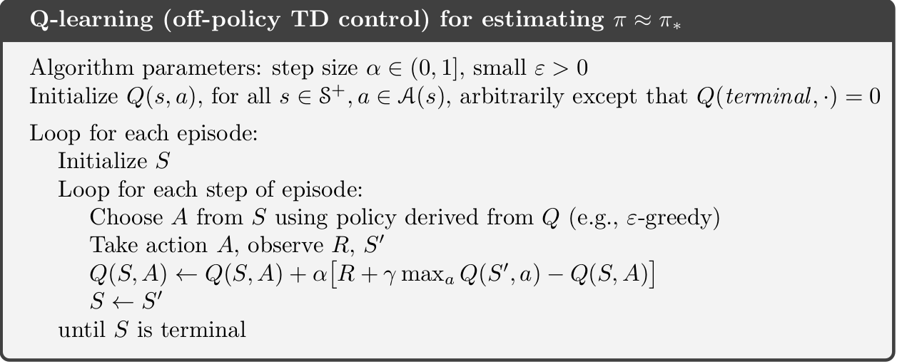

# Temporal difference methods for control {#mod-td-control}

In Module \@ref(mod-td-pred) temporal difference (TD) was used to estimate state-values. In this module we focus on improving the policy (control) by applying generalized policy iteration (GPI) using TD methods. GPI repeatedly apply policy evaluation and policy improvement. Since we do not have a model (the transition probability matrix and reward distribution are known) all our action-values are estimates. Hence an element of exploration are needed to estimate the action-values. For convergence to the optimal policy a model-free GPI algorithm must satisfy:

1. *Infinite exploration*: all state-action $(s,a)$ pairs should be explored infinitely many times as the number of iterations go to infinity (in the limit), i.e. as the number of iterations $k$ goes to infinity the number of visits $n_k$ does too $$\lim_{k\rightarrow\infty} n_k(s, a) = \infty.$$
2. *Greedy in the limit*: while we maintain infinite exploration, we do eventually need to converge to the optimal policy:
  $$\lim_{k\rightarrow\infty} \pi_k(a|s) = 1 \text{ for } a = \arg\max_a q(s, a).$$

## Learning outcomes 

By the end of this module, you are expected to:

* Describe how generalized policy iteration (GPI) can be used with TD to find improved policies.
* Identify the properties that must the satisfied for GPI to converge to the optimal policy.
* Derive and explain SARSA an on-policy GPI algorithm using TD.
* Describe the relationship between SARSA and the Bellman equations.
* Derive and explain Q-learning an off-policy GPI algorithm using TD.
* Argue how Q-learning can be off-policy without using importance sampling.
* Describe the relationship between Q-learning and the Bellman optimality equations.
* Derive and explain expected SARSA an on/off-policy GPI algorithm using TD.
* Describe the relationship between expected SARSA and the Bellman equations.
*  Explain how expected SARSA generalizes Q-learning.
* List the differences between Q-learning, SARSA and expected SARSA.
* Apply the algorithms to an MDP to find the optimal policy.

The learning outcomes relate to the [overall learning goals](#mod-lg-course) number 3, 4, 6, 9, and 12 of the course.

<!-- SOLO increasing: identify · memorise · name · do simple procedure · collect data · -->
<!-- enumerate · describe · interpret · formulate · list · paraphrase · combine · do -->
<!-- algorithms · compare · contrast · explain causes · analyse · relate · derive · -->
<!-- evaluate · apply · argue · theorise · generalise · hypothesise · solve · reflect -->


## Textbook readings

For this week, you will need to read Chapter 6.4-6.6 in @Sutton18. Read it before continuing this module. A summary of the book notation can be seen [here](sutton-notation).


```{=html}
<div>
Slides for this module can be seen
<a href="https://bss-osca.github.io/rl/slides/08_td-control-slides.html" target="_blank">here.</a>
You do not have to look at them before the lecture!
</div>
```

## SARSA - On-policy GPI using TD

The first GPI algorithm we will consider is SARSA. Since we do not have a model we need to estimate action-values so the optimal policy can be found using $q_*$ (see Eq. \@ref(eq:bell-opt-state-policy)). Hence to predict action-values for a policy $\pi$, the incremental update Eq. \@ref(eq:td0) must be modified to use $Q$ values: 
$$
Q(S_t, A_t) \leftarrow Q(S_t, A_t) + \alpha \left[R_{t+1} + \gamma Q(S_{t+1}, A_{t+1}) - Q(S_t, A_t) \right]
$$
Note given a policy $\pi$ you need to know $S_t, A_t, R_{t+1}, S_{t+1}, A_{t+1}$ or short SARSA before you can make an update. This acronym is used to name the algorithm.

The algorithm is given in Figure \@ref(fig:td-sarsa-alg). To ensure infinite exploration of all action-values, we need e.g. an $\epsilon$-greedy policy. The algorithm can also be applied for processes with continuing tasks. To ensure greedy in the limit a decreasing epsilon can be used (e.g. $\epsilon = 1/t$). No stopping criterion is given but could stop when small differences in action-values are observed. 

<div class="figure" style="text-align: center">

<p class="caption">(\#fig:td-sarsa-alg)SARSA - On-policy GPI using TD [@Sutton18].</p>
</div>

SARSA is a sample based algorithm that do updates based on the Bellman equation for action-values ($q$):
$$
\begin{align}
  q_\pi(s, a) &= \mathbb{E}_\pi[G_t | S_t = s, A_t = a] \\
  &= \mathbb{E}_\pi[R_{t+1} + \gamma G_{t+1} | S_t = s, A_t = a] \\
  &= \sum_{s',r} p(s', r | s, a) \left(r + \gamma v_\pi(s')\right) \\
  &= \sum_{s',r} p(s', r | s, a) \left(r + \gamma \sum_{a'} \pi(a'|s) q_\pi(s', a')\right).
\end{align}
$$
That is, we update the estimate based on samples $r$ and the estimate $q_\pi$ in $s'$. This is the same approach as policy iteration in DP: we first calculate new estimates of $q_\pi$ given the current policy $\pi$ and then improve. Hence SARSA is a sample based version of policy iteration in DP.


## Q-learning - Off-policy GPI using TD

Q-learning resembles SARSA; however there are some differences. The algorithm is given in Figure \@ref(fig:td-q-learning-alg). Note the incremental update equation is now: 
\begin{equation}
Q(S_t, A_t) \leftarrow Q(S_t, A_t) + \alpha \left[R_{t+1} + \gamma \max_{a} Q(S_{t+1}, a) - Q(S_t, A_t) \right]
\end{equation}
That is, the next action used to update $Q$ is selected greedy. That is, we are no longer following an $\epsilon$-greedy policy for our updates. 

<div class="figure" style="text-align: center">

<p class="caption">(\#fig:td-q-learning-alg)Q-learning - Off-policy GPI using TD [@Sutton18].</p>
</div>

SARSA is an on-policy algorithm, meaning that the behavioural and target policy is the same, e.g. an $\epsilon$-greedy policy to ensure exploration. That is, for fixed $\epsilon$ the greedy in the limit assumption is not fulfilled. Q-learning, on the other hand, is an off-policy algorithm where the behavioural policy is an $\epsilon$-greedy and the target policy is the (deterministic) greedy policy. That is, Q-learning fulfil both the 'infinite exploration' and 'greedy in the limit' assumptions. 

Note under MC prediction an off-policy algorithm needed to use importance sampling to estimate the action-value of the target policy (see Section \@ref(sec-mc-off-policy)). This is not necessary for one-step TD, since 
$$
\begin{align}
q_\pi(s,a) &= \mathbb{E}_{\pi}[R_t + \gamma G_{t+1}|S_t = s, A_t = a] \\
           &= \sum_{s',r} p(s', r | s, a) \left(r + \gamma \sum_{a'} \pi(a'|s) q_\pi(s', a')\right) \\
           &= \sum_{s',r} p(s', r | s, a) \left(r + \gamma \max_{a'} q_\pi(s', a')\right) \\
\end{align}
(\#eq:bellman-q)
$$ 

That is, because the target policy is greedy and deterministic expectation the $G_{t+1}$ becomes a maximum. Hence we can update the action-value estimates $Q$ for the target policy $\pi$ even though we sample from an $\epsilon$-greedy behavioural policy.

Q-learning is a sample based algorithm that do updates based on the Bellman optimality equation for action-values ($q_*$):
$$
\begin{align}
  q_*(s, a) &= \max_\pi q_\pi(s, a) \\
  &= \max_\pi \sum_{s',r} p(s', r | s, a) \left(r + \gamma v_\pi(s')\right) \\
  &= \sum_{s',r} p(s', r | s, a) \left(r + \gamma \max_\pi v_\pi(s')\right) \\
  &= \sum_{s',r} p(s', r | s, a) \left(r + \gamma \max_{a'} q_*(s', a')\right) 
\end{align}
$$
That is, we update the estimate based on samples $r$ and the estimate $q_*$ in $s'$. This is the same approach as value iteration in DP: we update the estimates of $q_\pi$ and improve the policy in one operation. Hence Q-learning is a sample based version of value iteration in DP.


## Expected SARSA - GPI using TD

The expected SARSA, as SARSA, focus on the Bellman equation \@ref(eq:bellman-q). SARSA generate action $A_{t+1}$ from the policy $\pi$ and use the estimated action-value of $(S_{t+1},A_{t+1})$. However, since we know the current policy $\pi$, we might update based on the expected value instead:
$$
Q(S_t, A_t) \leftarrow Q(S_t, A_t) + \alpha \left[R_{t+1} + \gamma \sum_{a} \pi(a | S_{t+1}) Q(S_{t+1}, a) - Q(S_t, A_t) \right] \\
$$
That is, we use a better estimate of the Bellman equation \@ref(eq:bellman-q) by not sampling $A_{t+1}$ but using the (deterministic) expectation over all actions instead. Doing so reduces the variance induced by selecting random actions according to an $\epsilon$-greedy policy. As a result, given the same amount of experiences, expected SARSA generally performs better than SARSA, but has a higher computational cost.

Expected SARSA is more robust to different step-size values. The incremental update formula can be written as
$$
Q(S_t, A_t) \leftarrow Q(S_t, A_t) + \alpha \left[T_t - Q(S_t, A_t) \right] = (1-\alpha)Q(S_t, A_t) + \alpha T_t,
$$
with step-size $\alpha$ and target $T_t$. For SARSA the target is
$$T_t = R_{t+1} + \gamma Q(S_{t+1}, A_{t+1}),$$
and for expected SARSA the target is: $$T_t = R_{t+1} + \gamma \sum_{a} \pi(a | S_{t+1}) Q(S_{t+1}, a).$$ Now assume that we have run the algorithm over many time-steps so that our estimates $Q(S_t, A_t)$ are close to $q_*(S_t, A_t)$. Since the target in expected SARSA is deterministic (we do not sample $A_{t+1}$), the target $T_t \approx Q(S_t, A_t)$ and no matter the step-size $Q(S_t, A_t)$ will be updated to the same value. On the other hand, the target in SARSA uses a sample action $A_{t+1}$ that might have an action-value far from the expectation. This implies that for large step-sizes $Q(S_t, A_t)$ will be updated to the target which is wrong. Hence SARSA is more sensitive to large step-sizes.

Expected SARSA can be both on-policy and off-policy. If the behavioural policy and the target policy are different it is off-policy. If they are the same it is on-policy. For instance, expected SARSA is off-policy if the target policy is greedy and the behavioural policy $\epsilon$-greedy. In which case expected SARSA becomes Q-learning since the expectation of a greedy policy is the maximum value ($\pi(s|a) = 1$ here). Hence expected SARSA can be seen as a generalisation of Q-learning that improves SARSA.


<!-- ## Maximization bias and double learning   -->

<!-- Many control algorithms use a maximisation operator to select actions (either $\epsilon$-greedy or greedy action selection). Hence we implicitly favour positive numbers. If the values of $q_\pi(s,a)$ are near zero and estimates $Q$ have values distributed around zero (both negative and positive) then the maximisation operator will select the positive estimates, despite the true value being near zero. This bias is a so-called \textit{maximisation bias}. -->

<!-- If you consider a RL problem where $q_*(s,a)$ may be near zero then \emph{double learning} may be used in which we learn two independent sets of value estimates $Q_1$ and $Q_2$, then at each time step we choose one of them at random and update it using the other as a target. This produces two unbiased estimates of the action-values (which could be averaged). Below we show an algorithm for \emph{double Q-learning}.  -->


## Summary 

Read Chapter 6.9 in @Sutton18.


## Exercises

Below you will find a set of exercises. Always have a look at the exercises before you meet in your study group and try to solve them yourself. Are you stuck, see the [help page](#help). Sometimes solutions can be seen by pressing the button besides a question. Beware, you will not learn by giving up too early. Put some effort into finding a solution!

<!-- An inventory problem that compares the algorithms -->


[BSS]: https://bss.au.dk/en/
[bi-programme]: https://kandidat.au.dk/en/businessintelligence/

[course-help]: https://github.com/bss-osca/rl/issues
[cran]: https://cloud.r-project.org
[cheatsheet-readr]: https://rawgit.com/rstudio/cheatsheets/master/data-import.pdf
[course-welcome-to-the-tidyverse]: https://github.com/rstudio-education/welcome-to-the-tidyverse

[DataCamp]: https://www.datacamp.com/
[datacamp-signup]: https://www.datacamp.com/groups/shared_links/cbaee6c73e7d78549a9e32a900793b2d5491ace1824efc1760a6729735948215
[datacamp-r-intro]: https://learn.datacamp.com/courses/free-introduction-to-r
[datacamp-r-rmarkdown]: https://campus.datacamp.com/courses/reporting-with-rmarkdown
[datacamp-r-communicating]: https://learn.datacamp.com/courses/communicating-with-data-in-the-tidyverse
[datacamp-r-communicating-chap3]: https://campus.datacamp.com/courses/communicating-with-data-in-the-tidyverse/introduction-to-rmarkdown
[datacamp-r-communicating-chap4]: https://campus.datacamp.com/courses/communicating-with-data-in-the-tidyverse/customizing-your-rmarkdown-report
[datacamp-r-intermediate]: https://learn.datacamp.com/courses/intermediate-r
[datacamp-r-intermediate-chap1]: https://campus.datacamp.com/courses/intermediate-r/chapter-1-conditionals-and-control-flow
[datacamp-r-intermediate-chap2]: https://campus.datacamp.com/courses/intermediate-r/chapter-2-loops
[datacamp-r-intermediate-chap3]: https://campus.datacamp.com/courses/intermediate-r/chapter-3-functions
[datacamp-r-intermediate-chap4]: https://campus.datacamp.com/courses/intermediate-r/chapter-4-the-apply-family
[datacamp-r-functions]: https://learn.datacamp.com/courses/introduction-to-writing-functions-in-r
[datacamp-r-tidyverse]: https://learn.datacamp.com/courses/introduction-to-the-tidyverse
[datacamp-r-strings]: https://learn.datacamp.com/courses/string-manipulation-with-stringr-in-r
[datacamp-r-dplyr]: https://learn.datacamp.com/courses/data-manipulation-with-dplyr
[datacamp-r-dplyr-bakeoff]: https://learn.datacamp.com/courses/working-with-data-in-the-tidyverse
[datacamp-r-ggplot2-intro]: https://learn.datacamp.com/courses/introduction-to-data-visualization-with-ggplot2
[datacamp-r-ggplot2-intermediate]: https://learn.datacamp.com/courses/intermediate-data-visualization-with-ggplot2
[dplyr-cran]: https://CRAN.R-project.org/package=dplyr
[debug-in-r]: https://rstats.wtf/debugging-r-code.html

[google-form]: https://forms.gle/s39GeDGV9AzAXUo18
[google-grupper]: https://docs.google.com/spreadsheets/d/1DHxthd5AQywAU4Crb3hM9rnog2GqGQYZ2o175SQgn_0/edit?usp=sharing
[GitHub]: https://github.com/
[git-install]: https://git-scm.com/downloads
[github-actions]: https://github.com/features/actions
[github-pages]: https://pages.github.com/
[gh-rl-student]: https://github.com/bss-osca/rl-student
[gh-rl]: https://github.com/bss-osca/rl

[happy-git]: https://happygitwithr.com
[hg-install-git]: https://happygitwithr.com/install-git.html
[hg-why]: https://happygitwithr.com/big-picture.html#big-picture
[hg-github-reg]: https://happygitwithr.com/github-acct.html#github-acct
[hg-git-install]: https://happygitwithr.com/install-git.html#install-git
[hg-exist-github-first]: https://happygitwithr.com/existing-github-first.html
[hg-exist-github-last]: https://happygitwithr.com/existing-github-last.html
[hg-credential-helper]: https://happygitwithr.com/credential-caching.html
[hypothes.is]: https://web.hypothes.is/

[osca-programme]: https://kandidat.au.dk/en/operationsandsupplychainanalytics/

[Peergrade]: https://peergrade.io
[peergrade-signup]: https://app.peergrade.io/join
[point-and-click]: https://en.wikipedia.org/wiki/Point_and_click
[pkg-bookdown]: https://bookdown.org/yihui/bookdown/
[pkg-openxlsx]: https://ycphs.github.io/openxlsx/index.html
[pkg-ropensci-writexl]: https://docs.ropensci.org/writexl/
[pkg-jsonlite]: https://cran.r-project.org/web/packages/jsonlite/index.html

[R]: https://www.r-project.org
[RStudio]: https://rstudio.com
[rstudio-cloud]: https://rstudio.cloud/spaces/176810/join?access_code=LSGnG2EXTuzSyeYaNXJE77vP33DZUoeMbC0xhfCz
[r-cloud-mod12]: https://rstudio.cloud/spaces/176810/project/2963819
[r-cloud-mod13]: https://rstudio.cloud/spaces/176810/project/3020139
[r-cloud-mod14]: https://rstudio.cloud/spaces/176810/project/3020322
[r-cloud-mod15]: https://rstudio.cloud/spaces/176810/project/3020509
[r-cloud-mod16]: https://rstudio.cloud/spaces/176810/project/3026754
[r-cloud-mod17]: https://rstudio.cloud/spaces/176810/project/3034015
[r-cloud-mod18]: https://rstudio.cloud/spaces/176810/project/3130795
[r-cloud-mod19]: https://rstudio.cloud/spaces/176810/project/3266132
[rstudio-download]: https://rstudio.com/products/rstudio/download/#download
[rstudio-customizing]: https://support.rstudio.com/hc/en-us/articles/200549016-Customizing-RStudio
[rstudio-key-shortcuts]: https://support.rstudio.com/hc/en-us/articles/200711853-Keyboard-Shortcuts
[rstudio-workbench]: https://www.rstudio.com/wp-content/uploads/2014/04/rstudio-workbench.png
[r-markdown]: https://rmarkdown.rstudio.com/
[ropensci-writexl]: https://docs.ropensci.org/writexl/
[r4ds-pipes]: https://r4ds.had.co.nz/pipes.html
[r4ds-factors]: https://r4ds.had.co.nz/factors.html
[r4ds-strings]: https://r4ds.had.co.nz/strings.html
[r4ds-iteration]: https://r4ds.had.co.nz/iteration.html


[stat-545]: https://stat545.com
[stat-545-functions-part1]: https://stat545.com/functions-part1.html
[stat-545-functions-part2]: https://stat545.com/functions-part2.html
[stat-545-functions-part3]: https://stat545.com/functions-part3.html
[slides-welcome]: https://bss-osca.github.io/rl/slides/00-rl_welcome.html
[slides-m1-3]: https://bss-osca.github.io/rl/slides/01-welcome_r_part.html
[slides-m4-5]: https://bss-osca.github.io/rl/slides/02-programming.html
[slides-m6-8]: https://bss-osca.github.io/rl/slides/03-transform.html
[slides-m9]: https://bss-osca.github.io/rl/slides/04-plot.html
[slides-m83]: https://bss-osca.github.io/rl/slides/05-joins.html
[sutton-notation]: https://bss-osca.github.io/rl/sutton-notation.pdf

[tidyverse-main-page]: https://www.tidyverse.org
[tidyverse-packages]: https://www.tidyverse.org/packages/
[tidyverse-core]: https://www.tidyverse.org/packages/#core-tidyverse
[tidyverse-ggplot2]: https://ggplot2.tidyverse.org/
[tidyverse-dplyr]: https://dplyr.tidyverse.org/
[tidyverse-tidyr]: https://tidyr.tidyverse.org/
[tidyverse-readr]: https://readr.tidyverse.org/
[tidyverse-purrr]: https://purrr.tidyverse.org/
[tidyverse-tibble]: https://tibble.tidyverse.org/
[tidyverse-stringr]: https://stringr.tidyverse.org/
[tidyverse-forcats]: https://forcats.tidyverse.org/
[tidyverse-readxl]: https://readxl.tidyverse.org
[tidyverse-googlesheets4]: https://googlesheets4.tidyverse.org/index.html
[tutorial-markdown]: https://commonmark.org/help/tutorial/
[tfa-course]: https://bss-osca.github.io/tfa/

[Udemy]: https://www.udemy.com/

[vba-yt-course1]: https://www.youtube.com/playlist?list=PLpOAvcoMay5S_hb2D7iKznLqJ8QG_pde0
[vba-course1-hello]: https://youtu.be/f42OniDWaIo

[vba-yt-course2]: https://www.youtube.com/playlist?list=PL3A6U40JUYCi4njVx59-vaUxYkG0yRO4m
[vba-course2-devel-tab]: https://youtu.be/awEOUaw9q58
[vba-course2-devel-editor]: https://youtu.be/awEOUaw9q58
[vba-course2-devel-project]: https://youtu.be/fp6PTbU7bXo
[vba-course2-devel-properties]: https://youtu.be/ks2QYKAd9Xw
[vba-course2-devel-hello]: https://youtu.be/EQ6tDWBc8G4

[video-install]: https://vimeo.com/415501284
[video-rstudio-intro]: https://vimeo.com/416391353
[video-packages]: https://vimeo.com/416743698
[video-projects]: https://vimeo.com/319318233
[video-r-intro-p1]: https://www.youtube.com/watch?v=vGY5i_J2c-c
[video-r-intro-p2]: https://www.youtube.com/watch?v=w8_XdYI3reU
[video-r-intro-p3]: https://www.youtube.com/watch?v=NuY6jY4qE7I
[video-subsetting]: https://www.youtube.com/watch?v=hWbgqzsQJF0&list=PLjTlxb-wKvXPqyY3FZDO8GqIaWuEDy-Od&index=10&t=0s
[video-datatypes]: https://www.youtube.com/watch?v=5AQM-yUX9zg&list=PLjTlxb-wKvXPqyY3FZDO8GqIaWuEDy-Od&index=10
[video-control-structures]: https://www.youtube.com/watch?v=s_h9ruNwI_0
[video-conditional-loops]: https://www.youtube.com/watch?v=2evtsnPaoDg
[video-functions]: https://www.youtube.com/watch?v=ffPeac3BigM
[video-tibble-vs-df]: https://www.youtube.com/watch?v=EBk6PnvE1R4
[video-dplyr]: https://www.youtube.com/watch?v=aywFompr1F4

[wiki-snake-case]: https://en.wikipedia.org/wiki/Snake_case
[wiki-camel-case]: https://en.wikipedia.org/wiki/Camel_case
[wiki-interpreted]: https://en.wikipedia.org/wiki/Interpreted_language
[wiki-literate-programming]: https://en.wikipedia.org/wiki/Literate_programming
[wiki-csv]: https://en.wikipedia.org/wiki/Comma-separated_values
[wiki-json]: https://en.wikipedia.org/wiki/JSON
