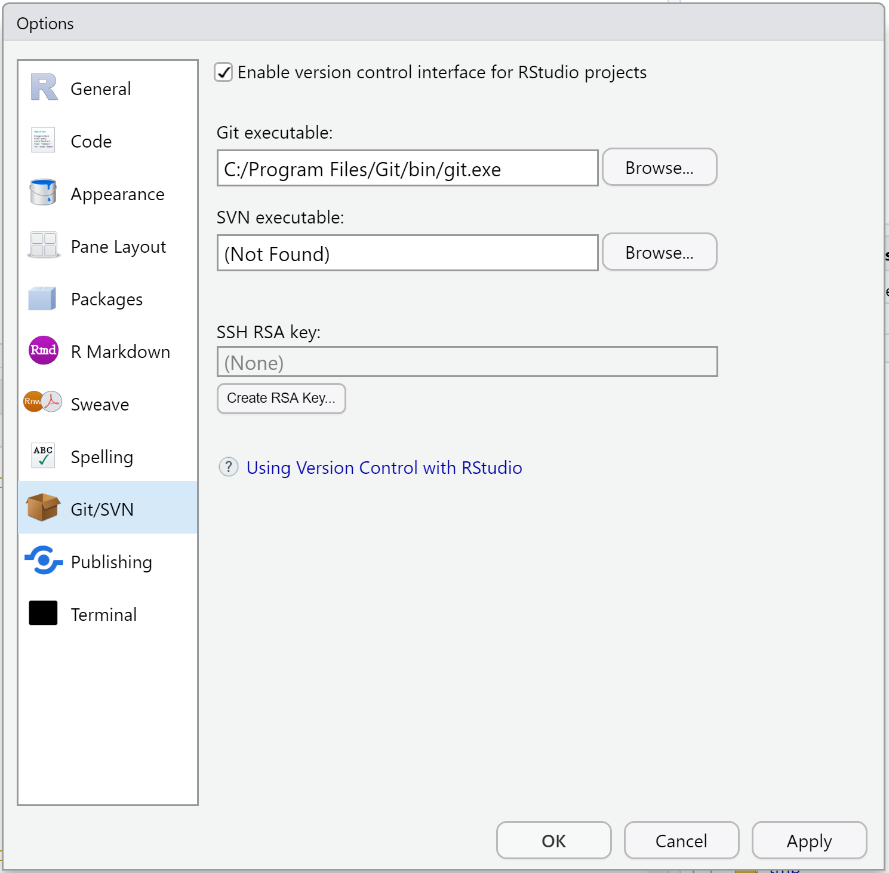

--- 
title: "Reinforcement Learning for Business (RL)"
subtitle: "Course notes"
author: 
- Lars Relund Nielsen
knit: "bookdown::render_book"
site: bookdown::bookdown_site
url: 'https\://bss-osca.github.io/rl/'
github-repo: bss-osca/rl
cover-image: img/logo.png
documentclass: book
bibliography: [book.bib, packages.bib]
biblio-style: apalike
link-citations: yes
description: "Course notes for 'Reinforcement Learning for Business'"
favicon: assets/favicon.ico
date: "`r Sys.Date()`"
editor_options: 
  chunk_output_type: console
---


# Introduction to the book {#mod-intro}

```{r, code = readLines("common.R"), cache = FALSE, include=FALSE}
```


```{r include = FALSE, cache=FALSE}
library(tidyverse)
library(devtools)
library(DT)
library(htmltools)
library(rmarkdown)
library(bsplus)
#tagList(html_dependency_font_awesome())
```


This site/book contains course notes for the course "Reinforcement Learning for Business" held at [Aarhus BSS][BSS]. The book show the learning path for the course modules. The course is an elective course for the [Operations and Supply Chain Analytics][osca-programme] and [Business Intelligence][bi-programme] programme and intended to give you an introduction to Reinforcement Learning (RL). You can expect the book to be updated when the course runs. The date listed above is the last time the book was updated.

__Learning path diagram__

Click/hover the nodes to follow links and see details.

```{r, echo=FALSE, out.width="100%", fig.asp=NA}
# gs4_deauth()
# # bring your own app via client id (aka key) and secret
# google_app <- httr::oauth_app(
#   "tfa",
#   key = "afss",
#   secret = "test"
# )
# google_key <- "YOUR_API_KEY"
# gs4_auth_configure(app = google_app, api_key = google_key)
# 
# # confirm the changes
# gs4_oauth_app()
# gs4_api_key()

g <- create_learning_path(
   url = "https://docs.google.com/spreadsheets/d/1bBe42LHK-bE7CsU9eNBzi_7VNjbmv-Ybr7285pE61jM/edit?usp=sharing", 
   sheet = "intro", 
   x_legend = 4.43, y_legend = 0,
   margin_node = 0.2)
render_graph(g, height = 300)
```

## Learning outcomes {#lo-intro}

By the end of this module, you are expected to:

* Memorize the purpose of the book.
* Describe what the term Business Analytics mean.
* Identify pros and cons of using Excel, VBA and R.
* Describe how a computer works.
* Describe what an algorithm is.
* Know how the book is organized.

The learning outcomes relate to the [overall learning goals](#lg-course) number 1, 3 and 5 of the course.

<!-- SOLO increasing: identify · memorise · name · do simple procedure · collect data · -->
<!-- enumerate · describe · interpret · formulate · list · paraphrase · combine · do -->
<!-- algorithms · compare · contrast · explain causes · analyse · relate · derive · -->
<!-- evaluate · apply · argue · theorise · generalise · hypothesise · solve · reflect -->

## Purpose for the book {#purpose}

Since the amount of available data has increased extensively in many companies, there is a need for analysts with the ability to do tasks within Analytics. For instance, extract relevant data and perform valid quantitative analysis. Clearly, it is also important that the analyst can communicate the results of the analysis to their surroundings. This requires for the analyst to be particularly qualified in handling IT based tools beyond e.g. basic Excel. 

Business Analytics (BA) (or just Analytics) refers to the scientific process of transforming data into insight for making better decisions in business. BA can both be seen as the complete decision making process for solving a business problem and the creation of business value by integration of concepts, methods and data. As a process, it can be characterized by descriptive, predictive, and prescriptive model building using data sources. For a full definition see the [appendix](#sec:ba).

Within a Business Analytics (BA) framework the course focuses on giving you an introduction to programming, handeling data and doing descriptive analytics. Descriptive analytics categorizes, characterizes, consolidates, and classifies data. Examples are standard reporting and dashboards (key performance indicators (KPIs), what happened or is happening now?) and ad-hoc reporting (how many/often?). Descriptive analytics often serves as a first step in the successful application of predictive or prescriptive analytics. Predictive and prescriptive analytics are covered in other courses of the [programme][osca-programme].

Analytics may be seen as a data driven process:

```{r process, echo = FALSE, fig.cap="Analytics as a data driven process."}
knitr::include_graphics("img/process.png")
```

For doing data driven analytics you first must __import__ your data. That is, take data from a database, file, web API etc. and transform it into a data frame/table. In general raw data may be messy and need to be structured in a __tidy__ way. Tidying your data means storing it in a structured form suitable for analysis. In brief, when your data is __tidy__, each column is a variable, and each row is an observation. Tidy data is important because the consistent structure lets you focus your struggle on questions about the data. 
Once you have tidy data, a common first step is to __transform__ it. Transformation includes narrowing in on observations of interest (e.g. only observations from a specific year or warehouse), creating new variables based on existing variables (e.g. the cost of using the machine that day given idle time). Together, tidying and transforming are called __wrangling__, because 
it can be a hard process to get your data in the right form.

The next step is to do a simple __exploration__ of you data such as calculating a set of summary statistics (like counts, means or KPIs). A good way to get an overview over your data is by __visualization__. A good visualisation will show you things that you did not expect, raise new questions about the data or confirm your hypothesis. A good visualization might also hint that you're asking the wrong question, or you need to collect different data. Exploration and visualization are descriptive analytics and used to answer questions such as: What happened? How many, how often, where? Where exactly is the problem? What actions are needed?
__Models__ are complementary tools to visualization. Once you have made your questions sufficiently precise, you can use a model to answer them. A model is a description of a system using mathematical concepts and a simplification of the real system. That is, the results of a model are based on a set of assumptions. Models for statistical analysis, forecasting, system behavior are predictive analytics and answer questions like: Why is this happening? What if these trends continue? What will happen next? Models for prescriptive analytics use optimization and other decision modeling techniques to suggest decision options with the goal of improving business performance and answer questions like: What is the best that can happen?

Exploration, visualization and modeling may be seen as different steps which can be used for __analyzing__ the data and answer the overall questions. This course will focus on the two first steps. 

Given an analysis, __communication__ is an absolutely critical part. It does not matter how well your models and visualization have led you to understand the data unless you can also communicate your results to decision makers. 

Note that analytics is not a one-way process, it is common that you several times have to tidy and transform your data, explore and visualize based on the results of a model, rerun the model based on feedback from the decision makers etc. Common connections are visualized using directed arrows in Figure \@ref(fig:process). 

Surrounding the process is __programming__. Programming is the Swiss army knife you use during parts of the process. An introduction to programming is given using both VBA in Excel and the programming language and free software environment [R]. Programming focus on writing algorithms. An __algorithm__ is a finite sequence of well-defined instructions to solve a specific problem or to perform a computation. That is, we use a programming language to program an algorithm that solves a specific task, e.g. find the best route, sort words, make a plot, etc.


## How this book is organized {#organization}

Module \@ref(mod-intro) (this module) gives a short introduction to the book. Next, the book consists of different parts each containing teaching modules about specific topics:

   * [Part I](#mod-vba-intro) gives you an introduction to VBA and how to program using VBA in Excel.

   <!-- * [Part II](#mod-vba-datatypes) gives you an overview over programming in VBA including datatypes (Module \@ref(mod-vba-datatypes)), procedures (Module \@ref(mod-vba-procedures)), loop and conditional statements (Module \@ref(mod-vba-loops-cond)) and the object model (Module \@ref(mod-vba-object-model)). -->
   <!-- * [Part III](#mod-vba-random-numbers) contains extra modules useful when coding in VBA.  -->
   <!-- * [Part IV](#mod-vba-project) presents the mandatory VBA project. -->
   <!-- * [Part V](#mod-r-install) focuses on helping you install the needed programs on your computer (Module \@ref(mod-r-install)) and gives you a short introduction to R (Module \@ref(mod-r-workflow)). -->
   <!-- * [Part VI](#mod-r-loops-cond) gives you an overview over programming in R including loops and conditionals (Module \@ref(mod-r-loops-cond)) and functions (Module \@ref(mod-r-functions)). -->

   <!-- * [Part VII](#mod-r-tidyverse-intro) the focus is on import/export, tidy and transformation of data. Module \@ref(mod-r-tidyverse-intro) first gives you an introduction to the [tidyverse][tidyverse-main-page] packages and introduces you to literal programming using R Markdown. Next, Module \@ref(mod-r-io) shows you how to export and import data. Finally, Module \@ref(mod-r-transform) focuses on transformation of data. -->
   <!-- * [Part VIII](#mod-r-plot) considers visualization of data in R (Module \@ref(mod-r-plot)). -->
   <!-- * [Part IX](#mod-project) presents the mandatory R project. -->
   <!-- * [Part X](#mod-r-maps) contains extra modules useful when coding in R.  -->

The appendix contains different modules that may be helpful for you including hints on [how to work in groups](#groups), [how to get help](#help) if you are stuck and [how to annotate](#annotate) the course notes.
   


## Acknowledgements {#ack} 

Some of the materials in this book are taken from various places

* The bookdown skeleton and some notes are based on the [Tools for Analytics][tfa-course] course.

<!-- * Some parts in Module \@ref(mod-intro) are inspired by [Chapter 1](https://r4ds.had.co.nz/introduction.html) in @r4ds. -->
<!-- * The VBA modules are inspired by the book @vba-book. This also holds for some of the exercises.  -->
<!-- * Module \@ref(mod-r-install) is inspired by [Chapter 1](https://stat545.com/block000_r-rstudio-install.html) in @stat545. -->
<!-- * Module \@ref(mod-r-workflow) is using some text and images from [Chapter 1](https://moderndive.netlify.app/1-getting-started.html) in @moderndrive and [Chapter 2](https://stat545.com/block002_hello-r-workspace-wd-project.html) in @stat545. A few exercises are inspired by [Chapter 2](https://rafalab.github.io/dsbook/r-basics.html) in @dsbook. -->
<!-- * Notes about git and GitHub in the appendix are based on @hgit. -->
<!-- * Exercise \@ref(ex-gapminder1) is a revision of Chapters 6-7 in @stat545. -->
<!-- * Exercise \@ref(ex-babynames1) is a revision of [Session 3](https://github.com/rstudio-education/welcome-to-the-tidyverse/blob/master/03-Transform/03-Transform-Exercises.Rmd) in the [Welcome to the tidyverse][course-welcome-to-the-tidyverse] course. -->
<!-- * Exercise \@ref(ex-gapminder2) is a revision of [Chapter 9](https://rafalab.github.io/dsbook/gapminder.html) in @dsbook. -->
<!-- * Exercise \@ref(ex-covid19) is inspired by the COVID19 application [exercise](https://raw.githubusercontent.com/rstudio-education/datascience-box/master/course-materials/application-exercises/ae-01b-covid/covid.Rmd) at the [data science in a box](https://github.com/rstudio-education/datascience-box) course. -->
<!-- * Exercise \@ref(ex-lego) is inspired by the Lego homework [exercise](https://github.com/rstudio-education/datascience-box/blob/master/course-materials/hw-instructions/hw-04/hw-04-legos-instructors.Rmd) at the [data science in a box](https://github.com/rstudio-education/datascience-box) course. -->
<!-- * Exercise \@ref(ex-fish) is inspired by the Fisheries application [exercise](https://github.com/rstudio-education/datascience-box/blob/master/course-materials/application-exercises/ae-05-fisheries-datajoins/fisheries.Rmd) at the [data science in a box](https://github.com/rstudio-education/datascience-box) course. -->


I would like to thank all for their inspiration. Also thanks to Solveig for proofreading the draft. 

This work is licensed under the Creative Commons Attribution-NonCommercial-ShareAlike 4.0 International [CC BY-NC-SA 4.0](https://creativecommons.org/licenses/by-nc-sa/4.0/).


```{r links, child="links.md"}
```

<!--chapter:end:index.Rmd-->

---
output: html_document
editor_options: 
  chunk_output_type: console
---

```{r, code = readLines("common.R"), cache = FALSE, include=FALSE}
```

# (PART) Introduction {-}

# An introduction to RL {#mod-rl-intro}

This module gives a short introduction to VBA. In general syllabus will point to chapters in @vba-book; however, there is a lot for videos about VBA online such as course [14-Hour VBA Course][vba-yt-course2]. You may have a look at these videos instead if you prefer a different learning style. In the learning path diagram links to alternative online content will be pointed out. Note this is alternatives to the standard learning path that you may use instead. The learning path may also have extra content that is not a part of syllabus you can have a look at.

Since Excel change as new versions arrive and it work on different operating systems, the look in the screenshots and videos might be a bit different from your version. However, you still should be able to understand it. 

__Learning path diagram__

Click/hover the nodes to follow links and see details.

```{r, echo=FALSE, out.width="100%", fig.asp=NA}
g <- create_learning_path(
   url = "https://docs.google.com/spreadsheets/d/1bBe42LHK-bE7CsU9eNBzi_7VNjbmv-Ybr7285pE61jM/edit?usp=sharing", 
   sheet = "vba-intro", 
   x_legend = 4.5, y_legend = 6.1)
render_graph(g, height = 500)
```

## Learning outcomes {#mod-rl-intro-lo}

By the end of this module, you are expected to:

* Describe what VBA is.
* Setup Excel for VBA.
* Know how the macro recorder works.
* Make your first program.
* Have an overview over what VBA can do.
* Recorded you first macro using the macro recorder

The learning outcomes relate to the [overall learning goals](#lg-course) number 2 and 4 of the course.

<!-- SOLO increasing: identify · memorise · name · do simple procedure · collect data · -->
<!-- enumerate · describe · interpret · formulate · list · paraphrase · combine · do -->
<!-- algorithms · compare · contrast · explain causes · analyse · relate · derive · -->
<!-- evaluate · apply · argue · theorise · generalise · hypothesise · solve · reflect -->

## What is VBA {#vba-what}

Visual Basic for Applications (VBA) is an implementation of the BASIC programming language intended to control and automate Microsoft Office applications, developed by Microsoft. For instance, you can automatically create sheets, delete objects, create user-defined functions or read/write data to a sheet. It is not a standalone program, it can only run in the host application. In this course we will focus on running VBA from Excel. VBA is widely used in the industry (specially linked to Excel) and easy to learn. Microsoft stopped investing in VBA in 2008. It only update it for small changes. However, VBA is still a vital part of desktop Office applications, and will continue to be so in the future. 

VBA is a [compiled language](https://en.wikipedia.org/wiki/Compiled_language#:~:text=A%20compiled%20language%20is%20a,%2Druntime%20translation%20takes%20place) implemented using compilers (translators that generate machine code from source code). That is, code need to be compiled first before running it. You can only run VBA using the desktop version of Excel. That is, you can't create, run, or edit VBA in Excel for the web. 

With VBA you can extend Excel and automate tasks by coding different algorithms that for instance can be run by pressing a button. Since VBA is a programming language, the initial learning curve is steeper compared to Excel. However, you will get started fast because you already know Excel.

  
## Your first program {#vba-hello}

We will use the book _VBA Programming in Business Economics_ by @vba-book. Read Chapter 1 in @vba-book. You may also have a look at the alternative videos instead as listed in the learning path diagram (select only one of the video paths).


## The macro recorder {#vba-macro}

It is possible to use the Macro recorder to turn your actions in Excel into VBA code. This can be particularly useful if you have forgotten the code for a specific color or the name of a function. Unfortunately, you cannot record if-statements or loops, so the recorder is not an easy way out of learning to code. But it is a handy tool.

Read Chapter 2 in @vba-book. You may also have a look at the alternative videos instead as listed in the learning path diagram (select only one of the video paths).


## A short overview

Read Chapter 3 in @vba-book which gives a short overview over VBA so you can get started coding.  


## Recap {#rc-vba-intro}

This module gives a short introduction to VBA which is: 

- A programming language intended to control and automate Microsoft Office applications (we use Excel).
- VBA (Visual Basic for Applications) is an implementation of BASIC developed by Microsoft. 
- A [compiled language](https://en.wikipedia.org/wiki/Compiled_language#:~:text=A%20compiled%20language%20is%20a,%2Druntime%20translation%20takes%20place). That is, code need to be compiled first before running it. 
- You can only run VBA using the desktop version of Excel (not the web version).
- With VBA you can extend Excel and automate tasks by coding different algorithms that for instance can be run by pressing a button. 

For running VBA code the **Developer** tab needs to be visible in Excel. This can be done by check marking the **Developer** tab under the 'Ribbon and Toolbar' options in Excel. You add it by choosing **Excel -> Preferences -> Ribbon and toolbar** (`r icons::fontawesome$brands$apple`) or right click a tab and choose **Customize ribbon ...** (`r icons::fontawesome$brands$windows`).

In the **Developer** tab you open the VBA editor by pressing the **Visual basic** button (`r icons::fontawesome$brands$windows` Alt + F11, `r icons::fontawesome$brands$apple` ⌥ + F11).

A few useful shortcuts:

- Toggle VBA editor and Excel (`r icons::fontawesome$brands$windows` Alt + F11, `r icons::fontawesome$brands$apple` ⌘⇧´).
- Run current procedure or continues execution after pausing (F5).
<!-- - Terminate a procedure and reset all variables to their default values (Shift + F5). -->
- Auto complete code (Ctrl + Space). On a mac you may have to disable the default shortcut (Ctrl + Space) for switching input sources. You can go to the System Preferences -> Keyboard -> Shortcuts -> Input Sources and disable it.
- Use the debugger and go to next line of code (`r icons::fontawesome$brands$windows` F8, `r icons::fontawesome$brands$apple` ⇧⌘I).
<!-- - Open the Object Browser (F2). -->
- Switch between subs/functions (`r icons::fontawesome$brands$windows`  Ctrl + Up/Down, `r icons::fontawesome$brands$apple` ⌘ + Up/Down).
<!-- - Run Debugger to this line (Ctrl + F8). -->

Basic building blocks in programming:

- _Variables_ store stuff in memory.
- _Procedures_ (functions and subs) execute a set of instructions.
- _Conditional statements_ (decisions) are used to execute different instructions depending on a true/false statement.
- _Loops_ are used to execute code repeatedly. 
- _Input/output_ are needed to read data and output the result.

Variables are used to store information in the program. Think of it as a box that can contain e.g. a number, a string or and array of integers. The variable name is the label on the box.

In VBA we deal with two kinds of procedures: A `Sub` which can work as a “macro” in Excel, i.e. we can call it using e.g. a button and a `Function` which can work like Excel functions, i.e. return a value.

Examples on input/output are dialog boxes which can be created using `MsgBox` or `InputBox`. You can also write/read values from a sheet using `Range` or `Cells`. Note it is always a good idea to know which sheet you are considering use the `Worksheets` function.

Conditional statements (decisions) execute different instructions depending on a true/false. 

Loops can be used to execute code repeatedly.

Excel functions can be called with the `WorksheetFunction` e.g. `WorksheetFunction.Sum(Range("D2:E5"))`

You may also have a look at the [slides for this module](https://bss-osca.github.io/tfa/slides/01-01_vba-intro-slides.html).

## Exercises {#ex-vba-intro}

`r strExercises`

### Exercise - Hello {#ex-vba-hello}

   (1) Based on Chapter 1 in @vba-book, create your own "Hello World" macro.
   (2) Create a new procedure
   
```
Public Sub MyHello() 
   Dim name as String 
   Name = InputBox("Type your name:")
   MsgBox("Hello " & Name)
End Sub
```

   (3) Run it using a button and using the shortcut F5. 
   


### Exercise - Record a macro {#ex-vba-macro}
   
Do the following steps:

   (1) Type 'My name is:' in cell A1. 
   (2) Type you name in cell B1 and activate it (click on it).
   (3) Start the macro recorder and call the macro `ChangeLayout`.
   (4) Change the color to blue and font size to 14.
   (5) Stop the macro recorder.
   (6) Activate cell A1 and run the macro.
   (7) Open the VBA editor and inspect the macro. 
   (8) Cleanup the macro so only stuff about color and size are maintained.
   (9) Add a button to run the macro.
   (10) Add numbers to cells A3:D3, select the cells and run the macro.
   (11) Modify the macro in the editor so the font size is 10 and test it.


### Exercise - User input {#ex-vba-user-input}

Write a procedure (sub) `CheckNumber` that:

   (1) Ask for a number using an input box.
   (2) Make a message box telling if the number is above 10.
   (3) Write the number to a cell.
   
Remember to save the file as a macro-enabled workbook (xlsm).   


### Exercise - Max and min number {#ex-vba-max-min}

The [file](https://github.com/bss-osca/tfa/blob/master/vba/vba-max-min-template.xlsm) contains a procedure to generate 40 random numbers.

```{r, hint=TRUE, eval=FALSE}
Sub FindMax()
    Dim m As Integer
    m = 0
    For r = 1 To 40
        If Cells(r, 1) ___ m Then
            m = ___
        End If
    Next
    Range("D1") = ___
End Sub
```

   (1) Create a procedure that finds the maximum number and write it to cell D1. Assign the procedure to button _Find max_.
   (2) Create a procedure that finds the minimum number and write it to cell D2. Assign the procedure to button _Find min_.
   (3) Create a procedure that finds the number range and write it to cell D3. Assign the procedure to button _Find range_. Given two numbers `m1` and `m2`, you can concatenate them to a string using `&` e.g. `"[" & m1 & "," & m2 & "]"`.
   (4) Create a procedure that count the number of positives and write it to cell D4. Assign the procedure to button _Count positives_.
   
It may often be nice to know the row number of the minimum and maximum values.

   (5) Create a procedure that finds the maximum row number and write it to cell D5. Assign the procedure to button _Find max row_.
   (6) Create a procedure that finds the minimum row number and write it to cell D6. Assign the procedure to button _Find min row_.
   
The procedure `RunAll` which is already linked to button _Run All_, runs all the procedures. Have a look at the code and try it out.


```{r links, child="links.md", include=FALSE}
```

<!--chapter:end:01-01_rl-intro.Rmd-->

---
output: html_document
editor_options: 
  chunk_output_type: console
---
```{r, code = readLines("common.R"), cache = FALSE, include=FALSE}
```

# (PART) Programming in VBA {-}

# Data types and variables {#mod-vba-datatypes}

This module gives a short introduction to variables and data types. In general syllabus will point to chapters in @vba-book; however, there is a lot for videos about VBA online such as courses [30 for 30 Excel VBA Absolute Beginner Course][vba-yt-course1] and [14-Hour VBA Course][vba-yt-course2]. You may have a look at these videos instead if you prefer a different learning style. In the learning path diagram, links to alternative online content will be pointed out. Note this is alternatives to the standard learning path that you may use instead. The learning path may also have extra content that is not a part of syllabus you can have a look at.

__Learning path diagram__

Click/hover the nodes to follow links and see details.

```{r, echo=FALSE, out.width="100%", fig.asp=NA}
g <- create_learning_path(
   url = "https://docs.google.com/spreadsheets/d/1bBe42LHK-bE7CsU9eNBzi_7VNjbmv-Ybr7285pE61jM/edit?usp=sharing", 
   sheet = "vba-datatypes", 
   x_legend = 3.5, y_legend = 4.5)
render_graph(g, height = 400)
```

## Learning outcomes {#lo-vba-datatypes}

By the end of this module, you are expected to be able to:

* Describe what a variable is.
* Name different datatypes and how they effect memory size.
* Declare a variable as a datatype.
* Describe that scope for a variable means.
* Declare an array variable with both fixed and dynamic dimension.
* Assign values to variables.
* Formulate well-structured code.

The learning outcomes relate to the [overall learning goals](#lg-course) number 1, 2, 4, 8 and 9 of the course.

<!-- SOLO increasing: identify · memorise · name · do simple procedure · collect data · -->
<!-- enumerate · describe · interpret · formulate · list · paraphrase · combine · do -->
<!-- algorithms · compare · contrast · explain causes · analyse · relate · derive · -->
<!-- evaluate · apply · argue · theorise · generalise · hypothesise · solve · reflect -->


## Datatypes {#vba-datatypes}

Variables are used to store information in a program that is saved in memory. A variable may store different datatypes such as an integer, a double, a string or an object (e.g. a range).

Read Chapter 4 in @vba-book. You may also have a look at the alternative and extra videos instead as listed in the learning path diagram.

### Collections

A useful datatype not mentioned in Chapter 4 is a collection. Collections are a way of storing a group of items together (think of it as a set). Collections and arrays are both used to group variables. They both store a set of items e.g. a list of student marks or country names. If we compare collections against arrays:

- Collections are similar to arrays but better to use when the number of items is not fixed. With an array you normally set the size once. On the contrary you often add or remove items from a collection.
- Collections are better when adding and removing items.
- An item in a collection are read-only whereas an entry in an array are read/write.
- Collection can be accessed using a key or an index (starting from 1).
- Items of a collection do not have to share the same data type.

Collections are a part of the [Object Model](#mod-vba-object-model) and hence a collection have to be defined in a special way. Let us consider an [example](https://github.com/bss-osca/tfa/blob/master/vba/vba-collection-examples.xlsm). First we declare and create a collection:
```
Dim col As New Collection
```
The collection (or set) is now defined with zero items. You can add items using
```
col.Add "Apple"
col.Add "Pear"
col.Add 123
```
Let us create a function that prints the items of a collection as string:
```
Function Coll2Str(col As Collection) As String
    Dim e As Variant
    Dim str As String
    
    For Each e In col
        str = str & e & ", "
    Next e
    str = Left(str, Len(str) - 1)
    Coll2Str = str
End Function
```
Then the output of 
```
Debug.Print "The collection now contains " & col.Count & " items: " & Coll2Str(col)
```
in the Immediate window becomes
```
The collection now contains 3 items: Apple, Pear, 123
```
You can access values in the collection using index:
```
Debug.Print "The 1. item is: " & col(1)
Debug.Print "The 3. item is: " & col(3)
```
```
The 1. item is: Apple
The 3. item is: 123
```
Items are removed using:
```
col.Remove (2)
Debug.Print "The collection now contains " & col.Count & " items: " & Coll2Str(col)
```

```
The collection now contains 2 items: Apple, 123
```

Note index of items has now changed (the 3. item has become the 2. item):
```
Debug.Print "The 1. item is: " & col(1)
Debug.Print "The 2. item is: " & col(2)
```

```
The 1. item is: Apple
The 2. item is: 123
```

You clear a collection using:
```
Set col = Nothing
Debug.Print "The collection now contains " & col.Count & " items."
```

```
The collection now contains 0 items.
```

An item in a collection can be given a key:
```
col.Add "Hans Jørgensen", "ID123"   ' value, key
col.Add "Jens Hansen", "ID234"
col.Add "Lone Nielsen", "ID456"
' col.Add "Sine Mikkelsen", "ID456" ' gives an error since already used the key
Debug.Print "The collection now contains " & col.Count & " items: " & Coll2Str(col)
```

```
The collection now contains 3 items: Hans Jørgensen, Jens Hansen, Lone Nielsen
```
You can now access the item using the key:
```
Debug.Print "The item with key ID123 is: " & col("ID123")
```

```
The item with key ID123 is: Hans Jørgensen
```
Similar you can remove an item using a key:
```
 col.Remove "ID123"
 Debug.Print "The collection now contains " & col.Count & " items: " & Coll2Str(col)
```

```
The collection now contains 2 items: Jens Hansen, Lone Nielsen
```

It is recommended to use keys since using keys has three advantages:

- If the order changes your code will still access the correct item
- You can directly access the item without reading through the entire collection
- It can make you code more readable

For more information about collections you may have a look at this [webpage](http://excelmacromastery.com/excel-vba-collections/).


## How do I structure my code? {#vba-code-structure}

When you program it is always a good idea to structure your code. The main reason for using a consistent set of coding conventions is to standardize the structure and coding style of an application so that you and others can easily read and understand the code. Good coding conventions result in precise, readable, and unambiguous source code that is consistent with other language conventions and as intuitive as possible. 

Have a look at the [guidelines given here](#coding-convention).


## Recap

- Variables are used to store information in a program. The information is saved in memory. A variable may store different datatypes such as an integer, a double, a string or an object (e.g. a range).
- A selected set of datatypes are (see all in the [documentation](https://docs.microsoft.com/en-us/office/vba/language/reference/user-interface-help/data-type-summary)):

   Name    | Type      | Details                                                                        
   ------- | --------- | -------------------------------------------------------------------------------
   Byte    | Numerical | Whole number between 0 and 255.                                                
   Integer | Numerical | Whole number between -32'768 and 32'767.                                       
   Long    | Numerical | Whole number between - 2'147'483'648 and 2'147'483'647.                        
   Double  | Numerical | Floating decimal number between -1.79769313486232E308 and 1.79769313486232E308.
   String  | Text      | Text.                                                                          
   Date    | Date      | Date and time.                                                                 
   Boolean | Boolean   | True or False.                                                                 
   Variant | Any type  | Any kind of data (default type if the variable is not declared). 

- Memory consists of bits (binary digit) where a bit can take the value 0 or 1. 
- Common naming of memory chunks are 8 Bits = 1 Byte, 1024 Bytes = 1 Kilobyte, 1024 Kilobytes = 1 Megabyte, 1024 Megabytes = 1 Gigabyte, 1024 Gigabytes = 1 Terabyte.
- Variables take up different storage place in memory based on the datatype they use. The size of selected datatypes:

   Data type                                 | Storage size            
   ----------------------------------------- | ------------------------
   Byte                                      | 1 byte                  
   Boolean                                   | 2 bytes                 
   Integer                                   | 2 bytes                 
   Long  (long integer)                      | 4 bytes                 
   Double  (double-precision floating-point) | 8 bytes                 
   Date                                      | 8 bytes                 
   String                                    | 10 bytes + string length
   Variant  (with numbers)                   | 16 bytes                
   Variant  (with characters)                | 22 bytes + string length

   Arrays require 20 bytes of memory plus 4 bytes for each array dimension plus the number of bytes occupied by the data itself. A Variant containing an array requires 12 bytes more than the array alone.

- Variables must be declared by

  ```
  Dim {variable name} As {data type}
  ```

  Example:
  ```
  Dim intC As Integer		
  intC = 2
  Dim dblCost As Double		
  dblCost = 2.45
  Dim rng As Range			
  Set rng = Range(“A3”)
  ```

  Note the `Set` keyword for setting object variables.

- Declare varibles to optimize memory usage, avoid errors and speed up code (instead of storing in a sheet).
- Use `Option Explicit` in the top of every module so the VBA editor will tell you if you forget to declare variables.
- Variable scope:
   - Global variables are known to the whole module or the whole file
   - Declare global variables in the top of the file.
   - In general try to avoid global variables!
   - Local variables are local to a procedure and only known within that procedure.
   - Declare local variables inside the procedure.
- Strings are special variables with varying length.
- Use the `&` to concatenate strings (glue strings together).
- An empty string is of length zero.
- An array store groups of variables of a specific datatype. For example
  ```
  Dim intValues(8) As Integer
  ```
  The variable `intValues` is an array with 9 elements which can be accessed using index 0, 1, 2, ..., 8. 
- The default start index of an array is 0. If you want to start with index 1 then add `Option Base 1` to the top of your module.
- An array can have different dimensions, e.g.
  ```
  Dim intOrderSize(52, 100, 50) As Integer  
  ```
  where indices may be (week, customer, product) number. Let us assume that index start from 1 then we have an array with $52 \cdot 100 \cdot 50$ elements which can be accessed using e.g.

  ```
  intOrderSize(2,10, 20)  ' order size week 2, customer 10, product 20 
  ```
- Dynamic arrays are arrays where the dimension is unknown when they are declared. Use `ReDim` to set the dimension later:
 
   ```
   Dim strPeople() As String
   ...
   n = 8
   ReDim strPeople(n)
   ```

You may also have a look at the [slides for this module](https://bss-osca.github.io/tfa/slides/02-01_vba-datatypes-slides.html).

## Exercises {#ex-vba-datatypes}

`r strExercises`

### Exercise - Product search {#ex-vba-search-products}

The [file](https://github.com/bss-osca/tfa/blob/master/vba/vba-search-products-template.xlsm) contains a sheet _Products_ with a set of products with product code and price. Cell D1 contains the total number of products. 

   (1) Create a sub `FindProduct` that 
       * Declare two arrays to store the price and product code.
       * Uses `ReDim` to set the size of the arrays.
       * Use a for loop to assign values to the arrays.
       * Use an input box to ask for a product code.
       * Use a for loop to search for the product and output the price in a message box.
   (2) Test you code using different product codes
   (3) Add a button to the Main sheet that run the procedure.
   (4) What happens if you write the product code without capital letters? If your code do not work, have a look at the [`UCase`](https://docs.microsoft.com/en-us/office/vba/language/reference/user-interface-help/ucase-function) function.
   (5) Modify your code so that if the product is not found then "Product not found!" is given in a message box. Hint: the [`Exit sub`](https://docs.microsoft.com/en-us/office/vba/language/reference/user-interface-help/exit-statement) may be useful inside the last for loop.
       

### Exercise - Read arrays {#ex-vba-read-arrays}

The [file](https://github.com/bss-osca/tfa/blob/master/vba/vba-read-arrays-template.xlsm) contains different sheets with numbers to be read into an array. 

   (1) The sheet _1D Array_ contains an index number `i` (column A) and value `v` (column B) also known as a long format. Create an array `ary1D` (with index starting from 0) that store the values `v` in array entry `ary1D(i)`. Assume that the default array value is 10. Hint you need a for loop to iterate though the numbers. Have a look at the unfinished sub `Read1DAry` for further hints.
   (2) The sheet _2D Array_ contains an array in matrix format where a cell in row `r` and column `c` contains the value to be stored in the array entry `ary2D(r, c)`. Create the array and store the values. Note `ary2D` start indexing from 1 and not 0. Have a look at the unfinished sub `Read2DAry` for further hints.
   (3) Modify sub `Read2DAry` so that indexing start from 0 instead of 1, i.e. a cell in row `r` and column `c` contains the value to be stored in the array entry `ary2D(r - 1, c - 1)`.
   (4) The sheet _4D Array_ contains values to be stored in a long format (column A:D indices and column E values). Create an array `ary4D` (with index starting from 0) that store the values. Assume that the default value is 5. Have a look at the unfinished sub `Read4DAry` for further hints.
   
   
### Exercise - Read collections {#ex-vba-read-collections}

The [file](https://github.com/bss-osca/tfa/blob/master/vba/vba-read-collections-template.xlsm) contains different sheets with numbers to be read into a collection.

Sheet _Data no keys_ contains some numbers. Create a procedure `CollNoKeys` that:

   (1) Create a collection `col` and add all the numbers.
   (2) Print the collection in a message box (you may use the function `Coll2Str` here).
   (3) Create another collection and add all the items in `col` with value below 5.

Sheet _Data with keys_ contains some ID numbers and prices for a set of products. Create a procedure `CollKeys` that:

   (1) Create a collection `col` and add all the prices using ID as key.
   (2) Print the price of the product with ID92011 in a message box.
   (3) What happens if you try to print the price of ID92?
   
   
```{r links, child="links.md", include=FALSE}
```

<!--chapter:end:02-01_vba-datatypes.Rmd-->

```{r, code = readLines("common.R"), cache = FALSE, include=FALSE}
```

# (APPENDIX) Appendix {- #mod-apdx}

# Working in groups {#groups}

During the course you have been allocated into groups. You are expected to solve the exercises and write the project reports in these groups. Before you start, it is a good idea to agree on a set of group rules. First, agree on a [coding convention](#coding-convention). Most people in the R community use snake case but camel case is also okay. Next, setup rules on when to meet and how you will organize the work. For instance, it is a good idea that all try to solve some of the exercises before you meet and you then discuss the answers, problems etc. Finally, it is a good idea to have a common place for your code. You have different options:

1) Use a cloud storage services such as Dropbox, OneDrive or Google Drive.
2) Use a version control system such as Git together with [GitHub]. GitHub is a code sharing and publishing service and may be seen as a social networking site for programmers. 
3) If you use RStudio Cloud then one person in the group can create a shared workspace with projects: 
   - First create a new workspace named e.g. _Shared_. 
   - Press _Members_ and add the group members as moderators.
   - Now go back to _Projects_ in the _Tools for Analytics_ workspace and move one project to the shared workspace. Rename it to e.g. _Group Project_. 
   Members will now have access to this project where you can share code. NOTE you can not work collectively on a file simultaneously. That is, only one member can change a file at a time! Hence it is a good idea to have your own private project to work on and use this project as a place where you can share code. If you want to download a project to your laptop then press the export button. 

The benefit of a cloud storage service is that it is well known to you and easy to setup. Cons are that you cannot work on the same file simultaneously. The benefit of Git and GitHub is that it manages the evolution of a set of files – called a repository – in a sane, highly structured way. If you have no idea what I'm talking about, think of it as the "Track Changes" features from Microsoft Word on steroids. Here you can work on files simultaneously. Moreover, it can be used from within RStudio. Cons are that it is harder to setup and learn. For a detailed description see [Why Git? Why GitHub?][hg-why].

I recommend that you use Git and GitHub. However, if you find the learning curve to high just use a cloud storage service. The [Using Git together with GitHub](#using-git) section gives a tutorial on how to setup Git and GitHub. Skip it if you use a cloud storage service.

## Joint R project structure {-}

I suggest to have an R project with subfolders `joint`, `[student1 name]`, `[student2 name]`, ..., `[student5 name]`. Student folders contain files only a single student work on (good when you do some exercises before class). Folder `joint` contains joint work. That could for instance be a joint answer of an exercise (based on the work you did in the student folders) and a sub-folder with the project report.  


## Using Git together with GitHub {- #using-git}

<!-- Source: https://happygitwithr.com/big-picture.html -->

Git is a version control system. Git manages the evolution of a set of files – called a repository – in a sane, highly structured way. If you have no idea what I'm talking about, think of it as the "Track Changes" features from Microsoft Word on steroids. 

GitHub provide a home for your Git-based projects on the internet. If you have no idea what I'm talking about, think of it as DropBox but much, much better. It allows other people to see your stuff, sync up with you, and perhaps even make changes. Even for private solo projects, it's a good idea to push your work to a remote location for peace of mind.

To configure your computer go though the following steps:

### Register a free GitHub account {-}

Sign-up at [GitHub]. Some thoughts about your username:

  * Incorporate your actual name! People like to know who they're dealing with. Also makes your username easier for people to guess or remember.
  * Reuse your username from other contexts, e.g., Twitter or Slack. But, of course, someone with no GitHub activity will probably be squatting on that.
  * Pick a username you will be comfortable revealing to your future boss.
  * Shorter is better than longer.
  * Be as unique as possible in as few characters as possible. In some settings GitHub auto-completes or suggests usernames.
  * Make it timeless. Don't highlight your current university, employer, or place of residence, e.g. JennyFromTheBlock.
  * Avoid the use of upper vs. lower case to separate words. We highly recommend all lowercase. GitHub treats usernames in a case insensitive way, but using all lowercase is kinder to people doing downstream regular expression work with usernames, in various languages. A better strategy for word separation is to use a hyphen `-` or underscore `_`.


### Install Git {-}  

Find installation instructions below for your operating system.

#### Windows  {- #install-git-windows}

[Install Git from the web][git-install]. Windows prefers for Git to be installed below `C:/Program Files` and this appears to be the default. This implies, for example, that the Git executable on my Windows system is found at `C:/Program Files/Git/bin/git.exe`. Unless you have specific reasons to otherwise, follow this convention. If asked about "Adjusting your PATH environment", make sure to select "Git from the command line and also from 3rd-party software".

#### macOS {-}

**Option 1** (*highly recommended*): Install the Xcode command line tools (**not all of Xcode**), which includes Git.

Go to the shell and enter one of these commands to elicit an offer to install developer command line tools:

``` bash
git --version
git config
```

Accept the offer! Click on "Install".

Here's another way to request this installation, more directly:

``` bash
xcode-select --install
```

We just happen to find this Git-based trigger apropos.

Note also that, after upgrading macOS, you might need to re-do the above and/or re-agree to the Xcode license agreement. We have seen this cause the RStudio Git pane to disappear on a system where it was previously working. Use commands like those above to tickle Xcode into prompting you for what it needs, then restart RStudio.

**Option 2** (*recommended*): Install Git from here: <http://git-scm.com/downloads>.

  * This arguably sets you up the best for the future. It will certainly get you the latest version of Git of all approaches described here.
  * The GitHub home for the macOS installer is here: <https://github.com/timcharper/git_osx_installer>.
    - At that link, you can find more info if something goes wrong or you are working on an old version of macOS.

**Option 3** (*recommended*): If you anticipate getting heavily into scientific computing, you're going to be installing and updating lots of software. You should check out [Homebrew](http://brew.sh), "the missing package manager for OS X". Among many other things, it can install Git for you. Once you have Homebrew installed, do this in the shell:

```
brew install git
```


#### Linux {-}

Install Git via your distro's package manager.

Ubuntu or Debian Linux:

```sh
sudo apt-get install git
```

Fedora or RedHat Linux:

```sh
sudo yum install git
```

A comprehensive list for various Linux and Unix package managers: <https://git-scm.com/download/linux>


### Check your installation {-}

Quit and re-launch RStudio if there's __any doubt in your mind__ about whether you opened RStudio before or after installing Git. 

<!-- Open the shell. An easy way to get into a shell from RStudio is *Tools > Terminal* or *Tools > Shell*. First setup your credentials. In the shell write: -->

<!-- ``` bash -->
<!-- git config --global user.name 'Jane Doe' -->
<!-- git config --global user.email 'jane@example.com' -->
<!-- git config --global --list -->
<!-- ``` -->

<!-- substituting your name and **the email associated with your GitHub account**. -->

You can set your Git user name and email from within R using the [usethis package](https://usethis.r-lib.org):

```{r, eval = FALSE}
## install if needed (do this exactly once):
## install.packages("usethis")

library(usethis)
use_git_config(user.name = "Jane Doe", user.email = "jane@example.org")
```

What user name should you give to Git? This does not have to be your GitHub user name, although it can be. Another good option is your actual first name and last name. If you commit from different machines, sometimes people work that info into the user name. Your commits will be labelled with this user name, so make it informative to potential collaborators and future you.

What email should you give to Git? This __must__ be the email associated with your GitHub account.

These commands return nothing. You can check that Git understood what you typed by looking at the output of `git config --global --list` from a shell.  An easy way to get into a shell from RStudio is **Tools > Terminal* or *Tools > Shell**. If you have any problems go though Chapters 4-14 on the [Happy Git site][happy-git].

<!-- If you want RStudio to help with your Git and GitHub work, it must be able to find the Git executable. Let's check if RStudio can find the Git executable: -->

<!-- * Quit and re-launch RStudio if there's __any doubt in your mind__ about whether you opened RStudio before or after installing Git.  -->
<!-- * From RStudio, go to *Tools > Global Options > Git/SVN* and make sure that the box *Git executable* points to your Git executable. -->

<!-- On macOS and Linux, the path usually looks something like this: -->

<!-- ``` bash -->
<!-- /usr/bin/git -->
<!-- ``` -->

<!-- If you need to set this on macOS, it can sometimes be hard to navigate to the necessary directory, once you've clicked "Browse" and are working with a Finder-type window. The keyboard shortcut "command + shift + g" will summon "Go To Folder", where you will be able to type or paste any path you want. -->

<!-- On Windows, this path should look something like this: -->

<!-- ``` bash -->
<!-- C:/Program Files/Git/bin/git.exe -->
<!-- ``` -->

<!-- and here is a screenshot on Windows: -->

<!--  -->


### Setup projects using Git and GitHub {-}

You have different options depending on how you start you project. I will only highlight the prefererd one.

#### New project, GitHub first {-}

Here we create a project with "GitHub first, then RStudio" sequence:

**Step 1**: Go to [GitHub] and make sure you are logged in. Click green "New repository" button. Or, if you are on your own profile page, click on "Repositories", then click the green "New" button.

- Repository name: `test` (or whatever you wish)  
- Public  
- YES Initialize this repository with a README

Click the big green button "Create repository."

Copy the HTTPS clone URL to your clipboard via the green "Clone or Download" button. 

**Step 2**: In RStudio, start a new Project:

  * **File > New Project > Version Control > Git**. In the "repository URL" paste the URL of your new GitHub repository. It will be something like this `https://github.com/[you-username]/test.git`.
  * Be intentional about where you create this Project.
  * Suggest you "Open in new session".
  * Click "Create Project" to create a new directory, which will be all of these things:
    - a directory or "folder" on your computer
    - a Git repository, linked to a remote GitHub repository
    - an RStudio Project
  * **In the absence of other constraints, I suggest that all of your R projects have exactly this set-up.**

This should download the `README.md` file that we created on GitHub in the previous step. Look in RStudio's file browser pane for the `README.md` file.

There's a big advantage to the "GitHub first, then RStudio" workflow: the remote GitHub repo is added as a remote for your local repo and your local `master` branch is now tracking `master` on GitHub. This is a technical but important point about Git. The practical implication is that you are now set up to push and pull. No need to fanny around setting up Git remotes and tracking branches on the command line.

**Step 3**: Make local changes, save, commit. 

**Do this every time you finish a valuable chunk of work, probably many times a day.**

From RStudio, modify the `README.md` file, e.g., by adding the line "This is a line from RStudio". Save your changes.

Commit these changes to your local repo. How?

  * Click the "Git" tab in upper right pane
  * Check "Staged" box for any files whose existence or modifications you want to commit.
    - To see more detail on what's changed in file since the last commit, click on "Diff" for a Git pop-up
  * If you're not already in the Git pop-up, click "Commit"
  * Type a message in "Commit message", such as "Commit from RStudio".
  * Click "Commit"

**Step 4**: Push your local changes to GitHub

**Do this a few times a day, but possibly less often than you commit.**

You have new work in your local Git repository, but the changes are not online yet.

This will seem counterintuitive, but first let's stop and pull from GitHub.

Why? Establish this habit for the future! If you make changes to the repo in the browser or from another machine or (one day) a collaborator has pushed, you will be happier if you pull those changes in before you attempt to push.
  
Click the blue "Pull" button in the "Git" tab in RStudio. I doubt anything will happen, i.e. you'll get the message "Already up-to-date." This is just to establish a habit.

Click the green "Push" button to send your local changes to GitHub. You should see some message along these lines.

``` bash
[master dc671f0] blah
 3 files changed, 22 insertions(+)
 create mode 100644 .gitignore
 create mode 100644 myrepo.Rproj
```

**Step 5**: Confirm the local change propagated to the GitHub remote

Go back to the browser. I assume we're still viewing your new GitHub repo.

Refresh.

You should see the new "This is a line from RStudio" in the README.

If you click on "commits," you should see one with the message "Commit from RStudio".

**Step 6**: Make a change on GitHub

Click on README.md in the file listing on GitHub.

In the upper right corner, click on the pencil for "Edit this file".

Add a line to this file, such as "Line added from GitHub."

Edit the commit message in "Commit changes" or accept the default.

Click the big green button "Commit changes."

**Step 7**: Pull from GitHub

Back in RStudio locally ...

Inspect your README.md. It should NOT have the line "Line added from GitHub". It should be as you left it. Verify that.

Click the blue Pull button.

Look at README.md again. You should now see the new line there.

**The end**

Now just repeat these operations when you do group work. Do work somewhere. Commit it. Push it or pull it depending on where you did it, but get local and remote "synced up". Repeat.

Note that in general (and especially in future when collaborating with other developers) you will usually need to pull changes from the remote (GitHub) before pushing the local changes you have made. For this reason, it's a good idea to try and get into the habit of pulling before you attempt to push.

If you have to type in your password over and over again, this can be avoided. Have a look at [Chapter 10][hg-credential-helper] of [Happy Git][happy-git].


#### Existing project, GitHub first {-}

See details in [Chapter 16][hg-exist-github-first] of [Happy Git][happy-git].


#### Existing project, GitHub last {-}

See details in [Chapter 17][hg-exist-github-last] of [Happy Git][happy-git].


# Annotate the course notes {#annotate}

I recommend using [hypothes.is] to annotate the online course notes. You can create both private and public annotations. Collaborative annotation helps people connect to each other and what they’re reading, even when they’re keeping their distance. You may also use public notes to help me indicate spell errors, unclear content etc. in the notes. 


# Getting help {#help}

We all get stuck sometimes and need some help. Below are some advises on how to help yourself and ask for help:
 
  * First try to understand the error message and solve the problem. You may try to debug your code by inserting break points in VBA or use `browser()` in your R code. See [Chapter 11][debug-in-r] in @wtf for further details.  
  * [Google is your friend](http://xkcd.com/627/). This is always the first step. Try searches like "vba range", "r dplyr filter", "r tidyverse", "r subset vector", etc.
  * Do you need help for a specific function in R then try `?[function-name]` such as `?geom_line`, `?mutate`, etc. Mostly, focus on the last section with examples. Moreover, some packages may have written vignettes try `browseVignettes(package = "package_name")` to check.
  * Have a look at **Help > Cheatsheets** in RStudio.
  * If you can't find an answer then it is time to ask on-line. I recommend asking a question at [stackoverflow](http://stackoverflow.com). To make your question effective, the idea is to make things as easy as possible for someone to answer. This stack overflow thread [How to make a great R reproducible example?](http://stackoverflow.com/questions/5963269/how-to-make-a-great-r-reproducible-example/5963610#5963610) give you some good hints. The process of providing a good minimal reproducible example (reprex) often causes you to answer your own question! See also [Stack Exchange's 'How to ask'](https://codereview.stackexchange.com/help/how-to-ask) and [How to make a reprex](https://www.tidyverse.org/help/) at tidyverse.
  * If you have a more course related question then ask it at our [course forum][course-help] and we will try to answer your question asap. Students are also welcome in helping each other.
  * You can also try to [annotate the online course notes](https://bss-osca.github.io/tfa/annotate.html) if something is unclear. I will try to answer asap.  
  * You can get help from our TAs at study cafés.
  
Note help using mail correspondence is not supported!


# Coding/naming convention {#coding-convention}

The main reason for using a consistent set of coding conventions is to standardize the structure and coding style of an application so that you and others can easily read and understand the code. Good coding conventions result in precise, readable, and unambiguous source code that is consistent with other language conventions and as intuitive as possible. 

Different ways of naming you variables exists. You are advised to adopt a naming convention; some use [snake case][wiki-snake-case] others use [camel case][wiki-camel-case]. The [Leszynski naming convention](https://en.wikipedia.org/wiki/Leszynski_naming_convention) define variables with a consistent prefix that makes it easy to identify its data type. It is common to use Leszynski convention within the VBA community. The R community use snake case but camel case is also okay. Some common prefixes used for the Leszynski naming convention are:

Type         Prefix     Example
-----      ----------   --------
Boolean      bln        blnFound
Currency	    cur	      curRevenue
Date (Time)	 dtm	      dtmStart
Double	    dbl     	dblTolerance
Integer      int        intQuantity
Long	       lng	      lngDistance
String       str        strFName
Variant      vnt        vntCheckSum
Array        ary        aryNumbers (optional)
User form    frm        frmProcess
Worksheet    wst        wstDistances
Workbook     wbk        wbkData

Many [other prefixes](https://msdn.microsoft.com/en-us/library/aa263493(v=vs.60).aspx) can be used also. 

Choose the naming convention you like best in your study group. But stick only to one of them. A few examples:

```
this_is_snake_case   # note you do not use capital letters here
thisIsCamelCase      # you start each word with a capital letter (except the first)
dblTolerance         # Lezynski convention naming a double (dbl) variable
strNane              # Lezynski naming a string (str) variable
```

When defining variables and functions, it is in general good practice to use nouns for variables and verbs for functions.


## Commenting your code

It is always good practice to comment your code. Such that others can get a fast overview and understand your code easier. We will use [roxygen documentation](https://roxygen2.r-lib.org/) comments which are widely known. A few examples in VBA are

The top of a module file:

```
'' Module description.
'  Can be more than one line.
' 
' @remarks Put your remarks on the module implementation here
' @author Lars Relund <junk@relund.dk>
' @date 2016-08-26
```

Before each `sub`, `function` etc. write:

```
'' Sub description
' 
' @pre Precondition 
' @post Postcondition
'
' @param strA	Explanation of input parameter strA
' @param intB Explanation of input parameter intB
' @return Return value (if a function)
' @remarks Further remarks 
Public Function MyFunc(strA As String, intB As Integer) As Integer {
   ...
}
```

Further tags (i.e. keywords starting with @) can be seen [here](https://roxygen2.r-lib.org/articles/rd.html).

In R we use a 'hash' (#') to comment functions:

```{r, eval=FALSE}
#' Subtract two vectors
#'
#' @param x First vector.
#' @param y Vector to be subtracted.
#'
#' @return The difference.
#' @export
#'
#' @examples
#' subtract(x = c(5,5), y = c(2,3))
subtract <- function(x, y) {
  return(x-y)
}
```


<!-- # Slides -->

<!-- Slides and code from the lectures. -->

<!-- * [Welcome to TFA][slides-welcome]. -->
<!-- * [Getting started (Module 1-3)][slides-m1-3] - [R-scipt file](https://github.com/bss-osca/tfa/blob/master/slides/01-r_part_welcome/01-welcome_r_part.R). -->
<!-- * [Programming (Module 4-5)][slides-m4-5] - [R-scipt file](https://github.com/bss-osca/tfa/blob/master/slides/02-programming/02-programming.R). -->
<!-- * [IO, Tidy and transform (Module 6-8)][slides-m6-8] - [R Markdown file](https://github.com/bss-osca/tfa/blob/master/slides/03-transform/03-transform_examples.Rmd). -->
<!-- * [Visualization using ggplot2 (Module 9)][slides-m9] - [R Markdown file](https://github.com/bss-osca/tfa/blob/master/slides/04-plot/04-plot_examples.Rmd). -->
<!-- * [Mutating joins (Module 8.3)][slides-m83] - [R Markdown file](https://github.com/bss-osca/tfa/blob/master/slides/05-joins/05-joins_examples.Rmd). -->


# Learning goals {#lg-course}
							
The purpose of this course is to give students a knowledge about IT tools for Analytics which requires the analyst to be qualified in handling tools beyond e.g. basic Excel. 							
After having participated in the course, the student must, in addition to achieving general academic skills, demonstrate:			
							
Knowledge of	

  1.	how a computer works at a basic level.						
  2.	basic programming such as variables, arrays, loops, functions and procedures. 						
  3.	what an algorithm is. 						
  4.	how to implement an algorithm based on a description. 						
  5.	different programming languages. 						
  6.	how to manage a code in a collaborative working environment.						
							
Skills to 		

  7.	handle data such as import, tidy, transform, visualize and export. 						
  8.	develop well-structured code. 						
  9.	perform testing and debugging. 						
  10.	implement/code selected algorithms. 						
  11.	apply analytical techniques on data.						
  12.	apply relevant methods, algorithms and techniques from this course in order to solve a specific problem.						
							
Competences to		

  13.	independently handle data given a problem. 						
  14.	independently analyze data given a relevant research question.						
  15.	compare different programming languages.						
  16.	compare different algorithms solving a problem and discuss their advantages and disadvantages.
  17.	interpret and discuss results based on a data analysis in relation to the relevant academic literature.						
  18.	communicate results from applied research in a scientific way, e.g. using literate programming.						


<!-- # Schedule {}  -->

<!-- The schedule for the course is given below. -->

<!-- ```{r, echo=FALSE, message=FALSE, cache=FALSE, eval=FALSE} -->
<!-- source("common.R") -->
<!-- library(googlesheets4) -->
<!-- sheets_deauth() -->
<!-- sheet <- read_sheet("https://docs.google.com/spreadsheets/d/1-fSG3KWip0Vm5Uwf9T6vUMuH0ReBhpITHT3rl896vwc/edit?usp=sharing", -->
<!--            sheet = "Schedule") -->
<!-- knitr::kable(sheet) -->
<!-- ``` -->

<!-- <p><iframe width="1300" height="600" frameborder="0" src="https://docs.google.com/spreadsheets/d/e/2PACX-1vRka2NKE77BvtIoJc1GW-Dr_oABzQdQhMC94KpPjW7DpSTnepN9RV3m6w1ILKe3YoQwUj0C6JAe3K1T/pubhtml?gid=1591856300&amp;single=true&amp;widget=true&amp;headers=false"></iframe></p> -->


# Business Analytics {#sec:ba}

Business Analytics (BA) refers to the scientific process of transforming data into insight for making better decisions in business. BA can both be seen as the complete decision making process for solving a business problem or as a set of methodologies that enable the creation of business value. As a process it can be characterized by descriptive, predictive, and prescriptive model building using "big" data sources.

Descriptive Analytics: A set of technologies and processes that use data to understand and analyze business performance. Descriptive analytics are the most commonly used and most well understood type of analytics. Descriptive analytics categorizes, characterizes, consolidates, and classifies data. Examples are standard reporting and dashboards (KPIs, what happened or is happening now?) and ad-hoc reporting (how many/often?). Descriptive analytics often serves as a first step in the successful application of predictive or prescriptive analytics.

Predictive Analytics: The use of data and statistical techniques to make predictions about future outputs/outcomes, identify patterns or opportunities for business performance. Examples of techniques are data mining (what data is correlated with other data?), pattern recognition and alerts (when should I take action to correct/adjust a spare part?), Monte-Carlo simulation (what could happen?), neural networks (which customer group are best?) and forecasting (what if these trends continue?).

Prescriptive Analytics: The use of optimization and other decision modelling techniques using the results of descriptive and predictive analytics to suggest decision options with the goal of improving business performance. Prescriptive analytics attempt to quantify the effect of future decisions in order to advise on possible outcomes before the decisions are actually made. Prescriptive analytics predicts not only what will happen, but also why it will happen and provides recommendations regarding actions that will take advantage of the predictions. Prescriptive analytics are relatively complex to administer, and most companies are not yet using it in their daily course of business. However, when implemented correctly, it can have a huge impact on business performance and how businesses make decisions. Examples on prescriptive analytics are optimization in production planning and scheduling, inventory management, the supply chain and transportation planning. 

Companies who use BA focus on fact-based management to drive decision making and treats data and information as a strategic asset that is shared within the company. This enterprise approach generates a companywide respect for applying descriptive, predictive and prescriptive analytics in areas such as supply chain, marketing and human resources. 

Related areas: In the past Business Intelligence traditionally focuses on querying, reporting, online analytical processing, i.e. descriptive analytics. However, a more modern definition of Business Intelligence is the union of descriptive and predictive analytics. Operations Research or Management Science deals with the application of advanced analytical methods to help make better decisions and can hence be seen as prescriptive analytics. However, traditionally it has been taking a more theoretical approach and focusing on problem-driven research while BA takes a more data-driven approach. Logistics is a cross-functional area focusing on the effective and efficient flows of goods and services, and the related flows of information and cash. Supply Chain Management adds a process-oriented and cross-company perspective. Both can be seen as prescriptive analytics with a more problem-driven research focus. Advanced Analytics is often used as a classification of both predictive and prescriptive analytics. Data science is an interdisciplinary field about scientific methods, processes, and systems to extract knowledge or insights from data in various forms, either structured or unstructured and can be seen as Business analytics applied to a wider range of data. 

Resources
http://analytics-magazine.org/the-analytics-journey/ 
https://en.wikipedia.org/wiki/Business_analytics 
http://connect.informs.org/analytics/home 
https://www.or-exchange.org/questions/5645/informs-analytics-definition 
https://en.wikipedia.org/wiki/Prescriptive_analytics
https://en.wikipedia.org/wiki/Predictive_analytics 

<!-- Business Analytics (BA) refers to the scientific process of transforming data into insight for making better decisions in business. BA can both be seen as the complete decision making process for solving a business problem and the creation of business value by integration of concepts, methods and data. As a process, it can be characterized by descriptive, predictive, and prescriptive model building using "big" data sources. For further details, see http://analytics-magazine.org/the-analytics-journey/. -->

<!-- Operations Research and Management Science deal with the application of advanced analytical methods in order to make better decisions. Hence, they are closely related to prescriptive analytics. Companies that use BA focus on fact-based management to drive decision making and treats data and information as a strategic asset that is shared within the company. To a larger extent than before, data may be available for validation purposes. -->


# Colophon {}

This book was written in [bookdown](http://bookdown.org/) inside [RStudio](http://www.rstudio.com/ide/). 
<!-- The website [stat545.com](https://stat545.com) is hosted with [Netlify](https://www.netlify.com), and automatically updated after every commit by [Travis-CI](https://travis-ci.org). The complete source is available from [GitHub](https://github.com/rstudio-education/stat545). -->

This version of the book was built with:

```{r message = FALSE, warning = FALSE, echo = FALSE}
# needed because new_session is set to true in _bookdown.yml
all_pkgs <- renv::dependencies(path = "DESCRIPTION") %>% 
  pull(Package) 

session <- devtools::session_info(pkgs = all_pkgs)

session$platform
```

Along with these packages:

```{r message = FALSE, warning = FALSE, echo = FALSE}
session$packages %>% 
  select(package, loadedversion, date, source) %>% 
  DT::datatable(rownames = FALSE,
                class = 'cell-border stripe',
                filter = list(position = 'top'),
                options = list(pageLength = nrow(session$packages), 
                           autoWidth = TRUE,
                           bInfo = FALSE,
                           paging = FALSE))
```


```{r include = FALSE}
# automatically create a bib database for R packages
knitr::write_bib(c(
  .packages(), 'bookdown', 'knitr', 'rmarkdown'
), 'packages.bib')
```

```{r links, child="links.md"}
```

<!--chapter:end:11-01_appdx.Rmd-->

