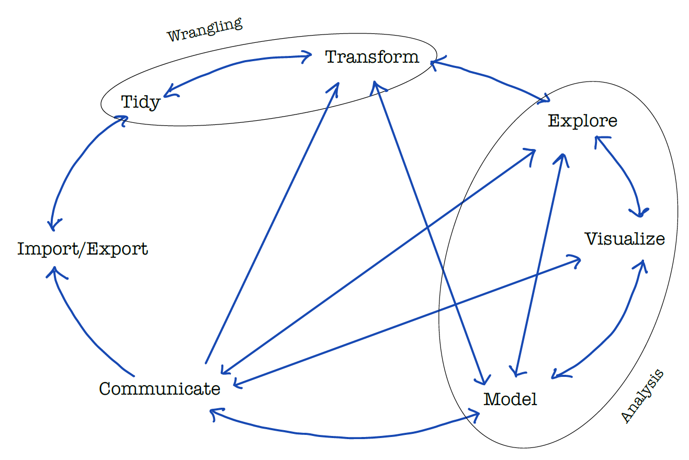

--- 
title: "Reinforcement Learning for Business (RL)"
subtitle: "Course notes"
author: 
- Lars Relund Nielsen
knit: "bookdown::render_book"
site: bookdown::bookdown_site
url: 'https\://bss-osca.github.io/rl/'
github-repo: bss-osca/rl
cover-image: img/logo.png
documentclass: book
bibliography: [book.bib, packages.bib]
biblio-style: apalike
link-citations: yes
description: "Course notes for 'Reinforcement Learning for Business'"
favicon: assets/favicon.ico
date: "`r Sys.Date()`"
editor_options: 
  chunk_output_type: console
---


# Introduction to the book {#mod-intro}

```{r, code = readLines("common.R"), cache = FALSE, include=FALSE}
```


```{r include = FALSE, cache=FALSE}
library(tidyverse)
library(devtools)
library(DT)
library(htmltools)
library(rmarkdown)
library(bsplus)
#tagList(html_dependency_font_awesome())
```


This site/book contains course notes for the course "Reinforcement Learning for Business" held at [Aarhus BSS][BSS]. The book show the learning path for the course modules. The course is an elective course for the [Operations and Supply Chain Analytics][osca-programme] and [Business Intelligence][bi-programme] programme and intended to give you an introduction to Reinforcement Learning (RL). You can expect the book to be updated when the course runs. The date listed above is the last time the book was updated.

__Learning path diagram__

Click/hover the nodes to follow links and see details.

```{r, echo=FALSE, out.width="100%", fig.asp=NA}
# gs4_deauth()
# # bring your own app via client id (aka key) and secret
# google_app <- httr::oauth_app(
#   "tfa",
#   key = "afss",
#   secret = "test"
# )
# google_key <- "YOUR_API_KEY"
# gs4_auth_configure(app = google_app, api_key = google_key)
# 
# # confirm the changes
# gs4_oauth_app()
# gs4_api_key()

g <- create_learning_path(
   url = "https://docs.google.com/spreadsheets/d/1bBe42LHK-bE7CsU9eNBzi_7VNjbmv-Ybr7285pE61jM/edit?usp=sharing", 
   sheet = "intro", 
   x_legend = 4.43, y_legend = 0,
   margin_node = 0.2)
render_graph(g, height = 300)
```

## Learning outcomes {#lo-intro}

By the end of this module, you are expected to:

* Memorize the purpose of the book.
* Describe what the term Business Analytics mean.
* Identify pros and cons of using Excel, VBA and R.
* Describe how a computer works.
* Describe what an algorithm is.
* Know how the book is organized.

The learning outcomes relate to the [overall learning goals](#lg-course) number 1, 3 and 5 of the course.

<!-- SOLO increasing: identify · memorise · name · do simple procedure · collect data · -->
<!-- enumerate · describe · interpret · formulate · list · paraphrase · combine · do -->
<!-- algorithms · compare · contrast · explain causes · analyse · relate · derive · -->
<!-- evaluate · apply · argue · theorise · generalise · hypothesise · solve · reflect -->

## Purpose for the book {#purpose}

Since the amount of available data has increased extensively in many companies, there is a need for analysts with the ability to do tasks within Analytics. For instance, extract relevant data and perform valid quantitative analysis. Clearly, it is also important that the analyst can communicate the results of the analysis to their surroundings. This requires for the analyst to be particularly qualified in handling IT based tools beyond e.g. basic Excel. 

Business Analytics (BA) (or just Analytics) refers to the scientific process of transforming data into insight for making better decisions in business. BA can both be seen as the complete decision making process for solving a business problem and the creation of business value by integration of concepts, methods and data. As a process, it can be characterized by descriptive, predictive, and prescriptive model building using data sources. For a full definition see the [appendix](#sec:ba).

Within a Business Analytics (BA) framework the course focuses on giving you an introduction to programming, handeling data and doing descriptive analytics. Descriptive analytics categorizes, characterizes, consolidates, and classifies data. Examples are standard reporting and dashboards (key performance indicators (KPIs), what happened or is happening now?) and ad-hoc reporting (how many/often?). Descriptive analytics often serves as a first step in the successful application of predictive or prescriptive analytics. Predictive and prescriptive analytics are covered in other courses of the [programme][osca-programme].

Analytics may be seen as a data driven process:

```{r process, echo = FALSE, fig.cap="Analytics as a data driven process."}

```

For doing data driven analytics you first must __import__ your data. That is, take data from a database, file, web API etc. and transform it into a data frame/table. In general raw data may be messy and need to be structured in a __tidy__ way. Tidying your data means storing it in a structured form suitable for analysis. In brief, when your data is __tidy__, each column is a variable, and each row is an observation. Tidy data is important because the consistent structure lets you focus your struggle on questions about the data. 
Once you have tidy data, a common first step is to __transform__ it. Transformation includes narrowing in on observations of interest (e.g. only observations from a specific year or warehouse), creating new variables based on existing variables (e.g. the cost of using the machine that day given idle time). Together, tidying and transforming are called __wrangling__, because 
it can be a hard process to get your data in the right form.

The next step is to do a simple __exploration__ of you data such as calculating a set of summary statistics (like counts, means or KPIs). A good way to get an overview over your data is by __visualization__. A good visualisation will show you things that you did not expect, raise new questions about the data or confirm your hypothesis. A good visualization might also hint that you're asking the wrong question, or you need to collect different data. Exploration and visualization are descriptive analytics and used to answer questions such as: What happened? How many, how often, where? Where exactly is the problem? What actions are needed?
__Models__ are complementary tools to visualization. Once you have made your questions sufficiently precise, you can use a model to answer them. A model is a description of a system using mathematical concepts and a simplification of the real system. That is, the results of a model are based on a set of assumptions. Models for statistical analysis, forecasting, system behavior are predictive analytics and answer questions like: Why is this happening? What if these trends continue? What will happen next? Models for prescriptive analytics use optimization and other decision modeling techniques to suggest decision options with the goal of improving business performance and answer questions like: What is the best that can happen?

Exploration, visualization and modeling may be seen as different steps which can be used for __analyzing__ the data and answer the overall questions. This course will focus on the two first steps. 

Given an analysis, __communication__ is an absolutely critical part. It does not matter how well your models and visualization have led you to understand the data unless you can also communicate your results to decision makers. 

Note that analytics is not a one-way process, it is common that you several times have to tidy and transform your data, explore and visualize based on the results of a model, rerun the model based on feedback from the decision makers etc. Common connections are visualized using directed arrows in Figure \@ref(fig:process). 

Surrounding the process is __programming__. Programming is the Swiss army knife you use during parts of the process. An introduction to programming is given using both VBA in Excel and the programming language and free software environment [R]. Programming focus on writing algorithms. An __algorithm__ is a finite sequence of well-defined instructions to solve a specific problem or to perform a computation. That is, we use a programming language to program an algorithm that solves a specific task, e.g. find the best route, sort words, make a plot, etc.


## How this book is organized {#organization}

Module \@ref(mod-intro) (this module) gives a short introduction to the book. Next, the book consists of different parts each containing teaching modules about specific topics:

   * [Part I](#mod-vba-intro) gives you an introduction to VBA and how to program using VBA in Excel.

   <!-- * [Part II](#mod-vba-datatypes) gives you an overview over programming in VBA including datatypes (Module \@ref(mod-vba-datatypes)), procedures (Module \@ref(mod-vba-procedures)), loop and conditional statements (Module \@ref(mod-vba-loops-cond)) and the object model (Module \@ref(mod-vba-object-model)). -->
   <!-- * [Part III](#mod-vba-random-numbers) contains extra modules useful when coding in VBA.  -->
   <!-- * [Part IV](#mod-vba-project) presents the mandatory VBA project. -->
   <!-- * [Part V](#mod-r-install) focuses on helping you install the needed programs on your computer (Module \@ref(mod-r-install)) and gives you a short introduction to R (Module \@ref(mod-r-workflow)). -->
   <!-- * [Part VI](#mod-r-loops-cond) gives you an overview over programming in R including loops and conditionals (Module \@ref(mod-r-loops-cond)) and functions (Module \@ref(mod-r-functions)). -->

   <!-- * [Part VII](#mod-r-tidyverse-intro) the focus is on import/export, tidy and transformation of data. Module \@ref(mod-r-tidyverse-intro) first gives you an introduction to the [tidyverse][tidyverse-main-page] packages and introduces you to literal programming using R Markdown. Next, Module \@ref(mod-r-io) shows you how to export and import data. Finally, Module \@ref(mod-r-transform) focuses on transformation of data. -->
   <!-- * [Part VIII](#mod-r-plot) considers visualization of data in R (Module \@ref(mod-r-plot)). -->
   <!-- * [Part IX](#mod-project) presents the mandatory R project. -->
   <!-- * [Part X](#mod-r-maps) contains extra modules useful when coding in R.  -->

The appendix contains different modules that may be helpful for you including hints on [how to work in groups](#groups), [how to get help](#help) if you are stuck and [how to annotate](#annotate) the course notes.
   


## Acknowledgements {#ack} 

Some of the materials in this book are taken from various places

* The bookdown skeleton and some notes are based on the [Tools for Analytics][tfa-course] course.

<!-- * Some parts in Module \@ref(mod-intro) are inspired by [Chapter 1](https://r4ds.had.co.nz/introduction.html) in @r4ds. -->
<!-- * The VBA modules are inspired by the book @vba-book. This also holds for some of the exercises.  -->
<!-- * Module \@ref(mod-r-install) is inspired by [Chapter 1](https://stat545.com/block000_r-rstudio-install.html) in @stat545. -->
<!-- * Module \@ref(mod-r-workflow) is using some text and images from [Chapter 1](https://moderndive.netlify.app/1-getting-started.html) in @moderndrive and [Chapter 2](https://stat545.com/block002_hello-r-workspace-wd-project.html) in @stat545. A few exercises are inspired by [Chapter 2](https://rafalab.github.io/dsbook/r-basics.html) in @dsbook. -->
<!-- * Notes about git and GitHub in the appendix are based on @hgit. -->
<!-- * Exercise \@ref(ex-gapminder1) is a revision of Chapters 6-7 in @stat545. -->
<!-- * Exercise \@ref(ex-babynames1) is a revision of [Session 3](https://github.com/rstudio-education/welcome-to-the-tidyverse/blob/master/03-Transform/03-Transform-Exercises.Rmd) in the [Welcome to the tidyverse][course-welcome-to-the-tidyverse] course. -->
<!-- * Exercise \@ref(ex-gapminder2) is a revision of [Chapter 9](https://rafalab.github.io/dsbook/gapminder.html) in @dsbook. -->
<!-- * Exercise \@ref(ex-covid19) is inspired by the COVID19 application [exercise](https://raw.githubusercontent.com/rstudio-education/datascience-box/master/course-materials/application-exercises/ae-01b-covid/covid.Rmd) at the [data science in a box](https://github.com/rstudio-education/datascience-box) course. -->
<!-- * Exercise \@ref(ex-lego) is inspired by the Lego homework [exercise](https://github.com/rstudio-education/datascience-box/blob/master/course-materials/hw-instructions/hw-04/hw-04-legos-instructors.Rmd) at the [data science in a box](https://github.com/rstudio-education/datascience-box) course. -->
<!-- * Exercise \@ref(ex-fish) is inspired by the Fisheries application [exercise](https://github.com/rstudio-education/datascience-box/blob/master/course-materials/application-exercises/ae-05-fisheries-datajoins/fisheries.Rmd) at the [data science in a box](https://github.com/rstudio-education/datascience-box) course. -->


I would like to thank all for their inspiration. Also thanks to Solveig for proofreading the draft. 

This work is licensed under the Creative Commons Attribution-NonCommercial-ShareAlike 4.0 International [CC BY-NC-SA 4.0](https://creativecommons.org/licenses/by-nc-sa/4.0/).


```{r links, child="links.md"}
```
