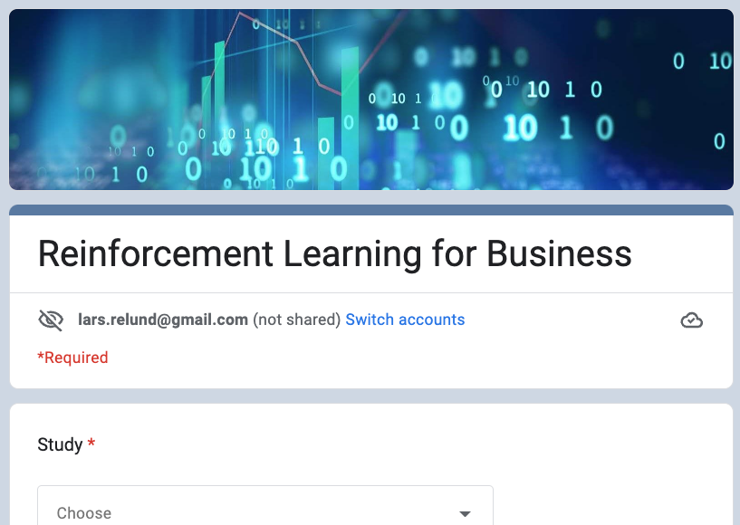
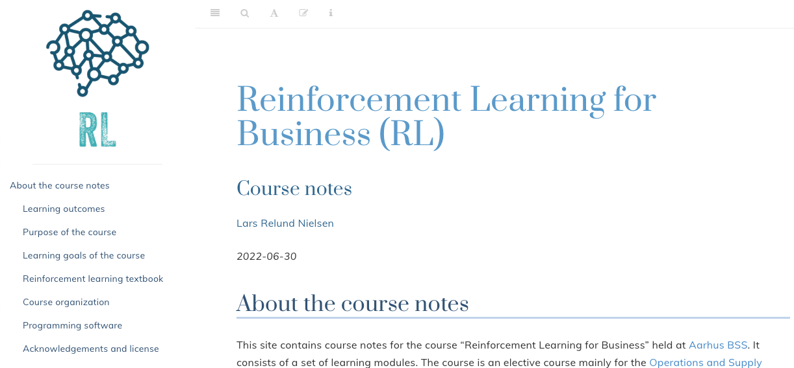

```{r, child = "setup.Rmd", echo=FALSE}
```

```{r include=FALSE}
# use xaringan::inf_mr(cast_from = ".") to preview
```

layout: true

```{r, echo=FALSE}
module_name <- "intro"
module_number <- "00"
library(htmltools)
withTags({
   div(class="my-footer",
      span(
         a(href=str_c("https://bss-osca.github.io/rl/index.html"), target="_blank", "Notes"), 
         " | ",
         a(href=str_c("https://bss-osca.github.io/rl/slides/", module_number, "_", module_name, "-slides.html"), target="_blank", "Slides"),    
         " | ",
         a(href=str_c("https://github.com/bss-osca/rl/blob/master/slides/", module_number, "_", module_name, "-slides.Rmd"), target="_blank", "Source"),  
      )
   )
})
knitr::opts_chunk$set(fig.path=str_c("img/", module_name, "-"))
```

---

## About Me 

- Lars Relund Nielsen (larsrn@econ.au.dk)
- Professor at Dept. of Economics and Business Economics, Aarhus Universitet. 
- I do research in algorithms for optimization, multiobjective optimization, stochastic dynamic programming
- Have been programming in many languages such as C, C++, VBA, R, SQL, Javascript …
- For more information see my [research page]( http://www.research.relund.dk/).

---

## Who are you?

Let us have a look at [what you answered](https://docs.google.com/forms/d/1Cmc5bXlNiJnU8FbCF3TIi_SL8X-Wm0wqlkYGV3SBxpM/edit#responses). 

```{r, echo = FALSE, out.width="80%"} 
 
```

---

## Course overview 

- The purpose of this course is to give an introduction and knowledge about reinforcement learning (RL).
- RL refers to:
  * An approach of modelling sequential decision making problems.
  * An approach for learning decision making form experience.
  * Mathematical models for learning-based decision making.
- Lectures/tutorials each week.
- Exercises are given to support your learning.

---

## Teaching form and style 

- A combination of lectures and tutorials. 
  - Before: Read the suggested material (you may start with the exercises).
  - Lecture or tutorial. Not all material will be covered here.
  - Continue with exercises (group work).
- It is strongly recommended that you solve the exercises for each week during the course. This is the best way to prepare for the exam. 

---

## Course notes 

The course notes are given [online](https://bss-osca.github.io/rl/). You may annotate the notes and slides using [hypothes.is](https://bss-osca.github.io/rl/annotate.html). Link to slides are given under the **Recap** section in each learning module.

```{r, echo = FALSE, out.width="100%"} 
 
```

---

## Groups 

- I recommend that you form groups of 3-6 persons that you use throughout the whole course. 
- It is up to you how to meet in these groups (on-line or physical). 
- Use the groups when you 
  * solve the exercises. 
  * hand in the project report.

---

## Project report

- A project report must be written during the course focussing on solving a RL problem.
- The report may be used as a starting point for discussion at the individual exam.
- You must hand in the reports in groups and do individual peer grading using the on-line platform [Peergrade].

---

## Exam

- A 20 min oral individual exam without any preparation. 
- Curriculum include all material such as book chapters, course notes, videos, interactive tutorials, exercises and project reports.
- The report may be used as a starting point for discussion at the individual exam.

---

layout: false
class: inverse, middle, center

# Looking forward to working with you!


```{r links, child="../book/links.md"}
```

```{r postprocess, include=FALSE}
system2("Rscript", args = "-e 'rmarkdown::render(\"index.Rmd\", quiet = TRUE)'")
file.copy("./slides.css", "./libs/", overwrite = T)
```
