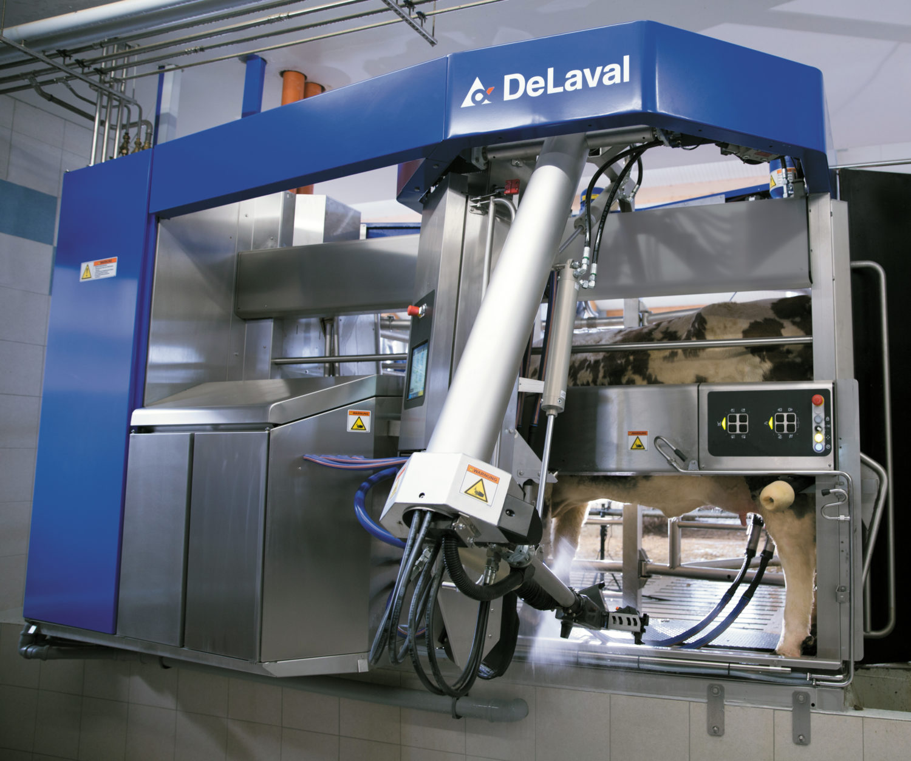
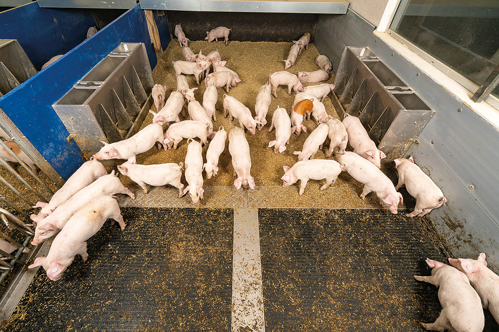

```{r, child = "setup.Rmd", echo=FALSE}
```

```{r include=FALSE, eval=FALSE}
# to preview
xaringan::inf_mr(cast_from = ".")
```

```{r, include=FALSE, cache=FALSE}
knitr::opts_chunk$set(echo = FALSE, 
                      fig.width = 6, 
                      # fig.asp = 0.5,
                      fig.path="img/",
                      # out.width = "100%",
                      fig.align = "center",
                      dpi = 300,
                      # cache = TRUE, autodep = TRUE,
                      warning = FALSE,
                      message = FALSE)
```

```{r, echo=FALSE}
module_name <- "pecha-kucha"
knitr::opts_chunk$set(fig.path=str_c("img/", module_name, "-"))
```


layout: true

## Sequential decision making 

```{r echo=FALSE}
library(diagram)
plotHypergraphV2<-function(gridDim, states=NULL, actions=NULL, showGrid=FALSE, 
                         radx = 0.03, rady=0.05, cex=1, marX=0.035, marY=0.15, ...)
{
   # internal functions
   gMap<-function(sId) return(states$gId[states$sId %in% sId])		# return gId given sId
   sMap<-function(gId) return(states$sId[states$gId %in% gId])		# return sId given gId

   pos <- coordinates(rep(gridDim[1], gridDim[2]), hor = F)  # coordinates of each point in the grid
   posT <- matrix(c(unique(pos[,1]), rep(0, gridDim[2])), ncol = 2)
   colnames(posT) <- colnames(pos)
   
   par(oma=c(0,0,0,0), mar = c(0,0,0,0))
   openplotmat(xlim=c(min(pos[,1])-marX,max(pos[,1])+marX), 
               ylim=c(0-marY,max(pos[,2])+marY) )  #main = "State expanded hypergraph"
   # plot time index
   for (i in 1:gridDim[2] - 1) textempty(posT[i+1, ], lab = parse(text = str_c("italic(t == ", i, ")")), cex=cex)
   
   # plot actions
   if (!is.null(actions)) {
      for (i in seq_along(actions)) {
         head <- actions[[i]]$state
         tails <- actions[[i]]$trans
         lwd <- ifelse(is.null(actions[[i]]$lwd), 1, actions[[i]]$lwd)
         lty <- ifelse(is.null(actions[[i]]$lty), 1, actions[[i]]$lty)
         col <- ifelse(is.null(actions[[i]]$col), "black", actions[[i]]$col)
         label <- ifelse(is.null(actions[[i]]$label), "", actions[[i]]$label)
         if (str_length(label) != 0) label <- parse(text = str_c("italic(", label, ")"))
         highlight <- ifelse(is.null(actions[[i]]$highlight), F, actions[[i]]$highlight)
         if (highlight) lwd <- lwd + 1
         pt <- splitarrow(to = pos[gMap(tails), ], from = pos[gMap(head),], lwd=lwd, lty=lty, arr.type = "none",
                          # arr.side = 1, arr.pos = 0.7, arr.type="curved", arr.lwd = 0.5, arr.length = 0.25, arr.width = 0.2, 
                          lcol=col)
         # misc coordinates
         meanFrom <- colMeans(matrix(ncol = 2, data = pos[gMap(head),]))  # head coord
         meanTo <- colMeans(matrix(ncol = 2, data = pos[gMap(tails),]))   # mean coord of tails
         centre <- meanFrom + 0.5 * (meanTo - meanFrom)  # centre point where split
         meanFT <- colMeans(matrix(c(meanFrom,centre), ncol = 2, byrow = T))  # coord between from and centre
         # add centre point
         textellipse(centre, radx = 0.2*radx, rady = 0.2*rady, shadow.size = 0, box.col = "black")
         # add label
         textempty(meanFT, lab=label, adj=c(0, 0), cex=cex, ...)
         # add rewards
         if (!is.null(actions[[i]]$reward)) {
            rew <- actions[[i]]$reward
            idx <- which(rew != "")
            for (j in idx) {
               label <- parse(text = str_c("italic(", rew[j], ")"))
               meanCT <- meanFT <- colMeans(matrix(c(pos[gMap(tails[j]), ],centre), ncol = 2, byrow = T))  # coord middle
               textempty(meanCT, lab=label, adj=c(0, 0), cex=cex, ...)
            }
         }
      }
   }	
   
   # plot states
   if (!is.null(states)) {
      for (i in 1:length(states$gId)) { 
         label <- ""
         if (str_length(states$label[i]) != 0) label <- parse(text = str_c("italic(", states$label[i], ")"))
         if (states$draw[i]) textellipse(pos[states$gId[i], ], lab = label, radx = radx, rady=rady, shadow.size = 0, lwd=0.5, cex=cex) 
      }
   }
   
   # visual view of the point numbers (for figuring out how to map stateId to gridId)
   if (showGrid) {
      for (i in 1:dim(pos)[1]) textrect(pos[i, ], lab = i, radx = 0.0, cex=cex)
   }
   return(invisible(NULL))
}
```

- Sequential decision analytics
- Markov decision processes (a mathematical model for a sequential decision problem)

---

---

```{r echo=FALSE, fig.width=6, fig.height=2.5}
set.seed(56789)
stateN <- 5   # states/stage
stages <- 3   # stages
gridDim <- c(stateN, stages)
states <- tibble(sId = 1:(stages * stateN), gId = 1:(stages * stateN), label = "", draw = rep(T, stages * stateN))
states$label[3] <- "s[0]"
actions <- list()
plotHypergraphV2(gridDim, states, actions, showGrid = F)
```

---

```{r echo=FALSE, fig.width=6, fig.height=2.5}
set.seed(56789)
stateN <- 5   # states/stage
stages <- 3   # stages
gridDim <- c(stateN, stages)
states <- tibble(sId = 1:(stages * stateN), gId = 1:(stages * stateN), label = "", draw = rep(T, stages * stateN))
# states <- states %>% mutate(draw = if_else(sId %in% c(1,2,4,5), F, T))
states$label[3] <- "s[0]"
# states$label[9] <- "s[1]"
# states$label[12] <- "s[2]"
# path <- c(3, 7, 13, 19, 22, 27)
# states$label[path] <- str_c("S[", seq_along(path)-1, "]")
actions <- list()
addHArc <- function(actions, harc) {
   actions[[length(actions)+1]] <- harc
   return(actions)
}
actions <- addHArc(actions, list(
   state = 3,
   trans = c(9,10),
   label = "a[1]",
   reward = c("", ""),
   lwd = 1
))
#plotHypergraphV2(gridDim, states, actions, showGrid = F)
```

```{r echo=FALSE, fig.width=6, fig.height=2.5}
set.seed(56789)
stateN <- 5   # states/stage
stages <- 3   # stages
gridDim <- c(stateN, stages)
states <- tibble(sId = 1:(stages * stateN), gId = 1:(stages * stateN), label = "", draw = rep(T, stages * stateN))
# states <- states %>% mutate(draw = if_else(sId %in% c(1,2,4,5), F, T))
states$label[3] <- "s[0]"
# states$label[9] <- "s[1]"
# states$label[12] <- "s[2]"
# path <- c(3, 7, 13, 19, 22, 27)
# states$label[path] <- str_c("S[", seq_along(path)-1, "]")
actions <- list()
addHArc <- function(actions, harc) {
   actions[[length(actions)+1]] <- harc
   return(actions)
}
actions <- addHArc(actions, list(
   state = 3,
   trans = c(9,10),
   label = "a[1]",
   reward = c("", ""),
   lwd = 1
))
actions <- addHArc(actions, list(
   state = 3,
   trans = c(6,7,8,9),
   label = "a[2]"
))
# actions <- addHArc(actions, list(
#    state = 9,
#    trans = c(13,12,15),
#    label = "a[1]"
# ))
# actions <- addHArc(actions, list(
#    state = 9,
#    trans = c(11,12),
#    label = "a[2]",
#    reward = c("", "r[2]"),
#    lwd = 2
# ))
plotHypergraphV2(gridDim, states, actions, showGrid = F)
```

---

```{r echo=FALSE, fig.width=6, fig.height=2.5}
set.seed(56789)
stateN <- 5   # states/stage
stages <- 3   # stages
gridDim <- c(stateN, stages)
states <- tibble(sId = 1:(stages * stateN), gId = 1:(stages * stateN), label = "", draw = rep(T, stages * stateN))
# states <- states %>% mutate(draw = if_else(sId %in% c(1,2,4,5), F, T))
states$label[3] <- "s[0]"
# states$label[9] <- "s[1]"
# states$label[12] <- "s[2]"
# path <- c(3, 7, 13, 19, 22, 27)
# states$label[path] <- str_c("S[", seq_along(path)-1, "]")
actions <- list()
addHArc <- function(actions, harc) {
   actions[[length(actions)+1]] <- harc
   return(actions)
}
actions <- addHArc(actions, list(
   state = 3,
   trans = c(9,10),
   label = "a[1]",
   reward = c("", ""),
   lwd = 2
))
actions <- addHArc(actions, list(
   state = 3,
   trans = c(6,7,8,9),
   label = "a[2]"
))
#plotHypergraphV2(gridDim, states, actions, showGrid = F)
```

```{r echo=FALSE, fig.width=6, fig.height=2.5}
set.seed(56789)
stateN <- 5   # states/stage
stages <- 3   # stages
gridDim <- c(stateN, stages)
states <- tibble(sId = 1:(stages * stateN), gId = 1:(stages * stateN), label = "", draw = rep(T, stages * stateN))
# states <- states %>% mutate(draw = if_else(sId %in% c(1,2,4,5), F, T))
states$label[3] <- "s[0]"
states$label[9] <- "s[1]"
# states$label[12] <- "s[2]"
# path <- c(3, 7, 13, 19, 22, 27)
# states$label[path] <- str_c("S[", seq_along(path)-1, "]")
actions <- list()
addHArc <- function(actions, harc) {
   actions[[length(actions)+1]] <- harc
   return(actions)
}
actions <- addHArc(actions, list(
   state = 3,
   trans = c(9,10),
   label = "a[1]",
   reward = c("r[1]", ""),
   lwd = 2
))
actions <- addHArc(actions, list(
   state = 3,
   trans = c(6,7,8,9),
   label = "a[2]"
))
# actions <- addHArc(actions, list(
#    state = 9,
#    trans = c(13,12,15),
#    label = "a[1]"
# ))
# actions <- addHArc(actions, list(
#    state = 9,
#    trans = c(11,12),
#    label = "a[2]",
#    reward = c("", "r[2]"),
#    lwd = 2
# ))
plotHypergraphV2(gridDim, states, actions, showGrid = F)
```

---

```{r echo=FALSE, fig.width=6, fig.height=2.5}
set.seed(56789)
stateN <- 5   # states/stage
stages <- 3   # stages
gridDim <- c(stateN, stages)
states <- tibble(sId = 1:(stages * stateN), gId = 1:(stages * stateN), label = "", draw = rep(T, stages * stateN))
# states <- states %>% mutate(draw = if_else(sId %in% c(1,2,4,5), F, T))
states$label[3] <- "s[0]"
states$label[9] <- "s[1]"
# states$label[12] <- "s[2]"
# path <- c(3, 7, 13, 19, 22, 27)
# states$label[path] <- str_c("S[", seq_along(path)-1, "]")
actions <- list()
addHArc <- function(actions, harc) {
   actions[[length(actions)+1]] <- harc
   return(actions)
}
actions <- addHArc(actions, list(
   state = 3,
   trans = c(9,10),
   label = "a[1]",
   reward = c("r[1]", ""),
   lwd = 2
))
actions <- addHArc(actions, list(
   state = 3,
   trans = c(6,7,8,9),
   label = "a[2]"
))
actions <- addHArc(actions, list(
   state = 9,
   trans = c(13,12,15),
   label = "a[1]"
))
#plotHypergraphV2(gridDim, states, actions, showGrid = F)
```

```{r echo=FALSE, fig.width=6, fig.height=2.5}
set.seed(56789)
stateN <- 5   # states/stage
stages <- 3   # stages
gridDim <- c(stateN, stages)
states <- tibble(sId = 1:(stages * stateN), gId = 1:(stages * stateN), label = "", draw = rep(T, stages * stateN))
# states <- states %>% mutate(draw = if_else(sId %in% c(1,2,4,5), F, T))
states$label[3] <- "s[0]"
states$label[9] <- "s[1]"
# states$label[12] <- "s[2]"
# path <- c(3, 7, 13, 19, 22, 27)
# states$label[path] <- str_c("S[", seq_along(path)-1, "]")
actions <- list()
addHArc <- function(actions, harc) {
   actions[[length(actions)+1]] <- harc
   return(actions)
}
actions <- addHArc(actions, list(
   state = 3,
   trans = c(9,10),
   label = "a[1]",
   reward = c("r[1]", ""),
   lwd = 2
))
actions <- addHArc(actions, list(
   state = 3,
   trans = c(6,7,8,9),
   label = "a[2]"
))
actions <- addHArc(actions, list(
   state = 9,
   trans = c(13,12,15),
   label = "a[1]"
))
actions <- addHArc(actions, list(
   state = 9,
   trans = c(11,12),
   label = "a[2]",
   reward = c("", ""),
   lwd = 1
))
plotHypergraphV2(gridDim, states, actions, showGrid = F)
```

---

```{r echo=FALSE, fig.width=6, fig.height=2.5}
set.seed(56789)
stateN <- 5   # states/stage
stages <- 3   # stages
gridDim <- c(stateN, stages)
states <- tibble(sId = 1:(stages * stateN), gId = 1:(stages * stateN), label = "", draw = rep(T, stages * stateN))
# states <- states %>% mutate(draw = if_else(sId %in% c(1,2,4,5), F, T))
states$label[3] <- "s[0]"
states$label[9] <- "s[1]"
states$label[12] <- "s[2]"
# path <- c(3, 7, 13, 19, 22, 27)
# states$label[path] <- str_c("S[", seq_along(path)-1, "]")
actions <- list()
addHArc <- function(actions, harc) {
   actions[[length(actions)+1]] <- harc
   return(actions)
}
actions <- addHArc(actions, list(
   state = 3,
   trans = c(9,10),
   label = "a[1]",
   reward = c("r[1]", ""),
   lwd = 2
))
actions <- addHArc(actions, list(
   state = 3,
   trans = c(6,7,8,9),
   label = "a[2]"
))
actions <- addHArc(actions, list(
   state = 9,
   trans = c(13,12,15),
   label = "a[1]"
))
actions <- addHArc(actions, list(
   state = 9,
   trans = c(11,12),
   label = "a[2]",
   reward = c("", "r[2]"),
   lwd = 2
))
plotHypergraphV2(gridDim, states, actions, showGrid = F)
```


---

layout: true

## The data-stream

```{r, include=FALSE}
## plot an RL (agent/environment relation)
library(ggraph)
library(tidygraph)
library(tidyverse)

plotRL <- function(active = c('F', 'T', 'F'), label = c("A[0]", "O[0]", "R[1]"), lblAgent = "") {
   nodes <- tibble(name = c('Environment', 'Agent', lblAgent))
   # lbl <- str_c(c("A[", "O[", "R["), t, c("]", "]", "]"))
   edges <-tibble(
       from = c(2, 1, 1),
       to =   c(1, 2, 2),
       label = label,
       active = active,
       cap = c(circle(20, 'mm'), circle(20, 'mm'), circle(10, 'mm')))
   gr <- tbl_graph(nodes, edges) 
   p <- ggraph(gr, layout = "manual", x = c(1, 1, 1), y = c(1, 2, 2.1)) +
      geom_edge_fan(
         aes(label = label, end_cap = cap, col = active), 
         arrow = arrow(length = unit(4, 'mm')),
         hjust = 1.5,
         label_parse = TRUE,
         strength = -1,
         fontface = "bold",
         show.legend = F,
         label_colour = NA,
         label_size = 8
      ) +
      scale_edge_color_manual(values = c('T' = "black", 'F' = "white")) +
      geom_node_label(aes(filter = name != lblAgent, label = name), label.padding = unit(1, "lines"), fontface = "bold", size = 10) +
      geom_node_text(aes(filter = name == lblAgent, label = name), parse = TRUE, size = 7) +
      theme_graph(base_size = 30, background = NA, border = T, plot_margin = margin(30,30,10,50)) +
      coord_cartesian(clip = "off")
   return(p)
}
```

---

.left-column-wide[
- Agent: The one who takes the action (computer, robot, decision maker).
- Environment: The system/world where observations and rewards are found. 
- Data are revealed sequentially as you take actions:
  * $(S_0, A_0)$
]

.right-column-small[
```{r, echo=FALSE, fig.cap = "Agent-environment representation."}
plotRL(active = c('T', 'T', 'F'), label = c("A[0]", "S[0]", "R[1]"))
```
]

---

.left-column-wide[
- Agent: The one who takes the action (computer, robot, decision maker).
- Environment: The system/world where observations and rewards are found. 
- Data are revealed sequentially as you take actions:
  * $(S_0, A_0, R_1, S_1)$
]

.right-column-small[
```{r, echo=FALSE, fig.cap = "Agent-environment representation."}
plotRL(active = c('F', 'T', 'T'), label = c("A[0]", "S[1]", "R[1]"))
```
]

---

.left-column-wide[
- Agent: The one who takes the action (computer, robot, decision maker).
- Environment: The system/world where observations and rewards are found. 
- Data are revealed sequentially as you take actions:
  * $(S_0, A_0, R_1, S_1, A_1, R_2, S_2, \ldots)$
]

.right-column-small[
```{r, echo=FALSE, fig.cap = "Agent-environment representation."}
plotRL(active = c('T', 'T', 'T'), label = c("A[1]", "S[2]", "R[2]"))
```
]

---

layout: false

## Note

- Reward can be delayed (current decisions have an impact on the future)
- Seek a policy $\pi: s \rightarrow a$ (agent’s behaviour) 
- Objective: expected discounted future reward (given in state $s$):
$$V_\pi(s) = \mathbb{E}_\pi(R_{t+1} + \gamma R_{t+2} + \gamma^2 R_{t+3} + \ldots | S = s).$$ 
- Goal is to find a **policy** that **maximize** the **total discounted reward**.


---

layout: false

## What is Reinforcement Learning (RL)

- Full model (model based): Markov Decision Process (stochastic dynamic programming)
- Model free: Don't know the transition probabilities but have data (RL)

--

RL can be seen as 

* An approach for learning good decision making under uncertainty from experience.
* The agent does not know the underlying setting and, thus, is bound to learn from experience.


---

## Challenges I


- Time really matters (sequential/dynamic system, non iid data).
- Forecasts change depending on the actions.
- Agent’s actions affect the subsequent data stream.
- Curse of dimensionality

---

## Challenges II 

- Not able to model transitions
- Exploitation vs exploration dilemma
  - We need to explore to find potential better actions
  - We need to exploit to get the best reward 

---

layout: true

## Application - Milk production

---

.left-column-wide[
- Sensor data 2-3 times a day (yield, hormone levels, feed intake)
- Objective: Economic value of the cow during a lactation cycle
]

.right-column-small[
```{r, echo = FALSE, out.width="100%", fig.cap="Milking robot"}

```
]

---

.left-column-wide[
- Sensor data 2-3 times a day (yield, hormone levels, feed intake)
- Objective: Economic value of the cow during a lactation cycle
- Use a state space model (SSM) or dynamic linear model (West and Harrison) for predicting daily milk yield
- Use a Markov decision process (MDP) for calculating the optimal strategy with the SSM embedded
- Actions: replace, keep
- State: expected production potential, expected local production effect, calving week 
]

.right-column-small[
```{r, echo = FALSE, out.width="100%", fig.cap="Milking robot"}

```
]

---

layout: true

## Application - Pig production

---

.left-column-wide[
- Sensor data (camera, feed intake, ir)
- Objective: Economic value of the pigs during growth
]

.right-column-small[
```{r, echo = FALSE, out.width="100%", fig.cap="Pig pen"}

```
]

---

.left-column-wide[
- Sensor data (camera, feed intake, ir)
- Objective: Economic value of the pigs during growth
- Use a state space model (SSM) for predicting weight and growth 
- Use a Markov decision process (MDP) for calculating the optimal strategy with the SSM embedded
- Actions: feed-mix, keep, replace
- State: week, feed-mix, pigs, expected weight, expected growth
]

.right-column-small[
```{r, echo = FALSE, out.width="100%", fig.cap="Pig pen"}

```
]


