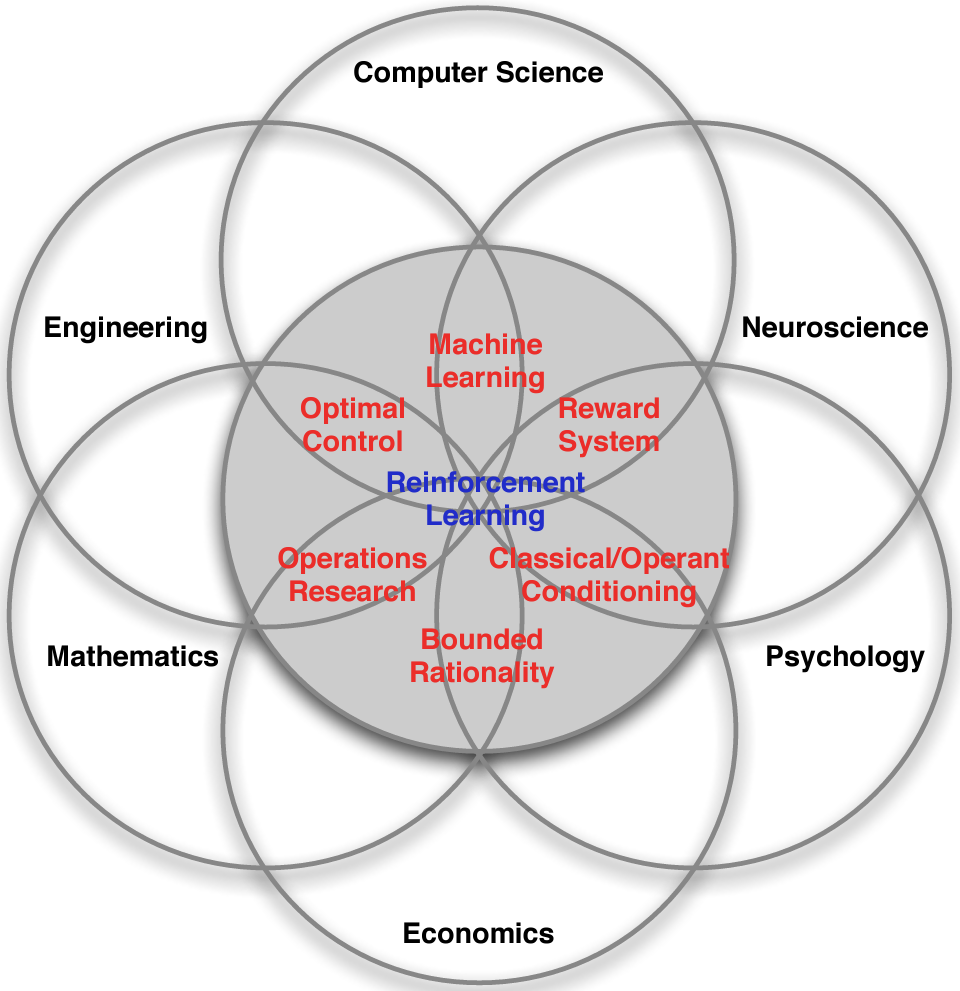

```{r, child = "setup.Rmd", echo=FALSE}
```

```{r include=FALSE, eval=FALSE}
# to preview
xaringan::inf_mr(cast_from = ".")
```

layout: true
  
```{r, echo=FALSE}
module_name <- "rl-intro"
module_number <- "02"
here::i_am(str_c("slides/", module_number, "_", module_name, "-slides.Rmd"))
library(htmltools)
footerHtml <- withTags({
   div(class="my-footer",
      span(
         a(href=str_c("https://bss-osca.github.io/rl/sec-", module_name, ".html"), target="_blank", "Notes"), 
         " | ",
         a(href=str_c("https://bss-osca.github.io/rl/slides/", module_number, "_", module_name, "-slides.html"), target="_blank", "Slides"),    
         " | ",
         a(href=str_c("https://github.com/bss-osca/rl/blob/master/slides/", module_number, "_", module_name, "-slides.Rmd"), target="_blank", "Source"),  
      )
   )
})
footerHtml
knitr::opts_chunk$set(fig.path=str_c("img/", module_name, "-"))
```

---

## Learning outcomes 

* Describe what RL is. 
* Be able to identify different sequential decision problems.
* Know what Business Analytics are and identify RL in that framework.
* Memorise different names for RL and how it fits in a Machine Learning framework.
* Formulate the blocks of a RL model (environment, agent, data, states, actions, rewards and policies).
* Run your first RL algorithm and evaluate on its solution.

---

## What is reinforcement learning

RL can be seen as

* An approach of modelling sequential decision making problems.
* An approach for learning good decision making under uncertainty from experience.
* Mathematical models for learning-based decision making.
* Trying to optimize decisions in a sequential decision model. That is, making a good sequence of decisions.
* Estimating and finding near optimal decisions of a stochastic process with sequential decision making. 
* A model where, given a state of a system, the agent wants to take actions to maximize future reward. Often the agent does not know the underlying setting and, thus, is bound to learn from experience.

---

## Sequential decision problems

Examples (with possible actions) are:

* Playing backgammon (how to move the checkers).
* [Driving a car](https://arxiv.org/pdf/1807.00412.pdf) (left, right, forward, back, break, stop, ...).
* How to [invest/maintain a portfolio of stocks](https://medium.com/ibm-data-ai/reinforcement-learning-the-business-use-case-part-2-c175740999) (buy, sell, amount).  
* [Control an inventory](https://www.youtube.com/watch?v=pxWkg2N0l9c) (wait, buy, amount).
* Vehicle routing (routes).
* Maintain a spare-part (wait, maintain).
* [Robot operations](https://arxiv.org/pdf/2103.14295.pdf) (sort, move, ...)
* [Dairy cow treatment/replacement](http://dx.doi.org/10.1016/j.ejor.2019.01.050) (treat, replace, ...)
* Recommender systems e.g. [Netflix recommendations](https://scale.com/blog/Netflix-Recommendation-Personalization-TransformX-Scale-AI-Insights) (videos)

Note current decisions have an impact on the future. 

---

## RL and intuition

RL can be seen as a way of modelling intuition. An RL model has specific states, actions and reward structure and our goal as an agent is to find good decisions/actions that maximize the total reward. The agent learn using, for instance:

* totally random trials (in the start),
* sophisticated tactics and superhuman skills (in the end). 

That is, as the agent learn, the reward estimate of a given action becomes better. 

As humans, we often learn by trial and error too:

* Learning to walk (by falling/pain).
* Learning to play (strategy is based on the game rules and what we have experienced works based on previous plays). 

This can also be seen as learning the reward of our actions. 


---

layout: true

## RL in a Business Analytics framework

```{r include=FALSE, eval=FALSE}
# Make a plot using ggplot2
library(ggplot2)
library(grid)
options(stringsAsFactors = FALSE)

# Data
# Raw Data                        ; How do we clean the data?
# Cleaned Data                    ; How do we handle them?
zz <- textConnection("
name; desc
'Standard\nReports';           What happend?
'Ad Hoc\nReports';             How many, how often, where?
'Query\nDrill Down';           Where exactly is the problem
'Alerts';                      What actions are needed?
'Statistical\nAnalysis';       Why is this happening?
'Forecasting';                 What if these trends continue?
'Predictive\nModeling';        What will happen next
'Optimization\nRL';           What is the best that can happen?
")
df <- read.table(zz, header= TRUE, sep=";", stringsAsFactors = FALSE, strip.white=TRUE, allowEscapes=TRUE, quote = "'")
close(zz)
l<-length(df$name)
df$x<-1:l
expF<-function(x,base=1.4) {base^x}
df$y<-expF(df$x)
df$size<-seq(from=10, to=20, length.out = l)
df

# make the plot
element_grob.element_custom_x <- function(element, ...)  {
   grid::segmentsGrob(0,1,1,1, arrow = arrow(), gp = gpar(col="cornflowerblue", lwd=8))
}
element_grob.element_custom_y <- function(element, ...)  {
   grid::segmentsGrob(1,0,1,1, arrow = arrow(), gp = gpar(col="cornflowerblue", lwd=8))
}
## silly wrapper to fool ggplot2
xAxisCustom <- function(...){
   structure(
      list(...), # this ... information is not used, btw
      class = c("element_custom_x","element_blank", "element") # inheritance test workaround
   )
}
yAxisCustom <- function(...){
   structure(
      list(...), # this ... information is not used, btw
      class = c("element_custom_y","element_blank", "element") # inheritance test workaround
   )
}

shiftX <- 0.75
spaceTextX <- 1.5
xlim<-c(min(df$x)-shiftX, max(df$x)+ shiftX + spaceTextX)
ylim<-c(-1,expF(max(df$x)+shiftX))
# ini plot with axis
p <- ggplot(df, aes(x=x, y=y), name = "Different types of decision support") +
   scale_x_continuous(name="Degrees of intelligence", limit=xlim) +
   scale_y_continuous(name="Competitive Advantage", limit=ylim) +
   theme(legend.position="none",
         axis.text.x=element_blank(), axis.text.y=element_blank(),
         axis.title = element_text(size=20),
         plot.background=element_rect(fill = "transparent",colour = NA),
         panel.background=element_blank(),
         axis.ticks=element_blank(),
         axis.line.x = xAxisCustom(size=5), axis.line.y = yAxisCustom(size=5), #element_line(color="cornflowerblue", size = 1, lineend = "round"),
         #axis.line.x = element_blank(), axis.line.y =element_blank(),
         panel.grid.major=element_blank(), panel.grid.minor=element_blank())
# add line with arrow
p <- p +
   geom_segment(aes(x = df$x[l], y = df$y[l], xend = max(df$x)+ shiftX, yend = ylim[2]),
                size = 5, color="cornflowerblue",
                arrow = arrow(length = unit(2, "cm"))) +
   stat_smooth(formula = y ~ expF(x), span=0.9, se=FALSE, color="cornflowerblue", method = 'loess', size=5)
# add citation
p <- p + annotate("text", x = xlim[2], y = ylim[1], size = 4, color="darkgray", hjust=1,
                  label = "Adopted from 'Competing on Analytics', Davenport and Harris, 2007")
# add bubbles
colFunc1<-colorRampPalette(c("darkolivegreen4","darkolivegreen"))
colFunc2<-colorRampPalette(c("deepskyblue","cornflowerblue"))
palette<-c(colFunc1(5),colFunc2(5))
# p <- p +
#    geom_point(aes(x=x, y=y, size=size, color=as.character(x))) +
#    scale_size_area(max_size = 50) +
#    geom_text(aes(label=name), size=5) +
#    geom_text(aes(label=desc), size=5, hjust=-0.1, vjust=6.5, color = "darkorange3") +
#    scale_colour_manual(values=palette)
for (i in 1:l) {
   p1 <- p +
      geom_point(aes(x=x, y=y, size=size, color=as.character(x)), data = df[1:i,]  ) +
      scale_size_area(max_size = 55) +
      geom_text(aes(label=name), size=5, data = df[1:i,]) +
      geom_text(aes(label=desc), size=5, hjust=-0.1, vjust=6.5, color = "darkorange3", data = df[1:i,]) +
      scale_colour_manual(values=palette[1:i])
   png(paste("./img/analytics_plot",i,".png",sep = ""), width = 1200, height = 600, bg="transparent")
   print(p1)
   dev.off()
   # print(p1)
}
# add desc about level
p1 <- p1 + annotate("text", x = c(3,6.3), y = c(6,13), size = 6, angle=c(15,43),
                  color=c("darkolivegreen4","cornflowerblue"),
                  label = c("Descriptive Reporting and Access","Predictive and Prescriptive Analytics") )
png(paste("./img/analytics_plot",i+1,".png",sep = ""), width = 1200, height = 600, bg="transparent")
p1
dev.off()
# p1
```

---

background-image: url("./img/analytics_plot1.png")

---

background-image: url("./img/analytics_plot2.png")

---

background-image: url("./img/analytics_plot3.png")

---

background-image: url("./img/analytics_plot4.png")

---

background-image: url("./img/analytics_plot5.png")

---

background-image: url("./img/analytics_plot6.png")

---

background-image: url("./img/analytics_plot7.png")

---

background-image: url("./img/analytics_plot8.png")

---

background-image: url("./img/analytics_plot9.png")

---

layout: true

```{r, echo=FALSE}
footerHtml
```

---

## RL in different research deciplines

.pull-left[
RL is used in many research fields using different names
- RL (most used) originated from computer science and AI.
- *Approximate dynamic programming (ADP)* is mostly used within operations research. 
- *Neuro-dynamic programming* or *Deep RL* is used when states or actions are represented using a neural network.
- RL is closely related to *Markov decision processes*, which is a mathematical model for a sequential decision problem.
]

.pull-right[
```{r, include=FALSE}
str <- str_c("Adopted from ", Citet(bib, "Silver15"), ".") 
```

```{r echo=FALSE, out.width="100%", fig.align = "center", fig.cap = str}

```
]

---

## RL in a Machine Learning framework

.pull-left[
* **Supervised learning:** Given data $(x_i, y_i)$ learn to predict $y$ from $x$, i.e. find $y \approx f(x)$ (e.g. regression).
* **Unsupervised learning:** Given data $(x_i)$ learn patterns using $x$, i.e. find $f(x)$ (e.g. clustering).
<!-- * Often assume that data are independent and identically distributed (iid).  -->
* **RL:** Given state $x$ you take an action and observe the reward $r$ and the new state $x'$.
 - There is no supervisor $y$, only a reward signal $r$.
 - Your goal is to find a policy that optimize the total reward function.
]

.pull-right[


```{r echo=FALSE, out.width="100%", fig.align = "center", fig.cap = str}
knitr::include_graphics("img/rl-ml.png")
```
]

---

layout: true

```{r, echo=FALSE}
footerHtml
```

## The RL data-stream

```{r, include=FALSE}
## plot an RL (agent/environment relation)
library(ggraph)
library(tidygraph)
library(tidyverse)

plotRL <- function(active = c('F', 'T', 'F'), label = c("A[0]", "O[0]", "R[1]"), lblAgent = "") {
   nodes <- tibble(name = c('Environment', 'Agent', lblAgent))
   # lbl <- str_c(c("A[", "O[", "R["), t, c("]", "]", "]"))
   edges <-tibble(
       from = c(2, 1, 1),
       to =   c(1, 2, 2),
       label = label,
       active = active,
       cap = c(circle(20, 'mm'), circle(20, 'mm'), circle(10, 'mm')))
   gr <- tbl_graph(nodes, edges) 
   p <- ggraph(gr, layout = "manual", x = c(1, 1, 1), y = c(1, 2, 2.1)) +
      geom_edge_fan(
         aes(label = label, end_cap = cap, col = active), 
         arrow = arrow(length = unit(4, 'mm')),
         hjust = 1.5, 
         label_parse = TRUE,
         strength = -1,
         fontface = "bold",
         show.legend = F, 
         label_colour = NA,
         label_size = 8
      ) +
      scale_edge_color_manual(values = c('T' = "black", 'F' = NA)) +
      geom_node_label(aes(filter = name != lblAgent, label = name), label.padding = unit(1, "lines"), fontface = "bold", size = 10) +
      geom_node_text(aes(filter = name == lblAgent, label = name), parse = TRUE, size = 7) +
      theme_graph(base_size = 30, background = NA, border = T, plot_margin = margin(30,30,10,50)) + 
      coord_cartesian(clip = "off")
   return(p)
}
```

---

.left-column-wide[
- Agent: The one who takes the action (computer, robot, decision maker).
- Environment: The system/world where observations and rewards are found. 
- Data are revealed sequentially as you take actions:
  * $(O_0)$
]

.right-column-small[
```{r, echo=FALSE, fig.cap = "Agent-environment representation."}
plotRL(active = c('F', 'T', 'F'), label = c("A[0]", "O[0]", "R[1]"))
```
]

---

.left-column-wide[
- Agent: The one who takes the action (computer, robot, decision maker).
- Environment: The system/world where observations and rewards are found. 
- Data are revealed sequentially as you take actions:
  * $(O_0, A_0)$
]

.right-column-small[
```{r, echo=FALSE, fig.cap = "Agent-environment representation."}
plotRL(active = c('T', 'F', 'F'), label = c("A[0]", "O[0]", "R[1]"))
```
]

---

.left-column-wide[
- Agent: The one who takes the action (computer, robot, decision maker).
- Environment: The system/world where observations and rewards are found. 
- Data are revealed sequentially as you take actions:
  * $(O_0, A_0, R_1, O_1)$
]

.right-column-small[
```{r, echo=FALSE, fig.cap = "Agent-environment representation."}
plotRL(active = c('F', 'T', 'T'), label = c("A[0]", "O[1]", "R[1]"))
```
]

---

.left-column-wide[
- Agent: The one who takes the action (computer, robot, decision maker).
- Environment: The system/world where observations and rewards are found. 
- Data are revealed sequentially as you take actions:
  * $(O_0, A_0, R_1, O_1, A_1)$
]

.right-column-small[
```{r, echo=FALSE, fig.cap = "Agent-environment representation."}
plotRL(active = c('T', 'F', 'F'), label = c("A[1]", "O[1]", "R[1]"))
```
]

---

.left-column-wide[
- Agent: The one who takes the action (computer, robot, decision maker).
- Environment: The system/world where observations and rewards are found. 
- Data are revealed sequentially as you take actions:
  * $(O_0, A_0, R_1, O_1, A_1, R_2, O_2)$
]

.right-column-small[
```{r, echo=FALSE, fig.cap = "Agent-environment representation."}
plotRL(active = c('F', 'T', 'T'), label = c("A[0]", "O[2]", "R[2]"))
```
]

---

.left-column-wide[
- Agent: The one who takes the action (computer, robot, decision maker).
- Environment: The system/world where observations and rewards are found. 
- Data are revealed sequentially as you take actions:
  * $(O_0, A_0, R_1, O_1, A_1, R_2, O_2, \ldots)$
- History at time $t$: $$H_t = (O_0, A_0, R_1, O_1, \ldots, A_{t-1}, R_t, O_t)$$
- Your goal is to find a policy that maximize the total future reward.
]

.right-column-small[
```{r, echo=FALSE, fig.cap = "Agent-environment representation."}
plotRL(active = c('T', 'T', 'T'), label = c("A[t-1]", "O[t]", "R[t]"))
```
]

---

layout:false

```{r, echo=FALSE}
footerHtml
```

## Reward a closer look

- The reward $R_t$ is a number representing the reward at time $t$ (negative if a cost).
   * Playing backgammon (0 (when play), 1 (when win), -1 (when loose)).
   * How to invest/maintain a portfolio of stocks (the profit).  
   * Control an inventory (inventory cost, lost sales cost).
   * Vehicle routing (transportation cost).
--

- Reward may be delayed, not instantaneous (the consequences of you decision now is revealed later).
--

- RL assumption: all goals can be transformed into the maximisation of expected total future (cumulative) reward.

<!-- - Time really matters (sequential/dynamic system, non iid data). -->
<!-- - Agent’s actions affect the subsequent data it receives. -->

---

layout:true

```{r, echo=FALSE}
footerHtml
```

## History vs state

---

.left-column-wide[
- The history is the sequence of observations, actions and rewards $$H_t = (O_0, A_0, R_1, O_1, \ldots, A_{t-1}, R_t, O_t).$$
]
.right-column-small[
```{r, echo=FALSE}
plotRL(active = c('F', 'T', 'T'), label = c("A[t]", "O[t]", "R[t]"), lblAgent = "")
```
]

---

.left-column-wide[
- The history is the sequence of observations, actions and rewards $$H_t = (O_0, A_0, R_1, O_1, \ldots, A_{t-1}, R_t, O_t).$$
- The state $S_t$ is the information used to take the next action.
]
.right-column-small[
```{r, echo=FALSE}
plotRL(active = c('T', 'F', 'F'), label = c("A[t]", "O[t]", "R[t]"), lblAgent = "S[t]")
```
]

---

.left-column-wide[
- The history is the sequence of observations, actions and rewards $$H_t = (O_0, A_0, R_1, O_1, \ldots, A_{t-1}, R_t, O_t).$$
- The state $S_t$ is the information used to take the next action.
- The next action $A_t$ depends on the history, i.e. a state is a function of the history $S_t = f(H_t)$.
  * Choosing $S_t = H_t$ is bad.
  * Instead just store the information needed for taking the next action. 
  * Markov state: given the present state the future is independent of the past.  
]
.right-column-small[
```{r, echo=FALSE}
plotRL(active = c('T', 'F', 'F'), label = c("A[t]", "O[t]", "R[t]"), lblAgent = "S[t]")
```
]

---

layout:false

layout:true

```{r, echo=FALSE}
footerHtml
```

---

## Policy 

- A *policy* is the agent’s behaviour
- It is a map from state to action, i.e. a function 
  $$a = \pi(s)$$ 
  saying that given the agent is in state $s$ we choose action $a$.
- Given state $S_t$ the goal is to find a policy that maximize the total future reward.

---

## Value of a state

- We use the *value function* to predict the future reward in state $S$ e.g. expected discounted future reward:
$$V_\pi(s) = \mathbb{E}_\pi(R_{t+1} + \gamma R_{t+2} + \gamma^2 R_{t+3} + \ldots | S = s).$$ 
- Discount factor $\gamma=0$: Only care about present reward.
- Discount factor $\gamma=1$: Future reward is as beneficial as immediate reward. Can be used if the time-horizon is finite.
- Discount factor $\gamma<1$: Rewards near to the present more beneficial. Note $V(s)$ will converge to a number even if the time-horizon is infinite.
- Policy that maximize the total future reward given state $s$: $$\pi^* = \arg\max_{\pi\in\Pi}(V_\pi(s)).$$

<!-- ## Model free vs Model based -->

---


## Exploitation vs Exploration

- Exploitation: Taking the action assumed to be optimal with respect to the data observed so far. 
  * Give better predictions of the value function (given the current policy). 
  * Prevents the agent from discovering potential better decisions (a better policy).
- Exploration: Not taking the action that seems to be optimal. 
  * The agent explore to find states we may not see and hence can update the value function for this state.  
- Examples
  * Movies recommendation: recommending the user’s best rated movie type (exploitation) or trying another movie type (exploration).
  * Oil drilling: drilling at the best known location (exploitation) or trying a new location (exploration).


---

layout:false

# References

```{r, results='asis', echo=FALSE}
PrintBibliography(bib)
```


```{r links, child="../book/links.md"}
```

```{r postprocess, include=FALSE}
system2("Rscript", args = "-e 'rmarkdown::render(\"index.Rmd\", quiet = TRUE)'")
file.copy("./slides.css", "./libs/", overwrite = T)
```
