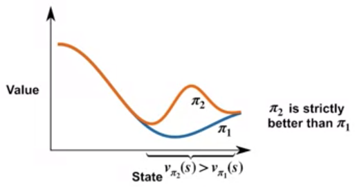
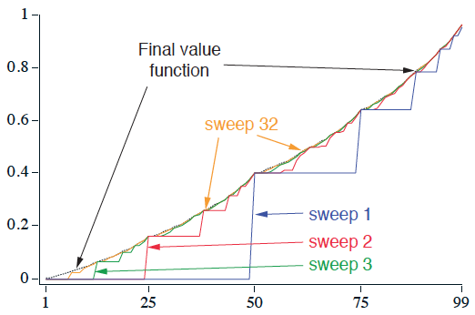
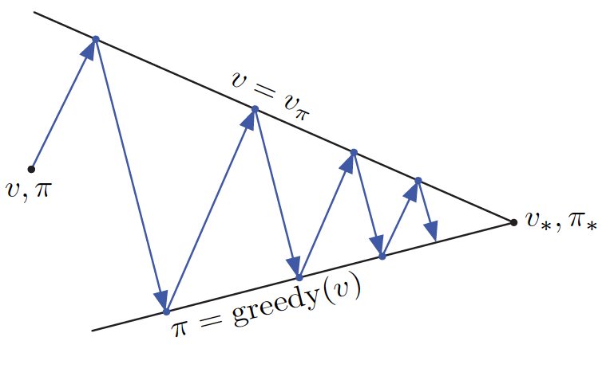
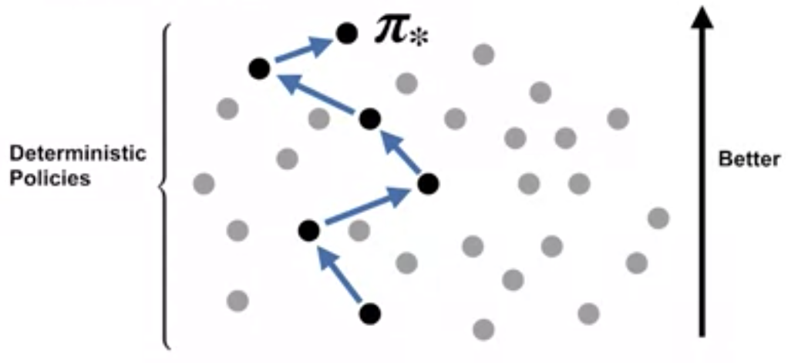
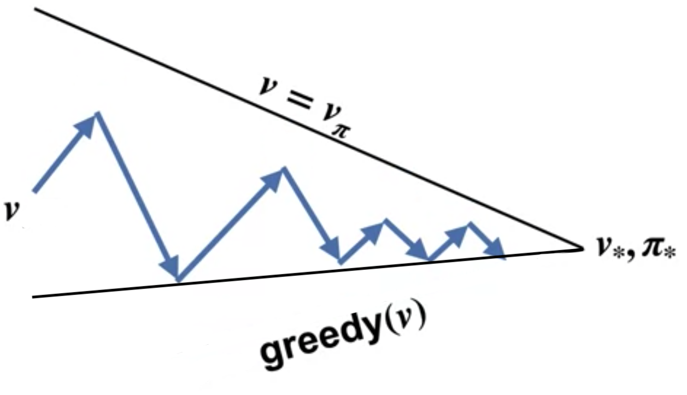
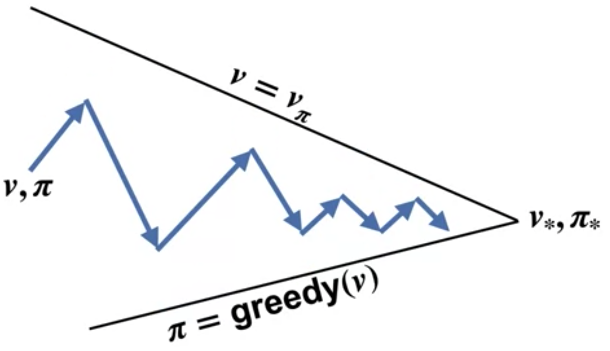
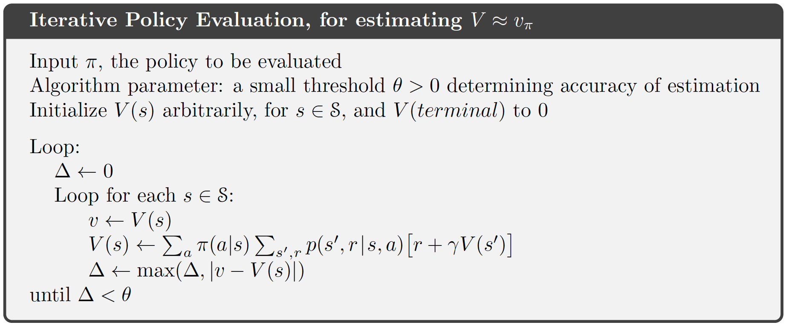
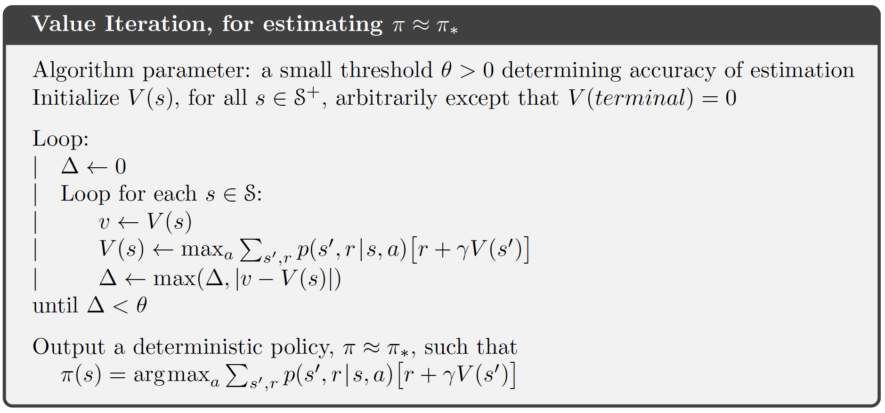

```{r, child = "setup.Rmd", echo=FALSE}
```

```{r include=FALSE, eval=FALSE}
# to preview
xaringan::inf_mr(cast_from = ".")
```

layout: true
  
```{r, echo=FALSE}
module_name <- "dp"
module_number <- "05"
here::i_am(str_c("slides/", module_number, "_", module_name, "-slides.Rmd"))
library(htmltools)
footerHtml <- withTags({
   div(class="my-footer",
      span(
         a(href=str_c("https://bss-osca.github.io/rl/mod-", module_name, ".html"), target="_blank", "Notes"), 
         " | ",
         a(href=str_c("https://bss-osca.github.io/rl/slides/", module_number, "_", module_name, "-slides.html"), target="_blank", "Slides"),    
         " | ",
         a(href=str_c("https://github.com/bss-osca/rl/blob/master/slides/", module_number, "_", module_name, "-slides.Rmd"), target="_blank", "Source"),  
      )
   )
})
footerHtml
knitr::opts_chunk$set(fig.path=str_c("img/", module_name, "-"))
```


<!-- Templates -->
<!-- .pull-left[] .pull-right[] -->
<!-- knitr::include_graphics("img/bandit.png") -->
<!-- .left-column-wide[]  .right-column-small[] -->

---

## Learning outcomes

* Describe the distinction between policy evaluation and control.
* Identify when DP can be applied, as well as its limitations.
* Explain and apply iterative policy evaluation for estimating state-values given a policy.
* Interpret the policy improvement theorem.
* Explain and apply policy iteration for finding an optimal policy.
* Explain and apply value iteration for finding an optimal policy.
* Describe the ideas behind generalized policy iteration.
* Interpret the distinction between synchronous and asynchronous dynamic programming methods.

---

## Dynamic Programming

* Algorithms for computing optimal policies given full information about the dynamics. 
* Must satisfy the *principle of optimality*: 
   - An optimal policy must consist for optimal sub-polices 
   - The optimal value function in a state can be calculated using optimal value functions in future states. 
* Two main problems arise with DP: 
   - Not full information, e.g. the rewards or transition probabilities are unknown. 
   - Need to calculate the value function in all states using the rewards, actions, and transition probabilities. 
* Note the term programming in DP have nothing to do with a computer program but comes from that the mathematical model is called a "program". 

---

## Policy evaluation vs control

.pull-left[
* Policy evaluation: Given a policy $\pi$, find the value function $v_\pi$
$$\pi \xrightarrow[]{E} v_\pi$$
Recall that
$$v_\pi(s) = \mathbb{E}_\pi[G_t | S_t = s]$$
where the return (discounted reward) is
$$G_t = R_{t+1} + \gamma R_{t+2} + \gamma^2 R_{t+3} + \cdots$$
]  

--

.pull-right[
* Control: Find the best policy or optimize the value function (using the Bellman optimality equations).

```{r, echo=FALSE}
 
```
] 

---

## Policy evaluation

We can find the state-value function by solving the system of Bellman equations:
\begin{equation}
v_\pi(s) = \sum_{a \in \mathcal{A}}\pi(a | s)\left( r(s,a) + \gamma\sum_{s' \in \mathcal{S}} p(s' | s, a) v_\pi(s')\right).
\end{equation}
However, can be computationally expensive. Instead we use an iterative method:

* Use an initial approximation $v_0$ chosen arbitrarily e.g. $v_0(s) = 0 \:  \forall s$ (terminal state = 0).
* Update the value function using sweeps:
\begin{equation}
v_{k+1}(s) = \sum_{a \in \mathcal{A}}\pi(a | s)\left( r(s,a) + \gamma\sum_{s' \in \mathcal{S}} p(s' | s, a) v_k(s')\right) 
\end{equation}
Until the value function converge to $v_\pi$ after a number of sweeps (the change in the value function is below a certain threshold).

---

## Policy evaluation - visualization

.pull-left[.midi[

Sweep 1:
$$v_{1}(s) = \sum_{a \in \mathcal{A}}\pi(a | s)\left( r(s,a) + \gamma\sum_{s' \in \mathcal{S}} p(s' | s, a) v_0(s')\right)$$
Sweep 2:
$$v_{2}(s) = \sum_{a \in \mathcal{A}}\pi(a | s)\left( r(s,a) + \gamma\sum_{s' \in \mathcal{S}} p(s' | s, a) v_1(s')\right)$$
$$\vdots$$
Sweep k:
$$v_{k}(s) = \sum_{a \in \mathcal{A}}\pi(a | s)\left( r(s,a) + \gamma\sum_{s' \in \mathcal{S}} p(s' | s, a) v_{k-1}(s')\right)$$
]] 

.pull-right[.vertical-center[ 
```{r, echo=FALSE, out.width="90%"}
 
```
]]

---

## Policy Improvement (control)

* Given the optimal value function we find the optimal deterministic policy by choosing *greedy* the best action: 

$$\pi_*(s) = \arg\max_{a \in \mathcal{A}} \left(r(s,a) + \gamma\sum_{s' \in \mathcal{S}} p(s' | s, a) v_*(s')\right).$$
* What if we apply greedy action selection to the value function for a policy $\pi$:

$$\pi'(s) = \arg\max_{a \in \mathcal{A}} \left(r(s,a) + \gamma\sum_{s' \in \mathcal{S}} p(s' | s, a) v_\pi(s')\right),$$
then 

$$q_\pi(s, \pi'(s)) \geq q_\pi(s, \pi(s)) = v_\pi(s) \quad \forall s \in \mathcal{S}.$$

---

## Policy improvement theorem (control)

.question[
Let $\pi$, $\pi'$ be any pair of deterministic policies, such that

\begin{equation}
    q_\pi(s, \pi'(s)) \geq v_\pi(s) \quad \forall s \in \mathcal{S}.
\end{equation}

That is, $\pi'$ is as least as good as $\pi$.
]

Implications:

* If we find policy $\pi'$ by applying greedy action selection on policy $\pi$ then $\pi'$ is as least as good as $\pi$. 
* If $\pi'(s) = \pi(s), \forall s\in\mathcal{S}$ then $\pi$ must be optimal.
* If $\pi'(s) \neq \pi(s)$, then policy $\pi'$ is strictly better than policy $\pi$ since there is at least one state $s$ for which $v_{\pi'}(s) > v_\pi(s)$.

---

## Policy iteration (control)

.left-column-wide[
Given the policy improvement theorem we can now improve policies iteratively: 

1. Pick an arbitrary initial policy $\pi$.
2. Given a policy $\pi$, estimate $v_\pi(s)$ via the policy evaluation algorithm.
3. Generate a new, improved policy $\pi' \geq \pi$ using *greedy* action selection. If $\pi'=\pi$ then stop (found optimal policy); otherwise go to Step 2.

The sequence of calculations will be: 
$$\pi_0 \xrightarrow[]{E} v_{\pi_0} \xrightarrow[]{I} \pi_1 \xrightarrow[]{E} v_{\pi_1} \xrightarrow[]{I} \pi_2 \xrightarrow[]{E} v_{\pi_2}  \ldots \xrightarrow[]{I} \pi_* \xrightarrow[]{E} v_{\pi_*}$$
The number of steps needed are often low.
]  

.right-column-small[
```{r, echo=FALSE}

``` 

```{r, echo=FALSE}

``` 
]

---

## Value iteration (control)

.left-column-wide[.midi[
Value iteration do one sweep of policy evaluation and one sweep of policy improvement by updating the Bellman optimality equation:

$$v_{k+1}(s) = \arg\max_a \left(r(s,a) + \gamma\sum_{s',r} p(s'|s, a)v_k(s')\right)$$
VI does not require a stored policy. Instead after the last step of value-iteration the optimal policy $\pi^*$ is found:

$$\pi_*(s) = \arg\max_{a \in \mathcal{A}} \left(r(s,a) + \gamma\sum_{s' \in \mathcal{S}} p(s' | s, a) v_*(s')\right)$$
The sequence of calculations will be: 
$$v_{0} \xrightarrow[]{EI} v_{1} \xrightarrow[]{EI} v_{2}  \ldots \xrightarrow[]{EI} v_{*} \xrightarrow[]{G} \pi_{*}$$
]]

.right-column-small[
```{r, echo=FALSE}

``` 
]

---

## Generalized policy iteration

.left-column-wide[.midi[
Generalised Policy Iteration (GPI) consider different policy evaluation and improvement strategies. For instance partly policy evaluation

* Value iteration: improve the state-value using a single sweep of the state space. 

Asynchronous state-value updates:

* In-place DP: Just one array of state-values.
* Prioritized sweeping: Update "significant" state-values using a priority queue. 

GPI works if explore the whole state space.
]]

.right-column-small[
```{r, echo=FALSE}

``` 
]

---

## Policy evaluation in R (evaluation)

```{r policy-eval-alg, echo=FALSE, out.width="100%"}

``` 

---

## Policy iteration in R (control)

```{r policy-ite-alg, echo=FALSE, out.width="75%"}
knitr::include_graphics("img/policy-iteration.png")
``` 

---

## Value iteration in R (control)

```{r, echo=FALSE, out.width="100%"}
 
``` 

<!-- # References -->

<!-- ```{r, results='asis', echo=FALSE} -->
<!-- PrintBibliography(bib) -->
<!-- ``` -->


```{r links, child="../book/links.md"}
```

```{r postprocess, include=FALSE}
system2("Rscript", args = "-e 'rmarkdown::render(\"index.Rmd\", quiet = TRUE)'")
file.copy("./slides.css", "./libs/", overwrite = T)
```
