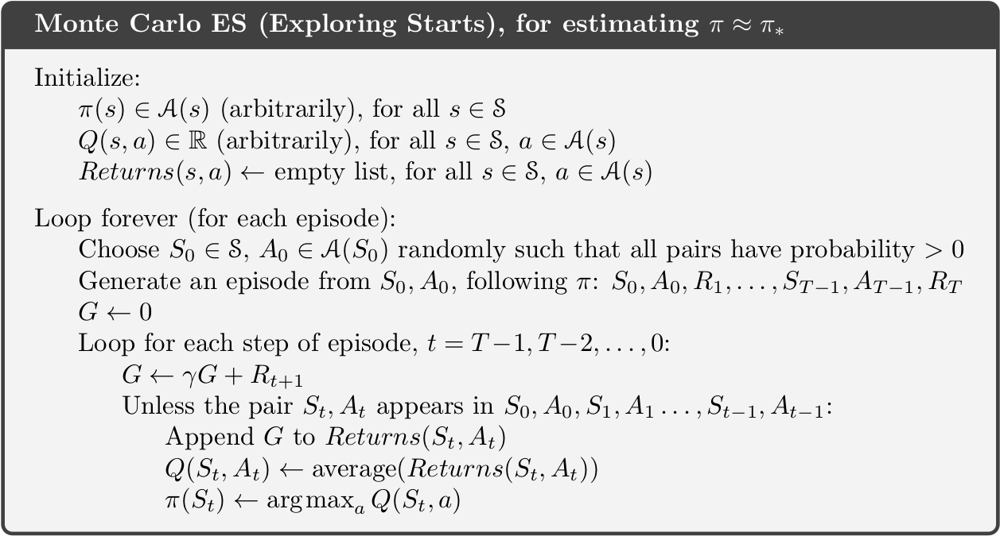

```{r, child = "setup.Rmd", echo=FALSE}
```

```{r include=FALSE, eval=FALSE}
# to preview
xaringan::inf_mr(cast_from = ".", quiet = T)
```

layout: true
  
```{r, echo=FALSE}
module_name <- "mc"
module_number <- "06"
here::i_am(str_c("slides/", module_number, "_", module_name, "-slides.Rmd"))
library(htmltools)
footerHtml <- withTags({
   div(class="my-footer",
      span(
         a(href=str_c("https://bss-osca.github.io/rl/mod-", module_name, ".html"), target="_blank", "Notes"), 
         " | ",
         a(href=str_c("https://bss-osca.github.io/rl/slides/", module_number, "_", module_name, "-slides.html"), target="_blank", "Slides"),    
         " | ",
         a(href=str_c("https://github.com/bss-osca/rl/blob/master/slides/", module_number, "_", module_name, "-slides.Rmd"), target="_blank", "Source"),  
      )
   )
})
footerHtml
knitr::opts_chunk$set(fig.path=str_c("img/", module_name, "-"))
```


<!-- Templates -->
<!-- .pull-left[] .pull-right[] -->
<!-- knitr::include_graphics("img/bandit.png") -->
<!-- .left-column-wide[]  .right-column-small[] -->

---

## Learning outcomes

<!-- * Describe the distinction between policy evaluation and control. -->
<!-- * Identify when DP can be applied, as well as its limitations. -->
<!-- * Explain and apply iterative policy evaluation for estimating state-values given a policy. -->
<!-- * Interpret the policy improvement theorem. -->
<!-- * Explain and apply policy iteration for finding an optimal policy. -->
<!-- * Explain and apply value iteration for finding an optimal policy. -->
<!-- * Describe the ideas behind generalized policy iteration. -->
<!-- * Interpret the distinction between synchronous and asynchronous dynamic programming methods. -->

---

## Monte Carlo methods for RL

* Monte Carlo (MC) is an estimation method which involves a random component. 
* Use MC methods to learn state and action values by sampling and averaging returns. 
* MC do not use dynamics (current state-value estimated using next state-value). 
* Estimate values by considering different sample-paths (state, action and reward realizations). 
* MC methods are model-free since they not require full knowledge of the transition probabilities and rewards (a model of the environment).
* MC methods learn the value function directly from experience. 
* The sample-path can be generated using simulation (some environment knowledge).
* Consider MC methods for processes with episodes, i.e. where there is a terminal state.
* Example: Blackjack (calculating transition probabilities may be tedious and error-prone). Instead we can simulate a game (a sample-path).
* Use generalised policy iteration, but learn the value function from experience. 


---

## MC prediction (evaluation)

Given policy $\pi$, we want to estimate the state-value function:
$$v_\pi(s) = \mathbb{E}_\pi[G_t | S_t = s].$$
where the return is 
$$G_t = R_{t+1} + \gamma R_{t+2} + \gamma^2 R_{t+3} + \cdots = \sum_{k=0}^{\infty} \gamma^k R_{t+k+1} = R_{t+1} + \gamma G_{t+1}$$

Procedure:

1. Generate sample-paths $S_0, A_0, R_1, S_1, A_1, \ldots, S_{T-1}, A_{T-l}, R_T$.
2. Calculate $G_t$ for each state in the sample-path.
3. Use the average of the realized returns for each state as an estimate. 

With enough observations, the average converges to the true state-value under the policy $\pi$.

---

## First and every visit MC

Given a policy $\pi$ and a set of sample-paths, there are two ways to estimate the state values $v_\pi(s)$:

* First visit MC: average returns from first visit to state $s$.
  - Generates iid (independent and identically distributed) estimates of $v_\pi(s)$ with finite variance.
  - Converges to the expected value by the law of large numbers.
* Every visit MC: average returns following every visit to state $s$.
  - Does not generate independent estimates, but still converges.

---

## MC prediction algorithm

```{r, echo=FALSE}
knitr::include_graphics("img/mc-prediction.png")
``` 

---

## MC prediction of action-values

* With a model of the environment we only need to estimate the state-value function (use Bellman optimality equations).
* Without a model it is useful to estimate action-values since the optimal policy can be found using: 
$$\pi_*(s) = \arg\max_{a \in \mathcal{A}} q_*(s, a).$$
* To find $q_*$, we first need to predict action-values for a policy $\pi$. 
* Problem: If $\pi$ is deterministic, we only estimate one action-value. 
* Some exploration are needed:
  - Make $\pi$ stochastic with non-zero probability of each state-action pair (e.g. $\epsilon$-soft). 
  - Exploring starts: Use a non-zero probability for each state-action pair of being selected as the starting state of an sample-path.

---

## Generalized policy iteration

.left-column-wide[.midi[
Generalised Policy Iteration (GPI) consider different policy evaluation and improvement strategies. The idea is to generate a sequence of policies and action-value functions
$$\pi_0 \xrightarrow[]{E} q_{\pi_0} \xrightarrow[]{I} \pi_1 \xrightarrow[]{E} q_{\pi_1} \xrightarrow[]{I} \pi_2  \xrightarrow[]{E} \ldots \xrightarrow[]{I} \pi_* \xrightarrow[]{E} q_{*}.$$
The algorithm repeatedly considers steps:

* Evaluation (E): Here we use MC evaluation. Note we don't have to evaluate the action-values precisely.
* Improvement (I): Select the next policy greedy $$\pi(s) = \arg\max_a q(s, a).$$ By using greedy action selection, the policy improvement theorem applies, i.e. $\pi_{k+1}$ is not worse than $\pi_{k}$.
]]

.right-column-small[
```{r, echo=FALSE}
knitr::include_graphics("img/policy-ite-general.png")
``` 
]

---

## GPI convergence 

* Model-based GPI (transition probability matrix and reward distribution are known): GPI converge if all states are visited during the algorithm. 
* Model-free GPI: We cannot simply use a 100% greedy strategy all the time, since all our action-values are estimates. An element of exploration must be used to estimate the action-values. 

For convergence to the optimal policy a model-free GPI algorithm must satisfy:

1. Infinite exploration: all state-action $(s,a)$ pairs should be explored infinitely many times as the number of iterations go to infinity, i.e. $\lim_{k\rightarrow\infty} n_k(s, a) = \infty$.
2. Greedy in the limit: while we maintain infinite exploration, we do eventually need to converge to the optimal policy:
  $$\lim_{k\rightarrow\infty} \pi_k(a|s) = 1 \text{ for } a = \arg\max_a q(s, a).$$

---

## GPI with exploring starts

```{r mc-gpi-es-alg, echo=FALSE, out.width="90%"}

```

---

## On-policy vs off-policy

By using exploring starts, the 'infinite exploration' convergence assumption is satisfied. However exploring starts may be hard to use in practice. Two other methods avoiding exploring starts are:

* *on-policy* methods: evaluate or improve the policy that is used to make decisions. 
* *off-policy* methods: evaluate or improve a policy that is different than the policy used to generate the data (sample-path).

---

## On-policy GPI using $\epsilon$-soft policies

.left-column-wide[
* Use an $\epsilon$-soft policy to ensure infinite exploration.
* An $\epsilon$-soft policy satisfy: $$\pi(a|s) \geq \epsilon/|\mathcal{A}(s)|$$ 
* Put probability $1 - \epsilon + \frac{\epsilon}{|\mathcal{A}(s)|}$ on the maximal action and $\frac{\epsilon}{|\mathcal{A}(s)|}$ on each of the others. 
* Note $\epsilon$-soft policies are always stochastic and hence ensure infinite exploration of the $(s,a)$ pairs.
* The best $\epsilon$-soft policy is found.
* To ensure the 'greedy in the limit' convergence (find the optimal policy) one may decrease $\epsilon$ as the number of iterations increase (e.g. $\epsilon = 1/k$). 

]

.right-column-small[
```{r, echo=FALSE, warning=FALSE}
eps <- 0.6
n <- 8
dat <- tibble(x = 1:n, y = sample(c(rep(eps/n, n-1), 1-eps + eps/n), n))
dat %>% ggplot(aes(x = x, y = y, fill = if_else(y == max(y), 1, 0))) +
   geom_col() + 
   geom_text(aes(label = if_else(y == max(y), "greedy", NA_character_)), nudge_y = 0.01) +
   theme_void() +
   theme(legend.position="none")
```
]

---

## On-policy GPI algorithm

```{r mc-gpi-on-policy-alg, echo=FALSE, out.width="80%"}
knitr::include_graphics("img/mc-gpi-on-policy.png")
```


<!-- # References -->

<!-- ```{r, results='asis', echo=FALSE} -->
<!-- PrintBibliography(bib) -->
<!-- ``` -->


```{r links, child="../book/links.md"}
```

```{r postprocess, include=FALSE}
system2("Rscript", args = "-e 'rmarkdown::render(\"index.Rmd\", quiet = TRUE)'")
file.copy("./slides.css", "./libs/", overwrite = T)
```
