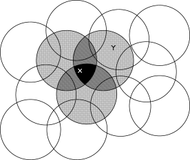

```{r, child = "setup.Rmd", echo=FALSE}
```

```{r include=FALSE, eval=FALSE}
# to preview
xaringan::inf_mr(cast_from = ".", quiet = T)
```

layout: true
  
```{r, echo=FALSE}
module_name <- "approx-pred"
module_number <- "12"
here::i_am(str_c("slides/", module_number, "_", module_name, "-slides.Rmd"))
library(htmltools)
footerHtml <- withTags({
   div(class="my-footer",
      span(
         a(href=str_c("https://bss-osca.github.io/rl/sec-", module_name, ".html"), target="_blank", "Notes"), 
         " | ",
         a(href=str_c("https://bss-osca.github.io/rl/slides/", module_number, "_", module_name, "-slides.html"), target="_blank", "Slides"),    
         " | ",
         a(href=str_c("https://github.com/bss-osca/rl/blob/master/slides/", module_number, "_", module_name, "-slides.Rmd"), target="_blank", "Source"),  
      )
   )
})
footerHtml
knitr::opts_chunk$set(fig.path=str_c("img/", module_name, "-"))
```


<!-- Templates -->
<!-- .pull-left[] .pull-right[] -->
<!-- knitr::include_graphics("img/bandit.png") -->
<!-- .left-column-wide[]  .right-column-small[] -->

---

## Learning outcomes

-   Explain why function approximation is needed beyond tabular RL and
    define the prediction problem.
-   Write the *mean-squared value error* objective and derive
    *semi-gradient* updates.
-   Implement *Gradient Monte Carlo* and *semi-gradient TD(0)* for value
    prediction with function approximation.
-   Compare and solve algorithms for linear function approximation.
-   Motivate and construct feature representations (polynomial/Fourier
    basis, tile coding) and discuss their trade-offs.
-   Explain causes of instability (e.g., step-size sensitivity).
-   Describe other methods for function approximation, such as memory-based and interest/emphasis. 

---

## Why function approximation

Tabular methods assume we can store a separate value for each state. In
large or continuous state spaces, this is impossible. We therefore
approximate the value function using a parametrised model
$\hat v(s;\mathbf w)$. 

* We approximate the value function using a function with parameters $\mathbf w \in \mathbb {R} ^d$. 
* A *on-policy* policy $\pi$ is assumed.
* A *supervised learning* approach is used. However,
  - We don't have exact training examples (we have an estimate of the state value). 
  - We update the value approximation online when new training arrive ($s \rightarrowtail u$).

---

## The prediction objective

The *mean-squared value error (MSVE)* is often used as an objective for
prediction: 
$$e(\mathbf w) = \overline{VE}(\mathbf w) = \sum_s \mu(s)\,\big[v_\pi(s) - \hat v(s;\mathbf w)\big]^2.$$

* $\mu(s)$ indicates how much we care about precision in state $s$. 
* If distribution known, $\mu(s)$ may denote the probability of visiting $s$. 
* If $\mu(s)$ is unknown, we may store state visits and $\mu(s)$ becomes the fraction of visits.
* The *RMSVE* ($\sqrt{e}$) measure of how much the approx. values differ from the true values. 
* Since $|\mathbf w| \ll |{\cal S}|$, adjusting $\mathbf{w}$ may reduce the error in a state and increase it in another.
* Given objective $e$, the goal is to minimize $e$. That is, to find a
global optimum, a weight vector $\mathbf w^*$ for which
$e(\mathbf w^*) \leq e(\mathbf w)$ for all possible $\mathbf w$. 
* Not always possible. Complex function approx. may converge to a local optimum. 
  
---

## Stochastic-gradient and semi-gradient methods

To minimise $e$, we use *stochastic gradient descent* (*SGD*) methods in an online setting. 

* Update $\mathbf w$ each time new data sample $S_t \mapsto v_\pi(S_t)$ arrives. 
<!-- * Assume that states appear in samples with the same distribution, $\mu$ -->
* Try to minimize error on the observed samples and adjust the weight vector after each sample by a small amount ($\alpha>0$): $$\begin{align}\mathbf w_{t+1} &= \mathbf w_t - \frac{1}{2}\alpha\nabla_{\mathbf w}\big[v_\pi(S_t) - \hat v(S_t;\mathbf w_t)\big]^2\\ &= \mathbf w_t + \alpha\,\big[v_\pi(S_t) - \hat v(S_t;\mathbf w_t)\big]\,\nabla_{\mathbf w}\hat v(S_t;\mathbf w_t).\end{align}$$ where $\nabla_{\mathbf w}\hat v(S_t;\mathbf w_t)$ denote the partial
derivative vector (the gradient).

---

## But the state value is unknown?

Since we approximate $v_\pi(s)$, we do not know the exact value of $v_\pi(s)$. 

* We have a target output $U_t$ (an estimate of $v_\pi(s)$). 
* Our sample is now $S_t \mapsto U_t$ instead and our updates becomes:
$$\mathbf w_{t+1} = \mathbf w_t + \alpha\,\big[U_t - \hat v(S_t;\mathbf w_t)\big]\,\nabla_{\mathbf w}\hat v(S_t;\mathbf w_t).$$ 
* If $U_t$ is an *unbiased estimate* ($\mathbb E[U_t|S_t=s] = v_\pi(s)$), then 
  - $w_t$ is guaranteed to converge to a local optimum for decreasing $\alpha$. 
  - In this case it is called a *gradient* descent method. 
* If $U_t$ is a *biased estimate* (not independent on $\mathbf w_t$) then 
  - $w_t$ is not guaranteed to converge to the true local optimum. 
  - We call this a *semi-gradient* method. 

---

## Gradient method

Gradient Monte Carlo:

* Choose $U_t$ as $U_t = G_t$ (full return). 
* Unbiased in expectation but requires episode completion. 
* High variance because 
  - the full return depends on all future rewards up to the end of the
    episode. 
  - Any randomness in transitions or rewards propagates through
    the entire sequence.

---

## Semi-gradient method

Semi-gradient TD(0):

* Choose $U_t$ as $U_t = R_{t+1} + \gamma\,\hat v(S_{t+1};\mathbf w_t)$. 
* Target depends on $\mathbf w_t$ (bias via bootstrapping). 
* Lower variance since the target depends only on one reward and the current estimate
    of the expected reward of the next state value.
* Although semi-gradient (bootstrapping) methods do not converge as
robustly as gradient methods, they do converge reliably in important
cases such as the linear case. 
* Offer important advantages e.g significantly faster learning.

---

## Linear methods

The approximate function is a linear function of the weight vector.

Let $\mathbf x(s)\in\mathbb R^d$ be features and define $$
\hat v(s;\mathbf w) = \mathbf w^\top \mathbf x(s) = \sum_{i=1}^d w_ix_i(s).
$$ 

Note here, the gradient (vector with partial derivatives) is easy to
calculate $$\nabla_{\mathbf w}\hat v(s;\mathbf w) = \mathbf x(s),$$ and our update formula becomes
$$
\mathbf w_{t+1} = \mathbf w_t + \alpha\,\big[U_t - \hat v(S_t;\mathbf w_t)\big]\mathbf x(S_t).
$$ 

In the linear case the MSVE $e(\textbf w)$ is convex and has only one global optimum. That is, under gradient
Monte Carlo $\mathbf w_{t}$ converges to the global optimum.

---

## Semi-gradient convergence

A semi-gradient method also converges, but to a point near the global optimum. The update of TD(0) becomes $$\begin{align}\mathbf w_{t+1} =& \mathbf w_t + \alpha\left( R_{t+1} + \gamma\mathbf w_t^\top \mathbf x(S_{t+1}) - \mathbf w_t^\top \mathbf x(S_t) \right) \mathbf x(S_t) \\=& \mathbf w_t + \alpha\left( R_{t+1}\mathbf x(S_t) - \mathbf x(S_t) \left(\mathbf x(S_t) - \gamma\mathbf x(S_{t+1})\right)^\top \mathbf w_t \right).\end{align}$$

Taking the expectation and setting $$\mathbf A = \mathbb E\big[ \mathbf x(S_t) \left(\mathbf x(S_t) - \gamma\mathbf x(S_{t+1})\right)^\top \big],\;\mathbf b = \mathbb E\big[R_{t+1}\mathbf x(S_t)\big].$$ Then the system converge to the weight vector $w^*$ satisfying $$\mathbf b − \mathbf A\mathbf w^* = \mathbf 0 \Leftrightarrow \mathbf w^* = \mathbf A^{-1}\mathbf b$$

The estimate $w^*$is called the *TD fixed point* and is close to the global optimum.

---

## Feature construction for linear models

Linear methods are interesting.

* Provide convergence guarantees.
* Efficient in terms of both data and computation. 

This depends on how the states are represented in terms of features 

* Choosing features appropriate to the task is an important way of adding prior
domain knowledge about the system. 
* The features should correspond to the
aspects of the state space along which generalization may be
appropriate. 

---

## State aggregation

A special case of linear function approximation in which states are grouped together. Here, the approximation is a *piecewise constant function* that is constant for each group.

* One estimated value (one component of the weight vector w) for each group. 
* The value of a state is estimated as its group’s value. 
* Let $g(s)$ be a mapping that assigns each state $s$ to a group index. 
* The features are $\mathbf x_i(s) = 1$ if $g(s) = i$ and $\mathbf x_j(s)  = 0$ for
$j\neq i$ and $$\hat v(s; \mathbf{w}) = w_{g(s)}.$$
* Note $\boldsymbol{x}(s)$ is a unit vector with all entries equal to zero except entry $g(s)$, i.e. $$w_{g(s)} \leftarrow w_{g(s)} + \alpha \,\big(U_t - w_{g(s)}\big).$$ 
<!-- All other $w_j$ remain unchanged.  -->
* Let us consider the an example in the [Colab tutorial][colab-12-approx-pred].

---

## Polynomials

Approximate $v_\pi(s)$ by fitting a low-degree polynomial of *normalized* state variables. 
<!-- Note the model remains linear in parameters $\textbf w$ even though it is nonlinear in $s$. -->

* Capture non-linear relationships and provide a smooth approximation.
* Choosing the appropriate degree of the polynomial is important. 
  - Too low a degree might not capture the complexity of the value function.
  - Too high a degree can lead to overfitting and poor generalization.
* Polynomials can have difficulty approximating value functions with sharp changes.
* If a scalar state $s$ the approximation is $$\hat{v} (s;\mathbf w) = \mathbf w^\top \mathbf x(s) = w_0 + w_1s + w_2s^2 + \ldots + w_{d}s^d.$$ That is, the gradient becomes polynomial of degree $d$: $\mathbf x(s) = (1,s,s^2,\dots,s^d).$
* If multiple state variables, you may combine polynomials to capture cross-effects.

---

## Numerical instabilities

Normalise the state values because if $s$ has a high value, then $s^d$ may be very large, yielding numerical instabilities. 

* If we normailze so state varibles are in the interval $[-1,1]$ then $s^d$ also lies in this interval. 
* If $s\in\{1,\dots,N\}$: use $z = \dfrac{s}{N+1}\in(0,1)$ or
    $u = 2z-1 \in (-1,1)$.
* If $s\in[a,b]$: use $u = \dfrac{2s-(a+b)}{b-a}\in(-1,1)$.
* To find the right step-size $\alpha$, keep track of RMSVE. If it oscillates, then the step-size $\alpha$ is too high.
* Let us consider the an example in the [Colab tutorial][colab-12-approx-pred].

---

## Fourier basis

The *Fourier basis* approximates $v_\pi(s)$ using global sine/cosine waves. 

<!-- * Remains *linear in parameters* even though it can represent highly nonlinear shapes.  -->

* Essentially any function can be approximated as accurately as desired. 
* Fourier basis functions are of interest because they are easy to use and can perform well.
* If a scalar state $s$. 
  - If normalize can restrict attention to just the cosine functions. 
  - The $d$ order Fourier cosine basis consists of the $d + 1$ features. $$\hat{v} (s;\mathbf w) = \mathbf w^\top \mathbf x(s) = w_0 + w_1\cos(\pi z) + w_2\cos(2\pi z) + \ldots + w_{d}\cos(d\pi z),$$ where $z$ is the normalised state and the first term is the *bias* term.
  - The gradient are $x_i(z)=\cos(i\pi z), j=0,1,\dots,n.$
* Let us consider the an example in the [Colab tutorial][colab-12-approx-pred].

---

## Coarse coding

.small[
.pull-left[
Here, the idea is to cover the state space with many overlapping regions. 

* A state activates the features whose regions contain it, producing a sparse binary vector.
* Create *sparse*, *localized* features so that nearby states share parameters and thus generalize to each other. Hence updates are cheap.
* If $s$ have multiple state variables, regions might be discs/ellipses
(2-D), balls/ellipsoids (3D), or any shapes convenient for the problem.
Feature $i$ is “on” if $s$ falls inside the region.
* The Linear approximation is
$$
\hat v(s;\mathbf w) \;=\; \mathbf w^\top \mathbf x(s) = \sum_{\{i | x_i(s) = 1\}} w_i,
$$
where $x_i(s)\in\{0,1\}$ (1 if region $i$ covers $s$).
]]

.pull-right[
```{r, out.width="100%", echo=FALSE}

```
]

---

## Tile coding

A structured, grid-based special case of coarse coding that is simple and fast. 

* First create a *tiling* that partitions the space into non-overlapping *tiles*. 
* Next, offset the tiling and hereby creating $n$ (multiple) tilings. 
* Each tiling is offset slightly, so two nearby states are likely to share some tiles. 
* For best results, normalise the state space (a consistent meaning across features).
* For a state $s$, exactly one tile is active in each tiling, i.e. update only $n$ parameters.
* With incremental semi-gradient TD(0): $\mathbf w \leftarrow \mathbf w + \alpha(R_{t+1} + \gamma\,\hat v(S_{t+1}) - \hat v(S_t))\mathbf x(S_t).$
* Scale the per-tiling step size to $\alpha \approx \frac{\alpha_0}{n}$ (since $n$ weights are
updated per step).
* More tilings increase overlap and stability but cost more memory/compute.
* Finer tiles reduce bias but increase variance and memory.
* Let us consider the an example in the [Colab tutorial][colab-12-approx-pred].

---

## Selecting step-size parameters manually

.small[
The goal is to pick a step size $\alpha$ that removes TD error quickly without causing instability.

* Tabular prediction: $V(S_t) \leftarrow V(S_t) + \alpha\,[\,U_t - V(S_t)\,].$ 
  - Think of $\alpha$ as how much you trust the newest target. 
  - Big enough to make visible progress, small enough to avoid creating noise. 
  - A step size of $\alpha = 1/10$ would take about 10 experiences to converge approximately to their mean target.
* Function approximation: If want to learn in about $\tau$ experiences with substantially the same feature
vector. Then, good rule of thumb is to set $\alpha = (\tau \mathbb{E}[\textbf{x}^T\textbf{x}])^{-1}.$
  - Works best if the feature vectors do not vary; ideally $\textbf{x}^T\textbf{x}$ is a constant.
  - For tile coding with $n$ tillings we have that $\textbf{x}^T\textbf{x}=n,$ and $\alpha = (\tau n)^{-1}$.
  - For scalar state polynomials of degree $d$, we have that $\alpha = (\tau\sum_{i=0}^{d} 1/(2i+1))^{-1}$.
* If features activate unevenly, damp steps by visit counts: $\alpha_i \;=\; \frac{\alpha_0}{1+n_i}.$
* One may also try a small grid of $\alpha$. 
  - Run a short training phase and track an error proxy (e.g., RMSVE), pick the largest $\alpha$ that yields a smooth, monotone decline.
  - Next, decrease $\alpha$ when needed as training is continued.
* Let us consider the an example in the [Colab tutorial][colab-12-approx-pred].
]

---

## Artificial neural networks

*Artificial neural networks (ANNs)* are widely used nonlinear function approximators. 

* Capable of representing complex mappings between inputs and outputs. 
* In RL, ANNs are employed to approximate value functions, policies, and models of the environment.
* Deep neural networks are composed of multiple hidden layers.
* ANNs are trained using stochastic gradient methods and the backpropagation algorithm to computes partial derivatives
* Research in deep ANNs is a hot topic, and big advancements have been made since the book was published.
* Using deep ANNs in RL is denoted *deep reinforcement learning*, and some RL courses focus on this. 
* There are many implementations of deep RL algorithms.

---

## Memory-based function approximation

* A different approach to estimating the state value. 
* No set of parameters are adjusted, as in parametric methods. 
* Instead, the agent stores examples of experience pairs $s \mapsto g$ of states and their estimated returns (the state
value). 
* When an estimate of the state value in a *query state* $s'$ is
wanted, the estimates in memory is used directly. 
*  There is no parameters and calculation is *lazy*, (calc. when an estimate is required).
* Use a *kernel* (function) that assigns a number between two states.
* Given the kernel *local search* based methods can be used to estimate the state value.
* Pros: no global model, focus on regions of the state space actually visited. 
* Cons: computational and memory cos. Retrieving and comparing neighbours may be expensive.


<!-- # References -->

<!-- ```{r, results='asis', echo=FALSE} -->
<!-- PrintBibliography(bib) -->
<!-- ``` -->


```{r links, child="../book/links.md"}
```

```{r postprocess, include=FALSE}
system2("Rscript", args = "-e 'rmarkdown::render(\"index.Rmd\", quiet = TRUE)'")
file.copy("./slides.css", "./libs/", overwrite = T)
```
