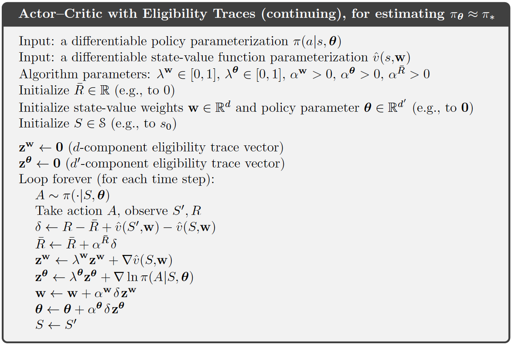

```{r, child = "setup.Rmd", echo=FALSE}
```

```{r include=FALSE, eval=FALSE}
# to preview
xaringan::inf_mr(cast_from = ".", quiet = T)
```

layout: true
  
```{r, echo=FALSE}
module_name <- "policy-gradient"
module_number <- "14"
here::i_am(str_c("slides/", module_number, "_", module_name, "-slides.Rmd"))
library(htmltools)
footerHtml <- withTags({
   div(class="my-footer",
      span(
         a(href=str_c("https://bss-osca.github.io/rl/sec-", module_name, ".html"), target="_blank", "Notes"), 
         " | ",
         a(href=str_c("https://bss-osca.github.io/rl/slides/", module_number, "_", module_name, "-slides.html"), target="_blank", "Slides"),    
         " | ",
         a(href=str_c("https://github.com/bss-osca/rl/blob/master/slides/", module_number, "_", module_name, "-slides.Rmd"), target="_blank", "Source"),  
      )
   )
})
footerHtml
knitr::opts_chunk$set(fig.path=str_c("img/", module_name, "-"))
```


<!-- Templates -->
<!-- .pull-left[] .pull-right[] -->
<!-- knitr::include_graphics("img/bandit.png") -->
<!-- .left-column-wide[]  .right-column-small[] -->

---

## Learning outcomes

- Identify why policy gradient methods differs from value-based methods.
- Explain why differentiable, parameterized policies are needed for policy gradient algorithms.
- Describe the softmax policy parameterization and how action preferences define stochastic policies.
- Understand the structure and meaning of the policy gradient theorem for both episodic and continuing tasks.
- Explain the REINFORCE algorithm and understand why it is an unbiased Monte Carlo estimator of the policy gradient.
- Explain how introducing baselines reduces variance without altering the expected gradient.
- Understand the conceptual and mathematical foundations of actor–critic methods.
- Understand how the TD error provides a lower-variance advantage signal for the actor.
- Explain how policy gradient methods extend to continuing tasks via average reward and differential value functions.
- Understand how to parametrize policies for continuous action spaces, especially Gaussian policies.
- Recognize how mixed discrete–continuous action spaces can be handled using factorized policies.

---

# Policy Gradient Methods 

- Up to this point approximated based on value functions.
- The best policy can be found by selecting the action with the highest estimate. 
- Policy used is derived from the estimates and hence dependent on the estimates.
- Now focus on directly learning a parametrized policy $\pi(a|s, \theta)$.
- Can select actions without referring to a value function. 
- The objective is to learn the policy the maximize a performance measure $J(\theta)$. 
- These methods are known as a *policy gradient method*. 
- The value function may still be employed to assist in learning the policy parameters.
- If also learns a value function approximation, it is referred to as an *actor-critic* method. 
- The actor is the agent that acts. The critic is the one who criticises or evaluates the actor's performance by estimating the value function.

---

## Policy Approximation 

- Let the policy be differentiable with respect to $\theta$: $$\pi(a|s, \theta) = \Pr(A_t = a|S_t = s, \theta_t = \theta).$$ 
- In practice, to ensure exploration $\pi(a|s,\theta) \in (0, 1)$ for all $s, a$.
- Updates follow a *stochastic gradient-ascent* rule: $$\theta_{t+1} = \theta_t + \alpha \nabla J(\theta_t)$$ 
- For *discrete actions*, we use a softmax function (*soft-max in action preferences*): $$\pi(a|s,\theta) = \frac{e^{h(s,a,\theta)}}{\sum_b e^{h(s,b,\theta)}},$$ where $h(s, a, \theta)$ is a numerical preference (can be parametrised arbitrarily).
- Guarantees continual exploration since no action ever receives zero probability. 

---

## Policy Approximation and its Advantages

Compared to value-based methods, policy approximation offers several advantages.

- In policies with a softmax the resulting stochastic policy can approach a deterministic one. As the differences between preferences grow, the softmax distribution becomes increasingly peaked, and in the limit it becomes deterministic. 
- Enables the selection of actions with arbitrary probabilities. In problems with significant function approximation, the best approximate policy may be stochastic.
-   The policy may be a simpler function to approximate. 
-   The choice of policy parameterization is sometimes a good way of injecting prior knowledge about the desired form of the policy into the RL system (important reason).
- Stronger convergence guarantees with continuous policy parameterization. 
  - The action probabilities change smoothly as a function of the learned parameter.
  - In $\epsilon$-greedy selection, the action probabilities may change dramatically given a small change in action values.

---

## The Policy Gradient Theorem

- To do stochastic gradient-ascent, we need to find the gradient of the performance measure $J(\theta)$ with respect to the policy parameters $\theta$. 
- Episodic case: Objective/performance $J(\theta) = v_{\pi_\theta}(s_0)$ given $\pi_\theta$.
- Given $s$ and $\pi_\theta$ we can find the next action and reward.
- But how can we estimate the performance gradient when the gradient depends on the unknown effect of policy changes on the state distribution? 
- Policy gradient theorem: The gradient of $J(\theta)$ can be written as $$\nabla J(\theta) \propto \sum_s \mu(s) \sum_a q_{\pi}(s,a) \nabla \pi(a|s,\theta)$$ where $\mu(s)$ is the on-policy distribution over states under $\pi$.
- The gradient can be expressed without involving the derivative of the state distribution.  

---

## From policy gradient to eligibility vector

Using $\nabla \pi(a \mid S_t, \theta) = \pi(a \mid s, \theta)\,\nabla \ln \pi(a \mid s, \theta)$, we may modify the Policy Gradient Theorem:

$$\begin{align*}
\nabla J(\theta) &\propto \sum_s \mu(s) \sum_a q_{\pi}(s,a) \nabla \pi(a|s,\theta) = \mathbb{E}_\pi\left[\sum_a q_\pi(S_t,a)\nabla\,\pi(a \mid S_t, \theta)\right] \\
    &= \mathbb{E}_\pi\left[\sum_a q_\pi(S_t,a) \pi(a \mid S_t, \theta)\,\nabla \ln \pi(a \mid S_t, \theta)\right]\\
    &= \mathbb{E}_\pi\left[q_\pi(S_t, A_t)\,\nabla \ln \pi(A_t|S_t, \theta)\right]
    = \mathbb{E}_\pi\left[G_t\,\nabla \ln \pi(A_t|S_t, \theta)\right]\\
\end{align*}$$

- Expectation is taken based on the trajectory distribution generated by the current policy. 
- The policy parameters is adjusted in proportion to the product of the action-value $q_\pi(S_t, A_t)$ and the gradient of the log-probability.
- The gradient $\nabla \ln \pi(A_t|S_t, \theta)$ is often called the *eligibility vector*. 

---

## REINFORCE: Monte Carlo Policy Gradient

```{r, echo=FALSE}
knitr::include_graphics("img/1303_REINFORCE.png")
```

Note an discount rate have been added here (we didn't include it in the policy gradient theorem).

---

## REINFORCE with Baseline (1)

- The REINFORCE algorithm use the full MC return (often very high variance). 
- To reduce this variance/stability, a baseline $b(s)$ can be subtracted from the return. 
- Replace the return $G_t$ with $G_t - b(S_t)$. The new update rule becomes:
$$
\theta_{t+1}
= \theta_t + \alpha\,(G_t - b(S_t))\,\nabla \ln \pi(A_t|S_t,\theta_t).
$$
- The baseline may depend on the state but must not depend on the action. Hence
$$
\sum_a b(s)\,\nabla \pi(a|s,\theta) = b(s)\,\nabla \sum_a \pi(a|s,\theta) = b(s)\,\nabla 1 = 0.
$$
- Subtracting $b(s)$ alters only variance, not the expectation.
- An effective choice is using the approx. state-value $b(s) = \hat v(s, w)$ with updates
$$w \leftarrow w + \alpha_w\,(G_t - \hat v(S_t,w))\,\nabla \hat v(S_t,w).$$

---

## REINFORCE with Baseline (2)


- This produces a *critic* that approximates how good each state is on average. 
- The policy update (the *actor*) then adjusts the probabilities in proportion to how much better or worse the return was compared to what is expected for the state.
- Still a Monte Carlo method.
- Still provides unbiased estimates of the policy gradient. 
- The improvement is purely variance reduction to accelerate learning. 
- Empirically, leads to much faster convergence.
- We now have both learning rules for actor and critic:
$$
\begin{aligned}
w &\leftarrow w + \alpha_w\,(G_t - \hat v(S_t,w))\,\nabla \hat v(S_t,w), \\
\theta &\leftarrow \theta + \alpha_\theta\,(G_t - \hat v(S_t,w))\,\nabla \ln \pi(A_t|S_t,\theta).
\end{aligned}
$$
---

## REINFORCE with Baseline algorithm

```{r, echo=FALSE}
knitr::include_graphics("img/1304_REINFORCE_With_Baseline.png")
```

---

## Actor-Critic Methods

- Actor-critic methods replace the full MC return with a bootstrapped estimate. 
- The policy is the *actor* and the value function is the *critic*. The critic evaluates the state value, and the actor adjust the policy parameters.
- Now let the critic use TD updates (faster updates and less variance). TD error:
$$\delta_t = R_{t+1} + \gamma \hat v(S_{t+1}, w) - \hat v(S_t, w).$$
- The critic update becomes:
$$w \leftarrow w + \alpha_w \,\delta_t\, \nabla \hat v(S_t, w).$$
The actor update becomes (with bias but lower variance):
$$\theta \leftarrow \theta + \alpha_\theta\,\delta_t\,\nabla \ln \pi(A_t|S_t, \theta).$$ 
- Actor-critic methods can be seen as the policy-gradient analogue of SARSA.

---

## Actor-Critic algorithm

```{r, echo=FALSE, out.width="90%"}
knitr::include_graphics("img/1305a_One_Step_Actor_Critic.png")
```

---

## Policy Gradient for Continuing Problems (1)

- New objective *average reward*: $$J(\theta) = r(\pi) = \sum_s \mu(s)\sum_a \pi(a|s)\sum_{s',r} p(s',r|s,a)\, r.$$
- The policy gradient theorem still holds (now with equal sign) $$\nabla r(\pi) = \sum_s \mu(s) \sum_a q_\pi(s,a)\,\nabla \pi(a|s,\theta).$$
- Value functions are as before except that the return is defined as the *differential value*: $$G_t = R_{t+1} - r(\pi) + R_{t+2} - r(\pi) + \cdots.$$

---

## Policy Gradient for Continuing Problems (2)

- The gradient with a baseline then becomes $$\nabla r(\pi) \approx \mathbb{E}\left[(G_t-b(s))\,\nabla \ln \pi(A_t|S_t,\theta)\right].
$$
- If use TD and let the baseline be the state-value, then $$G_t - b(s) \approx \delta_t = (R_{t+1} - \hat r + \hat v(S_{t+1})) - \hat v(S_t)$$
- Now also the average reward $r(\pi)$ must be estimated during learning $(\hat r)$. 
- Policy gradient methods extend naturally to the continuing case, but the formulation shifts from episodic returns to average reward and differential values. 

---

## Policy Gradient algorithm (continuing case)

```{r, echo=FALSE, out.width="80%"}

```

---

## Policy Parameterisation for Continuous Actions (1)

- Consider *continuous action spaces*, meaning actions are real-valued (or vector-valued). 
- Policies are *parameterised probability density functions* over continuous actions $$\pi(a \mid s, \theta) = \text{a differentiable density over } a$$
- A common parametrisation is the univariate Gaussian or Normal distribution:
$$
\pi(a \mid s, \theta) = \frac{1}{\sqrt{2\pi\sigma^2(s, \theta)}} \exp\left( -\frac{(a - \mu(s, \theta))^2}{2\sigma^2(s, \theta)} \right),
$$
where both the mean $\mu(s)$ and standard deviation $\sigma(s)$ may depend on the state and are parametrised by separate sets of weights $\theta = (\theta_\mu, \theta_\sigma)$. 
- The mean and variance can be $$\mu(s, \theta) = {\theta_\mu}^\top \textbf x_\mu(s), \qquad \sigma^2(s, \theta) = \exp({\theta_\sigma}^\top \textbf x_\sigma(s)).$$ 
 
---

## Policy Parameterisation for Continuous Actions (2)

- The eligibility vector $\nabla \ln \pi(A_t|S_t, \theta_t)$ becomes:
$$\nabla \ln \pi(a|s, \theta) 
  = \frac{a-\mu(s, \theta_\mu)}{\sigma(s, \theta_\sigma)^2}\, \textbf x(s, \theta_\mu) +
  \left(\frac{(a-\mu(s, \theta_\mu))^2}{\sigma(s, \theta_\sigma)^2} - 1\right)
\textbf x(s, \theta_\sigma).$$
- The choice of parametrization has important effects. 
  - If the variance is too small, exploration collapses; if too large, gradient estimates become noisy. 
  - Learning both mean and variance enables adaptive exploration: the variance shrinks in well-understood regions and grows where uncertainty is higher.
- Once a differentiable density is available, all previous machinery for policy gradients applies unchanged. 
- The policy gradient theorem still holds, as it does not depend on action space cardinality. 
- Actor-critic methods remain preferable because they reduce variance.

---

## Mixed Action Spaces

- The action includes both continuous and discrete components $a = (a^{\text{disc}},\, a^{\text{cont}}).$
- The policy must represent a joint distribution over this mixed action space. 
- Policy gradient methods handle this naturally as long as the policy is differentiable. 
- A standard and convenient factorization is:
$$
\pi(a \mid s)
= \pi(a^{\text{disc}} \mid s)\,
  \pi(a^{\text{cont}} \mid s, a^{\text{disc}}).
$$
- First choose the discrete action component. Then choose the continuous parameters conditioned on the discrete choice.
- The log-policy splits naturally: $$\ln \pi(a \mid s) = \ln \pi(a^{\text{disc}} \mid s) + \ln \pi(a^{\text{cont}} \mid s, a^{\text{disc}}).$$
$$\nabla_\theta \ln \pi(a \mid s)
=
\nabla_\theta \ln \pi(a^{\text{disc}} \mid s)
+
\nabla_\theta \ln \pi(a^{\text{cont}} \mid s, a^{\text{disc}}).$$

---

## Colab

Let us consider the an example in the [Colab tutorial][colab-14-policy-gradient].


<!-- # References -->

<!-- ```{r, results='asis', echo=FALSE} -->
<!-- PrintBibliography(bib) -->
<!-- ``` -->


```{r links, child="../book/links.md"}
```

```{r postprocess, include=FALSE}
system2("Rscript", args = "-e 'rmarkdown::render(\"index.Rmd\", quiet = TRUE)'")
file.copy("./slides.css", "./libs/", overwrite = T)
```
